# Education

______________________________________________________________________

```
- Sobre el 'nivel educativo' de los profecionales que respondieron la encuesta.
```

## General Education

______________________________________________________________________

```
- column name : 'educacion'
Aspectos 'generales' sobre el nivel educativo de las personas que respondieron la encuesta. (NOMBRES, MUJERES, NO CONTESTO)
```

```python
ed_levels = get_column_uniques(df, "educacion")
ed_levels
```

```
['Ed. Basica',
 'Ed. Secundaria',
 'Doctorado',
 'Autodidacta',
 'Ed. Universitaria',
 'Master']
```

### Unique 'education levels'.

- 'Master'
- 'Ed. Universitaria'
- 'Doctorado'
- 'Ed. Secundaria'
- 'Autodidacta'
- 'Ed. Basica'

```python
# Replacing education column content to english translation.

ed_repl = {
    "Ed. Basica": "Basic Education",
    "Ed. Universitaria": "University Education",
    "Autodidacta": "Autodidact",
    "Doctorado": "Doctorate",
    "Ed. Secundaria": "Middle School",
}


replace_column_content(df, "educacion", ed_repl)
```

```python
df["educacion"].value_counts().keys()
```

```
Index(['University Education',
       'Basic Education;Middle School;University Education',
       'Basic Education;Middle School;University Education;Autodidact',
       'University Education;Autodidact', 'Master', 'Middle School',
       'Basic Education;Middle School',
       'Basic Education;Middle School;Autodidact',
       'University Education;Master', 'Middle School;Autodidact',
       'Basic Education;Middle School;University Education;Master',
       'University Education;Master;Autodidact', 'Autodidact',
       'Basic Education;Middle School;University Education;Master;Autodidact',
       'Master;Autodidact', 'Middle School;University Education;Master',
       'Middle School;University Education',
       'Middle School;University Education;Autodidact',
       'Basic Education;Middle School;University Education;Master;Doctorate;Autodidact',
       'Basic Education;Middle School;Master;Autodidact', 'Doctorate'],
      dtype='object', name='educacion')
```

## Education levels counts.

______________________________________________________________________

```python
get_uniques_col_count(df, "educacion")
```

```
{'Middle School': 130,
 'Autodidact': 94,
 'Basic Education': 107,
 'University Education': 279,
 'Doctorate': 2,
 'Master': 38}
```

Se puede ver que la cantidad de profecionales con nivel de educacion 'universitaria' excede ampliamente a los otros.

## Carers or Specialties

______________________________________________________________________

```
We explore the 'carers or specialties' of the people who answered the survey.
- column name : 'carr_especialidades'
```

```python
get_column_uniques(df, "carr_especialidades")
```

```
['Ing. Informática',
 'Análisis de Sist.',
 'Ing. Electrónica',
 'Programación',
 'Ing. Civil',
 'Otras',
 'Matemático',
 'Diseño Gráfico',
 'Ninguna',
 'Otras Ing.']
```

```python
carr_repl = {
    "Matemático": "Mathematician",
    "Ninguna": "None",
    "Otras": "Others",
    "Ing. Informática": "Eng. Computing",
    "Diseño Gráfico": "Graphic design",
    "Otras Ing.": "Other Eng.",
    "Ing. Electrónica": "Eng. Electronics",
    "Ing. Civil": "Eng. Civil",
    "Análisis de Sist.": "System Analysis",
    "Programación": "Programming",
}


replace_column_content(df, "carr_especialidades", carr_repl)
```

```python
get_uniques_col_count(df, "carr_especialidades")
```

```
{'Eng. Computing': 169,
 'Others Ing.': 6,
 'Mathematician': 2,
 'Eng. Electronics': 8,
 'None': 16,
 'Others': 32,
 'Eng. Civil': 1,
 'System Analysis': 151,
 'Programming': 111,
 'Graphic design': 13}
```

```python
# Making a plot for this column.
fig = plt.figure(figsize=(9, 5))
# Declaring the plot.
carr_esp_df = make_df(df, "carr_especialidades", "categorias", "conteo")

print(carr_esp_df)
print("\n" * 4)


carr_esp_plot = carr_esp_df.plot(
    kind="barh",
    title="Careers or specialties.\n (GENERAL)",
    legend=False,
    # color=get_color("fasfasddf", "light"),
)

carr_esp_uniques = get_column_uniques(df, "carr_especialidades")


carr_esp_plot.set_yticks([k for k, v in enumerate(carr_esp_uniques)], minor=False)
carr_esp_plot.set_yticklabels(
    [i for i in carr_esp_uniques],
    fontdict=None,
    minor=False,
)


carr_esp_plot.set_xlabel("\n\nTotal")
carr_esp_plot.set_ylabel("Careers or Specialties\n\n")


cat_values = [i for i in carr_esp_df.conteo.value_counts().keys()]


# Plot annotations.
for k, v in enumerate(cat_values):
    carr_esp_plot.annotate(v, (v, k), va="center")

    # nv_ed_plot.annotate(v, (v,k),va='center')

plt.show()
```

```
         categorias  conteo
0    Eng. Computing     169
1       Others Ing.       6
2     Mathematician       2
3  Eng. Electronics       8
4              None      16
5            Others      32
6        Eng. Civil       1
7   System Analysis     151
8       Programming     111
9    Graphic design      13


<Figure size 900x500 with 0 Axes>
```


```python
make_horizontal_bar(
    df,
    "carr_especialidades",
    "Careers or specialties. \n (GENERAL)",
    "Total ",
    "Carreras / Especialidades",
    False,
)
```

```
<Figure size 900x500 with 0 Axes>
```

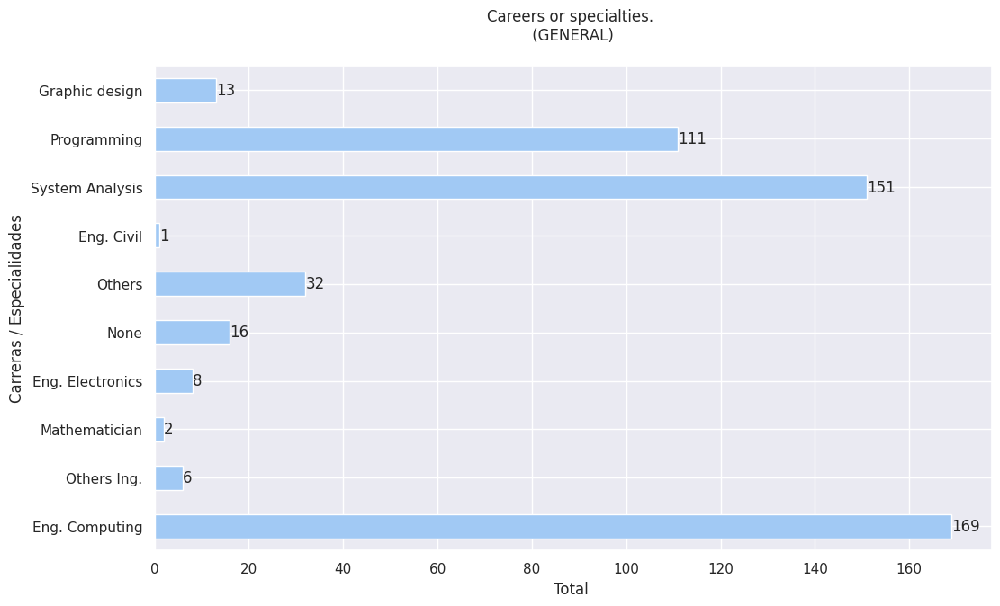

```python
carr_esp_uniques = get_column_uniques(df, "carr_especialidades")
```

```python
carr_esp_uniques
print(len(carr_esp_uniques))
```

```
10
```

## Importance of Formal Education

______________________________________________________________________

```
We explore the views of the "importance of formal education" of the people who answered.
- column name : 'imp_ed_formal'
```

```python
get_column_uniques(df, "imp_ed_formal")
```

```
['+ || -', 'CRITICO', 'MUY', 'NO', 'BASTANTE']
```

```python
importance_repl = {
    "MUY": "VERY",
    "BASTANTE": "FAIRLY",
    "CRITICO": "CRITICAL",
    #'+ || -':'MORE or LESS'
}


replace_column_content(df, "imp_ed_formal", importance_repl)
```

```python
# Ploting a figure for this column.
fig = plt.figure(figsize=(9, 5))
ax1 = plt.subplot(111)
# Plot
exp_df = df["imp_ed_formal"].value_counts()
exp_plot = exp_df.plot(
    kind="barh",
    title="Importance of formal education.\n (GENERAL)",
    # color=get_color("Mafasdfadle", "light"),
)


exp_plot.set_xlabel("Total")
exp_plot.set_ylabel("Importance Level")


# Plot annotations.
for k, v in enumerate(df["imp_ed_formal"].value_counts().values):
    exp_plot.annotate(v, (v, k), va="center")
plt.show()
```

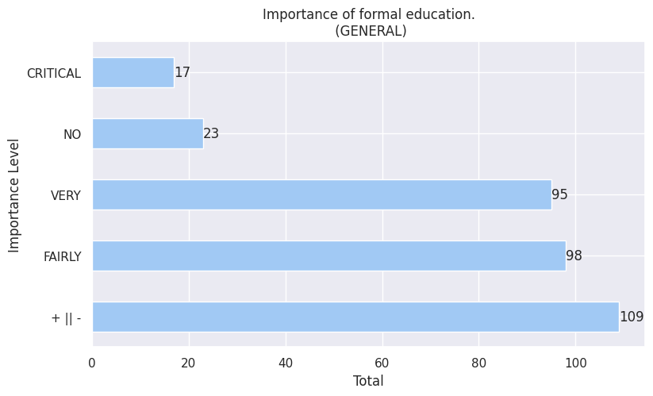

```python
# Ploting a figure for this column.
fig = plt.figure(figsize=(9, 5))
ax1 = plt.subplot(111)
# Plot
exp_df = df["imp_ed_formal"].value_counts(normalize=True)
exp_plot = exp_df.plot(
    kind="barh",
    title="Importance of formal education.\n (GENERAL)",
    # color=get_color("Mafasdfadle", "light"),
)


exp_plot.set_xlabel("Total")
exp_plot.set_ylabel("Importance Level")


# Plot annotations.
for k, v in enumerate(df["imp_ed_formal"].value_counts(normalize=True).values):
    exp_plot.annotate(get_percentage(v), (v, k), va="center")
plt.show()
```


## Educational Level x Gender

```
- We explore the "educational level" of the people who answered the survey by gender.
```

```python
# Making groups by gender.
gen = df.groupby("genero")
```

```python
# Print genders keys.
df["genero"].value_counts().keys()
```

```
Index(['HOMBRE', 'MUJER', 'NO COMPARTO'], dtype='object', name='genero')
```

```python
gen_repl = {
    "HOMBRE": "MAN",
    "MUJER": "WOMAN",
    "NO COMPARTO": "DONT SHARE",
}


replace_column_content(df, "genero", gen_repl)
```

### Education Level - HOMBRE

```
- Education level for the group of MENS. 
```

```python
# Available Columns:
#'educación'
#'carreras_o_especialidades'
#'importancia_educación_formal'
```

```python
# Print group 'HOMBRE' and the column 'educacion' with its value counts.
gen.get_group("MAN")["educacion"].value_counts()
```

```
educacion
University Education                                                              117
Basic Education;Middle School;University Education                                 37
Basic Education;Middle School;University Education;Autodidact                      31
University Education;Autodidact                                                    23
Master                                                                             15
Middle School                                                                      10
Basic Education;Middle School                                                       9
Basic Education;Middle School;Autodidact                                            8
Middle School;Autodidact                                                            7
University Education;Master                                                         6
Basic Education;Middle School;University Education;Master                           4
Basic Education;Middle School;University Education;Master;Autodidact                2
Autodidact                                                                          2
University Education;Master;Autodidact                                              2
Middle School;University Education                                                  1
Basic Education;Middle School;University Education;Master;Doctorate;Autodidact      1
Middle School;University Education;Autodidact                                       1
Basic Education;Middle School;Master;Autodidact                                     1
Middle School;University Education;Master                                           1
Doctorate                                                                           1
Name: count, dtype: int64
```

```python
get_normal_uniques_col_count(gen.get_group("MAN"), "educacion")
```

```
{'Middle School': 113,
 'Autodidact': 78,
 'Basic Education': 93,
 'University Education': 226,
 'Doctorate': 2,
 'Master': 32}
```

```python
ed_uniques = get_column_uniques(df, "educacion")
```

```python
# Making a plot for this 'relation'.
fig = plt.figure(figsize=(9, 5))
# Plot
ed_hombres_df = make_df(gen.get_group("MAN"), "educacion", "categories", "count")
ed_hombres_plot = ed_hombres_df.plot(
    kind="barh",
    title="Educational level of the respondents. \n (Men)",
    fontsize=13,
    legend=False,
    color=get_color("Male", "light"),
)

print(ed_hombres_df)
ed_hombres_plot.set_yticklabels([v for k, v in enumerate(ed_uniques)])


ed_hombres_plot.set_xlabel("Total")
ed_hombres_plot.set_ylabel("Education Level")


# Plot annotations.
for k, v in enumerate(ed_hombres_df["count"]):
    if v < 10:
        # if count its less than 10, value will be painted in 'red'.
        ed_hombres_plot.annotate(v, (v, k), va="center", color="black")
    else:
        # if count its greather than 10, value will be painted in 'blue'.
        ed_hombres_plot.annotate(v, (v, k), va="center", color="black")
plt.show()
```

```
/home/torrezmn/Documentos/Data_Science/Enc_Devs_Py/Notebooks/toolkit/tools.py:184: SettingWithCopyWarning: 
A value is trying to be set on a copy of a slice from a DataFrame.
Try using .loc[row_indexer,col_indexer] = value instead

See the caveats in the documentation: https://pandas.pydata.org/pandas-docs/stable/user_guide/indexing.html#returning-a-view-versus-a-copy
  df[col] = df[col].fillna(False)


             categories  count
0         Middle School    113
1            Autodidact     78
2       Basic Education     93
3  University Education    226
4             Doctorate      2
5                Master     32


<Figure size 900x500 with 0 Axes>
```

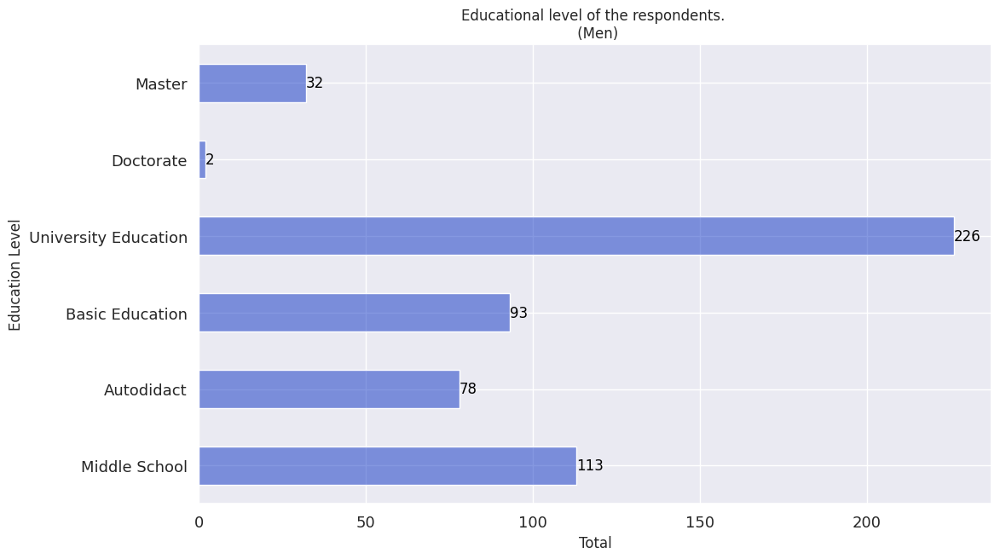

### Careers or Specialties - HOMBRE

```
- Column name : 'carr_especialidades'
```

```python
# Print 'value counts' of this column.
gen.get_group("MAN")["carr_especialidades"].value_counts()
```

```
carr_especialidades
Eng. Computing                                                      92
System Analysis                                                     52
Programming;System Analysis                                         22
Programming;Eng. Computing                                          17
Programming;System Analysis;Eng. Computing                          15
Programming                                                         15
None                                                                13
System Analysis;Eng. Computing                                       7
Eng. Electronics                                                     5
Programming;System Analysis;Others                                   5
Eng. Computing;Others                                                4
Others Ing.                                                          4
System Analysis;Others                                               3
Others                                                               3
Programming;Others                                                   2
Programming;System Analysis;Graphic design                           2
Programming;Graphic design                                           2
Programming;Eng. Computing;Others                                    2
Programming;System Analysis;Eng. Computing;Others                    2
Programming;Graphic design;Others                                    2
Programming;System Analysis;Eng. Computing;Eng. Electronics          1
Programming;System Analysis;Eng. Computing;Graphic design;Others     1
System Analysis;Graphic design                                       1
Graphic design                                                       1
System Analysis;Eng. Electronics                                     1
Programming;Others Ing.;Graphic design                               1
Mathematician                                                        1
Programming;System Analysis;Eng. Computing;Mathematician             1
System Analysis;None                                                 1
System Analysis;Eng. Computing;Graphic design                        1
Name: count, dtype: int64
```

```python
# Making a plot for this column.
fig = plt.figure(figsize=(9, 5))
# Plot
carr_hombres_df = make_df(
    gen.get_group("MAN"), "carr_especialidades", "Category", "count"
)
carr_hombres_plot = carr_hombres_df.plot(
    kind="barh",
    title="Carers or Specialties \n (Men)",
    ylabel="Carers / Specialties",
    xlabel="Total",
    legend=False,
    color=get_color("Male", "light"),
)

print(carr_hombres_df)
carr_hombres_plot.set_yticklabels(
    [v for k, v in enumerate(carr_hombres_df["Category"])]
)


# Plot annotations.
for k, v in enumerate(carr_hombres_df["count"]):
    if v < 10:
        # If count its less than 10, value will be painted in 'red'.
        carr_hombres_plot.annotate(v, (v, k), va="center", color="black")
    else:
        # If count its greather than 10, value will be painted in 'blue'.
        carr_hombres_plot.annotate(v, (v, k), va="center", color="black")
plt.show()
```

```
/home/torrezmn/Documentos/Data_Science/Enc_Devs_Py/Notebooks/toolkit/tools.py:184: SettingWithCopyWarning: 
A value is trying to be set on a copy of a slice from a DataFrame.
Try using .loc[row_indexer,col_indexer] = value instead

See the caveats in the documentation: https://pandas.pydata.org/pandas-docs/stable/user_guide/indexing.html#returning-a-view-versus-a-copy
  df[col] = df[col].fillna(False)


           Category  count
0    Eng. Computing    143
1       Others Ing.      5
2     Mathematician      2
3  Eng. Electronics      7
4              None     14
5            Others     29
6   System Analysis    115
7       Programming     90
8    Graphic design     11


<Figure size 900x500 with 0 Axes>
```

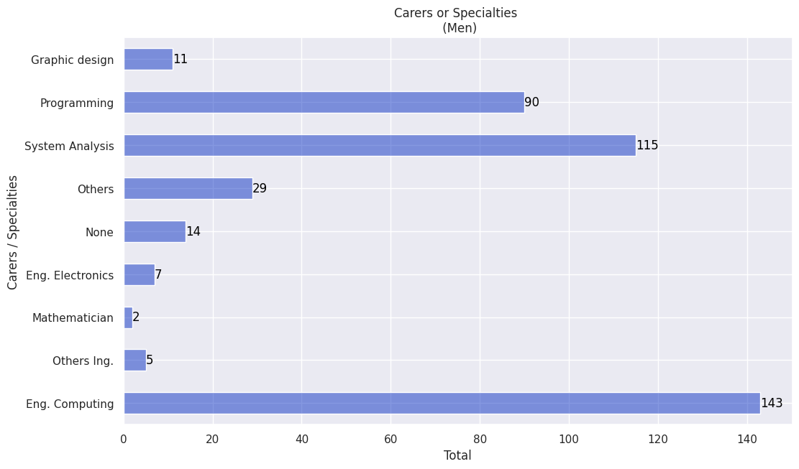

```python
make_custom_horizontal_bar(
    carr_hombres_df,
    "carr_especialidades",
    "\n Carers or Specialties \n (Men).",
    "Total",
    "Carers / Specialties",
    False,
)
```

```
<Figure size 900x500 with 0 Axes>
```

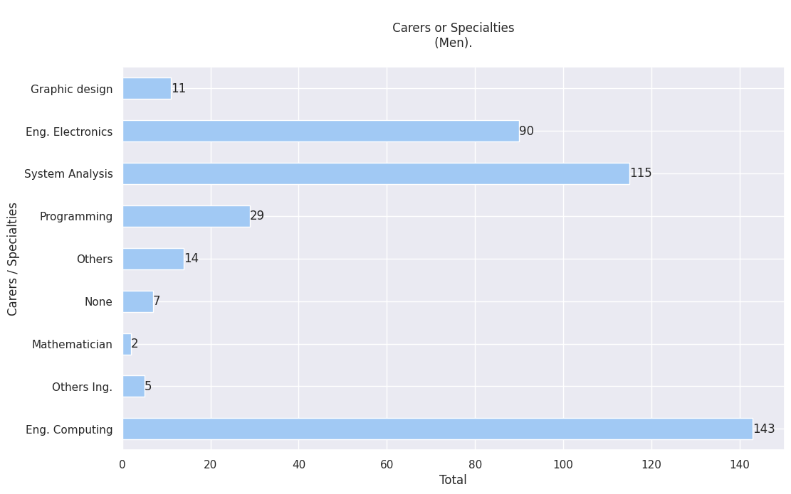

```python
carr_hombres_df = make_df(
    gen.get_group("MAN"), "carr_especialidades", "Category", "count"
)
print(carr_hombres_df)
```

```
           Category  count
0    Eng. Computing    143
1       Others Ing.      5
2     Mathematician      2
3  Eng. Electronics      7
4              None     14
5            Others     29
6   System Analysis    115
7       Programming     90
8    Graphic design     11


/home/torrezmn/Documentos/Data_Science/Enc_Devs_Py/Notebooks/toolkit/tools.py:184: SettingWithCopyWarning: 
A value is trying to be set on a copy of a slice from a DataFrame.
Try using .loc[row_indexer,col_indexer] = value instead

See the caveats in the documentation: https://pandas.pydata.org/pandas-docs/stable/user_guide/indexing.html#returning-a-view-versus-a-copy
  df[col] = df[col].fillna(False)
```

- NOTE: There is a theoretical or scope conflict within the content of this column. A career is an academic degree and a specialty is a branch of knowledge within a career. Within the column the category "programacion, ninguna, Otras" are presented. It makes no sense to consider them.

### Importance of formal education. - HOMBRES

```python
# Print the 'normal count' of values in the column.
df["imp_ed_formal"].value_counts()
```

```
imp_ed_formal
+ || -      109
FAIRLY       98
VERY         95
NO           23
CRITICAL     17
Name: count, dtype: int64
```

```python
# Print the 'normal count' of values in the column.
print(df["imp_ed_formal"].value_counts(normalize=True))
```

```
imp_ed_formal
+ || -      0.318713
FAIRLY      0.286550
VERY        0.277778
NO          0.067251
CRITICAL    0.049708
Name: proportion, dtype: float64
```

```python
print(percentage_to_normal(df["imp_ed_formal"].value_counts(normalize=True)))
```

```
imp_ed_formal
+ || -      31.9 %
FAIRLY      28.7 %
VERY        27.8 %
NO           6.7 %
CRITICAL     5.0 %
Name: proportion, dtype: object
```

```python
make_normalized_df(df, "imp_ed_formal")
```

<div>
<style scoped>
    .dataframe tbody tr th:only-of-type {
        vertical-align: middle;
    }

```
.dataframe tbody tr th {
    vertical-align: top;
}

.dataframe thead th {
    text-align: right;
}
```

</style>
<table border="1" class="dataframe">
  <thead>
    <tr style="text-align: right;">
      <th></th>
      <th>total count</th>
    </tr>
    <tr>
      <th>categories</th>
      <th></th>
    </tr>
  </thead>
  <tbody>
    <tr>
      <th>+ || -</th>
      <td>31.871345</td>
    </tr>
    <tr>
      <th>FAIRLY</th>
      <td>28.654971</td>
    </tr>
    <tr>
      <th>VERY</th>
      <td>27.777778</td>
    </tr>
    <tr>
      <th>NO</th>
      <td>6.725146</td>
    </tr>
    <tr>
      <th>CRITICAL</th>
      <td>4.970760</td>
    </tr>
  </tbody>
</table>
</div>

```python
make_normalized_df(df, "imp_ed_formal")
```

<div>
<style scoped>
    .dataframe tbody tr th:only-of-type {
        vertical-align: middle;
    }

```
.dataframe tbody tr th {
    vertical-align: top;
}

.dataframe thead th {
    text-align: right;
}
```

</style>
<table border="1" class="dataframe">
  <thead>
    <tr style="text-align: right;">
      <th></th>
      <th>total count</th>
    </tr>
    <tr>
      <th>categories</th>
      <th></th>
    </tr>
  </thead>
  <tbody>
    <tr>
      <th>+ || -</th>
      <td>31.871345</td>
    </tr>
    <tr>
      <th>FAIRLY</th>
      <td>28.654971</td>
    </tr>
    <tr>
      <th>VERY</th>
      <td>27.777778</td>
    </tr>
    <tr>
      <th>NO</th>
      <td>6.725146</td>
    </tr>
    <tr>
      <th>CRITICAL</th>
      <td>4.970760</td>
    </tr>
  </tbody>
</table>
</div>

```python
# Any null value?
df["imp_ed_formal"].isna().sum()
```

```
0
```

```python
# Making a chart for this column.
fig = plt.figure(figsize=(5, 10))
ax1 = plt.subplot(111)
# Plot
import_df = gen.get_group("MAN")["imp_ed_formal"].value_counts(normalize=True)
import_plot = import_df.plot(
    kind="pie",
    title="Importance of formal education. \n (Men)",
    autopct="%1.1f%%",
    ylabel="",
    xlabel="",
    explode=explode_pie(import_df.size),
)

plt.show()
```


### EDUCACION - MUJERES

______________________________________________________________________

```
The 'education' of the womens.
```

```python
#'educación'
#'carreras_o_especialidades'
#'importancia_educación_formal'
```

- Grouped in this way, the content of the column makes no sense. We will try to separate each "category".

```python
gen.get_group("WOMAN")["educacion"].value_counts()
```

```
educacion
University Education                                             29
University Education;Autodidact                                   5
Basic Education;Middle School;University Education                5
Basic Education;Middle School;University Education;Autodidact     3
University Education;Master                                       2
Master                                                            2
Master;Autodidact                                                 1
Basic Education;Middle School                                     1
Middle School                                                     1
Name: count, dtype: int64
```

```python
print("WIMAN education levels.")
make_normalized_df(gen.get_group("WOMAN"), "educacion")
```

```
WIMAN education levels.
```

<div>
<style scoped>
    .dataframe tbody tr th:only-of-type {
        vertical-align: middle;
    }

```
.dataframe tbody tr th {
    vertical-align: top;
}

.dataframe thead th {
    text-align: right;
}
```

</style>
<table border="1" class="dataframe">
  <thead>
    <tr style="text-align: right;">
      <th></th>
      <th>total count</th>
    </tr>
    <tr>
      <th>categories</th>
      <th></th>
    </tr>
  </thead>
  <tbody>
    <tr>
      <th>University Education</th>
      <td>57.142857</td>
    </tr>
    <tr>
      <th>Middle School</th>
      <td>12.987013</td>
    </tr>
    <tr>
      <th>Autodidact</th>
      <td>11.688312</td>
    </tr>
    <tr>
      <th>Basic Education</th>
      <td>11.688312</td>
    </tr>
    <tr>
      <th>Master</th>
      <td>6.493506</td>
    </tr>
  </tbody>
</table>
</div>

```python
fig = plt.figure(figsize=(9, 5))


ed_mujeres_df = make_df(gen.get_group("WOMAN"), "educacion", "categories", "count")
ed_mujeres_plot = ed_mujeres_df.plot(
    kind="barh",
    title="Level of Education \n Woman",
    legend=False,
    color=get_color("Female", "light"),
)

print(ed_mujeres_df)
ed_mujeres_plot.set_yticklabels([v for k, v in enumerate(ed_mujeres_df["categories"])])

ed_mujeres_plot.set_xlabel("Total")
ed_mujeres_plot.set_ylabel("Education Level")


for k, v in enumerate([i for i in ed_mujeres_df["count"]]):
    if v < 10:
        ed_mujeres_plot.annotate(v, (v, k), va="center", color="black")
    else:
        ed_mujeres_plot.annotate(v, (v, k), va="center", color="black")

plt.show()
```

```
/home/torrezmn/Documentos/Data_Science/Enc_Devs_Py/Notebooks/toolkit/tools.py:184: SettingWithCopyWarning: 
A value is trying to be set on a copy of a slice from a DataFrame.
Try using .loc[row_indexer,col_indexer] = value instead

See the caveats in the documentation: https://pandas.pydata.org/pandas-docs/stable/user_guide/indexing.html#returning-a-view-versus-a-copy
  df[col] = df[col].fillna(False)


             categories  count
0         Middle School     10
1            Autodidact      9
2       Basic Education      9
3  University Education     44
4                Master      5


<Figure size 900x500 with 0 Axes>
```

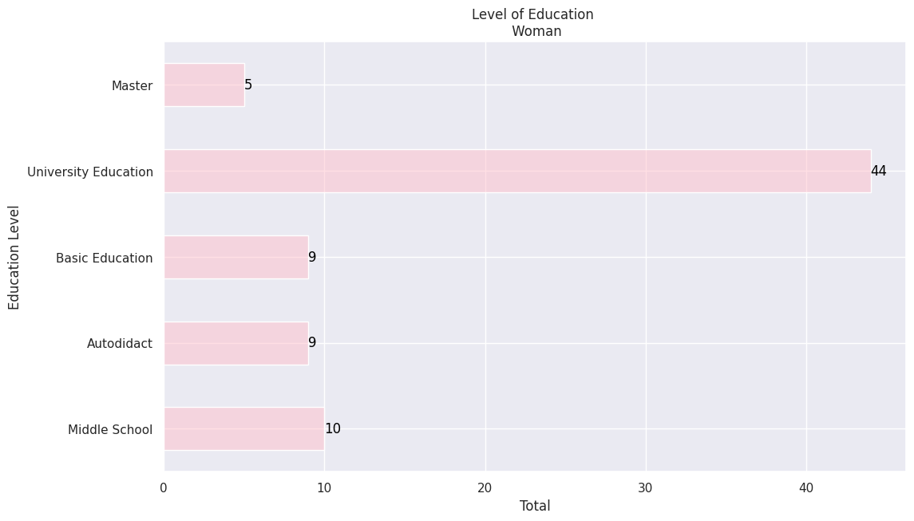

### Carreras o especialidades. - MUJERES

- column name : 'carr_especialidades'

```python
fig = plt.figure(figsize=(9, 5))


carr_mujeres_df = make_df(
    gen.get_group("WOMAN"), "carr_especialidades", "categories", "count"
)
carr_mujeres_plot = carr_mujeres_df.plot(
    kind="barh",
    ylabel="Carers / Specialties",
    title="Careers or specialties. \n Woman",
    legend=False,
    color=get_color("Female", "light"),
)


carr_mujeres_plot.set_xlabel("Total")
carr_mujeres_plot.set_ylabel("Careers")


print(carr_mujeres_df)
carr_mujeres_plot.set_yticklabels(
    [v for k, v in enumerate(carr_mujeres_df["categories"])]
)

for k, v in enumerate([i for i in carr_mujeres_df["count"]]):
    carr_mujeres_plot.annotate(v, (v, k), va="center", color="black")

plt.show()
```

```
        categories  count
0   Eng. Computing     22
1           Others      2
2  System Analysis     27
3      Programming     15
4   Graphic design      1


/home/torrezmn/Documentos/Data_Science/Enc_Devs_Py/Notebooks/toolkit/tools.py:184: SettingWithCopyWarning: 
A value is trying to be set on a copy of a slice from a DataFrame.
Try using .loc[row_indexer,col_indexer] = value instead

See the caveats in the documentation: https://pandas.pydata.org/pandas-docs/stable/user_guide/indexing.html#returning-a-view-versus-a-copy
  df[col] = df[col].fillna(False)


<Figure size 900x500 with 0 Axes>
```

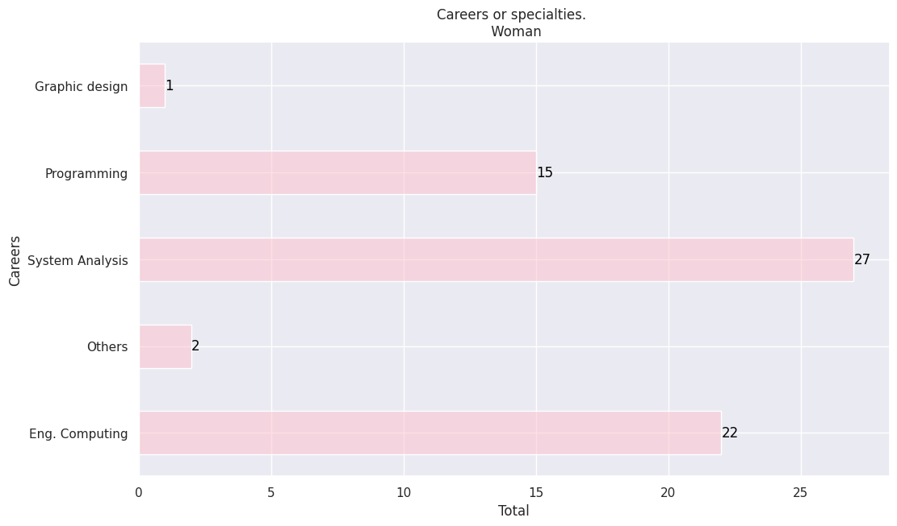

# Importancia de la educacion formal. - MUJERES

- column name : 'imp_ed_formal'

```python
[i for i in gen.groups.keys()]
```

```
['DONT SHARE', 'MAN', 'WOMAN']
```

```python
fig = plt.figure(figsize=(9, 5))

muj_import_df = gen.get_group("WOMAN")["imp_ed_formal"].value_counts()
muj_import_plot = muj_import_df.plot(
    kind="barh",
    title="Importance of formal education. \n Woman",
    color=get_color("Female", "light"),
)

muj_import_plot.set_xlabel("Total")
muj_import_plot.set_ylabel("Importance Level")


for k, v in enumerate(gen.get_group("WOMAN")["imp_ed_formal"].value_counts().values):
    muj_import_plot.annotate(v, (v, k), va="center", color="black")

plt.show()
```

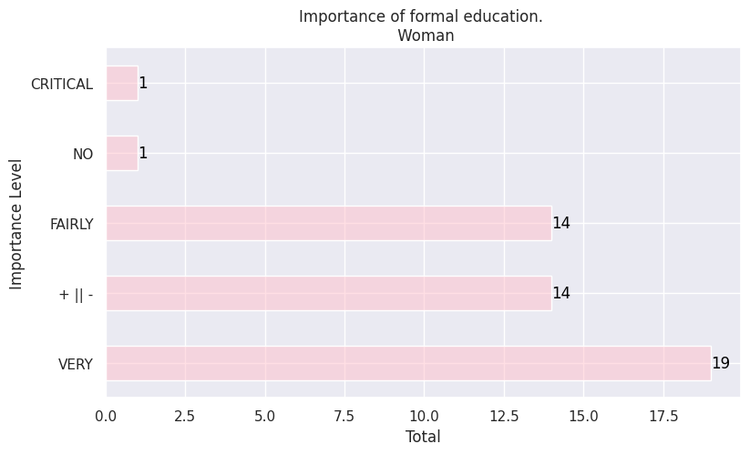

### EDUCACION - NO COMPARTO

```python
#'educación'
#'carreras_o_especialidades'
#'importancia_educación_formal'
```

```python
gen.groups.keys()
```

```
dict_keys(['DONT SHARE', 'MAN', 'WOMAN'])
```

```python
fig = plt.figure(figsize=(9, 5))
ed_no_comp_df = make_df(gen.get_group("DONT SHARE"), "educacion", "categories", "count")

ed_no_comp_plot = ed_no_comp_df.plot(
    kind="barh",
    title="Education Levels \n NO COMPARTO",
    color=get_color("I do not share.", "light"),
    legend=False,
)


ed_no_comp_plot.set_xlabel("Total")
ed_no_comp_plot.set_ylabel("Education Level")

print(ed_no_comp_df)
ed_no_comp_plot.set_yticklabels([v for k, v in enumerate(ed_no_comp_df["categories"])])


for k, v in enumerate([i for i in ed_no_comp_df["count"]]):
    ed_no_comp_plot.annotate(v, (v, k), va="center", color="blue")

plt.show()
```

```
             categories  count
0            Autodidact      2
1       Basic Education      2
2  University Education      4
3         Middle School      3


/home/torrezmn/Documentos/Data_Science/Enc_Devs_Py/Notebooks/toolkit/tools.py:184: SettingWithCopyWarning: 
A value is trying to be set on a copy of a slice from a DataFrame.
Try using .loc[row_indexer,col_indexer] = value instead

See the caveats in the documentation: https://pandas.pydata.org/pandas-docs/stable/user_guide/indexing.html#returning-a-view-versus-a-copy
  df[col] = df[col].fillna(False)


<Figure size 900x500 with 0 Axes>
```


### Carreras o especialidades. - NO DEFINIDO

```python
fig = plt.figure(figsize=(9, 5))


carr_no_comp_df = make_df(
    gen.get_group("DONT SHARE"), "carr_especialidades", "categoria", "cuenta"
)
carr_no_comp_plot = carr_no_comp_df.plot(
    kind="barh",
    title="Carers or specialties. \n I do not share.",
    color=get_color("I do not share.", "light"),
    legend=False,
)


carr_no_comp_plot.set_xlabel("Total")
carr_no_comp_plot.set_ylabel("Carrers / Specialties")


print(carr_no_comp_df)
carr_no_comp_plot.set_yticklabels(
    [v for k, v in enumerate(carr_no_comp_df["categoria"])]
)


for k, v in enumerate([i for i in carr_no_comp_df["cuenta"]]):
    carr_no_comp_plot.annotate(v, (v, k), va="center")

plt.show()
```

```
          categoria  cuenta
0    Eng. Computing       1
1       Others Ing.       1
2  Eng. Electronics       1
3              None       1
4        Eng. Civil       1
5   System Analysis       3
6       Programming       2
7    Graphic design       1


/home/torrezmn/Documentos/Data_Science/Enc_Devs_Py/Notebooks/toolkit/tools.py:184: SettingWithCopyWarning: 
A value is trying to be set on a copy of a slice from a DataFrame.
Try using .loc[row_indexer,col_indexer] = value instead

See the caveats in the documentation: https://pandas.pydata.org/pandas-docs/stable/user_guide/indexing.html#returning-a-view-versus-a-copy
  df[col] = df[col].fillna(False)


<Figure size 900x500 with 0 Axes>
```


### Importancia de la educacion formal. - NO DEFINIDO

```python
fig = plt.figure(figsize=(9, 5))
imp_ed_no_comp_df = gen.get_group("DONT SHARE")["imp_ed_formal"].value_counts()
imp_ed_no_comp_plot = imp_ed_no_comp_df.plot(
    kind="barh",
    title="Importance of formal education. \n I do not share.",
    color=get_color("I do not share.", "light"),
)


imp_ed_no_comp_plot.set_xlabel("Total")
imp_ed_no_comp_plot.set_ylabel("Carrers / Specialties")


for k, v in enumerate(
    [i for i in gen.get_group("DONT SHARE")["imp_ed_formal"].value_counts().values]
):
    imp_ed_no_comp_plot.annotate(v, (v, k), va="center", color="blue")

plt.show()
```

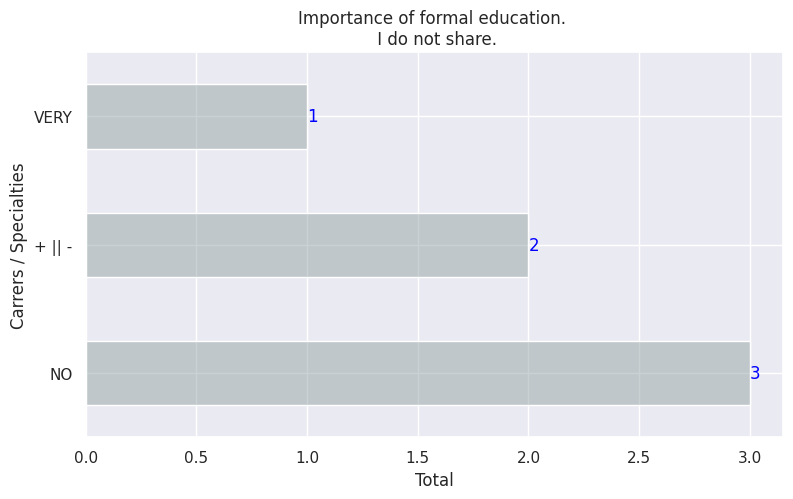

```python
df.columns
```

```
Index(['marca_temp', 'modalidad', 'trabajo', 'tipo_de_trabajo', 'devops',
       'programar_x_trabajo', 'exp_en_IT', 'exp_en_programacion',
       '1_linea_de_codigo', 'educacion', 'carr_especialidades',
       'imp_ed_formal', 'genero', 'edad_actual', 'salario_mensual',
       'prog_script_leng', 'lib_frameworks', 'otras_lib_frameworks', 'db',
       'plataformas', 'leng_fav', 'leng_mas_odiado', 'fram_fav',
       'fram_mas_odiado', 'herramientas'],
      dtype='object')
```

# IMPORTANCIA DE LA EDUCACION FORMAL - COMPARATIVAS

columna --------> 'imp_ed_formal'

```python
generos = gen.groups.keys()
plt.figure(figsize=(4, 20), dpi=80)
```

```
<Figure size 320x1600 with 0 Axes>


<Figure size 320x1600 with 0 Axes>
```

```python
for k, v in enumerate(generos):
    # plt.subplot(2, 2, k + 1)
    ie_df = gen.get_group(v)["imp_ed_formal"].value_counts(normalize=True)
    ie_plot = ie_df.plot(
        kind="pie",
        ylabel="",
        autopct="%1.1f%%",
        explode=explode_pie(ie_df.size),
        textprops={"fontsize": 12},
        title=f"Importance of formal education by Gender.\n ({v})",
    )
    plt.show()

# plt.subplots_adjust(left=0.1, bottom=0.1, right=0.9, top=0.3, wspace=0.4, hspace=0.4)
```

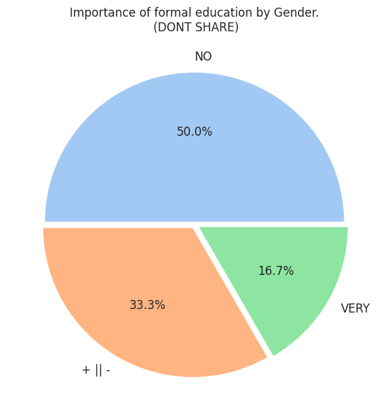

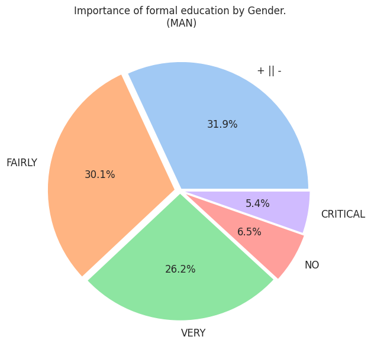


```python
for k, v in enumerate(generos):
    ie_df = gen.get_group(v)["imp_ed_formal"].value_counts(normalize=True)
    print(f"Gender : {v}\nImportance of formal education.")
    print("=" * 33)
    print(percentage_to_normal(ie_df))
    print("\n" * 4)
```

```
Gender : DONT SHARE
Importance of formal education.
=================================
imp_ed_formal
NO        50.0 %
+ || -    33.3 %
VERY      16.7 %
Name: proportion, dtype: object


Gender : MAN
Importance of formal education.
=================================
imp_ed_formal
+ || -      31.9 %
FAIRLY      30.1 %
VERY        26.2 %
NO           6.5 %
CRITICAL     5.4 %
Name: proportion, dtype: object


Gender : WOMAN
Importance of formal education.
=================================
imp_ed_formal
VERY        38.8 %
+ || -      28.6 %
FAIRLY      28.6 %
NO           2.0 %
CRITICAL     2.0 %
Name: proportion, dtype: object
```

## Education

```
(Column name 'educacion'.)
```

```python
group_config = {
    "title": "educacion by Gender \n",
    "c1_label": "Hombres",
    "c2_label": "Mujeres",
    "xlabel": "\n educacion level. \n",
    "ylabel": "\n Total count.",
}

make_horizontal_grouped_chart(
    df,
    gen.get_group("MAN").fillna(""),
    gen.get_group("WOMAN").fillna(""),
    "educacion",
    get_column_uniques(df, "educacion"),
    group_config,
)
```

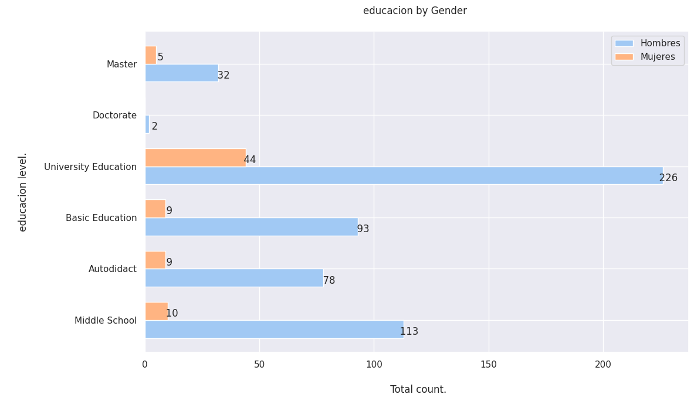

## Carreras o especialidades.

- Column name 'carr_especialidades'.

# carr_especialidades

```python
group_config = {
    "title": "carr_especialidades by Gender \n",
    "c1_label": "Hombres",
    "c2_label": "Mujeres",
    "xlabel": "\n carr_especialidades level. \n",
    "ylabel": "\n Total count.",
}

make_horizontal_grouped_chart(
    df,
    gen.get_group("MAN").fillna(""),
    gen.get_group("WOMAN").fillna(""),
    "carr_especialidades",
    get_column_uniques(df, "carr_especialidades"),
    group_config,
)
```


# edad_actual

```python
group_config = {
    "title": "edad_actual by Gender \n",
    "c1_label": "Hombres",
    "c2_label": "Mujeres",
    "xlabel": "\n edad_actual level. \n",
    "ylabel": "\n Total count.",
}

make_vertical_grouped_chart(
    df,
    gen.get_group("MAN").fillna(""),
    gen.get_group("WOMAN").fillna(""),
    "edad_actual",
    get_column_uniques(df, "edad_actual"),
    group_config,
)
```

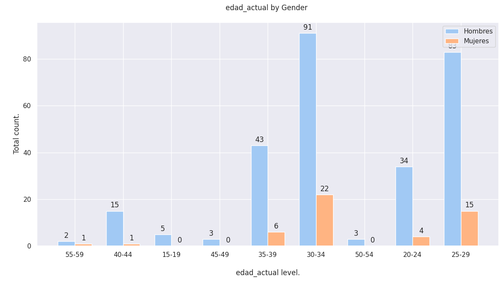

```python
print("HOMBRES ", gen.get_group("MAN").fillna("")["edad_actual"].value_counts())
print("\n" * 3)
print("MUJERES ", gen.get_group("WOMAN").fillna("")["edad_actual"].value_counts())
```

```
HOMBRES  edad_actual
30-34    91
25-29    83
35-39    43
20-24    34
40-44    15
15-19     5
45-49     3
50-54     3
55-59     2
Name: count, dtype: int64


MUJERES  edad_actual
30-34    22
25-29    15
35-39     6
20-24     4
55-59     1
40-44     1
Name: count, dtype: int64
```

# salario_mensual

```python
group_config = {
    "title": "salario_mensual by Gender \n",
    "c1_label": "Hombres",
    "c2_label": "Mujeres",
    "xlabel": "\n salario_mensual level. \n",
    "ylabel": "\n Total count.",
}

make_horizontal_grouped_chart(
    df,
    gen.get_group("MAN").fillna(""),
    gen.get_group("WOMAN").fillna(""),
    "salario_mensual",
    get_column_uniques(df, "salario_mensual"),
    group_config,
)
```


```python

```

```python

```

```python

```

```python

```

```python

```

# TEST COMPARATIVE CHARTS

```python
for i in df.columns:
    print(i)
```

```
marca_temp
modalidad
trabajo
tipo_de_trabajo
devops
programar_x_trabajo
exp_en_IT
exp_en_programacion
1_linea_de_codigo
educacion
carr_especialidades
imp_ed_formal
genero
edad_actual
salario_mensual
prog_script_leng
lib_frameworks
otras_lib_frameworks
db
plataformas
leng_fav
leng_mas_odiado
fram_fav
fram_mas_odiado
herramientas
```

```python
get_column_uniques(df, "trabajo")
```

```
['Internacional', 'Ambas', 'Nacional (Paraguay)']
```

```python

```

```python
gen.groups.keys()
```

```
dict_keys(['DONT SHARE', 'MAN', 'WOMAN'])
```

```python
count_modalidad_hombres = get_uniques_col_count(gen.get_group("MAN"), "modalidad")
```

```python
count_modalidad_mujeres = get_uniques_col_count(gen.get_group("WOMAN"), "modalidad")
```

```python
modalidad_labels = get_column_uniques(df, "modalidad")
```

```python
print("MODALIDAD LABELS -> ", modalidad_labels)
print("MOD COUNT HOMBRES -< ", count_modalidad_hombres)
print("MOD COUNT MUJERES -< ", count_modalidad_mujeres)
```

```
MODALIDAD LABELS ->  ['Presencial', 'Ninguna', 'Hibrído', 'Remoto']
MOD COUNT HOMBRES -<  {'Presencial': 60, 'Ninguna': 8, 'Hibrído': 94, 'Remoto': 117}
MOD COUNT MUJERES -<  {'Presencial': 18, 'Hibrído': 11, 'Remoto': 20}
```

```python
men_val = [count_modalidad_hombres.get(i, 0) for i in modalidad_labels]
```

```python
women_val = [count_modalidad_mujeres.get(i, 0) for i in modalidad_labels]
```

```python
men_val
```

```
[60, 8, 94, 117]
```

```python
women_val
```

```
[18, 0, 11, 20]
```

```python
labels = get_column_uniques(df, "modalidad")
men_means = [20, 34, 30, 35, 27]
women_means = [25, 32, 34, 20, 25]

x = np.arange(len(labels))  # the label locations
width = 0.35  # the width of the bars

fig, ax = plt.subplots()
rects1 = ax.bar(x - width / 2, men_val, width, label="Men")
rects2 = ax.bar(x + width / 2, women_val, width, label="Women")

# Add some text for labels, title and custom x-axis tick labels, etc.
ax.set_ylabel("Modalidad")
ax.set_title("Modalidad by group and gender")
ax.set_xticks(x)
ax.set_xticklabels(labels)
ax.legend()


def autolabel(rects):
    """Attach a text label above each bar in *rects*, displaying its height."""
    for rect in rects:
        height = rect.get_height()
        ax.annotate(
            "{}".format(height),
            xy=(rect.get_x() + rect.get_width() / 2, height),
            xytext=(0, 3),  # 3 points vertical offset
            textcoords="offset points",
            ha="center",
            va="bottom",
        )


autolabel(rects1)
autolabel(rects2)

fig.tight_layout()

plt.show()
```

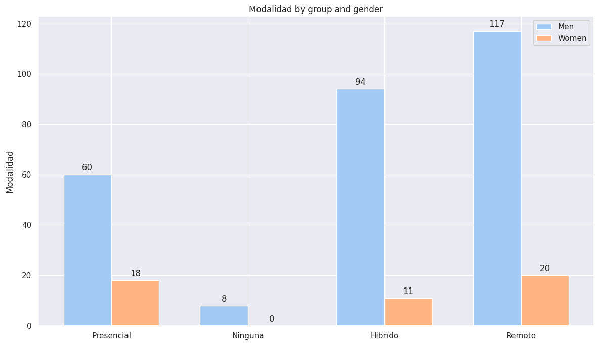

```python
group_config = {
    "title": "Education by Gender \n",
    "c1_label": "Hombres",
    "c2_label": "Mujeres",
    "xlabel": "\n Education level.",
    "ylabel": "Total count.\n",
}

make_vertical_grouped_chart(
    df,
    gen.get_group("MAN"),
    gen.get_group("WOMAN"),
    "educacion",
    get_column_uniques(df, "educacion"),
    group_config,
)
```

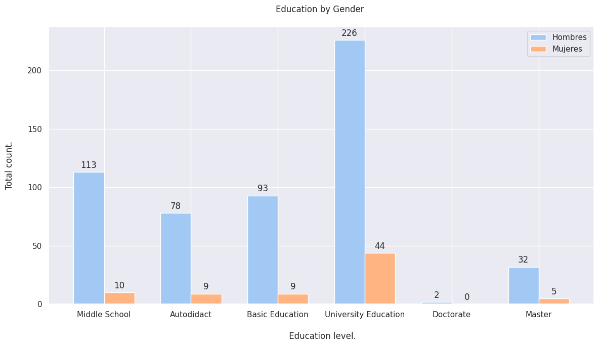

```python
group_config = {
    "title": "exp_en_IT by Gender \n",
    "c1_label": "Hombres",
    "c2_label": "Mujeres",
    "xlabel": "\n exp_en_IT level.",
    "ylabel": "Total count.\n",
}

make_vertical_grouped_chart(
    df,
    gen.get_group("MAN"),
    gen.get_group("WOMAN"),
    "exp_en_IT",
    get_column_uniques(df, "exp_en_IT"),
    group_config,
)
```

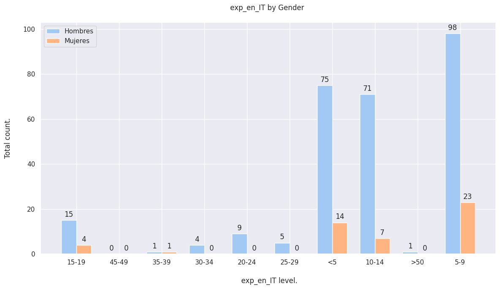

```python
df["leng_mas_odiado"].dropna(inplace=True)
```

```python
get_column_uniques(df, "1_linea_de_codigo")
```

```
['16-17',
 '26-27',
 '24-25',
 '12-13',
 '10-11',
 '18-19',
 '<10',
 '14-15',
 '20-21',
 '>30',
 '22-23',
 '28-29']
```

```python
group_config = {
    "title": "1_linea_de_codigo by Gender \n",
    "c1_label": "Hombres",
    "c2_label": "Mujeres",
    "xlabel": "\n 1_linea_de_codigo level.",
    "ylabel": "Total count.\n",
}

make_vertical_grouped_chart(
    df,
    gen.get_group("MAN").fillna(""),
    gen.get_group("WOMAN").fillna(""),
    "1_linea_de_codigo",
    get_column_uniques(df, "1_linea_de_codigo"),
    group_config,
)
```


```python
group_config = {
    "title": "modalidad by Gender \n",
    "c1_label": "Hombres",
    "c2_label": "Mujeres",
    "xlabel": "\n modalidad level.",
    "ylabel": "Total count.\n",
}

make_vertical_grouped_chart(
    df,
    gen.get_group("MAN").fillna(""),
    gen.get_group("WOMAN").fillna(""),
    "modalidad",
    get_column_uniques(df, "modalidad"),
    group_config,
)
```

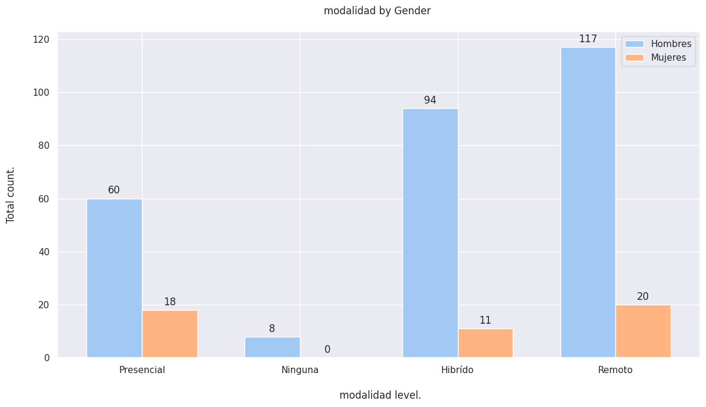

```python
df.columns
```

```
Index(['marca_temp', 'modalidad', 'trabajo', 'tipo_de_trabajo', 'devops',
       'programar_x_trabajo', 'exp_en_IT', 'exp_en_programacion',
       '1_linea_de_codigo', 'educacion', 'carr_especialidades',
       'imp_ed_formal', 'genero', 'edad_actual', 'salario_mensual',
       'prog_script_leng', 'lib_frameworks', 'otras_lib_frameworks', 'db',
       'plataformas', 'leng_fav', 'leng_mas_odiado', 'fram_fav',
       'fram_mas_odiado', 'herramientas'],
      dtype='object')
```

```python
group_config = {
    "title": "edad_actual by Gender \n",
    "c1_label": "Hombres",
    "c2_label": "Mujeres",
    "xlabel": "\n edad_actual level.",
    "ylabel": "Total count.\n",
}

make_vertical_grouped_chart(
    df,
    gen.get_group("MAN").fillna(""),
    gen.get_group("WOMAN").fillna(""),
    "edad_actual",
    get_column_uniques(df, "edad_actual"),
    group_config,
)
```

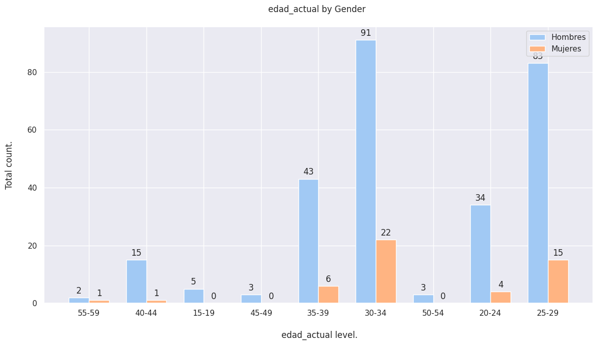

```python
group_config = {
    "title": "carr_especialidades by Gender \n",
    "c1_label": "Hombres",
    "c2_label": "Mujeres",
    "xlabel": "\n carr_especialidades level.\n \n",
    "ylabel": "\n \n \n Total count.\n",
}

make_horizontal_grouped_chart(
    df,
    gen.get_group("MAN").fillna(""),
    gen.get_group("WOMAN").fillna(""),
    "carr_especialidades",
    get_column_uniques(df, "carr_especialidades"),
    group_config,
)
```

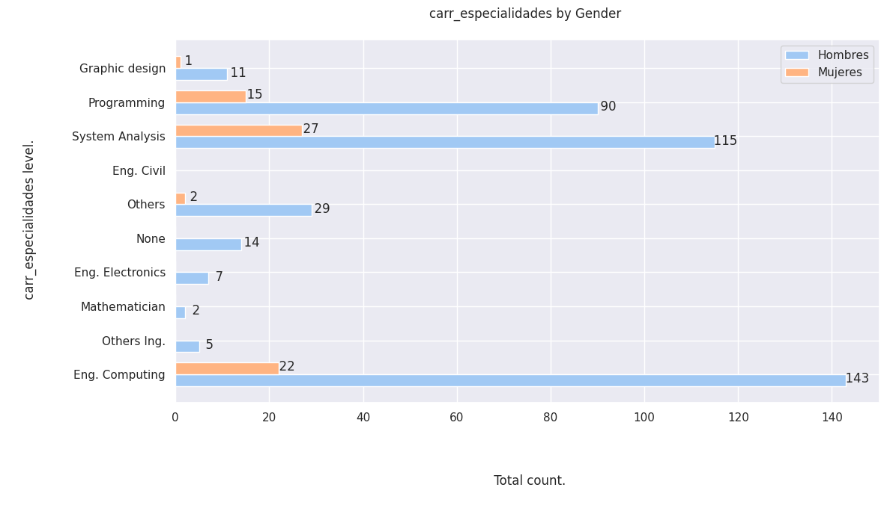

```python
group_config = {
    "title": "carr_especialidades by Gender \n",
    "c1_label": "Hombres",
    "c2_label": "Mujeres",
    "xlabel": "\n carr_especialidades level. \n",
    "ylabel": "\n Total count.",
}

make_horizontal_grouped_chart(
    df,
    gen.get_group("MAN").fillna(""),
    gen.get_group("WOMAN").fillna(""),
    "carr_especialidades",
    get_column_uniques(df, "carr_especialidades"),
    group_config,
)
```

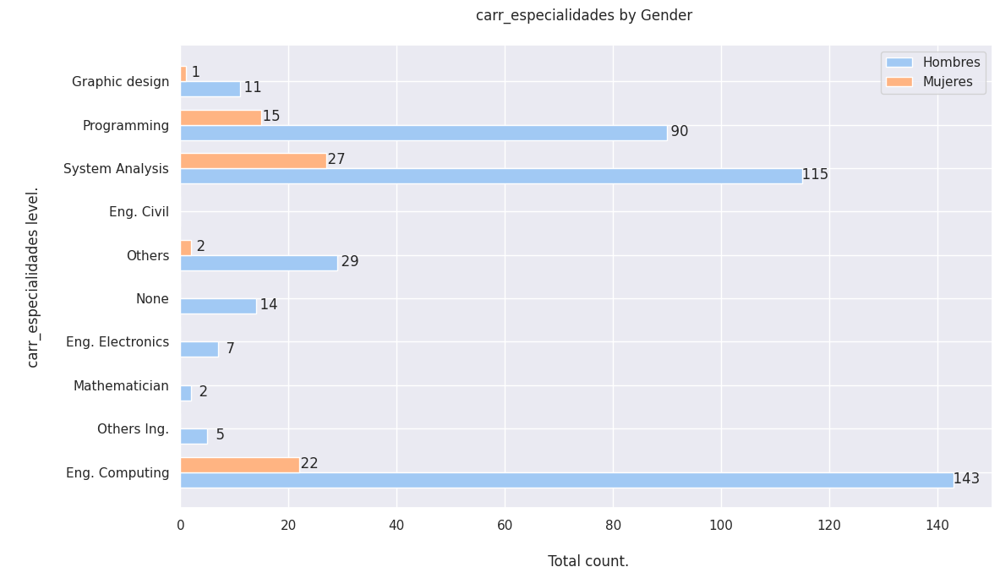

```python
print(
    "MAN ",
    get_uniques_col_count(gen.get_group("MAN").fillna(""), "carr_especialidades"),
)
print("\n" * 3)
# print("WOMAN -> ", gen.get_group('WOMAN').fillna('')["carr_especialidades"].value_counts())
```

```
MAN  {'Eng. Computing': 143, 'Others Ing.': 5, 'Mathematician': 2, 'Eng. Electronics': 7, 'None': 14, 'Others': 29, 'System Analysis': 115, 'Programming': 90, 'Graphic design': 11}
```

```python
df.columns
```

```
Index(['marca_temp', 'modalidad', 'trabajo', 'tipo_de_trabajo', 'devops',
       'programar_x_trabajo', 'exp_en_IT', 'exp_en_programacion',
       '1_linea_de_codigo', 'educacion', 'carr_especialidades',
       'imp_ed_formal', 'genero', 'edad_actual', 'salario_mensual',
       'prog_script_leng', 'lib_frameworks', 'otras_lib_frameworks', 'db',
       'plataformas', 'leng_fav', 'leng_mas_odiado', 'fram_fav',
       'fram_mas_odiado', 'herramientas'],
      dtype='object')
```

```python
# salario_mensual
group_config = {
    "title": "salario_mensual by Gender \n",
    "c1_label": "Hombres",
    "c2_label": "Mujeres",
    "xlabel": "\n salario_mensual level. \n",
    "ylabel": "\n Total count.",
}

make_horizontal_grouped_chart(
    df,
    gen.get_group("MAN").fillna(""),
    gen.get_group("WOMAN").fillna(""),
    "salario_mensual",
    get_column_uniques(df, "salario_mensual"),
    group_config,
)
```


```python

```

# Segun el sueldo.

```python
group_sueldos = df.groupby("salario_mensual")
```

```python
group_sueldos.groups.keys()
```

```
dict_keys(['12 a 15 M. Gs.', '15 a 18 M. Gs.', '18 a 21 M. Gs.', '21 a 24 M. Gs.', '24 a 27 M. Gs.', '3.5 a 5 M. Gs.', '5 a 7 M. Gs.', '7 a 9 M. Gs.', '9 a 12 M. Gs.', '< MINIMO Gs.', '> 27 M. Gs.', 'MINIMO', 'MINIMO a 3.5 M. Gs.'])
```

```python
 for i in group_sueldos.groups.keys():
    print('\n'*2)
    print('='*33)
    print(f'EDUCACION - SUELDO {i}')
    print('='*33)
    df1 =group_sueldos.get_group(i).fillna('')
    df2 = group_sueldos.get_group(i).fillna('')
     
 
    d1 = make_normalized_df(df1.loc[df['genero']=='MAN'],'educacion')
    d2 = make_normalized_df(df2.loc[df['genero']=='WOMAN'],'educacion')
    print('MAN ', d1)
    print('='*33)
    print('WOMAN ', d2)
 
```

```
=================================
EDUCACION - SUELDO 12 a 15 M. Gs.
=================================
MAN                        total count
categories                       
University Education    43.181818
Autodidact              18.181818
Middle School           13.636364
Master                  13.636364
Basic Education         11.363636
=================================
WOMAN                        total count
categories                       
University Education    66.666667
Master                  33.333333


=================================
EDUCACION - SUELDO 15 a 18 M. Gs.
=================================
MAN                        total count
categories                       
University Education    42.307692
Basic Education         15.384615
Middle School           15.384615
Master                  15.384615
Autodidact              11.538462
=================================
WOMAN  Empty DataFrame
Columns: [total count]
Index: []


=================================
EDUCACION - SUELDO 18 a 21 M. Gs.
=================================
MAN                        total count
categories                       
University Education    40.000000
Basic Education         20.000000
Middle School           20.000000
Autodidact              13.333333
Master                   6.666667
=================================
WOMAN                        total count
categories                       
University Education         50.0
Autodidact                   50.0


=================================
EDUCACION - SUELDO 21 a 24 M. Gs.
=================================
MAN                        total count
categories                       
University Education    33.333333
Basic Education         16.666667
Middle School           16.666667
Autodidact              16.666667
Master                  11.111111
Doctorate                5.555556
=================================
WOMAN  Empty DataFrame
Columns: [total count]
Index: []


=================================
EDUCACION - SUELDO 24 a 27 M. Gs.
=================================
MAN                        total count
categories                       
University Education    50.000000
Basic Education         16.666667
Middle School           16.666667
Doctorate               16.666667
=================================
WOMAN  Empty DataFrame
Columns: [total count]
Index: []


=================================
EDUCACION - SUELDO 3.5 a 5 M. Gs.
=================================
MAN                        total count
categories                       
University Education    37.037037
Middle School           23.456790
Basic Education         19.753086
Autodidact              18.518519
Master                   1.234568
=================================
WOMAN                        total count
categories                       
University Education    45.454545
Autodidact              18.181818
Middle School           18.181818
Basic Education          9.090909
Master                   9.090909


=================================
EDUCACION - SUELDO 5 a 7 M. Gs.
=================================
MAN                        total count
categories                       
University Education    44.444444
Middle School           21.111111
Autodidact              14.444444
Basic Education         14.444444
Master                   5.555556
=================================
WOMAN                        total count
categories                       
University Education         55.0
Basic Education              20.0
Middle School                20.0
Autodidact                    5.0


=================================
EDUCACION - SUELDO 7 a 9 M. Gs.
=================================
MAN                        total count
categories                       
University Education    53.846154
Middle School           18.461538
Basic Education         15.384615
Autodidact              10.769231
Master                   1.538462
=================================
WOMAN                        total count
categories                       
University Education    61.538462
Basic Education         15.384615
Middle School           15.384615
Autodidact               7.692308


=================================
EDUCACION - SUELDO 9 a 12 M. Gs.
=================================
MAN                        total count
categories                       
University Education    52.238806
Middle School           14.925373
Autodidact              14.925373
Basic Education         13.432836
Master                   4.477612
=================================
WOMAN                        total count
categories                       
University Education    46.153846
Master                  15.384615
Basic Education         15.384615
Middle School           15.384615
Autodidact               7.692308


=================================
EDUCACION - SUELDO < MINIMO Gs.
=================================
MAN                        total count
categories                       
Middle School           37.500000
Basic Education         25.000000
University Education    25.000000
Autodidact               8.333333
Master                   4.166667
=================================
WOMAN  Empty DataFrame
Columns: [total count]
Index: []


=================================
EDUCACION - SUELDO > 27 M. Gs.
=================================
MAN                        total count
categories                       
University Education    26.470588
Middle School           23.529412
Basic Education         20.588235
Master                  17.647059
Autodidact              11.764706
=================================
WOMAN                        total count
categories                       
University Education    66.666667
Master                  33.333333


=================================
EDUCACION - SUELDO MINIMO
=================================
MAN                        total count
categories                       
University Education    35.714286
Middle School           28.571429
Basic Education         21.428571
Autodidact              14.285714
=================================
WOMAN                        total count
categories                       
University Education        100.0


=================================
EDUCACION - SUELDO MINIMO a 3.5 M. Gs.
=================================
MAN                        total count
categories                       
University Education    35.000000
Middle School           25.000000
Basic Education         21.666667
Autodidact              15.000000
Master                   3.333333
=================================
WOMAN                        total count
categories                       
University Education         70.0
Autodidact                   30.0
```

```python
for i in group_sueldos.groups.keys():
    print("\n" * 2)
    print("=" * 33)
    print(f"MODALIDAD - SUELDO {i}")
    print("=" * 33)
    df1 = group_sueldos.get_group(i).fillna("")
    df2 = group_sueldos.get_group(i).fillna("")

    d1 = make_normalized_df(df1.loc[df["genero"] == "MAN"], "modalidad")
    d2 = make_normalized_df(df2.loc[df["genero"] == "WOMAN"], "modalidad")
    print("MAN ", d1)
    print("=" * 33)
    print("WOMAN ", d2)
```

```
=================================
MODALIDAD - SUELDO 12 a 15 M. Gs.
=================================
MAN              total count
categories             
Hibrído       65.217391
Remoto        17.391304
Presencial    17.391304
=================================
WOMAN              total count
categories             
Hibrído       33.333333
Presencial    33.333333
Remoto        33.333333


=================================
MODALIDAD - SUELDO 15 a 18 M. Gs.
=================================
MAN              total count
categories             
Hibrído       46.153846
Remoto        46.153846
Presencial     7.692308
=================================
WOMAN  Empty DataFrame
Columns: [total count]
Index: []


=================================
MODALIDAD - SUELDO 18 a 21 M. Gs.
=================================
MAN              total count
categories             
Remoto        66.666667
Presencial    16.666667
Hibrído       16.666667
=================================
WOMAN              total count
categories             
Hibrído           100.0


=================================
MODALIDAD - SUELDO 21 a 24 M. Gs.
=================================
MAN              total count
categories             
Remoto        42.857143
Hibrído       42.857143
Presencial    14.285714
=================================
WOMAN  Empty DataFrame
Columns: [total count]
Index: []


=================================
MODALIDAD - SUELDO 24 a 27 M. Gs.
=================================
MAN              total count
categories             
Remoto             75.0
Hibrído            25.0
=================================
WOMAN  Empty DataFrame
Columns: [total count]
Index: []


=================================
MODALIDAD - SUELDO 3.5 a 5 M. Gs.
=================================
MAN              total count
categories             
Remoto        43.243243
Hibrído       35.135135
Presencial    18.918919
Ninguna        2.702703
=================================
WOMAN              total count
categories             
Remoto        57.142857
Presencial    28.571429
Hibrído       14.285714


=================================
MODALIDAD - SUELDO 5 a 7 M. Gs.
=================================
MAN              total count
categories             
Remoto        45.833333
Hibrído       33.333333
Presencial    18.750000
Ninguna        2.083333
=================================
WOMAN              total count
categories             
Remoto        41.666667
Presencial    41.666667
Hibrído       16.666667


=================================
MODALIDAD - SUELDO 7 a 9 M. Gs.
=================================
MAN              total count
categories             
Remoto        36.585366
Hibrído       31.707317
Presencial    31.707317
=================================
WOMAN              total count
categories             
Remoto             50.0
Presencial         37.5
Hibrído            12.5


=================================
MODALIDAD - SUELDO 9 a 12 M. Gs.
=================================
MAN              total count
categories             
Remoto        40.540541
Presencial    29.729730
Hibrído       29.729730
=================================
WOMAN              total count
categories             
Hibrído       57.142857
Remoto        28.571429
Presencial    14.285714


=================================
MODALIDAD - SUELDO < MINIMO Gs.
=================================
MAN              total count
categories             
Remoto        53.846154
Ninguna       30.769231
Hibrído       15.384615
=================================
WOMAN  Empty DataFrame
Columns: [total count]
Index: []


=================================
MODALIDAD - SUELDO > 27 M. Gs.
=================================
MAN              total count
categories             
Remoto        92.307692
Hibrído        7.692308
=================================
WOMAN              total count
categories             
Remoto            100.0


=================================
MODALIDAD - SUELDO MINIMO
=================================
MAN              total count
categories             
Presencial    33.333333
Remoto        33.333333
Hibrído       33.333333
=================================
WOMAN              total count
categories             
Presencial        100.0


=================================
MODALIDAD - SUELDO MINIMO a 3.5 M. Gs.
=================================
MAN              total count
categories             
Presencial    35.483871
Hibrído       32.258065
Remoto        25.806452
Ninguna        6.451613
=================================
WOMAN              total count
categories             
Presencial    57.142857
Remoto        28.571429
Hibrído       14.285714
```

```python
for i in group_sueldos.groups.keys():
    print("\n" * 2)
    print("=" * 33)
    print(f"GENERO - SUELDO {i}")
    print("=" * 33)
    df1 = group_sueldos.get_group(i).fillna("")
    df2 = group_sueldos.get_group(i).fillna("")

    d1 = make_normalized_df(df1.loc[df["genero"] == "MAN"], "genero")
    d2 = make_normalized_df(df2.loc[df["genero"] == "WOMAN"], "genero")
    print(d1)
```

```
=================================
GENERO - SUELDO 12 a 15 M. Gs.
=================================
            total count
categories             
MAN               100.0


=================================
GENERO - SUELDO 15 a 18 M. Gs.
=================================
            total count
categories             
MAN               100.0


=================================
GENERO - SUELDO 18 a 21 M. Gs.
=================================
            total count
categories             
MAN               100.0


=================================
GENERO - SUELDO 21 a 24 M. Gs.
=================================
            total count
categories             
MAN               100.0


=================================
GENERO - SUELDO 24 a 27 M. Gs.
=================================
            total count
categories             
MAN               100.0


=================================
GENERO - SUELDO 3.5 a 5 M. Gs.
=================================
            total count
categories             
MAN               100.0


=================================
GENERO - SUELDO 5 a 7 M. Gs.
=================================
            total count
categories             
MAN               100.0


=================================
GENERO - SUELDO 7 a 9 M. Gs.
=================================
            total count
categories             
MAN               100.0


=================================
GENERO - SUELDO 9 a 12 M. Gs.
=================================
            total count
categories             
MAN               100.0


=================================
GENERO - SUELDO < MINIMO Gs.
=================================
            total count
categories             
MAN               100.0


=================================
GENERO - SUELDO > 27 M. Gs.
=================================
            total count
categories             
MAN               100.0


=================================
GENERO - SUELDO MINIMO
=================================
            total count
categories             
MAN               100.0


=================================
GENERO - SUELDO MINIMO a 3.5 M. Gs.
=================================
            total count
categories             
MAN               100.0
```

```python

```

```python

```
