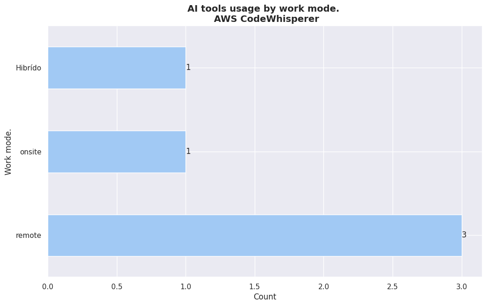

### 5. **Artificial Intelligence**

- ¿Usás regularmente\* alguna de estas herramientas de I.A. para ayudarte en tu proceso de desarrollo?

- ¿Creés que la inteligencia artificial reemplazará al desarrollador?

- ¿Usás regularmente\* alguna de estas herramientas de I.A. para ayudarte en tu proceso de desarrollo?

<center>
     <div class='stats_table'>
  <a id="ia_use_total_count_table_o5nCT"></a>

| category          | count |
| :---------------- | ----: |
| ChatGPT           |   300 |
| Github Copilot    |   100 |
| Google Bard       |    49 |
| Bing AI           |    45 |
| Notion AI         |    17 |
| WolframAlpha      |     5 |
| AWS CodeWhisperer |     5 |
| Codeium           |     4 |
| Claude.ai         |     2 |
| Copilot           |     1 |

<p style="text-align: center;"><em>Use of IA total count.</em></p>
  <br/>
  </div>
</center>


- ¿Creés que la inteligencia artificial reemplazará al desarrollador?


# AI Tools usage

```python
# print uniques in column.
ai_usage_uniques_df = uniques_count_to_dataframe(
    get_column_uniques_count(df, "use_AI_tools")
)
```

```python
plot_uniques_count(ai_usage_uniques_df, "AI usage counts.", "Count.", "AI")
```


## AI TOOLS - work_mode

```python
# Mostrar uniques in 'work_mode' column.
```

```python
get_column_uniques(df, "work_mode")
```

```
['remote', 'onsite', 'Hibrído', 'none']
```

```python
barh_chart_unique_values(
    df, "use_AI_tools", "work_mode", "AI tools usage by work mode.", "Work mode."
)
```





## AI TOOLS - employment_mode

```python
md_group_table(
    "ai_tools_by_employment_mode_table",
    df,
    "employment_mode",
    "use_AI_tools",
    "Use AI tools by employment mode.",
)

```

```
<center>
    <a id="ai_tools_by_employment_mode_table_njxEP"></a>
    <br/>
    <br/>
    <div style="text-align: center;">
    | Category | Percentage |
|-------|-------------|
    | ChatGPT | 52% |
| Github Copilot, ChatGPT | 7% |
| ChatGPT, Github Copilot | 7% |
| Google Bard, ChatGPT | 5% |
| ChatGPT, Bing AI | 2% |
| ChatGPT, Google Bard | 2% |
| Bing AI, ChatGPT | 1% |
| Codeium | 1% |
| ChatGPT, Google Bard, Bing AI | 0% |
| Google Bard | 0% |
| Github Copilot, ChatGPT, Google Bard | 0% |
| ChatGPT, Github Copilot, Google Bard | 0% |
| Github Copilot | 0% |
| Bing AI | 0% |
| WolframAlpha, ChatGPT, Claude Ai | 0% |
| ChatGPT, Notion AI, Github Copilot | 0% |
| Bing AI, ChatGPT, Github Copilot | 0% |
| Claude | 0% |
| WolframAlpha, Github Copilot | 0% |
| Bing AI, Google Bard, ChatGPT, WolframAlpha, Notion AI | 0% |
| Google Bard, Bing AI, ChatGPT, Claude.ai | 0% |
| ChatGPT, Codeium | 0% |
| Notion AI, ChatGPT, Bing AI | 0% |
| Google Bard, ChatGPT, Bing AI | 0% |
| Bing AI, Github Copilot, ChatGPT | 0% |
| ChatGPT, Bing AI, Github Copilot | 0% |
| ChatGPT, AWS CodeWhisperer, Github Copilot, Notion AI, Bing AI, Google Bard | 0% |
| Github Copilot, Notion AI, Google Bard, ChatGPT | 0% |
| ChatGPT, Google Bard, Bing AI, Github Copilot | 0% |
| Bing AI, Github Copilot | 0% |
| Google Bard, Bing AI, ChatGPT | 0% |
| ChatGPT, Bing AI, Google Bard | 0% |
| ChatGPT, Github Copilot, TabNine | 0% |
| ChatGPT, Claude.ai | 0% |
| Github Copilot, Bing AI | 0% |
| Google Bard, Github Copilot, ChatGPT, Notion AI | 0% |
| ChatGPT, Google Bard, CODEGEEX | 0% |
| Bing AI, ChatGPT, Notion AI | 0% |
| ChatGPT, Google Bard, Github Copilot, Bing AI | 0% |
| Google Bard, ChatGPT, Notion AI | 0% |
| Talkai | 0% |
    </div>
    <br/>
    <p style="text-align: center;"><em>Use AI tools by employment mode. 
 <p class="table_subtitle">(Empleador local (Paraguay))<p></em></p>
    <br/>
</center>


<center>
    <a id="ai_tools_by_employment_mode_table_EyikI"></a>
    <br/>
    <br/>
    <div style="text-align: center;">
    | Category | Percentage |
|-------|-------------|
    | ChatGPT | 34% |
| ChatGPT, Github Copilot | 12% |
| Github Copilot, ChatGPT | 10% |
| Github Copilot | 8% |
| ChatGPT, Bing AI | 4% |
| Notion AI, Github Copilot, ChatGPT | 2% |
| ChatGPT, Github Copilot, Google Bard | 2% |
| Google Bard, ChatGPT, Notion AI, Bing AI, Github Copilot | 1% |
| Notion AI | 1% |
| Bing AI, AWS CodeWhisperer, ChatGPT | 1% |
| Github Copilot, WolframAlpha | 1% |
| Bing AI, ChatGPT | 1% |
| Bing AI, ChatGPT, AWS CodeWhisperer, Google Bard | 1% |
| Github Copilot, AWS CodeWhisperer, ChatGPT, Google Bard | 1% |
| Microsoft Copilot | 1% |
| Github Copilot, Notion AI, ChatGPT | 1% |
| ChatGPT, Google Bard | 1% |
| Github Copilot, IntelliJ Assistant  | 1% |
| Google Bard, ChatGPT | 1% |
| ChatGPT, Genesis, Copilot | 1% |
| AiDE | 1% |
| ChatGPT, Google Bard, Github Copilot | 1% |
| ChatGPT, Github Copilot, Notion AI, Bing AI | 1% |
| Codium AI | 1% |
    </div>
    <br/>
    <p style="text-align: center;"><em>Use AI tools by employment mode. 
 <p class="table_subtitle">(foreign_employer)<p></em></p>
    <br/>
</center>


<center>
    <a id="ai_tools_by_employment_mode_table_C4kpp"></a>
    <br/>
    <br/>
    <div style="text-align: center;">
    | Category | Percentage |
|-------|-------------|
    | ChatGPT | 48% |
| ChatGPT, Github Copilot | 14% |
| Bing AI, ChatGPT | 7% |
| Google Bard, Google Geminis | 3% |
| ChatGPT, Bing AI | 3% |
| ChatGPT, Bing AI, Google Bard | 3% |
| ChatGPT, Unity Muse | 3% |
| Google Bard, ChatGPT | 3% |
| Notion AI | 3% |
| Github Copilot, ChatGPT | 3% |
| Bing AI | 3% |
    </div>
    <br/>
    <p style="text-align: center;"><em>Use AI tools by employment mode. 
 <p class="table_subtitle">(freelance)<p></em></p>
    <br/>
</center>


<center>
    <a id="ai_tools_by_employment_mode_table_pqOMJ"></a>
    <br/>
    <br/>
    <div style="text-align: center;">
    | Category | Percentage |
|-------|-------------|
    | ChatGPT | 44% |
| ChatGPT, Github Copilot | 16% |
| Github Copilot, ChatGPT | 8% |
| Github Copilot | 4% |
| Github Copilot, Notion AI, AWS CodeWhisperer | 4% |
| WolframAlpha, ChatGPT | 4% |
| Bing AI, ChatGPT, Github Copilot | 4% |
| ChatGPT, Google Bard | 4% |
| Notion AI, ChatGPT, Bing AI | 4% |
| Bing AI, Github Copilot, ChatGPT | 4% |
| Github Copilot, Bing AI | 4% |
    </div>
    <br/>
    <p style="text-align: center;"><em>Use AI tools by employment mode. 
 <p class="table_subtitle">(local_with_foreign_clients)<p></em></p>
    <br/>
</center>
```

## AI TOOLS - role

```python
md_group_table("ai_tools_by_role", df, "role", "use_AI_tools", "Use AI tools by role.")
```

```
<center>
    <a id="ai_tools_by_role_oe6Xv"></a>
    <br/>
    <br/>
    <div style="text-align: center;">
    | Category | Percentage |
|-------|-------------|
    | ChatGPT | 100% |
    </div>
    <br/>
    <p style="text-align: center;"><em>Use AI tools by role. 
 <p class="table_subtitle">(data_eng)<p></em></p>
    <br/>
</center>


<center>
    <a id="ai_tools_by_role_W6uoA"></a>
    <br/>
    <br/>
    <div style="text-align: center;">
    | Category | Percentage |
|-------|-------------|
    | ChatGPT, Bing AI | 100% |
    </div>
    <br/>
    <p style="text-align: center;"><em>Use AI tools by role. 
 <p class="table_subtitle">(desktop_apps, qa_testing, data_analyst)<p></em></p>
    <br/>
</center>


<center>
    <a id="ai_tools_by_role_D6RcG"></a>
    <br/>
    <br/>
    <div style="text-align: center;">
    | Category | Percentage |
|-------|-------------|
    | ChatGPT | 100% |
    </div>
    <br/>
    <p style="text-align: center;"><em>Use AI tools by role. 
 <p class="table_subtitle">(backend_arch)<p></em></p>
    <br/>
</center>


<center>
    <a id="ai_tools_by_role_SAYho"></a>
    <br/>
    <br/>
    <div style="text-align: center;">
    | Category | Percentage |
|-------|-------------|
    | ChatGPT | 100% |
    </div>
    <br/>
    <p style="text-align: center;"><em>Use AI tools by role. 
 <p class="table_subtitle">(desktop_apps, db_admin, proj_lead)<p></em></p>
    <br/>
</center>


<center>
    <a id="ai_tools_by_role_ciGu9"></a>
    <br/>
    <br/>
    <div style="text-align: center;">
    | Category | Percentage |
|-------|-------------|
    | Github Copilot, ChatGPT | 50% |
| ChatGPT | 50% |
    </div>
    <br/>
    <p style="text-align: center;"><em>Use AI tools by role. 
 <p class="table_subtitle">(full_stack_dev, dev_ops)<p></em></p>
    <br/>
</center>


<center>
    <a id="ai_tools_by_role_KwKZp"></a>
    <br/>
    <br/>
    <div style="text-align: center;">
    | Category | Percentage |
|-------|-------------|
    | ChatGPT | 46% |
| ChatGPT, Github Copilot | 15% |
| Google Bard, ChatGPT | 7% |
| ChatGPT, Github Copilot, Google Bard | 7% |
| Github Copilot, ChatGPT | 2% |
| AiDE | 2% |
| Github Copilot, Notion AI, ChatGPT | 2% |
| Github Copilot | 2% |
| ChatGPT, Google Bard | 2% |
| Google Bard, ChatGPT, Bing AI | 2% |
| Github Copilot, ChatGPT, Google Bard | 2% |
| Claude | 2% |
| Codium AI | 2% |
    </div>
    <br/>
    <p style="text-align: center;"><em>Use AI tools by role. 
 <p class="table_subtitle">(backend_dev)<p></em></p>
    <br/>
</center>


<center>
    <a id="ai_tools_by_role_wZNmC"></a>
    <br/>
    <br/>
    <div style="text-align: center;">
    | Category | Percentage |
|-------|-------------|
    | Google Bard, Google Geminis | 100% |
    </div>
    <br/>
    <p style="text-align: center;"><em>Use AI tools by role. 
 <p class="table_subtitle">(backend_dev, frontend_dev, full_stack_dev, desktop_apps, db_admin, dev_ops, sre)<p></em></p>
    <br/>
</center>


<center>
    <a id="ai_tools_by_role_tICIW"></a>
    <br/>
    <br/>
    <div style="text-align: center;">
    | Category | Percentage |
|-------|-------------|
    | ChatGPT | 49% |
| Github Copilot, ChatGPT | 11% |
| ChatGPT, Github Copilot | 8% |
| ChatGPT, Bing AI | 8% |
| ChatGPT, Google Bard | 4% |
| Github Copilot | 2% |
| ChatGPT, Github Copilot, Notion AI, Bing AI | 1% |
| ChatGPT, Google Bard, Github Copilot, Bing AI | 1% |
| Bing AI, Github Copilot, ChatGPT | 1% |
| Notion AI | 1% |
| Notion AI, Github Copilot, ChatGPT | 1% |
| ChatGPT, Codeium | 1% |
| Bing AI | 1% |
| Google Bard, Bing AI, ChatGPT, Claude.ai | 1% |
| Github Copilot, Bing AI | 1% |
    </div>
    <br/>
    <p style="text-align: center;"><em>Use AI tools by role. 
 <p class="table_subtitle">(full_stack_dev)<p></em></p>
    <br/>
</center>


<center>
    <a id="ai_tools_by_role_mvpKp"></a>
    <br/>
    <br/>
    <div style="text-align: center;">
    | Category | Percentage |
|-------|-------------|
    | ChatGPT | 100% |
    </div>
    <br/>
    <p style="text-align: center;"><em>Use AI tools by role. 
 <p class="table_subtitle">(full_stack_dev, qa_testing)<p></em></p>
    <br/>
</center>


<center>
    <a id="ai_tools_by_role_l2IQ8"></a>
    <br/>
    <br/>
    <div style="text-align: center;">
    | Category | Percentage |
|-------|-------------|
    | ChatGPT | 100% |
    </div>
    <br/>
    <p style="text-align: center;"><em>Use AI tools by role. 
 <p class="table_subtitle">(backend_dev, frontend_dev, full_stack_dev, dev_ops)<p></em></p>
    <br/>
</center>


<center>
    <a id="ai_tools_by_role_cxbFD"></a>
    <br/>
    <br/>
    <div style="text-align: center;">
    | Category | Percentage |
|-------|-------------|
    | ChatGPT | 100% |
    </div>
    <br/>
    <p style="text-align: center;"><em>Use AI tools by role. 
 <p class="table_subtitle">(qa_tester)<p></em></p>
    <br/>
</center>


<center>
    <a id="ai_tools_by_role_jvBS9"></a>
    <br/>
    <br/>
    <div style="text-align: center;">
    | Category | Percentage |
|-------|-------------|
    | Github Copilot, ChatGPT | 66% |
| ChatGPT, Github Copilot | 33% |
    </div>
    <br/>
    <p style="text-align: center;"><em>Use AI tools by role. 
 <p class="table_subtitle">(backend_dev, proj_lead)<p></em></p>
    <br/>
</center>


<center>
    <a id="ai_tools_by_role_zHZuO"></a>
    <br/>
    <br/>
    <div style="text-align: center;">
    | Category | Percentage |
|-------|-------------|
    | Github Copilot, ChatGPT | 100% |
    </div>
    <br/>
    <p style="text-align: center;"><em>Use AI tools by role. 
 <p class="table_subtitle">(backend_dev, frontend_dev, full_stack_dev, desktop_apps, db_admin, data_analyst, data_eng, data_sci, ai_specialist)<p></em></p>
    <br/>
</center>


<center>
    <a id="ai_tools_by_role_OLbTZ"></a>
    <br/>
    <br/>
    <div style="text-align: center;">
    | Category | Percentage |
|-------|-------------|
    | Google Bard, ChatGPT, Notion AI | 100% |
    </div>
    <br/>
    <p style="text-align: center;"><em>Use AI tools by role. 
 <p class="table_subtitle">(digital_analyst)<p></em></p>
    <br/>
</center>


<center>
    <a id="ai_tools_by_role_hQrmg"></a>
    <br/>
    <br/>
    <div style="text-align: center;">
    | Category | Percentage |
|-------|-------------|
    | ChatGPT | 50% |
| ChatGPT, Github Copilot | 16% |
| Github Copilot, Bing AI | 16% |
| Github Copilot, ChatGPT, Google Bard | 16% |
    </div>
    <br/>
    <p style="text-align: center;"><em>Use AI tools by role. 
 <p class="table_subtitle">(backend_dev, frontend_dev, full_stack_dev, mobile_dev)<p></em></p>
    <br/>
</center>


<center>
    <a id="ai_tools_by_role_pqt45"></a>
    <br/>
    <br/>
    <div style="text-align: center;">
    | Category | Percentage |
|-------|-------------|
    | Google Bard, ChatGPT | 100% |
    </div>
    <br/>
    <p style="text-align: center;"><em>Use AI tools by role. 
 <p class="table_subtitle">(sys_coord)<p></em></p>
    <br/>
</center>


<center>
    <a id="ai_tools_by_role_RWk0f"></a>
    <br/>
    <br/>
    <div style="text-align: center;">
    | Category | Percentage |
|-------|-------------|
    | ChatGPT | 100% |
    </div>
    <br/>
    <p style="text-align: center;"><em>Use AI tools by role. 
 <p class="table_subtitle">(it)<p></em></p>
    <br/>
</center>


<center>
    <a id="ai_tools_by_role_pY6Ug"></a>
    <br/>
    <br/>
    <div style="text-align: center;">
    | Category | Percentage |
|-------|-------------|
    | Bing AI | 50% |
| ChatGPT | 50% |
    </div>
    <br/>
    <p style="text-align: center;"><em>Use AI tools by role. 
 <p class="table_subtitle">(full_stack_dev, db_admin)<p></em></p>
    <br/>
</center>


<center>
    <a id="ai_tools_by_role_3BYTR"></a>
    <br/>
    <br/>
    <div style="text-align: center;">
    | Category | Percentage |
|-------|-------------|
    | ChatGPT | 40% |
| ChatGPT, Github Copilot | 20% |
| Google Bard, Github Copilot, ChatGPT, Notion AI | 20% |
| Github Copilot | 20% |
    </div>
    <br/>
    <p style="text-align: center;"><em>Use AI tools by role. 
 <p class="table_subtitle">(full_stack_dev, mobile_dev)<p></em></p>
    <br/>
</center>


<center>
    <a id="ai_tools_by_role_S4MLH"></a>
    <br/>
    <br/>
    <div style="text-align: center;">
    | Category | Percentage |
|-------|-------------|
    | ChatGPT, Google Bard, Github Copilot | 100% |
    </div>
    <br/>
    <p style="text-align: center;"><em>Use AI tools by role. 
 <p class="table_subtitle">(frontend_dev, game_dev)<p></em></p>
    <br/>
</center>


<center>
    <a id="ai_tools_by_role_ywxqL"></a>
    <br/>
    <br/>
    <div style="text-align: center;">
    | Category | Percentage |
|-------|-------------|
    | ChatGPT | 50% |
| Bing AI, ChatGPT | 50% |
    </div>
    <br/>
    <p style="text-align: center;"><em>Use AI tools by role. 
 <p class="table_subtitle">(backend_dev, full_stack_dev)<p></em></p>
    <br/>
</center>


<center>
    <a id="ai_tools_by_role_usLFm"></a>
    <br/>
    <br/>
    <div style="text-align: center;">
    | Category | Percentage |
|-------|-------------|
    | Google Bard, ChatGPT | 37% |
| Github Copilot, ChatGPT | 12% |
| Microsoft Copilot | 12% |
| ChatGPT | 12% |
| ChatGPT, Bing AI | 12% |
| ChatGPT, Github Copilot | 12% |
    </div>
    <br/>
    <p style="text-align: center;"><em>Use AI tools by role. 
 <p class="table_subtitle">(proj_lead)<p></em></p>
    <br/>
</center>


<center>
    <a id="ai_tools_by_role_7Hd5D"></a>
    <br/>
    <br/>
    <div style="text-align: center;">
    | Category | Percentage |
|-------|-------------|
    | Codeium | 100% |
    </div>
    <br/>
    <p style="text-align: center;"><em>Use AI tools by role. 
 <p class="table_subtitle">(backend_dev, frontend_dev, full_stack_dev, mobile_dev, proj_lead)<p></em></p>
    <br/>
</center>


<center>
    <a id="ai_tools_by_role_z9DDz"></a>
    <br/>
    <br/>
    <div style="text-align: center;">
    | Category | Percentage |
|-------|-------------|
    | ChatGPT | 36% |
| Github Copilot, ChatGPT | 18% |
| Github Copilot | 18% |
| ChatGPT, Google Bard | 9% |
| Github Copilot, IntelliJ Assistant  | 9% |
| ChatGPT, Google Bard, Bing AI | 9% |
    </div>
    <br/>
    <p style="text-align: center;"><em>Use AI tools by role. 
 <p class="table_subtitle">(mobile_dev)<p></em></p>
    <br/>
</center>


<center>
    <a id="ai_tools_by_role_duy2M"></a>
    <br/>
    <br/>
    <div style="text-align: center;">
    | Category | Percentage |
|-------|-------------|
    | ChatGPT, Github Copilot | 40% |
| Github Copilot, ChatGPT | 20% |
| ChatGPT, Google Bard, CODEGEEX | 20% |
| ChatGPT | 20% |
    </div>
    <br/>
    <p style="text-align: center;"><em>Use AI tools by role. 
 <p class="table_subtitle">(full_stack_dev, proj_lead)<p></em></p>
    <br/>
</center>


<center>
    <a id="ai_tools_by_role_4ziAM"></a>
    <br/>
    <br/>
    <div style="text-align: center;">
    | Category | Percentage |
|-------|-------------|
    | ChatGPT | 100% |
    </div>
    <br/>
    <p style="text-align: center;"><em>Use AI tools by role. 
 <p class="table_subtitle">(mobile_dev, desktop_apps, db_admin)<p></em></p>
    <br/>
</center>


<center>
    <a id="ai_tools_by_role_uqOrd"></a>
    <br/>
    <br/>
    <div style="text-align: center;">
    | Category | Percentage |
|-------|-------------|
    | ChatGPT | 66% |
| ChatGPT, Genesis, Copilot | 11% |
| Google Bard | 11% |
| Bing AI, ChatGPT | 11% |
    </div>
    <br/>
    <p style="text-align: center;"><em>Use AI tools by role. 
 <p class="table_subtitle">(desktop_apps)<p></em></p>
    <br/>
</center>


<center>
    <a id="ai_tools_by_role_JuZjg"></a>
    <br/>
    <br/>
    <div style="text-align: center;">
    | Category | Percentage |
|-------|-------------|
    | ChatGPT | 83% |
| Github Copilot, AWS CodeWhisperer, ChatGPT, Google Bard | 16% |
    </div>
    <br/>
    <p style="text-align: center;"><em>Use AI tools by role. 
 <p class="table_subtitle">(backend_dev, frontend_dev, full_stack_dev)<p></em></p>
    <br/>
</center>


<center>
    <a id="ai_tools_by_role_hzExa"></a>
    <br/>
    <br/>
    <div style="text-align: center;">
    | Category | Percentage |
|-------|-------------|
    | ChatGPT | 100% |
    </div>
    <br/>
    <p style="text-align: center;"><em>Use AI tools by role. 
 <p class="table_subtitle">(full_stack_dev, db_admin, ai_specialist, sales)<p></em></p>
    <br/>
</center>


<center>
    <a id="ai_tools_by_role_DgANl"></a>
    <br/>
    <br/>
    <div style="text-align: center;">
    | Category | Percentage |
|-------|-------------|
    | Github Copilot | 100% |
    </div>
    <br/>
    <p style="text-align: center;"><em>Use AI tools by role. 
 <p class="table_subtitle">(support_analyst)<p></em></p>
    <br/>
</center>


<center>
    <a id="ai_tools_by_role_IM40z"></a>
    <br/>
    <br/>
    <div style="text-align: center;">
    | Category | Percentage |
|-------|-------------|
    | ChatGPT | 55% |
| ChatGPT, Github Copilot | 22% |
| ChatGPT, Bing AI, Google Bard | 11% |
| Github Copilot | 11% |
    </div>
    <br/>
    <p style="text-align: center;"><em>Use AI tools by role. 
 <p class="table_subtitle">(frontend_dev)<p></em></p>
    <br/>
</center>


<center>
    <a id="ai_tools_by_role_yTPWf"></a>
    <br/>
    <br/>
    <div style="text-align: center;">
    | Category | Percentage |
|-------|-------------|
    | Github Copilot, ChatGPT | 33% |
| ChatGPT, Github Copilot, Google Bard | 33% |
| ChatGPT | 33% |
    </div>
    <br/>
    <p style="text-align: center;"><em>Use AI tools by role. 
 <p class="table_subtitle">(frontend_dev, full_stack_dev, mobile_dev)<p></em></p>
    <br/>
</center>


<center>
    <a id="ai_tools_by_role_jqYii"></a>
    <br/>
    <br/>
    <div style="text-align: center;">
    | Category | Percentage |
|-------|-------------|
    | ChatGPT | 66% |
| Google Bard, ChatGPT | 33% |
    </div>
    <br/>
    <p style="text-align: center;"><em>Use AI tools by role. 
 <p class="table_subtitle">(backend_dev, mobile_dev)<p></em></p>
    <br/>
</center>


<center>
    <a id="ai_tools_by_role_YpDEQ"></a>
    <br/>
    <br/>
    <div style="text-align: center;">
    | Category | Percentage |
|-------|-------------|
    | Github Copilot, ChatGPT | 25% |
| ChatGPT | 25% |
| ChatGPT, Github Copilot | 25% |
| ChatGPT, Notion AI, Github Copilot | 25% |
    </div>
    <br/>
    <p style="text-align: center;"><em>Use AI tools by role. 
 <p class="table_subtitle">(frontend_dev, mobile_dev)<p></em></p>
    <br/>
</center>


<center>
    <a id="ai_tools_by_role_AtMvA"></a>
    <br/>
    <br/>
    <div style="text-align: center;">
    | Category | Percentage |
|-------|-------------|
    | ChatGPT | 100% |
    </div>
    <br/>
    <p style="text-align: center;"><em>Use AI tools by role. 
 <p class="table_subtitle">(data_eng, ai_specialist)<p></em></p>
    <br/>
</center>


<center>
    <a id="ai_tools_by_role_hNXHw"></a>
    <br/>
    <br/>
    <div style="text-align: center;">
    | Category | Percentage |
|-------|-------------|
    | Bing AI, ChatGPT, Notion AI | 100% |
    </div>
    <br/>
    <p style="text-align: center;"><em>Use AI tools by role. 
 <p class="table_subtitle">(backend_dev, frontend_dev, qa_testing, data_analyst)<p></em></p>
    <br/>
</center>


<center>
    <a id="ai_tools_by_role_GY62k"></a>
    <br/>
    <br/>
    <div style="text-align: center;">
    | Category | Percentage |
|-------|-------------|
    | ChatGPT | 50% |
| Google Bard, ChatGPT | 50% |
    </div>
    <br/>
    <p style="text-align: center;"><em>Use AI tools by role. 
 <p class="table_subtitle">(frontend_dev, full_stack_dev)<p></em></p>
    <br/>
</center>


<center>
    <a id="ai_tools_by_role_pu36a"></a>
    <br/>
    <br/>
    <div style="text-align: center;">
    | Category | Percentage |
|-------|-------------|
    | ChatGPT, Github Copilot | 100% |
    </div>
    <br/>
    <p style="text-align: center;"><em>Use AI tools by role. 
 <p class="table_subtitle">(backend_dev, frontend_dev, desktop_apps, qa_testing, db_admin)<p></em></p>
    <br/>
</center>


<center>
    <a id="ai_tools_by_role_0Cjzp"></a>
    <br/>
    <br/>
    <div style="text-align: center;">
    | Category | Percentage |
|-------|-------------|
    | ChatGPT | 100% |
    </div>
    <br/>
    <p style="text-align: center;"><em>Use AI tools by role. 
 <p class="table_subtitle">(full_stack_dev, data_analyst)<p></em></p>
    <br/>
</center>


<center>
    <a id="ai_tools_by_role_8X4u6"></a>
    <br/>
    <br/>
    <div style="text-align: center;">
    | Category | Percentage |
|-------|-------------|
    | ChatGPT | 60% |
| Google Bard, ChatGPT | 20% |
| ChatGPT, Github Copilot | 20% |
    </div>
    <br/>
    <p style="text-align: center;"><em>Use AI tools by role. 
 <p class="table_subtitle">(qa_testing)<p></em></p>
    <br/>
</center>


<center>
    <a id="ai_tools_by_role_DpLGK"></a>
    <br/>
    <br/>
    <div style="text-align: center;">
    | Category | Percentage |
|-------|-------------|
    | ChatGPT | 100% |
    </div>
    <br/>
    <p style="text-align: center;"><em>Use AI tools by role. 
 <p class="table_subtitle">(backend_dev, frontend_dev, dev_ops, ai_specialist)<p></em></p>
    <br/>
</center>


<center>
    <a id="ai_tools_by_role_IGdXy"></a>
    <br/>
    <br/>
    <div style="text-align: center;">
    | Category | Percentage |
|-------|-------------|
    | Google Bard, ChatGPT | 100% |
    </div>
    <br/>
    <p style="text-align: center;"><em>Use AI tools by role. 
 <p class="table_subtitle">(backend_dev, dev_ops, sys_arch)<p></em></p>
    <br/>
</center>


<center>
    <a id="ai_tools_by_role_ftRwM"></a>
    <br/>
    <br/>
    <div style="text-align: center;">
    | Category | Percentage |
|-------|-------------|
    | Bing AI | 50% |
| ChatGPT, Github Copilot | 50% |
    </div>
    <br/>
    <p style="text-align: center;"><em>Use AI tools by role. 
 <p class="table_subtitle">(full_stack_dev, desktop_apps)<p></em></p>
    <br/>
</center>


<center>
    <a id="ai_tools_by_role_j6QVD"></a>
    <br/>
    <br/>
    <div style="text-align: center;">
    | Category | Percentage |
|-------|-------------|
    | ChatGPT | 100% |
    </div>
    <br/>
    <p style="text-align: center;"><em>Use AI tools by role. 
 <p class="table_subtitle">(frontend_dev, mobile_dev, qa_testing)<p></em></p>
    <br/>
</center>


<center>
    <a id="ai_tools_by_role_FF5sN"></a>
    <br/>
    <br/>
    <div style="text-align: center;">
    | Category | Percentage |
|-------|-------------|
    | Github Copilot, ChatGPT | 100% |
    </div>
    <br/>
    <p style="text-align: center;"><em>Use AI tools by role. 
 <p class="table_subtitle">(full_stack_dev, db_admin, dev_ops)<p></em></p>
    <br/>
</center>


<center>
    <a id="ai_tools_by_role_oYY2r"></a>
    <br/>
    <br/>
    <div style="text-align: center;">
    | Category | Percentage |
|-------|-------------|
    | Codeium | 100% |
    </div>
    <br/>
    <p style="text-align: center;"><em>Use AI tools by role. 
 <p class="table_subtitle">(frontend_dev, full_stack_dev, qa_testing, db_admin, ux_ui)<p></em></p>
    <br/>
</center>


<center>
    <a id="ai_tools_by_role_Nd3f2"></a>
    <br/>
    <br/>
    <div style="text-align: center;">
    | Category | Percentage |
|-------|-------------|
    | ChatGPT, Claude.ai | 100% |
    </div>
    <br/>
    <p style="text-align: center;"><em>Use AI tools by role. 
 <p class="table_subtitle">(qa_testing, db_admin)<p></em></p>
    <br/>
</center>


<center>
    <a id="ai_tools_by_role_qdlXk"></a>
    <br/>
    <br/>
    <div style="text-align: center;">
    | Category | Percentage |
|-------|-------------|
    | ChatGPT, Bing AI | 100% |
    </div>
    <br/>
    <p style="text-align: center;"><em>Use AI tools by role. 
 <p class="table_subtitle">(backend_dev, db_admin, dev_ops)<p></em></p>
    <br/>
</center>


<center>
    <a id="ai_tools_by_role_cWoo3"></a>
    <br/>
    <br/>
    <div style="text-align: center;">
    | Category | Percentage |
|-------|-------------|
    | Github Copilot | 100% |
    </div>
    <br/>
    <p style="text-align: center;"><em>Use AI tools by role. 
 <p class="table_subtitle">(data_sci, ml_eng)<p></em></p>
    <br/>
</center>


<center>
    <a id="ai_tools_by_role_togm4"></a>
    <br/>
    <br/>
    <div style="text-align: center;">
    | Category | Percentage |
|-------|-------------|
    | ChatGPT, Github Copilot, TabNine | 25% |
| ChatGPT | 25% |
| ChatGPT, Github Copilot | 25% |
| Github Copilot, ChatGPT | 25% |
    </div>
    <br/>
    <p style="text-align: center;"><em>Use AI tools by role. 
 <p class="table_subtitle">(backend_dev, frontend_dev)<p></em></p>
    <br/>
</center>


<center>
    <a id="ai_tools_by_role_BzuQw"></a>
    <br/>
    <br/>
    <div style="text-align: center;">
    | Category | Percentage |
|-------|-------------|
    | Google Bard | 100% |
    </div>
    <br/>
    <p style="text-align: center;"><em>Use AI tools by role. 
 <p class="table_subtitle">(backend_dev, frontend_dev, full_stack_dev, mobile_dev, db_admin)<p></em></p>
    <br/>
</center>


<center>
    <a id="ai_tools_by_role_qnB5k"></a>
    <br/>
    <br/>
    <div style="text-align: center;">
    | Category | Percentage |
|-------|-------------|
    | Bing AI, ChatGPT | 100% |
    </div>
    <br/>
    <p style="text-align: center;"><em>Use AI tools by role. 
 <p class="table_subtitle">(backend_dev, frontend_dev, full_stack_dev, embedded_sys_dev, db_admin, proj_lead, data_analyst, data_eng, ux_ui)<p></em></p>
    <br/>
</center>


<center>
    <a id="ai_tools_by_role_NFL3g"></a>
    <br/>
    <br/>
    <div style="text-align: center;">
    | Category | Percentage |
|-------|-------------|
    | ChatGPT | 66% |
| ChatGPT, Bing AI, Google Bard | 33% |
    </div>
    <br/>
    <p style="text-align: center;"><em>Use AI tools by role. 
 <p class="table_subtitle">(data_analyst, data_eng)<p></em></p>
    <br/>
</center>


<center>
    <a id="ai_tools_by_role_5TGo9"></a>
    <br/>
    <br/>
    <div style="text-align: center;">
    | Category | Percentage |
|-------|-------------|
    | ChatGPT | 100% |
    </div>
    <br/>
    <p style="text-align: center;"><em>Use AI tools by role. 
 <p class="table_subtitle">(data_sci)<p></em></p>
    <br/>
</center>


<center>
    <a id="ai_tools_by_role_MmiZU"></a>
    <br/>
    <br/>
    <div style="text-align: center;">
    | Category | Percentage |
|-------|-------------|
    | ChatGPT | 100% |
    </div>
    <br/>
    <p style="text-align: center;"><em>Use AI tools by role. 
 <p class="table_subtitle">(full_stack_dev, mobile_dev, db_admin)<p></em></p>
    <br/>
</center>


<center>
    <a id="ai_tools_by_role_t2WU7"></a>
    <br/>
    <br/>
    <div style="text-align: center;">
    | Category | Percentage |
|-------|-------------|
    | ChatGPT, AWS CodeWhisperer, Github Copilot, Notion AI, Bing AI, Google Bard | 50% |
| ChatGPT | 50% |
    </div>
    <br/>
    <p style="text-align: center;"><em>Use AI tools by role. 
 <p class="table_subtitle">(backend_dev, desktop_apps)<p></em></p>
    <br/>
</center>


<center>
    <a id="ai_tools_by_role_MnMvc"></a>
    <br/>
    <br/>
    <div style="text-align: center;">
    | Category | Percentage |
|-------|-------------|
    | Google Bard, Bing AI, ChatGPT | 100% |
    </div>
    <br/>
    <p style="text-align: center;"><em>Use AI tools by role. 
 <p class="table_subtitle">(backend_dev, qa_testing, data_analyst)<p></em></p>
    <br/>
</center>


<center>
    <a id="ai_tools_by_role_6ABpl"></a>
    <br/>
    <br/>
    <div style="text-align: center;">
    | Category | Percentage |
|-------|-------------|
    | Bing AI, Github Copilot | 100% |
    </div>
    <br/>
    <p style="text-align: center;"><em>Use AI tools by role. 
 <p class="table_subtitle">(solution_arch)<p></em></p>
    <br/>
</center>


<center>
    <a id="ai_tools_by_role_XMhM3"></a>
    <br/>
    <br/>
    <div style="text-align: center;">
    | Category | Percentage |
|-------|-------------|
    | ChatGPT | 60% |
| Github Copilot, Notion AI, AWS CodeWhisperer | 20% |
| Bing AI, ChatGPT, AWS CodeWhisperer, Google Bard | 20% |
    </div>
    <br/>
    <p style="text-align: center;"><em>Use AI tools by role. 
 <p class="table_subtitle">(dev_ops)<p></em></p>
    <br/>
</center>


<center>
    <a id="ai_tools_by_role_kTgyk"></a>
    <br/>
    <br/>
    <div style="text-align: center;">
    | Category | Percentage |
|-------|-------------|
    | ChatGPT, Github Copilot | 50% |
| ChatGPT | 50% |
    </div>
    <br/>
    <p style="text-align: center;"><em>Use AI tools by role. 
 <p class="table_subtitle">(backend_dev, frontend_dev, full_stack_dev, ux_ui)<p></em></p>
    <br/>
</center>


<center>
    <a id="ai_tools_by_role_BbKah"></a>
    <br/>
    <br/>
    <div style="text-align: center;">
    | Category | Percentage |
|-------|-------------|
    | ChatGPT | 100% |
    </div>
    <br/>
    <p style="text-align: center;"><em>Use AI tools by role. 
 <p class="table_subtitle">(backend_dev, full_stack_dev, db_admin)<p></em></p>
    <br/>
</center>


<center>
    <a id="ai_tools_by_role_oIFia"></a>
    <br/>
    <br/>
    <div style="text-align: center;">
    | Category | Percentage |
|-------|-------------|
    | ChatGPT | 100% |
    </div>
    <br/>
    <p style="text-align: center;"><em>Use AI tools by role. 
 <p class="table_subtitle">(backend_dev, full_stack_dev, proj_lead)<p></em></p>
    <br/>
</center>


<center>
    <a id="ai_tools_by_role_xWhQh"></a>
    <br/>
    <br/>
    <div style="text-align: center;">
    | Category | Percentage |
|-------|-------------|
    | Google Bard, ChatGPT, Notion AI, Bing AI, Github Copilot | 100% |
    </div>
    <br/>
    <p style="text-align: center;"><em>Use AI tools by role. 
 <p class="table_subtitle">(backend_dev, frontend_dev, full_stack_dev, qa_testing, proj_lead)<p></em></p>
    <br/>
</center>


<center>
    <a id="ai_tools_by_role_dx7Ir"></a>
    <br/>
    <br/>
    <div style="text-align: center;">
    | Category | Percentage |
|-------|-------------|
    | ChatGPT | 100% |
    </div>
    <br/>
    <p style="text-align: center;"><em>Use AI tools by role. 
 <p class="table_subtitle">(software_arch)<p></em></p>
    <br/>
</center>


<center>
    <a id="ai_tools_by_role_iYaru"></a>
    <br/>
    <br/>
    <div style="text-align: center;">
    | Category | Percentage |
|-------|-------------|
    | ChatGPT, Unity Muse | 100% |
    </div>
    <br/>
    <p style="text-align: center;"><em>Use AI tools by role. 
 <p class="table_subtitle">(game_dev)<p></em></p>
    <br/>
</center>


<center>
    <a id="ai_tools_by_role_mEeOX"></a>
    <br/>
    <br/>
    <div style="text-align: center;">
    | Category | Percentage |
|-------|-------------|
    | ChatGPT | 100% |
    </div>
    <br/>
    <p style="text-align: center;"><em>Use AI tools by role. 
 <p class="table_subtitle">(full_stack_dev, mobile_dev, dev_ops)<p></em></p>
    <br/>
</center>


<center>
    <a id="ai_tools_by_role_48Y0m"></a>
    <br/>
    <br/>
    <div style="text-align: center;">
    | Category | Percentage |
|-------|-------------|
    | Bing AI, ChatGPT | 100% |
    </div>
    <br/>
    <p style="text-align: center;"><em>Use AI tools by role. 
 <p class="table_subtitle">(backend_dev, frontend_dev, qa_testing)<p></em></p>
    <br/>
</center>


<center>
    <a id="ai_tools_by_role_RqacW"></a>
    <br/>
    <br/>
    <div style="text-align: center;">
    | Category | Percentage |
|-------|-------------|
    | ChatGPT | 100% |
    </div>
    <br/>
    <p style="text-align: center;"><em>Use AI tools by role. 
 <p class="table_subtitle">(full_stack_dev, ux_ui)<p></em></p>
    <br/>
</center>


<center>
    <a id="ai_tools_by_role_xfAbm"></a>
    <br/>
    <br/>
    <div style="text-align: center;">
    | Category | Percentage |
|-------|-------------|
    | Github Copilot, ChatGPT | 100% |
    </div>
    <br/>
    <p style="text-align: center;"><em>Use AI tools by role. 
 <p class="table_subtitle">(backend_dev, full_stack_dev, mobile_dev, embedded_sys_dev)<p></em></p>
    <br/>
</center>


<center>
    <a id="ai_tools_by_role_r9SIe"></a>
    <br/>
    <br/>
    <div style="text-align: center;">
    | Category | Percentage |
|-------|-------------|
    | ChatGPT | 100% |
    </div>
    <br/>
    <p style="text-align: center;"><em>Use AI tools by role. 
 <p class="table_subtitle">(proj_lead, data_analyst)<p></em></p>
    <br/>
</center>


<center>
    <a id="ai_tools_by_role_LINpn"></a>
    <br/>
    <br/>
    <div style="text-align: center;">
    | Category | Percentage |
|-------|-------------|
    | ChatGPT | 100% |
    </div>
    <br/>
    <p style="text-align: center;"><em>Use AI tools by role. 
 <p class="table_subtitle">(backend_dev, frontend_dev, embedded_sys_dev, desktop_apps)<p></em></p>
    <br/>
</center>


<center>
    <a id="ai_tools_by_role_3ioY9"></a>
    <br/>
    <br/>
    <div style="text-align: center;">
    | Category | Percentage |
|-------|-------------|
    | ChatGPT | 100% |
    </div>
    <br/>
    <p style="text-align: center;"><em>Use AI tools by role. 
 <p class="table_subtitle">(backend_dev, db_admin)<p></em></p>
    <br/>
</center>


<center>
    <a id="ai_tools_by_role_S2EMS"></a>
    <br/>
    <br/>
    <div style="text-align: center;">
    | Category | Percentage |
|-------|-------------|
    | ChatGPT, Google Bard | 100% |
    </div>
    <br/>
    <p style="text-align: center;"><em>Use AI tools by role. 
 <p class="table_subtitle">(backend_dev, frontend_dev, full_stack_dev, desktop_apps, db_admin)<p></em></p>
    <br/>
</center>


<center>
    <a id="ai_tools_by_role_w8GkN"></a>
    <br/>
    <br/>
    <div style="text-align: center;">
    | Category | Percentage |
|-------|-------------|
    | ChatGPT | 100% |
    </div>
    <br/>
    <p style="text-align: center;"><em>Use AI tools by role. 
 <p class="table_subtitle">(qa_testing, ux_ui)<p></em></p>
    <br/>
</center>


<center>
    <a id="ai_tools_by_role_PDeim"></a>
    <br/>
    <br/>
    <div style="text-align: center;">
    | Category | Percentage |
|-------|-------------|
    | ChatGPT, Google Bard, Bing AI, Github Copilot | 100% |
    </div>
    <br/>
    <p style="text-align: center;"><em>Use AI tools by role. 
 <p class="table_subtitle">(db_admin, proj_lead, data_analyst, data_eng, data_sci, ai_specialist)<p></em></p>
    <br/>
</center>


<center>
    <a id="ai_tools_by_role_v3gaj"></a>
    <br/>
    <br/>
    <div style="text-align: center;">
    | Category | Percentage |
|-------|-------------|
    | Github Copilot, Notion AI, Google Bard, ChatGPT | 100% |
    </div>
    <br/>
    <p style="text-align: center;"><em>Use AI tools by role. 
 <p class="table_subtitle">(it_analyst)<p></em></p>
    <br/>
</center>


<center>
    <a id="ai_tools_by_role_xQWsX"></a>
    <br/>
    <br/>
    <div style="text-align: center;">
    | Category | Percentage |
|-------|-------------|
    | ChatGPT | 100% |
    </div>
    <br/>
    <p style="text-align: center;"><em>Use AI tools by role. 
 <p class="table_subtitle">(mobile_dev, community_lead)<p></em></p>
    <br/>
</center>


<center>
    <a id="ai_tools_by_role_qW9hh"></a>
    <br/>
    <br/>
    <div style="text-align: center;">
    | Category | Percentage |
|-------|-------------|
    | ChatGPT, Bing AI | 50% |
| ChatGPT | 50% |
    </div>
    <br/>
    <p style="text-align: center;"><em>Use AI tools by role. 
 <p class="table_subtitle">(data_analyst)<p></em></p>
    <br/>
</center>


<center>
    <a id="ai_tools_by_role_0hZUr"></a>
    <br/>
    <br/>
    <div style="text-align: center;">
    | Category | Percentage |
|-------|-------------|
    | Google Bard, ChatGPT | 50% |
| ChatGPT | 50% |
    </div>
    <br/>
    <p style="text-align: center;"><em>Use AI tools by role. 
 <p class="table_subtitle">(full_stack_dev, data_eng)<p></em></p>
    <br/>
</center>


<center>
    <a id="ai_tools_by_role_mrMJI"></a>
    <br/>
    <br/>
    <div style="text-align: center;">
    | Category | Percentage |
|-------|-------------|
    | ChatGPT | 100% |
    </div>
    <br/>
    <p style="text-align: center;"><em>Use AI tools by role. 
 <p class="table_subtitle">(backend_dev, data_analyst)<p></em></p>
    <br/>
</center>


<center>
    <a id="ai_tools_by_role_9hTEw"></a>
    <br/>
    <br/>
    <div style="text-align: center;">
    | Category | Percentage |
|-------|-------------|
    | ChatGPT | 100% |
    </div>
    <br/>
    <p style="text-align: center;"><em>Use AI tools by role. 
 <p class="table_subtitle">(backend_dev, frontend_dev, embedded_sys_dev, desktop_apps, db_admin, data_analyst)<p></em></p>
    <br/>
</center>


<center>
    <a id="ai_tools_by_role_bCBYb"></a>
    <br/>
    <br/>
    <div style="text-align: center;">
    | Category | Percentage |
|-------|-------------|
    | Notion AI, Github Copilot, ChatGPT | 100% |
    </div>
    <br/>
    <p style="text-align: center;"><em>Use AI tools by role. 
 <p class="table_subtitle">(frontend_dev, mobile_dev, proj_lead)<p></em></p>
    <br/>
</center>


<center>
    <a id="ai_tools_by_role_GeO93"></a>
    <br/>
    <br/>
    <div style="text-align: center;">
    | Category | Percentage |
|-------|-------------|
    | ChatGPT | 100% |
    </div>
    <br/>
    <p style="text-align: center;"><em>Use AI tools by role. 
 <p class="table_subtitle">(tech_lead)<p></em></p>
    <br/>
</center>


<center>
    <a id="ai_tools_by_role_Np1qD"></a>
    <br/>
    <br/>
    <div style="text-align: center;">
    | Category | Percentage |
|-------|-------------|
    | ChatGPT | 100% |
    </div>
    <br/>
    <p style="text-align: center;"><em>Use AI tools by role. 
 <p class="table_subtitle">(desktop_apps, db_admin)<p></em></p>
    <br/>
</center>


<center>
    <a id="ai_tools_by_role_vbgaE"></a>
    <br/>
    <br/>
    <div style="text-align: center;">
    | Category | Percentage |
|-------|-------------|
    | ChatGPT | 100% |
    </div>
    <br/>
    <p style="text-align: center;"><em>Use AI tools by role. 
 <p class="table_subtitle">(db_admin, data_analyst)<p></em></p>
    <br/>
</center>


<center>
    <a id="ai_tools_by_role_Xd2xk"></a>
    <br/>
    <br/>
    <div style="text-align: center;">
    | Category | Percentage |
|-------|-------------|
    | WolframAlpha, ChatGPT | 100% |
    </div>
    <br/>
    <p style="text-align: center;"><em>Use AI tools by role. 
 <p class="table_subtitle">(desktop_apps, qa_testing, db_admin, proj_lead)<p></em></p>
    <br/>
</center>


<center>
    <a id="ai_tools_by_role_MOLmY"></a>
    <br/>
    <br/>
    <div style="text-align: center;">
    | Category | Percentage |
|-------|-------------|
    | ChatGPT | 50% |
| Notion AI | 50% |
    </div>
    <br/>
    <p style="text-align: center;"><em>Use AI tools by role. 
 <p class="table_subtitle">(db_admin)<p></em></p>
    <br/>
</center>


<center>
    <a id="ai_tools_by_role_JHYak"></a>
    <br/>
    <br/>
    <div style="text-align: center;">
    | Category | Percentage |
|-------|-------------|
    | Bing AI, ChatGPT | 100% |
    </div>
    <br/>
    <p style="text-align: center;"><em>Use AI tools by role. 
 <p class="table_subtitle">(full_stack_dev, embedded_sys_dev, data_eng, dev_ops)<p></em></p>
    <br/>
</center>


<center>
    <a id="ai_tools_by_role_wZFq6"></a>
    <br/>
    <br/>
    <div style="text-align: center;">
    | Category | Percentage |
|-------|-------------|
    | Bing AI, ChatGPT | 100% |
    </div>
    <br/>
    <p style="text-align: center;"><em>Use AI tools by role. 
 <p class="table_subtitle">(backend_dev, frontend_dev, full_stack_dev, crm)<p></em></p>
    <br/>
</center>


<center>
    <a id="ai_tools_by_role_TLoyQ"></a>
    <br/>
    <br/>
    <div style="text-align: center;">
    | Category | Percentage |
|-------|-------------|
    | ChatGPT | 100% |
    </div>
    <br/>
    <p style="text-align: center;"><em>Use AI tools by role. 
 <p class="table_subtitle">(full_stack_dev, db_admin, proj_lead, data_eng, data_sci, dev_ops, ai_specialist)<p></em></p>
    <br/>
</center>


<center>
    <a id="ai_tools_by_role_TQFVW"></a>
    <br/>
    <br/>
    <div style="text-align: center;">
    | Category | Percentage |
|-------|-------------|
    | Github Copilot, ChatGPT | 100% |
    </div>
    <br/>
    <p style="text-align: center;"><em>Use AI tools by role. 
 <p class="table_subtitle">(backend_dev, cloud_dev)<p></em></p>
    <br/>
</center>


<center>
    <a id="ai_tools_by_role_osoob"></a>
    <br/>
    <br/>
    <div style="text-align: center;">
    | Category | Percentage |
|-------|-------------|
    | Github Copilot, WolframAlpha | 100% |
    </div>
    <br/>
    <p style="text-align: center;"><em>Use AI tools by role. 
 <p class="table_subtitle">(backend_dev, proj_lead, dev_ops)<p></em></p>
    <br/>
</center>


<center>
    <a id="ai_tools_by_role_LFrcz"></a>
    <br/>
    <br/>
    <div style="text-align: center;">
    | Category | Percentage |
|-------|-------------|
    | ChatGPT, Github Copilot | 100% |
    </div>
    <br/>
    <p style="text-align: center;"><em>Use AI tools by role. 
 <p class="table_subtitle">(frontend_dev, full_stack_dev, data_eng)<p></em></p>
    <br/>
</center>


<center>
    <a id="ai_tools_by_role_p9MRl"></a>
    <br/>
    <br/>
    <div style="text-align: center;">
    | Category | Percentage |
|-------|-------------|
    | ChatGPT, Github Copilot | 100% |
    </div>
    <br/>
    <p style="text-align: center;"><em>Use AI tools by role. 
 <p class="table_subtitle">(frontend_dev, ux_ui)<p></em></p>
    <br/>
</center>


<center>
    <a id="ai_tools_by_role_TYrxw"></a>
    <br/>
    <br/>
    <div style="text-align: center;">
    | Category | Percentage |
|-------|-------------|
    | ChatGPT, Github Copilot | 100% |
    </div>
    <br/>
    <p style="text-align: center;"><em>Use AI tools by role. 
 <p class="table_subtitle">(backend_dev, full_stack_dev, platform_dev)<p></em></p>
    <br/>
</center>


<center>
    <a id="ai_tools_by_role_9IxP8"></a>
    <br/>
    <br/>
    <div style="text-align: center;">
    | Category | Percentage |
|-------|-------------|
    | Notion AI, ChatGPT, Bing AI | 100% |
    </div>
    <br/>
    <p style="text-align: center;"><em>Use AI tools by role. 
 <p class="table_subtitle">(proj_lead, data_analyst, data_eng, data_sci)<p></em></p>
    <br/>
</center>


<center>
    <a id="ai_tools_by_role_HxAyr"></a>
    <br/>
    <br/>
    <div style="text-align: center;">
    | Category | Percentage |
|-------|-------------|
    | Bing AI, ChatGPT, Github Copilot | 100% |
    </div>
    <br/>
    <p style="text-align: center;"><em>Use AI tools by role. 
 <p class="table_subtitle">(frontend_dev, full_stack_dev, proj_lead)<p></em></p>
    <br/>
</center>


<center>
    <a id="ai_tools_by_role_tI9Kz"></a>
    <br/>
    <br/>
    <div style="text-align: center;">
    | Category | Percentage |
|-------|-------------|
    | ChatGPT | 100% |
    </div>
    <br/>
    <p style="text-align: center;"><em>Use AI tools by role. 
 <p class="table_subtitle">(backend_dev, team_lead )<p></em></p>
    <br/>
</center>


<center>
    <a id="ai_tools_by_role_k9Soh"></a>
    <br/>
    <br/>
    <div style="text-align: center;">
    | Category | Percentage |
|-------|-------------|
    | ChatGPT | 100% |
    </div>
    <br/>
    <p style="text-align: center;"><em>Use AI tools by role. 
 <p class="table_subtitle">(backend_dev, full_stack_dev, desktop_apps, dev_ops)<p></em></p>
    <br/>
</center>


<center>
    <a id="ai_tools_by_role_ABpLI"></a>
    <br/>
    <br/>
    <div style="text-align: center;">
    | Category | Percentage |
|-------|-------------|
    | Bing AI, AWS CodeWhisperer, ChatGPT | 100% |
    </div>
    <br/>
    <p style="text-align: center;"><em>Use AI tools by role. 
 <p class="table_subtitle">(frontend_dev, data_analyst, ux_ui)<p></em></p>
    <br/>
</center>


<center>
    <a id="ai_tools_by_role_msUHn"></a>
    <br/>
    <br/>
    <div style="text-align: center;">
    | Category | Percentage |
|-------|-------------|
    | ChatGPT | 33% |
| Bing AI, Github Copilot, ChatGPT | 33% |
| Github Copilot, ChatGPT | 33% |
    </div>
    <br/>
    <p style="text-align: center;"><em>Use AI tools by role. 
 <p class="table_subtitle">(backend_dev, dev_ops)<p></em></p>
    <br/>
</center>


<center>
    <a id="ai_tools_by_role_rV31v"></a>
    <br/>
    <br/>
    <div style="text-align: center;">
    | Category | Percentage |
|-------|-------------|
    | ChatGPT, Github Copilot | 100% |
    </div>
    <br/>
    <p style="text-align: center;"><em>Use AI tools by role. 
 <p class="table_subtitle">(data_analyst, data_eng, data_sci, ai_specialist)<p></em></p>
    <br/>
</center>


<center>
    <a id="ai_tools_by_role_YKa5V"></a>
    <br/>
    <br/>
    <div style="text-align: center;">
    | Category | Percentage |
|-------|-------------|
    | ChatGPT, Github Copilot | 100% |
    </div>
    <br/>
    <p style="text-align: center;"><em>Use AI tools by role. 
 <p class="table_subtitle">(backend_dev, frontend_dev, full_stack_dev, mobile_dev, qa_testing)<p></em></p>
    <br/>
</center>


<center>
    <a id="ai_tools_by_role_GWChF"></a>
    <br/>
    <br/>
    <div style="text-align: center;">
    | Category | Percentage |
|-------|-------------|
    | ChatGPT, Google Bard | 100% |
    </div>
    <br/>
    <p style="text-align: center;"><em>Use AI tools by role. 
 <p class="table_subtitle">(ux_ui)<p></em></p>
    <br/>
</center>


<center>
    <a id="ai_tools_by_role_HwvCW"></a>
    <br/>
    <br/>
    <div style="text-align: center;">
    | Category | Percentage |
|-------|-------------|
    | Github Copilot, ChatGPT | 100% |
    </div>
    <br/>
    <p style="text-align: center;"><em>Use AI tools by role. 
 <p class="table_subtitle">(data_analyst, data_sci)<p></em></p>
    <br/>
</center>


<center>
    <a id="ai_tools_by_role_rnGuG"></a>
    <br/>
    <br/>
    <div style="text-align: center;">
    | Category | Percentage |
|-------|-------------|
    | Codeium | 100% |
    </div>
    <br/>
    <p style="text-align: center;"><em>Use AI tools by role. 
 <p class="table_subtitle">(full_stack_dev, qa_testing, proj_lead, dev_ops, ux_ui, ai_specialist)<p></em></p>
    <br/>
</center>


<center>
    <a id="ai_tools_by_role_wtKAN"></a>
    <br/>
    <br/>
    <div style="text-align: center;">
    | Category | Percentage |
|-------|-------------|
    | Bing AI, Google Bard, ChatGPT, WolframAlpha, Notion AI | 100% |
    </div>
    <br/>
    <p style="text-align: center;"><em>Use AI tools by role. 
 <p class="table_subtitle">(jr_electrical_eng)<p></em></p>
    <br/>
</center>


<center>
    <a id="ai_tools_by_role_LcZod"></a>
    <br/>
    <br/>
    <div style="text-align: center;">
    | Category | Percentage |
|-------|-------------|
    | ChatGPT | 100% |
    </div>
    <br/>
    <p style="text-align: center;"><em>Use AI tools by role. 
 <p class="table_subtitle">(backend_dev, frontend_dev, full_stack_dev, desktop_apps, db_admin, data_analyst, data_eng, data_sci, dev_ops, ux_ui)<p></em></p>
    <br/>
</center>


<center>
    <a id="ai_tools_by_role_PHueH"></a>
    <br/>
    <br/>
    <div style="text-align: center;">
    | Category | Percentage |
|-------|-------------|
    | Notion AI, ChatGPT, Bing AI | 100% |
    </div>
    <br/>
    <p style="text-align: center;"><em>Use AI tools by role. 
 <p class="table_subtitle">(backend_dev, embedded_sys_dev, desktop_apps, proj_lead)<p></em></p>
    <br/>
</center>


<center>
    <a id="ai_tools_by_role_Ldx3L"></a>
    <br/>
    <br/>
    <div style="text-align: center;">
    | Category | Percentage |
|-------|-------------|
    | ChatGPT | 100% |
    </div>
    <br/>
    <p style="text-align: center;"><em>Use AI tools by role. 
 <p class="table_subtitle">(backend_dev, mobile_dev, desktop_apps)<p></em></p>
    <br/>
</center>


<center>
    <a id="ai_tools_by_role_CGAne"></a>
    <br/>
    <br/>
    <div style="text-align: center;">
    | Category | Percentage |
|-------|-------------|
    | ChatGPT | 100% |
    </div>
    <br/>
    <p style="text-align: center;"><em>Use AI tools by role. 
 <p class="table_subtitle">(quality_analyst )<p></em></p>
    <br/>
</center>


<center>
    <a id="ai_tools_by_role_dWQto"></a>
    <br/>
    <br/>
    <div style="text-align: center;">
    | Category | Percentage |
|-------|-------------|
    | ChatGPT | 100% |
    </div>
    <br/>
    <p style="text-align: center;"><em>Use AI tools by role. 
 <p class="table_subtitle">(full_stack_dev, game_dev)<p></em></p>
    <br/>
</center>


<center>
    <a id="ai_tools_by_role_YgmMz"></a>
    <br/>
    <br/>
    <div style="text-align: center;">
    | Category | Percentage |
|-------|-------------|
    | Bing AI, ChatGPT, Github Copilot | 100% |
    </div>
    <br/>
    <p style="text-align: center;"><em>Use AI tools by role. 
 <p class="table_subtitle">(backend_dev, qa_testing)<p></em></p>
    <br/>
</center>


<center>
    <a id="ai_tools_by_role_yRLTR"></a>
    <br/>
    <br/>
    <div style="text-align: center;">
    | Category | Percentage |
|-------|-------------|
    | ChatGPT, Github Copilot | 100% |
    </div>
    <br/>
    <p style="text-align: center;"><em>Use AI tools by role. 
 <p class="table_subtitle">(backend_dev, data_eng, dev_ops)<p></em></p>
    <br/>
</center>


<center>
    <a id="ai_tools_by_role_Ljk6g"></a>
    <br/>
    <br/>
    <div style="text-align: center;">
    | Category | Percentage |
|-------|-------------|
    | ChatGPT | 100% |
    </div>
    <br/>
    <p style="text-align: center;"><em>Use AI tools by role. 
 <p class="table_subtitle">(full_stack_dev, data_analyst, data_eng)<p></em></p>
    <br/>
</center>


<center>
    <a id="ai_tools_by_role_SBAjb"></a>
    <br/>
    <br/>
    <div style="text-align: center;">
    | Category | Percentage |
|-------|-------------|
    | ChatGPT | 100% |
    </div>
    <br/>
    <p style="text-align: center;"><em>Use AI tools by role. 
 <p class="table_subtitle">(frontend_dev, proj_lead)<p></em></p>
    <br/>
</center>


<center>
    <a id="ai_tools_by_role_oZbyf"></a>
    <br/>
    <br/>
    <div style="text-align: center;">
    | Category | Percentage |
|-------|-------------|
    | ChatGPT | 100% |
    </div>
    <br/>
    <p style="text-align: center;"><em>Use AI tools by role. 
 <p class="table_subtitle">(backend_dev, frontend_dev, mobile_dev)<p></em></p>
    <br/>
</center>


<center>
    <a id="ai_tools_by_role_7dNDi"></a>
    <br/>
    <br/>
    <div style="text-align: center;">
    | Category | Percentage |
|-------|-------------|
    | ChatGPT, Bing AI, Github Copilot | 100% |
    </div>
    <br/>
    <p style="text-align: center;"><em>Use AI tools by role. 
 <p class="table_subtitle">(sys_analyst)<p></em></p>
    <br/>
</center>


<center>
    <a id="ai_tools_by_role_QkFG1"></a>
    <br/>
    <br/>
    <div style="text-align: center;">
    | Category | Percentage |
|-------|-------------|
    | ChatGPT, Google Bard, Bing AI | 100% |
    </div>
    <br/>
    <p style="text-align: center;"><em>Use AI tools by role. 
 <p class="table_subtitle">(backend_dev, frontend_dev, mobile_dev, desktop_apps)<p></em></p>
    <br/>
</center>


<center>
    <a id="ai_tools_by_role_UncoE"></a>
    <br/>
    <br/>
    <div style="text-align: center;">
    | Category | Percentage |
|-------|-------------|
    | ChatGPT | 100% |
    </div>
    <br/>
    <p style="text-align: center;"><em>Use AI tools by role. 
 <p class="table_subtitle">(backend_dev, frontend_dev, proj_lead)<p></em></p>
    <br/>
</center>


<center>
    <a id="ai_tools_by_role_Peo6g"></a>
    <br/>
    <br/>
    <div style="text-align: center;">
    | Category | Percentage |
|-------|-------------|
    | ChatGPT, Github Copilot | 100% |
    </div>
    <br/>
    <p style="text-align: center;"><em>Use AI tools by role. 
 <p class="table_subtitle">(full_stack_dev, mobile_dev, desktop_apps, db_admin)<p></em></p>
    <br/>
</center>


<center>
    <a id="ai_tools_by_role_k3yxv"></a>
    <br/>
    <br/>
    <div style="text-align: center;">
    | Category | Percentage |
|-------|-------------|
    | Github Copilot, ChatGPT | 100% |
    </div>
    <br/>
    <p style="text-align: center;"><em>Use AI tools by role. 
 <p class="table_subtitle">(frontend_dev, data_eng, data_sci)<p></em></p>
    <br/>
</center>


<center>
    <a id="ai_tools_by_role_BTttj"></a>
    <br/>
    <br/>
    <div style="text-align: center;">
    | Category | Percentage |
|-------|-------------|
    | ChatGPT | 100% |
    </div>
    <br/>
    <p style="text-align: center;"><em>Use AI tools by role. 
 <p class="table_subtitle">(backend_dev, embedded_sys_dev)<p></em></p>
    <br/>
</center>


<center>
    <a id="ai_tools_by_role_6Nnn7"></a>
    <br/>
    <br/>
    <div style="text-align: center;">
    | Category | Percentage |
|-------|-------------|
    | WolframAlpha, ChatGPT, Claude Ai | 100% |
    </div>
    <br/>
    <p style="text-align: center;"><em>Use AI tools by role. 
 <p class="table_subtitle">(backend_dev, frontend_dev, full_stack_dev, db_admin, ux_ui)<p></em></p>
    <br/>
</center>


<center>
    <a id="ai_tools_by_role_WRwYM"></a>
    <br/>
    <br/>
    <div style="text-align: center;">
    | Category | Percentage |
|-------|-------------|
    | ChatGPT, Google Bard | 100% |
    </div>
    <br/>
    <p style="text-align: center;"><em>Use AI tools by role. 
 <p class="table_subtitle">(backend_dev, frontend_dev, desktop_apps, db_admin, data_eng, data_sci, ai_specialist)<p></em></p>
    <br/>
</center>


<center>
    <a id="ai_tools_by_role_1q3vh"></a>
    <br/>
    <br/>
    <div style="text-align: center;">
    | Category | Percentage |
|-------|-------------|
    | ChatGPT | 100% |
    </div>
    <br/>
    <p style="text-align: center;"><em>Use AI tools by role. 
 <p class="table_subtitle">(full_stack_dev, db_admin, data_analyst)<p></em></p>
    <br/>
</center>


<center>
    <a id="ai_tools_by_role_3Kmjp"></a>
    <br/>
    <br/>
    <div style="text-align: center;">
    | Category | Percentage |
|-------|-------------|
    | Google Bard, ChatGPT | 100% |
    </div>
    <br/>
    <p style="text-align: center;"><em>Use AI tools by role. 
 <p class="table_subtitle">(backend_dev, frontend_dev, full_stack_dev, data_analyst)<p></em></p>
    <br/>
</center>


<center>
    <a id="ai_tools_by_role_oZY0d"></a>
    <br/>
    <br/>
    <div style="text-align: center;">
    | Category | Percentage |
|-------|-------------|
    | WolframAlpha, Github Copilot | 100% |
    </div>
    <br/>
    <p style="text-align: center;"><em>Use AI tools by role. 
 <p class="table_subtitle">(full_stack_dev, embedded_sys_dev, proj_lead, dev_ops)<p></em></p>
    <br/>
</center>


<center>
    <a id="ai_tools_by_role_obwyh"></a>
    <br/>
    <br/>
    <div style="text-align: center;">
    | Category | Percentage |
|-------|-------------|
    | ChatGPT | 100% |
    </div>
    <br/>
    <p style="text-align: center;"><em>Use AI tools by role. 
 <p class="table_subtitle">(it_auditor)<p></em></p>
    <br/>
</center>


<center>
    <a id="ai_tools_by_role_wTV4Q"></a>
    <br/>
    <br/>
    <div style="text-align: center;">
    | Category | Percentage |
|-------|-------------|
    | ChatGPT | 100% |
    </div>
    <br/>
    <p style="text-align: center;"><em>Use AI tools by role. 
 <p class="table_subtitle">(backend_dev, full_stack_dev, desktop_apps, data_analyst, ai_specialist)<p></em></p>
    <br/>
</center>


<center>
    <a id="ai_tools_by_role_Dk6lx"></a>
    <br/>
    <br/>
    <div style="text-align: center;">
    | Category | Percentage |
|-------|-------------|
    | ChatGPT | 100% |
    </div>
    <br/>
    <p style="text-align: center;"><em>Use AI tools by role. 
 <p class="table_subtitle">(full_stack_dev, mobile_dev, db_admin, proj_lead, dev_ops)<p></em></p>
    <br/>
</center>


<center>
    <a id="ai_tools_by_role_1ys9y"></a>
    <br/>
    <br/>
    <div style="text-align: center;">
    | Category | Percentage |
|-------|-------------|
    | ChatGPT | 100% |
    </div>
    <br/>
    <p style="text-align: center;"><em>Use AI tools by role. 
 <p class="table_subtitle">(backend_dev, platform_eng )<p></em></p>
    <br/>
</center>


<center>
    <a id="ai_tools_by_role_ygeyh"></a>
    <br/>
    <br/>
    <div style="text-align: center;">
    | Category | Percentage |
|-------|-------------|
    | ChatGPT | 100% |
    </div>
    <br/>
    <p style="text-align: center;"><em>Use AI tools by role. 
 <p class="table_subtitle">(backend_dev, desktop_apps, qa_testing, db_admin, proj_lead)<p></em></p>
    <br/>
</center>


<center>
    <a id="ai_tools_by_role_FgqqK"></a>
    <br/>
    <br/>
    <div style="text-align: center;">
    | Category | Percentage |
|-------|-------------|
    | ChatGPT | 100% |
    </div>
    <br/>
    <p style="text-align: center;"><em>Use AI tools by role. 
 <p class="table_subtitle">(backend_dev, frontend_dev, full_stack_dev, proj_lead)<p></em></p>
    <br/>
</center>


<center>
    <a id="ai_tools_by_role_ERwYH"></a>
    <br/>
    <br/>
    <div style="text-align: center;">
    | Category | Percentage |
|-------|-------------|
    | ChatGPT | 100% |
    </div>
    <br/>
    <p style="text-align: center;"><em>Use AI tools by role. 
 <p class="table_subtitle">(data_analyst, data_eng, data_sci)<p></em></p>
    <br/>
</center>


<center>
    <a id="ai_tools_by_role_xqDVn"></a>
    <br/>
    <br/>
    <div style="text-align: center;">
    | Category | Percentage |
|-------|-------------|
    | ChatGPT | 100% |
    </div>
    <br/>
    <p style="text-align: center;"><em>Use AI tools by role. 
 <p class="table_subtitle">(backend_dev, data_eng)<p></em></p>
    <br/>
</center>


<center>
    <a id="ai_tools_by_role_H2xN8"></a>
    <br/>
    <br/>
    <div style="text-align: center;">
    | Category | Percentage |
|-------|-------------|
    | Talkai | 100% |
    </div>
    <br/>
    <p style="text-align: center;"><em>Use AI tools by role. 
 <p class="table_subtitle">(analyst_qa)<p></em></p>
    <br/>
</center>
```

## AI TOOLS - prog_skills_in_role

```python
md_group_table(
    "ai_tools_by_prog_skills_in_role",
    df,
    "prog_skills_in_role",
    "use_AI_tools",
    "Use AI tools by programming skills in role.",
)
```

```
<center>
    <a id="ai_tools_by_prog_skills_in_role_uV49o"></a>
    <br/>
    <br/>
    <div style="text-align: center;">
    | Category | Percentage |
|-------|-------------|
    | ChatGPT | 100% |
    </div>
    <br/>
    <p style="text-align: center;"><em>Use AI tools by programming skills in role. 
 <p class="table_subtitle">(devops_dataops, scientific_researcher)<p></em></p>
    <br/>
</center>


<center>
    <a id="ai_tools_by_prog_skills_in_role_CV7V2"></a>
    <br/>
    <br/>
    <div style="text-align: center;">
    | Category | Percentage |
|-------|-------------|
    | ChatGPT, Bing AI | 33% |
| ChatGPT | 33% |
| Google Bard, Bing AI, ChatGPT, Claude.ai | 33% |
    </div>
    <br/>
    <p style="text-align: center;"><em>Use AI tools by programming skills in role. 
 <p class="table_subtitle">(sys_admin, devops_dataops, designer)<p></em></p>
    <br/>
</center>


<center>
    <a id="ai_tools_by_prog_skills_in_role_Uxcn6"></a>
    <br/>
    <br/>
    <div style="text-align: center;">
    | Category | Percentage |
|-------|-------------|
    | ChatGPT | 53% |
| Github Copilot, ChatGPT | 10% |
| ChatGPT, Github Copilot | 6% |
| Google Bard, ChatGPT | 3% |
| Google Bard | 3% |
| Bing AI, ChatGPT | 3% |
| WolframAlpha, ChatGPT, Claude Ai | 1% |
| ChatGPT, Google Bard, Bing AI | 1% |
| Bing AI, ChatGPT, Github Copilot | 1% |
| Github Copilot, ChatGPT, Google Bard | 1% |
| Github Copilot, Notion AI, Google Bard, ChatGPT | 1% |
| Microsoft Copilot | 1% |
| ChatGPT, Google Bard | 1% |
| Github Copilot | 1% |
| ChatGPT, Google Bard, Github Copilot | 1% |
| ChatGPT, Github Copilot, Notion AI, Bing AI | 1% |
| ChatGPT, Bing AI | 1% |
| Codium AI | 1% |
    </div>
    <br/>
    <p style="text-align: center;"><em>Use AI tools by programming skills in role. 
 <p class="table_subtitle">(sys_admin)<p></em></p>
    <br/>
</center>


<center>
    <a id="ai_tools_by_prog_skills_in_role_QVUAZ"></a>
    <br/>
    <br/>
    <div style="text-align: center;">
    | Category | Percentage |
|-------|-------------|
    | ChatGPT | 53% |
| ChatGPT, Github Copilot | 10% |
| Github Copilot, ChatGPT | 6% |
| Google Bard, ChatGPT | 4% |
| ChatGPT, Bing AI | 2% |
| WolframAlpha, Github Copilot | 2% |
| Bing AI, Github Copilot, ChatGPT | 2% |
| Notion AI, ChatGPT, Bing AI | 2% |
| Github Copilot, WolframAlpha | 2% |
| Notion AI, Github Copilot, ChatGPT | 2% |
| Bing AI, ChatGPT, AWS CodeWhisperer, Google Bard | 2% |
| ChatGPT, Github Copilot, Google Bard | 2% |
| Bing AI, Github Copilot | 2% |
| ChatGPT, Google Bard | 2% |
| ChatGPT, Github Copilot, TabNine | 2% |
| Google Bard, Github Copilot, ChatGPT, Notion AI | 2% |
| Github Copilot, Bing AI | 2% |
    </div>
    <br/>
    <p style="text-align: center;"><em>Use AI tools by programming skills in role. 
 <p class="table_subtitle">(devops_dataops)<p></em></p>
    <br/>
</center>


<center>
    <a id="ai_tools_by_prog_skills_in_role_M3qJz"></a>
    <br/>
    <br/>
    <div style="text-align: center;">
    | Category | Percentage |
|-------|-------------|
    | ChatGPT | 50% |
| Google Bard, Google Geminis | 16% |
| Github Copilot, Notion AI, AWS CodeWhisperer | 16% |
| Google Bard, ChatGPT, Bing AI | 16% |
    </div>
    <br/>
    <p style="text-align: center;"><em>Use AI tools by programming skills in role. 
 <p class="table_subtitle">(sys_admin, devops_dataops, scientific_researcher)<p></em></p>
    <br/>
</center>


<center>
    <a id="ai_tools_by_prog_skills_in_role_EsmDo"></a>
    <br/>
    <br/>
    <div style="text-align: center;">
    | Category | Percentage |
|-------|-------------|
    | ChatGPT | 44% |
| Github Copilot, ChatGPT | 22% |
| Github Copilot | 11% |
| ChatGPT, AWS CodeWhisperer, Github Copilot, Notion AI, Bing AI, Google Bard | 11% |
| ChatGPT, Github Copilot | 11% |
    </div>
    <br/>
    <p style="text-align: center;"><em>Use AI tools by programming skills in role. 
 <p class="table_subtitle">(educator)<p></em></p>
    <br/>
</center>


<center>
    <a id="ai_tools_by_prog_skills_in_role_vnUgq"></a>
    <br/>
    <br/>
    <div style="text-align: center;">
    | Category | Percentage |
|-------|-------------|
    | ChatGPT | 48% |
| ChatGPT, Github Copilot | 11% |
| Codeium | 7% |
| ChatGPT, Genesis, Copilot | 3% |
| ChatGPT, Google Bard, Github Copilot, Bing AI | 3% |
| Github Copilot, ChatGPT | 3% |
| ChatGPT, Bing AI | 3% |
| Github Copilot, AWS CodeWhisperer, ChatGPT, Google Bard | 3% |
| Google Bard, ChatGPT | 3% |
| Notion AI, ChatGPT, Bing AI | 3% |
| Notion AI | 3% |
| Bing AI, ChatGPT | 3% |
    </div>
    <br/>
    <p style="text-align: center;"><em>Use AI tools by programming skills in role. 
 <p class="table_subtitle">(sys_admin, devops_dataops)<p></em></p>
    <br/>
</center>


<center>
    <a id="ai_tools_by_prog_skills_in_role_thgzI"></a>
    <br/>
    <br/>
    <div style="text-align: center;">
    | Category | Percentage |
|-------|-------------|
    | ChatGPT | 42% |
| ChatGPT, Google Bard | 10% |
| ChatGPT, Github Copilot | 10% |
| ChatGPT, Bing AI, Google Bard | 5% |
| Codeium | 5% |
| ChatGPT, Unity Muse | 5% |
| ChatGPT, Bing AI | 5% |
| Bing AI, ChatGPT, Github Copilot | 5% |
| Bing AI, AWS CodeWhisperer, ChatGPT | 5% |
| Github Copilot, ChatGPT | 5% |
    </div>
    <br/>
    <p style="text-align: center;"><em>Use AI tools by programming skills in role. 
 <p class="table_subtitle">(designer)<p></em></p>
    <br/>
</center>


<center>
    <a id="ai_tools_by_prog_skills_in_role_mpcJK"></a>
    <br/>
    <br/>
    <div style="text-align: center;">
    | Category | Percentage |
|-------|-------------|
    | Github Copilot, ChatGPT | 66% |
| ChatGPT, Bing AI | 33% |
    </div>
    <br/>
    <p style="text-align: center;"><em>Use AI tools by programming skills in role. 
 <p class="table_subtitle">(devops_dataops, designer)<p></em></p>
    <br/>
</center>


<center>
    <a id="ai_tools_by_prog_skills_in_role_PDPli"></a>
    <br/>
    <br/>
    <div style="text-align: center;">
    | Category | Percentage |
|-------|-------------|
    | Bing AI, ChatGPT, Notion AI | 25% |
| Google Bard, ChatGPT, Notion AI, Bing AI, Github Copilot | 25% |
| ChatGPT, Google Bard, Bing AI, Github Copilot | 25% |
| ChatGPT | 25% |
    </div>
    <br/>
    <p style="text-align: center;"><em>Use AI tools by programming skills in role. 
 <p class="table_subtitle">(sys_admin, scientific_researcher, educator)<p></em></p>
    <br/>
</center>


<center>
    <a id="ai_tools_by_prog_skills_in_role_Xalgt"></a>
    <br/>
    <br/>
    <div style="text-align: center;">
    | Category | Percentage |
|-------|-------------|
    | ChatGPT | 60% |
| Github Copilot | 20% |
| ChatGPT, Github Copilot | 20% |
    </div>
    <br/>
    <p style="text-align: center;"><em>Use AI tools by programming skills in role. 
 <p class="table_subtitle">(scientific_researcher)<p></em></p>
    <br/>
</center>


<center>
    <a id="ai_tools_by_prog_skills_in_role_cXyMD"></a>
    <br/>
    <br/>
    <div style="text-align: center;">
    | Category | Percentage |
|-------|-------------|
    | ChatGPT | 60% |
| Google Bard, ChatGPT | 10% |
| Bing AI | 10% |
| Notion AI, Github Copilot, ChatGPT | 10% |
| ChatGPT, Github Copilot | 10% |
    </div>
    <br/>
    <p style="text-align: center;"><em>Use AI tools by programming skills in role. 
 <p class="table_subtitle">(sys_admin, designer)<p></em></p>
    <br/>
</center>


<center>
    <a id="ai_tools_by_prog_skills_in_role_mhsvB"></a>
    <br/>
    <br/>
    <div style="text-align: center;">
    | Category | Percentage |
|-------|-------------|
    | ChatGPT, Claude.ai | 25% |
| Google Bard, Bing AI, ChatGPT | 25% |
| ChatGPT | 25% |
| ChatGPT, Google Bard, Bing AI | 25% |
    </div>
    <br/>
    <p style="text-align: center;"><em>Use AI tools by programming skills in role. 
 <p class="table_subtitle">(sys_admin, scientific_researcher)<p></em></p>
    <br/>
</center>


<center>
    <a id="ai_tools_by_prog_skills_in_role_fB7zX"></a>
    <br/>
    <br/>
    <div style="text-align: center;">
    | Category | Percentage |
|-------|-------------|
    | ChatGPT | 70% |
| Bing AI | 10% |
| ChatGPT, Google Bard | 10% |
| ChatGPT, Bing AI | 10% |
    </div>
    <br/>
    <p style="text-align: center;"><em>Use AI tools by programming skills in role. 
 <p class="table_subtitle">(sys_admin, educator)<p></em></p>
    <br/>
</center>


<center>
    <a id="ai_tools_by_prog_skills_in_role_UW2ZQ"></a>
    <br/>
    <br/>
    <div style="text-align: center;">
    | Category | Percentage |
|-------|-------------|
    | ChatGPT, Github Copilot | 100% |
    </div>
    <br/>
    <p style="text-align: center;"><em>Use AI tools by programming skills in role. 
 <p class="table_subtitle">(scientific_researcher, designer, educator)<p></em></p>
    <br/>
</center>


<center>
    <a id="ai_tools_by_prog_skills_in_role_209JJ"></a>
    <br/>
    <br/>
    <div style="text-align: center;">
    | Category | Percentage |
|-------|-------------|
    | ChatGPT | 66% |
| ChatGPT, Github Copilot | 33% |
    </div>
    <br/>
    <p style="text-align: center;"><em>Use AI tools by programming skills in role. 
 <p class="table_subtitle">(sys_admin, devops_dataops, educator)<p></em></p>
    <br/>
</center>


<center>
    <a id="ai_tools_by_prog_skills_in_role_uc7Qt"></a>
    <br/>
    <br/>
    <div style="text-align: center;">
    | Category | Percentage |
|-------|-------------|
    | Github Copilot | 100% |
    </div>
    <br/>
    <p style="text-align: center;"><em>Use AI tools by programming skills in role. 
 <p class="table_subtitle">(sys_admin, devops_dataops, scientific_researcher, designer, educator)<p></em></p>
    <br/>
</center>


<center>
    <a id="ai_tools_by_prog_skills_in_role_9TLKl"></a>
    <br/>
    <br/>
    <div style="text-align: center;">
    | Category | Percentage |
|-------|-------------|
    | Notion AI | 100% |
    </div>
    <br/>
    <p style="text-align: center;"><em>Use AI tools by programming skills in role. 
 <p class="table_subtitle">(sys_admin, scientific_researcher, designer)<p></em></p>
    <br/>
</center>


<center>
    <a id="ai_tools_by_prog_skills_in_role_EU8Sv"></a>
    <br/>
    <br/>
    <div style="text-align: center;">
    | Category | Percentage |
|-------|-------------|
    | ChatGPT | 50% |
| Github Copilot, ChatGPT | 50% |
    </div>
    <br/>
    <p style="text-align: center;"><em>Use AI tools by programming skills in role. 
 <p class="table_subtitle">(scientific_researcher, educator)<p></em></p>
    <br/>
</center>


<center>
    <a id="ai_tools_by_prog_skills_in_role_FPhey"></a>
    <br/>
    <br/>
    <div style="text-align: center;">
    | Category | Percentage |
|-------|-------------|
    | Google Bard, ChatGPT | 100% |
    </div>
    <br/>
    <p style="text-align: center;"><em>Use AI tools by programming skills in role. 
 <p class="table_subtitle">(sys_admin, devops_dataops, scientific_researcher, designer)<p></em></p>
    <br/>
</center>
```

```python
md_group_table(
    "table_programming_skills_in_role",
    df,
    "role",
    "prog_skills_in_role",
    "Use AI tools by programming skills in role.",
)
```

```
<center>
    <a id="table_programming_skills_in_role_4JJNs"></a>
    <br/>
    <br/>
    <div style="text-align: center;">
    | Category | Percentage |
|-------|-------------|
    | devops_dataops, scientific_researcher | 50% |
| scientific_researcher | 50% |
    </div>
    <br/>
    <p style="text-align: center;"><em>Use AI tools by programming skills in role. 
 <p class="table_subtitle">(data_eng)<p></em></p>
    <br/>
</center>


<center>
    <a id="table_programming_skills_in_role_yGFmI"></a>
    <br/>
    <br/>
    <div style="text-align: center;">
    | Category | Percentage |
|-------|-------------|
    | sys_admin, devops_dataops, designer | 100% |
    </div>
    <br/>
    <p style="text-align: center;"><em>Use AI tools by programming skills in role. 
 <p class="table_subtitle">(desktop_apps, qa_testing, data_analyst)<p></em></p>
    <br/>
</center>


<center>
    <a id="table_programming_skills_in_role_VVBTb"></a>
    <br/>
    <br/>
    <div style="text-align: center;">
    | Category | Percentage |
|-------|-------------|
    | devops_dataops, scientific_researcher | 100% |
    </div>
    <br/>
    <p style="text-align: center;"><em>Use AI tools by programming skills in role. 
 <p class="table_subtitle">(backend_arch)<p></em></p>
    <br/>
</center>


<center>
    <a id="table_programming_skills_in_role_NPJRm"></a>
    <br/>
    <br/>
    <div style="text-align: center;">
    | Category | Percentage |
|-------|-------------|
    | sys_admin | 100% |
    </div>
    <br/>
    <p style="text-align: center;"><em>Use AI tools by programming skills in role. 
 <p class="table_subtitle">(desktop_apps, db_admin, proj_lead)<p></em></p>
    <br/>
</center>


<center>
    <a id="table_programming_skills_in_role_6cQTJ"></a>
    <br/>
    <br/>
    <div style="text-align: center;">
    | Category | Percentage |
|-------|-------------|
    | devops_dataops | 100% |
    </div>
    <br/>
    <p style="text-align: center;"><em>Use AI tools by programming skills in role. 
 <p class="table_subtitle">(full_stack_dev, dev_ops)<p></em></p>
    <br/>
</center>


<center>
    <a id="table_programming_skills_in_role_b5y6L"></a>
    <br/>
    <br/>
    <div style="text-align: center;">
    | Category | Percentage |
|-------|-------------|
    | sys_admin, devops_dataops | 100% |
    </div>
    <br/>
    <p style="text-align: center;"><em>Use AI tools by programming skills in role. 
 <p class="table_subtitle">(backend_dev, full_stack_dev, desktop_apps, db_admin, proj_lead, dev_ops)<p></em></p>
    <br/>
</center>


<center>
    <a id="table_programming_skills_in_role_TQWmj"></a>
    <br/>
    <br/>
    <div style="text-align: center;">
    | Category | Percentage |
|-------|-------------|
    | sys_admin, devops_dataops, scientific_researcher | 100% |
    </div>
    <br/>
    <p style="text-align: center;"><em>Use AI tools by programming skills in role. 
 <p class="table_subtitle">(backend_dev, frontend_dev, full_stack_dev, desktop_apps, db_admin, dev_ops, sre)<p></em></p>
    <br/>
</center>


<center>
    <a id="table_programming_skills_in_role_Qoq5W"></a>
    <br/>
    <br/>
    <div style="text-align: center;">
    | Category | Percentage |
|-------|-------------|
    | sys_admin | 27% |
| devops_dataops | 18% |
| sys_admin, devops_dataops | 11% |
| educator | 9% |
| sys_admin, educator | 6% |
| designer | 6% |
| devops_dataops, designer | 4% |
| sys_admin, designer | 4% |
| scientific_researcher, designer, educator | 2% |
| sys_admin, devops_dataops, scientific_researcher, designer, educator | 2% |
| sys_admin, scientific_researcher, designer | 2% |
| scientific_researcher | 2% |
| sys_admin, devops_dataops, designer | 2% |
    </div>
    <br/>
    <p style="text-align: center;"><em>Use AI tools by programming skills in role. 
 <p class="table_subtitle">(full_stack_dev)<p></em></p>
    <br/>
</center>


<center>
    <a id="table_programming_skills_in_role_6b6Rc"></a>
    <br/>
    <br/>
    <div style="text-align: center;">
    | Category | Percentage |
|-------|-------------|
    | sys_admin, devops_dataops | 100% |
    </div>
    <br/>
    <p style="text-align: center;"><em>Use AI tools by programming skills in role. 
 <p class="table_subtitle">(backend_dev, frontend_dev, full_stack_dev, dev_ops)<p></em></p>
    <br/>
</center>


<center>
    <a id="table_programming_skills_in_role_6EQmr"></a>
    <br/>
    <br/>
    <div style="text-align: center;">
    | Category | Percentage |
|-------|-------------|
    | devops_dataops | 54% |
| sys_admin | 22% |
| devops_dataops, scientific_researcher | 9% |
| designer | 4% |
| sys_admin, devops_dataops, scientific_researcher | 4% |
| sys_admin, devops_dataops | 4% |
    </div>
    <br/>
    <p style="text-align: center;"><em>Use AI tools by programming skills in role. 
 <p class="table_subtitle">(backend_dev)<p></em></p>
    <br/>
</center>


<center>
    <a id="table_programming_skills_in_role_TobuM"></a>
    <br/>
    <br/>
    <div style="text-align: center;">
    | Category | Percentage |
|-------|-------------|
    | sys_admin, devops_dataops | 50% |
| sys_admin | 50% |
    </div>
    <br/>
    <p style="text-align: center;"><em>Use AI tools by programming skills in role. 
 <p class="table_subtitle">(backend_dev, proj_lead)<p></em></p>
    <br/>
</center>


<center>
    <a id="table_programming_skills_in_role_Pb4bp"></a>
    <br/>
    <br/>
    <div style="text-align: center;">
    | Category | Percentage |
|-------|-------------|
    | sys_admin | 100% |
    </div>
    <br/>
    <p style="text-align: center;"><em>Use AI tools by programming skills in role. 
 <p class="table_subtitle">(backend_dev, frontend_dev, full_stack_dev, desktop_apps, db_admin, data_analyst, data_eng, data_sci, ai_specialist)<p></em></p>
    <br/>
</center>


<center>
    <a id="table_programming_skills_in_role_nLX8z"></a>
    <br/>
    <br/>
    <div style="text-align: center;">
    | Category | Percentage |
|-------|-------------|
    | sys_admin, devops_dataops, scientific_researcher | 100% |
    </div>
    <br/>
    <p style="text-align: center;"><em>Use AI tools by programming skills in role. 
 <p class="table_subtitle">(it)<p></em></p>
    <br/>
</center>


<center>
    <a id="table_programming_skills_in_role_RtC3E"></a>
    <br/>
    <br/>
    <div style="text-align: center;">
    | Category | Percentage |
|-------|-------------|
    | devops_dataops | 75% |
| sys_admin, scientific_researcher | 25% |
    </div>
    <br/>
    <p style="text-align: center;"><em>Use AI tools by programming skills in role. 
 <p class="table_subtitle">(full_stack_dev, mobile_dev)<p></em></p>
    <br/>
</center>


<center>
    <a id="table_programming_skills_in_role_ChVrn"></a>
    <br/>
    <br/>
    <div style="text-align: center;">
    | Category | Percentage |
|-------|-------------|
    | sys_admin | 100% |
    </div>
    <br/>
    <p style="text-align: center;"><em>Use AI tools by programming skills in role. 
 <p class="table_subtitle">(frontend_dev, game_dev)<p></em></p>
    <br/>
</center>


<center>
    <a id="table_programming_skills_in_role_RLGcx"></a>
    <br/>
    <br/>
    <div style="text-align: center;">
    | Category | Percentage |
|-------|-------------|
    | sys_admin | 33% |
| educator | 16% |
| sys_admin, educator | 16% |
| sys_admin, devops_dataops | 16% |
| sys_admin, devops_dataops, scientific_researcher, designer | 16% |
    </div>
    <br/>
    <p style="text-align: center;"><em>Use AI tools by programming skills in role. 
 <p class="table_subtitle">(proj_lead)<p></em></p>
    <br/>
</center>


<center>
    <a id="table_programming_skills_in_role_sj02k"></a>
    <br/>
    <br/>
    <div style="text-align: center;">
    | Category | Percentage |
|-------|-------------|
    | sys_admin, devops_dataops | 100% |
    </div>
    <br/>
    <p style="text-align: center;"><em>Use AI tools by programming skills in role. 
 <p class="table_subtitle">(backend_dev, frontend_dev, full_stack_dev, mobile_dev, proj_lead)<p></em></p>
    <br/>
</center>


<center>
    <a id="table_programming_skills_in_role_cpouT"></a>
    <br/>
    <br/>
    <div style="text-align: center;">
    | Category | Percentage |
|-------|-------------|
    | sys_admin | 75% |
| sys_admin, devops_dataops | 25% |
    </div>
    <br/>
    <p style="text-align: center;"><em>Use AI tools by programming skills in role. 
 <p class="table_subtitle">(full_stack_dev, proj_lead)<p></em></p>
    <br/>
</center>


<center>
    <a id="table_programming_skills_in_role_z4pUo"></a>
    <br/>
    <br/>
    <div style="text-align: center;">
    | Category | Percentage |
|-------|-------------|
    | sys_admin, devops_dataops | 100% |
    </div>
    <br/>
    <p style="text-align: center;"><em>Use AI tools by programming skills in role. 
 <p class="table_subtitle">(backend_dev, frontend_dev, full_stack_dev, db_admin)<p></em></p>
    <br/>
</center>


<center>
    <a id="table_programming_skills_in_role_3TrvW"></a>
    <br/>
    <br/>
    <div style="text-align: center;">
    | Category | Percentage |
|-------|-------------|
    | sys_admin | 50% |
| sys_admin, devops_dataops | 20% |
| designer | 20% |
| sys_admin, designer | 10% |
    </div>
    <br/>
    <p style="text-align: center;"><em>Use AI tools by programming skills in role. 
 <p class="table_subtitle">(desktop_apps)<p></em></p>
    <br/>
</center>


<center>
    <a id="table_programming_skills_in_role_tmU42"></a>
    <br/>
    <br/>
    <div style="text-align: center;">
    | Category | Percentage |
|-------|-------------|
    | devops_dataops | 40% |
| sys_admin | 40% |
| sys_admin, devops_dataops | 20% |
    </div>
    <br/>
    <p style="text-align: center;"><em>Use AI tools by programming skills in role. 
 <p class="table_subtitle">(backend_dev, frontend_dev, full_stack_dev)<p></em></p>
    <br/>
</center>


<center>
    <a id="table_programming_skills_in_role_2AcKx"></a>
    <br/>
    <br/>
    <div style="text-align: center;">
    | Category | Percentage |
|-------|-------------|
    | devops_dataops | 33% |
| devops_dataops, scientific_researcher | 33% |
| sys_admin | 33% |
    </div>
    <br/>
    <p style="text-align: center;"><em>Use AI tools by programming skills in role. 
 <p class="table_subtitle">(data_analyst, data_eng)<p></em></p>
    <br/>
</center>


<center>
    <a id="table_programming_skills_in_role_nu0IX"></a>
    <br/>
    <br/>
    <div style="text-align: center;">
    | Category | Percentage |
|-------|-------------|
    | educator | 100% |
    </div>
    <br/>
    <p style="text-align: center;"><em>Use AI tools by programming skills in role. 
 <p class="table_subtitle">(support_analyst)<p></em></p>
    <br/>
</center>


<center>
    <a id="table_programming_skills_in_role_w8vR5"></a>
    <br/>
    <br/>
    <div style="text-align: center;">
    | Category | Percentage |
|-------|-------------|
    | designer | 50% |
| sys_admin | 25% |
| sys_admin, scientific_researcher | 25% |
    </div>
    <br/>
    <p style="text-align: center;"><em>Use AI tools by programming skills in role. 
 <p class="table_subtitle">(mobile_dev)<p></em></p>
    <br/>
</center>


<center>
    <a id="table_programming_skills_in_role_hy3cU"></a>
    <br/>
    <br/>
    <div style="text-align: center;">
    | Category | Percentage |
|-------|-------------|
    | designer | 75% |
| sys_admin | 25% |
    </div>
    <br/>
    <p style="text-align: center;"><em>Use AI tools by programming skills in role. 
 <p class="table_subtitle">(frontend_dev)<p></em></p>
    <br/>
</center>


<center>
    <a id="table_programming_skills_in_role_YEYyG"></a>
    <br/>
    <br/>
    <div style="text-align: center;">
    | Category | Percentage |
|-------|-------------|
    | devops_dataops | 100% |
    </div>
    <br/>
    <p style="text-align: center;"><em>Use AI tools by programming skills in role. 
 <p class="table_subtitle">(backend_dev, proj_lead, dev_ops)<p></em></p>
    <br/>
</center>


<center>
    <a id="table_programming_skills_in_role_tw3Oa"></a>
    <br/>
    <br/>
    <div style="text-align: center;">
    | Category | Percentage |
|-------|-------------|
    | designer | 33% |
| sys_admin | 33% |
| devops_dataops | 33% |
    </div>
    <br/>
    <p style="text-align: center;"><em>Use AI tools by programming skills in role. 
 <p class="table_subtitle">(backend_dev, frontend_dev, full_stack_dev, mobile_dev)<p></em></p>
    <br/>
</center>


<center>
    <a id="table_programming_skills_in_role_mHBiL"></a>
    <br/>
    <br/>
    <div style="text-align: center;">
    | Category | Percentage |
|-------|-------------|
    | sys_admin | 33% |
| sys_admin, devops_dataops, educator | 33% |
| sys_admin, devops_dataops | 33% |
    </div>
    <br/>
    <p style="text-align: center;"><em>Use AI tools by programming skills in role. 
 <p class="table_subtitle">(backend_dev, mobile_dev)<p></em></p>
    <br/>
</center>


<center>
    <a id="table_programming_skills_in_role_aCNgR"></a>
    <br/>
    <br/>
    <div style="text-align: center;">
    | Category | Percentage |
|-------|-------------|
    | devops_dataops | 100% |
    </div>
    <br/>
    <p style="text-align: center;"><em>Use AI tools by programming skills in role. 
 <p class="table_subtitle">(data_eng, ai_specialist)<p></em></p>
    <br/>
</center>


<center>
    <a id="table_programming_skills_in_role_AMtl5"></a>
    <br/>
    <br/>
    <div style="text-align: center;">
    | Category | Percentage |
|-------|-------------|
    | sys_admin, scientific_researcher, educator | 100% |
    </div>
    <br/>
    <p style="text-align: center;"><em>Use AI tools by programming skills in role. 
 <p class="table_subtitle">(backend_dev, frontend_dev, qa_testing, data_analyst)<p></em></p>
    <br/>
</center>


<center>
    <a id="table_programming_skills_in_role_Cheia"></a>
    <br/>
    <br/>
    <div style="text-align: center;">
    | Category | Percentage |
|-------|-------------|
    | sys_admin, devops_dataops | 50% |
| sys_admin | 50% |
    </div>
    <br/>
    <p style="text-align: center;"><em>Use AI tools by programming skills in role. 
 <p class="table_subtitle">(backend_dev, qa_testing)<p></em></p>
    <br/>
</center>


<center>
    <a id="table_programming_skills_in_role_6MMns"></a>
    <br/>
    <br/>
    <div style="text-align: center;">
    | Category | Percentage |
|-------|-------------|
    | sys_admin, devops_dataops | 100% |
    </div>
    <br/>
    <p style="text-align: center;"><em>Use AI tools by programming skills in role. 
 <p class="table_subtitle">(backend_dev, frontend_dev, desktop_apps, qa_testing, db_admin)<p></em></p>
    <br/>
</center>


<center>
    <a id="table_programming_skills_in_role_UhmBJ"></a>
    <br/>
    <br/>
    <div style="text-align: center;">
    | Category | Percentage |
|-------|-------------|
    | sys_admin | 100% |
    </div>
    <br/>
    <p style="text-align: center;"><em>Use AI tools by programming skills in role. 
 <p class="table_subtitle">(full_stack_dev, data_analyst)<p></em></p>
    <br/>
</center>


<center>
    <a id="table_programming_skills_in_role_8ISvk"></a>
    <br/>
    <br/>
    <div style="text-align: center;">
    | Category | Percentage |
|-------|-------------|
    | sys_admin, designer | 25% |
| educator | 25% |
| devops_dataops | 25% |
| sys_admin | 25% |
    </div>
    <br/>
    <p style="text-align: center;"><em>Use AI tools by programming skills in role. 
 <p class="table_subtitle">(qa_testing)<p></em></p>
    <br/>
</center>


<center>
    <a id="table_programming_skills_in_role_uDCdj"></a>
    <br/>
    <br/>
    <div style="text-align: center;">
    | Category | Percentage |
|-------|-------------|
    | devops_dataops | 100% |
    </div>
    <br/>
    <p style="text-align: center;"><em>Use AI tools by programming skills in role. 
 <p class="table_subtitle">(backend_dev, dev_ops, sys_arch)<p></em></p>
    <br/>
</center>


<center>
    <a id="table_programming_skills_in_role_KCQlp"></a>
    <br/>
    <br/>
    <div style="text-align: center;">
    | Category | Percentage |
|-------|-------------|
    | sys_admin, devops_dataops | 100% |
    </div>
    <br/>
    <p style="text-align: center;"><em>Use AI tools by programming skills in role. 
 <p class="table_subtitle">(full_stack_dev, desktop_apps, db_admin)<p></em></p>
    <br/>
</center>


<center>
    <a id="table_programming_skills_in_role_eCVxH"></a>
    <br/>
    <br/>
    <div style="text-align: center;">
    | Category | Percentage |
|-------|-------------|
    | sys_admin, designer | 50% |
| sys_admin | 50% |
    </div>
    <br/>
    <p style="text-align: center;"><em>Use AI tools by programming skills in role. 
 <p class="table_subtitle">(full_stack_dev, desktop_apps)<p></em></p>
    <br/>
</center>


<center>
    <a id="table_programming_skills_in_role_0hsMZ"></a>
    <br/>
    <br/>
    <div style="text-align: center;">
    | Category | Percentage |
|-------|-------------|
    | sys_admin | 100% |
    </div>
    <br/>
    <p style="text-align: center;"><em>Use AI tools by programming skills in role. 
 <p class="table_subtitle">(frontend_dev, mobile_dev, qa_testing)<p></em></p>
    <br/>
</center>


<center>
    <a id="table_programming_skills_in_role_gq5IJ"></a>
    <br/>
    <br/>
    <div style="text-align: center;">
    | Category | Percentage |
|-------|-------------|
    | devops_dataops, educator | 100% |
    </div>
    <br/>
    <p style="text-align: center;"><em>Use AI tools by programming skills in role. 
 <p class="table_subtitle">(backend_dev, full_stack_dev, desktop_apps, qa_testing, dev_ops)<p></em></p>
    <br/>
</center>


<center>
    <a id="table_programming_skills_in_role_RHX60"></a>
    <br/>
    <br/>
    <div style="text-align: center;">
    | Category | Percentage |
|-------|-------------|
    | sys_admin, devops_dataops | 100% |
    </div>
    <br/>
    <p style="text-align: center;"><em>Use AI tools by programming skills in role. 
 <p class="table_subtitle">(full_stack_dev, db_admin, dev_ops)<p></em></p>
    <br/>
</center>


<center>
    <a id="table_programming_skills_in_role_Xkasl"></a>
    <br/>
    <br/>
    <div style="text-align: center;">
    | Category | Percentage |
|-------|-------------|
    | designer | 100% |
    </div>
    <br/>
    <p style="text-align: center;"><em>Use AI tools by programming skills in role. 
 <p class="table_subtitle">(frontend_dev, full_stack_dev, qa_testing, db_admin, ux_ui)<p></em></p>
    <br/>
</center>


<center>
    <a id="table_programming_skills_in_role_xdBWK"></a>
    <br/>
    <br/>
    <div style="text-align: center;">
    | Category | Percentage |
|-------|-------------|
    | sys_admin | 50% |
| educator | 50% |
    </div>
    <br/>
    <p style="text-align: center;"><em>Use AI tools by programming skills in role. 
 <p class="table_subtitle">(backend_dev, desktop_apps)<p></em></p>
    <br/>
</center>


<center>
    <a id="table_programming_skills_in_role_zczrl"></a>
    <br/>
    <br/>
    <div style="text-align: center;">
    | Category | Percentage |
|-------|-------------|
    | sys_admin, scientific_researcher | 100% |
    </div>
    <br/>
    <p style="text-align: center;"><em>Use AI tools by programming skills in role. 
 <p class="table_subtitle">(qa_testing, db_admin)<p></em></p>
    <br/>
</center>


<center>
    <a id="table_programming_skills_in_role_B0uR5"></a>
    <br/>
    <br/>
    <div style="text-align: center;">
    | Category | Percentage |
|-------|-------------|
    | sys_admin, devops_dataops | 100% |
    </div>
    <br/>
    <p style="text-align: center;"><em>Use AI tools by programming skills in role. 
 <p class="table_subtitle">(backend_dev, db_admin, dev_ops)<p></em></p>
    <br/>
</center>


<center>
    <a id="table_programming_skills_in_role_CvUyN"></a>
    <br/>
    <br/>
    <div style="text-align: center;">
    | Category | Percentage |
|-------|-------------|
    | scientific_researcher | 100% |
    </div>
    <br/>
    <p style="text-align: center;"><em>Use AI tools by programming skills in role. 
 <p class="table_subtitle">(data_sci, ml_eng)<p></em></p>
    <br/>
</center>


<center>
    <a id="table_programming_skills_in_role_ytPHZ"></a>
    <br/>
    <br/>
    <div style="text-align: center;">
    | Category | Percentage |
|-------|-------------|
    | devops_dataops | 25% |
| sys_admin | 25% |
| sys_admin, designer | 25% |
| devops_dataops, designer | 25% |
    </div>
    <br/>
    <p style="text-align: center;"><em>Use AI tools by programming skills in role. 
 <p class="table_subtitle">(backend_dev, frontend_dev)<p></em></p>
    <br/>
</center>


<center>
    <a id="table_programming_skills_in_role_4nYPK"></a>
    <br/>
    <br/>
    <div style="text-align: center;">
    | Category | Percentage |
|-------|-------------|
    | sys_admin | 100% |
    </div>
    <br/>
    <p style="text-align: center;"><em>Use AI tools by programming skills in role. 
 <p class="table_subtitle">(backend_dev, frontend_dev, full_stack_dev, mobile_dev, db_admin)<p></em></p>
    <br/>
</center>


<center>
    <a id="table_programming_skills_in_role_rrxTc"></a>
    <br/>
    <br/>
    <div style="text-align: center;">
    | Category | Percentage |
|-------|-------------|
    | sys_admin, educator | 100% |
    </div>
    <br/>
    <p style="text-align: center;"><em>Use AI tools by programming skills in role. 
 <p class="table_subtitle">(backend_dev, frontend_dev, embedded_sys_dev, desktop_apps, proj_lead)<p></em></p>
    <br/>
</center>


<center>
    <a id="table_programming_skills_in_role_sCzrL"></a>
    <br/>
    <br/>
    <div style="text-align: center;">
    | Category | Percentage |
|-------|-------------|
    | sys_admin | 100% |
    </div>
    <br/>
    <p style="text-align: center;"><em>Use AI tools by programming skills in role. 
 <p class="table_subtitle">(backend_dev, frontend_dev, full_stack_dev, embedded_sys_dev, db_admin, proj_lead, data_analyst, data_eng, ux_ui)<p></em></p>
    <br/>
</center>


<center>
    <a id="table_programming_skills_in_role_mRY11"></a>
    <br/>
    <br/>
    <div style="text-align: center;">
    | Category | Percentage |
|-------|-------------|
    | sys_admin, devops_dataops, scientific_researcher | 100% |
    </div>
    <br/>
    <p style="text-align: center;"><em>Use AI tools by programming skills in role. 
 <p class="table_subtitle">(data_sci)<p></em></p>
    <br/>
</center>


<center>
    <a id="table_programming_skills_in_role_9JSRp"></a>
    <br/>
    <br/>
    <div style="text-align: center;">
    | Category | Percentage |
|-------|-------------|
    | sys_admin, devops_dataops | 50% |
| sys_admin | 50% |
    </div>
    <br/>
    <p style="text-align: center;"><em>Use AI tools by programming skills in role. 
 <p class="table_subtitle">(full_stack_dev, mobile_dev, db_admin)<p></em></p>
    <br/>
</center>


<center>
    <a id="table_programming_skills_in_role_Vokp2"></a>
    <br/>
    <br/>
    <div style="text-align: center;">
    | Category | Percentage |
|-------|-------------|
    | sys_admin, scientific_researcher | 100% |
    </div>
    <br/>
    <p style="text-align: center;"><em>Use AI tools by programming skills in role. 
 <p class="table_subtitle">(backend_dev, qa_testing, data_analyst)<p></em></p>
    <br/>
</center>


<center>
    <a id="table_programming_skills_in_role_YqQwF"></a>
    <br/>
    <br/>
    <div style="text-align: center;">
    | Category | Percentage |
|-------|-------------|
    | devops_dataops | 100% |
    </div>
    <br/>
    <p style="text-align: center;"><em>Use AI tools by programming skills in role. 
 <p class="table_subtitle">(solution_arch)<p></em></p>
    <br/>
</center>


<center>
    <a id="table_programming_skills_in_role_BvHcF"></a>
    <br/>
    <br/>
    <div style="text-align: center;">
    | Category | Percentage |
|-------|-------------|
    | devops_dataops | 80% |
| sys_admin, devops_dataops, scientific_researcher | 20% |
    </div>
    <br/>
    <p style="text-align: center;"><em>Use AI tools by programming skills in role. 
 <p class="table_subtitle">(dev_ops)<p></em></p>
    <br/>
</center>


<center>
    <a id="table_programming_skills_in_role_V3gDK"></a>
    <br/>
    <br/>
    <div style="text-align: center;">
    | Category | Percentage |
|-------|-------------|
    | designer | 50% |
| sys_admin, devops_dataops, designer | 50% |
    </div>
    <br/>
    <p style="text-align: center;"><em>Use AI tools by programming skills in role. 
 <p class="table_subtitle">(backend_dev, frontend_dev, full_stack_dev, ux_ui)<p></em></p>
    <br/>
</center>


<center>
    <a id="table_programming_skills_in_role_CZNJj"></a>
    <br/>
    <br/>
    <div style="text-align: center;">
    | Category | Percentage |
|-------|-------------|
    | sys_admin | 100% |
    </div>
    <br/>
    <p style="text-align: center;"><em>Use AI tools by programming skills in role. 
 <p class="table_subtitle">(backend_dev, full_stack_dev, proj_lead)<p></em></p>
    <br/>
</center>


<center>
    <a id="table_programming_skills_in_role_0FhRj"></a>
    <br/>
    <br/>
    <div style="text-align: center;">
    | Category | Percentage |
|-------|-------------|
    | sys_admin | 50% |
| sys_admin, devops_dataops | 50% |
    </div>
    <br/>
    <p style="text-align: center;"><em>Use AI tools by programming skills in role. 
 <p class="table_subtitle">(full_stack_dev, db_admin)<p></em></p>
    <br/>
</center>


<center>
    <a id="table_programming_skills_in_role_NFpoL"></a>
    <br/>
    <br/>
    <div style="text-align: center;">
    | Category | Percentage |
|-------|-------------|
    | sys_admin, scientific_researcher, educator | 100% |
    </div>
    <br/>
    <p style="text-align: center;"><em>Use AI tools by programming skills in role. 
 <p class="table_subtitle">(backend_dev, frontend_dev, full_stack_dev, qa_testing, proj_lead)<p></em></p>
    <br/>
</center>


<center>
    <a id="table_programming_skills_in_role_fXAVf"></a>
    <br/>
    <br/>
    <div style="text-align: center;">
    | Category | Percentage |
|-------|-------------|
    | sys_admin, devops_dataops | 100% |
    </div>
    <br/>
    <p style="text-align: center;"><em>Use AI tools by programming skills in role. 
 <p class="table_subtitle">(software_arch)<p></em></p>
    <br/>
</center>


<center>
    <a id="table_programming_skills_in_role_spgNf"></a>
    <br/>
    <br/>
    <div style="text-align: center;">
    | Category | Percentage |
|-------|-------------|
    | designer | 100% |
    </div>
    <br/>
    <p style="text-align: center;"><em>Use AI tools by programming skills in role. 
 <p class="table_subtitle">(game_dev)<p></em></p>
    <br/>
</center>


<center>
    <a id="table_programming_skills_in_role_3SErx"></a>
    <br/>
    <br/>
    <div style="text-align: center;">
    | Category | Percentage |
|-------|-------------|
    | educator | 100% |
    </div>
    <br/>
    <p style="text-align: center;"><em>Use AI tools by programming skills in role. 
 <p class="table_subtitle">(frontend_dev, mobile_dev)<p></em></p>
    <br/>
</center>


<center>
    <a id="table_programming_skills_in_role_xkIPm"></a>
    <br/>
    <br/>
    <div style="text-align: center;">
    | Category | Percentage |
|-------|-------------|
    | devops_dataops | 100% |
    </div>
    <br/>
    <p style="text-align: center;"><em>Use AI tools by programming skills in role. 
 <p class="table_subtitle">(full_stack_dev, mobile_dev, dev_ops)<p></em></p>
    <br/>
</center>


<center>
    <a id="table_programming_skills_in_role_GoP8a"></a>
    <br/>
    <br/>
    <div style="text-align: center;">
    | Category | Percentage |
|-------|-------------|
    | sys_admin | 100% |
    </div>
    <br/>
    <p style="text-align: center;"><em>Use AI tools by programming skills in role. 
 <p class="table_subtitle">(full_stack_dev, ux_ui)<p></em></p>
    <br/>
</center>


<center>
    <a id="table_programming_skills_in_role_LRiWR"></a>
    <br/>
    <br/>
    <div style="text-align: center;">
    | Category | Percentage |
|-------|-------------|
    | sys_admin | 100% |
    </div>
    <br/>
    <p style="text-align: center;"><em>Use AI tools by programming skills in role. 
 <p class="table_subtitle">(backend_dev, full_stack_dev, mobile_dev, embedded_sys_dev)<p></em></p>
    <br/>
</center>


<center>
    <a id="table_programming_skills_in_role_Js6iT"></a>
    <br/>
    <br/>
    <div style="text-align: center;">
    | Category | Percentage |
|-------|-------------|
    | sys_admin | 100% |
    </div>
    <br/>
    <p style="text-align: center;"><em>Use AI tools by programming skills in role. 
 <p class="table_subtitle">(proj_lead, data_analyst)<p></em></p>
    <br/>
</center>


<center>
    <a id="table_programming_skills_in_role_5vMc9"></a>
    <br/>
    <br/>
    <div style="text-align: center;">
    | Category | Percentage |
|-------|-------------|
    | sys_admin, devops_dataops | 100% |
    </div>
    <br/>
    <p style="text-align: center;"><em>Use AI tools by programming skills in role. 
 <p class="table_subtitle">(backend_dev, frontend_dev, embedded_sys_dev, desktop_apps)<p></em></p>
    <br/>
</center>


<center>
    <a id="table_programming_skills_in_role_4Zzsz"></a>
    <br/>
    <br/>
    <div style="text-align: center;">
    | Category | Percentage |
|-------|-------------|
    | devops_dataops | 100% |
    </div>
    <br/>
    <p style="text-align: center;"><em>Use AI tools by programming skills in role. 
 <p class="table_subtitle">(backend_dev, frontend_dev, full_stack_dev, mobile_dev, db_admin, proj_lead, data_analyst)<p></em></p>
    <br/>
</center>


<center>
    <a id="table_programming_skills_in_role_OyPQu"></a>
    <br/>
    <br/>
    <div style="text-align: center;">
    | Category | Percentage |
|-------|-------------|
    | sys_admin, educator | 100% |
    </div>
    <br/>
    <p style="text-align: center;"><em>Use AI tools by programming skills in role. 
 <p class="table_subtitle">(backend_dev, db_admin)<p></em></p>
    <br/>
</center>


<center>
    <a id="table_programming_skills_in_role_Or9cI"></a>
    <br/>
    <br/>
    <div style="text-align: center;">
    | Category | Percentage |
|-------|-------------|
    | sys_admin | 100% |
    </div>
    <br/>
    <p style="text-align: center;"><em>Use AI tools by programming skills in role. 
 <p class="table_subtitle">(backend_dev, frontend_dev, full_stack_dev, desktop_apps, db_admin)<p></em></p>
    <br/>
</center>


<center>
    <a id="table_programming_skills_in_role_t5Gnd"></a>
    <br/>
    <br/>
    <div style="text-align: center;">
    | Category | Percentage |
|-------|-------------|
    | sys_admin, designer | 100% |
    </div>
    <br/>
    <p style="text-align: center;"><em>Use AI tools by programming skills in role. 
 <p class="table_subtitle">(qa_testing, ux_ui)<p></em></p>
    <br/>
</center>


<center>
    <a id="table_programming_skills_in_role_ekAuZ"></a>
    <br/>
    <br/>
    <div style="text-align: center;">
    | Category | Percentage |
|-------|-------------|
    | sys_admin | 50% |
| scientific_researcher | 25% |
| devops_dataops | 25% |
    </div>
    <br/>
    <p style="text-align: center;"><em>Use AI tools by programming skills in role. 
 <p class="table_subtitle">(data_analyst)<p></em></p>
    <br/>
</center>


<center>
    <a id="table_programming_skills_in_role_usbS3"></a>
    <br/>
    <br/>
    <div style="text-align: center;">
    | Category | Percentage |
|-------|-------------|
    | sys_admin, scientific_researcher, educator | 100% |
    </div>
    <br/>
    <p style="text-align: center;"><em>Use AI tools by programming skills in role. 
 <p class="table_subtitle">(db_admin, proj_lead, data_analyst, data_eng, data_sci, ai_specialist)<p></em></p>
    <br/>
</center>


<center>
    <a id="table_programming_skills_in_role_Y8W1Q"></a>
    <br/>
    <br/>
    <div style="text-align: center;">
    | Category | Percentage |
|-------|-------------|
    | sys_admin | 100% |
    </div>
    <br/>
    <p style="text-align: center;"><em>Use AI tools by programming skills in role. 
 <p class="table_subtitle">(it_analyst)<p></em></p>
    <br/>
</center>


<center>
    <a id="table_programming_skills_in_role_pz0FL"></a>
    <br/>
    <br/>
    <div style="text-align: center;">
    | Category | Percentage |
|-------|-------------|
    | sys_admin | 100% |
    </div>
    <br/>
    <p style="text-align: center;"><em>Use AI tools by programming skills in role. 
 <p class="table_subtitle">(full_stack_dev, data_eng)<p></em></p>
    <br/>
</center>


<center>
    <a id="table_programming_skills_in_role_rwF1B"></a>
    <br/>
    <br/>
    <div style="text-align: center;">
    | Category | Percentage |
|-------|-------------|
    | sys_admin | 100% |
    </div>
    <br/>
    <p style="text-align: center;"><em>Use AI tools by programming skills in role. 
 <p class="table_subtitle">(backend_dev, data_analyst)<p></em></p>
    <br/>
</center>


<center>
    <a id="table_programming_skills_in_role_Mck9q"></a>
    <br/>
    <br/>
    <div style="text-align: center;">
    | Category | Percentage |
|-------|-------------|
    | sys_admin, designer | 100% |
    </div>
    <br/>
    <p style="text-align: center;"><em>Use AI tools by programming skills in role. 
 <p class="table_subtitle">(backend_dev, frontend_dev, embedded_sys_dev, desktop_apps, db_admin, data_analyst)<p></em></p>
    <br/>
</center>


<center>
    <a id="table_programming_skills_in_role_CWl7B"></a>
    <br/>
    <br/>
    <div style="text-align: center;">
    | Category | Percentage |
|-------|-------------|
    | devops_dataops | 100% |
    </div>
    <br/>
    <p style="text-align: center;"><em>Use AI tools by programming skills in role. 
 <p class="table_subtitle">(frontend_dev, mobile_dev, proj_lead)<p></em></p>
    <br/>
</center>


<center>
    <a id="table_programming_skills_in_role_FDklZ"></a>
    <br/>
    <br/>
    <div style="text-align: center;">
    | Category | Percentage |
|-------|-------------|
    | sys_admin, educator | 100% |
    </div>
    <br/>
    <p style="text-align: center;"><em>Use AI tools by programming skills in role. 
 <p class="table_subtitle">(desktop_apps, db_admin)<p></em></p>
    <br/>
</center>


<center>
    <a id="table_programming_skills_in_role_6qPxe"></a>
    <br/>
    <br/>
    <div style="text-align: center;">
    | Category | Percentage |
|-------|-------------|
    | sys_admin | 100% |
    </div>
    <br/>
    <p style="text-align: center;"><em>Use AI tools by programming skills in role. 
 <p class="table_subtitle">(db_admin, data_analyst)<p></em></p>
    <br/>
</center>


<center>
    <a id="table_programming_skills_in_role_7NzxD"></a>
    <br/>
    <br/>
    <div style="text-align: center;">
    | Category | Percentage |
|-------|-------------|
    | sys_admin | 100% |
    </div>
    <br/>
    <p style="text-align: center;"><em>Use AI tools by programming skills in role. 
 <p class="table_subtitle">(desktop_apps, qa_testing, db_admin)<p></em></p>
    <br/>
</center>


<center>
    <a id="table_programming_skills_in_role_BHvMR"></a>
    <br/>
    <br/>
    <div style="text-align: center;">
    | Category | Percentage |
|-------|-------------|
    | sys_admin, devops_dataops | 100% |
    </div>
    <br/>
    <p style="text-align: center;"><em>Use AI tools by programming skills in role. 
 <p class="table_subtitle">(full_stack_dev, embedded_sys_dev, desktop_apps, proj_lead, data_analyst, ux_ui, dba)<p></em></p>
    <br/>
</center>


<center>
    <a id="table_programming_skills_in_role_VE62x"></a>
    <br/>
    <br/>
    <div style="text-align: center;">
    | Category | Percentage |
|-------|-------------|
    | sys_admin, devops_dataops | 100% |
    </div>
    <br/>
    <p style="text-align: center;"><em>Use AI tools by programming skills in role. 
 <p class="table_subtitle">(full_stack_dev, qa_testing, db_admin, proj_lead, data_analyst, data_eng, api_rest)<p></em></p>
    <br/>
</center>


<center>
    <a id="table_programming_skills_in_role_SOH4L"></a>
    <br/>
    <br/>
    <div style="text-align: center;">
    | Category | Percentage |
|-------|-------------|
    | devops_dataops | 100% |
    </div>
    <br/>
    <p style="text-align: center;"><em>Use AI tools by programming skills in role. 
 <p class="table_subtitle">(tableau_dev)<p></em></p>
    <br/>
</center>


<center>
    <a id="table_programming_skills_in_role_guuW6"></a>
    <br/>
    <br/>
    <div style="text-align: center;">
    | Category | Percentage |
|-------|-------------|
    | sys_admin | 50% |
| sys_admin, devops_dataops | 50% |
    </div>
    <br/>
    <p style="text-align: center;"><em>Use AI tools by programming skills in role. 
 <p class="table_subtitle">(db_admin)<p></em></p>
    <br/>
</center>


<center>
    <a id="table_programming_skills_in_role_4yp8p"></a>
    <br/>
    <br/>
    <div style="text-align: center;">
    | Category | Percentage |
|-------|-------------|
    | sys_admin, devops_dataops, scientific_researcher | 100% |
    </div>
    <br/>
    <p style="text-align: center;"><em>Use AI tools by programming skills in role. 
 <p class="table_subtitle">(full_stack_dev, db_admin, proj_lead, data_eng, data_sci, dev_ops, ai_specialist)<p></em></p>
    <br/>
</center>


<center>
    <a id="table_programming_skills_in_role_XCqMu"></a>
    <br/>
    <br/>
    <div style="text-align: center;">
    | Category | Percentage |
|-------|-------------|
    | devops_dataops | 100% |
    </div>
    <br/>
    <p style="text-align: center;"><em>Use AI tools by programming skills in role. 
 <p class="table_subtitle">(backend_dev, cloud_dev)<p></em></p>
    <br/>
</center>


<center>
    <a id="table_programming_skills_in_role_l3ZDm"></a>
    <br/>
    <br/>
    <div style="text-align: center;">
    | Category | Percentage |
|-------|-------------|
    | sys_admin, designer | 100% |
    </div>
    <br/>
    <p style="text-align: center;"><em>Use AI tools by programming skills in role. 
 <p class="table_subtitle">(backend_dev, frontend_dev, full_stack_dev, db_admin, proj_lead)<p></em></p>
    <br/>
</center>


<center>
    <a id="table_programming_skills_in_role_iLRyp"></a>
    <br/>
    <br/>
    <div style="text-align: center;">
    | Category | Percentage |
|-------|-------------|
    | sys_admin, devops_dataops, educator | 100% |
    </div>
    <br/>
    <p style="text-align: center;"><em>Use AI tools by programming skills in role. 
 <p class="table_subtitle">(backend_dev, full_stack_dev, platform_dev)<p></em></p>
    <br/>
</center>


<center>
    <a id="table_programming_skills_in_role_zw4rd"></a>
    <br/>
    <br/>
    <div style="text-align: center;">
    | Category | Percentage |
|-------|-------------|
    | sys_admin, devops_dataops | 100% |
    </div>
    <br/>
    <p style="text-align: center;"><em>Use AI tools by programming skills in role. 
 <p class="table_subtitle">(proj_lead, data_analyst, data_eng, data_sci)<p></em></p>
    <br/>
</center>


<center>
    <a id="table_programming_skills_in_role_UcKmU"></a>
    <br/>
    <br/>
    <div style="text-align: center;">
    | Category | Percentage |
|-------|-------------|
    | designer | 100% |
    </div>
    <br/>
    <p style="text-align: center;"><em>Use AI tools by programming skills in role. 
 <p class="table_subtitle">(frontend_dev, full_stack_dev, proj_lead)<p></em></p>
    <br/>
</center>


<center>
    <a id="table_programming_skills_in_role_PKz5E"></a>
    <br/>
    <br/>
    <div style="text-align: center;">
    | Category | Percentage |
|-------|-------------|
    | scientific_researcher, educator | 100% |
    </div>
    <br/>
    <p style="text-align: center;"><em>Use AI tools by programming skills in role. 
 <p class="table_subtitle">(backend_dev, team_lead )<p></em></p>
    <br/>
</center>


<center>
    <a id="table_programming_skills_in_role_0TlzG"></a>
    <br/>
    <br/>
    <div style="text-align: center;">
    | Category | Percentage |
|-------|-------------|
    | devops_dataops | 100% |
    </div>
    <br/>
    <p style="text-align: center;"><em>Use AI tools by programming skills in role. 
 <p class="table_subtitle">(backend_dev, full_stack_dev, desktop_apps, dev_ops)<p></em></p>
    <br/>
</center>


<center>
    <a id="table_programming_skills_in_role_54fFv"></a>
    <br/>
    <br/>
    <div style="text-align: center;">
    | Category | Percentage |
|-------|-------------|
    | designer | 100% |
    </div>
    <br/>
    <p style="text-align: center;"><em>Use AI tools by programming skills in role. 
 <p class="table_subtitle">(frontend_dev, data_analyst, ux_ui)<p></em></p>
    <br/>
</center>


<center>
    <a id="table_programming_skills_in_role_HEVgd"></a>
    <br/>
    <br/>
    <div style="text-align: center;">
    | Category | Percentage |
|-------|-------------|
    | devops_dataops | 75% |
| sys_admin, devops_dataops | 25% |
    </div>
    <br/>
    <p style="text-align: center;"><em>Use AI tools by programming skills in role. 
 <p class="table_subtitle">(backend_dev, dev_ops)<p></em></p>
    <br/>
</center>


<center>
    <a id="table_programming_skills_in_role_rgUJL"></a>
    <br/>
    <br/>
    <div style="text-align: center;">
    | Category | Percentage |
|-------|-------------|
    | scientific_researcher | 100% |
    </div>
    <br/>
    <p style="text-align: center;"><em>Use AI tools by programming skills in role. 
 <p class="table_subtitle">(data_analyst, data_eng, data_sci, ai_specialist)<p></em></p>
    <br/>
</center>


<center>
    <a id="table_programming_skills_in_role_0hwGc"></a>
    <br/>
    <br/>
    <div style="text-align: center;">
    | Category | Percentage |
|-------|-------------|
    | designer | 100% |
    </div>
    <br/>
    <p style="text-align: center;"><em>Use AI tools by programming skills in role. 
 <p class="table_subtitle">(ux_ui)<p></em></p>
    <br/>
</center>


<center>
    <a id="table_programming_skills_in_role_UUvMk"></a>
    <br/>
    <br/>
    <div style="text-align: center;">
    | Category | Percentage |
|-------|-------------|
    | scientific_researcher, educator | 100% |
    </div>
    <br/>
    <p style="text-align: center;"><em>Use AI tools by programming skills in role. 
 <p class="table_subtitle">(data_analyst, data_sci)<p></em></p>
    <br/>
</center>


<center>
    <a id="table_programming_skills_in_role_vTKVM"></a>
    <br/>
    <br/>
    <div style="text-align: center;">
    | Category | Percentage |
|-------|-------------|
    | sys_admin, devops_dataops | 100% |
    </div>
    <br/>
    <p style="text-align: center;"><em>Use AI tools by programming skills in role. 
 <p class="table_subtitle">(full_stack_dev, qa_testing, proj_lead, dev_ops, ux_ui, ai_specialist)<p></em></p>
    <br/>
</center>


<center>
    <a id="table_programming_skills_in_role_6Hox1"></a>
    <br/>
    <br/>
    <div style="text-align: center;">
    | Category | Percentage |
|-------|-------------|
    | sys_admin, designer | 100% |
    </div>
    <br/>
    <p style="text-align: center;"><em>Use AI tools by programming skills in role. 
 <p class="table_subtitle">(backend_dev, frontend_dev, full_stack_dev, desktop_apps, db_admin, data_analyst, data_eng, data_sci, dev_ops, ux_ui)<p></em></p>
    <br/>
</center>


<center>
    <a id="table_programming_skills_in_role_9qGtI"></a>
    <br/>
    <br/>
    <div style="text-align: center;">
    | Category | Percentage |
|-------|-------------|
    | devops_dataops | 100% |
    </div>
    <br/>
    <p style="text-align: center;"><em>Use AI tools by programming skills in role. 
 <p class="table_subtitle">(full_stack_dev, embedded_sys_dev, proj_lead, dev_ops, ux_ui)<p></em></p>
    <br/>
</center>


<center>
    <a id="table_programming_skills_in_role_5sjYG"></a>
    <br/>
    <br/>
    <div style="text-align: center;">
    | Category | Percentage |
|-------|-------------|
    | devops_dataops | 100% |
    </div>
    <br/>
    <p style="text-align: center;"><em>Use AI tools by programming skills in role. 
 <p class="table_subtitle">(backend_dev, embedded_sys_dev, desktop_apps, proj_lead)<p></em></p>
    <br/>
</center>


<center>
    <a id="table_programming_skills_in_role_8uxhj"></a>
    <br/>
    <br/>
    <div style="text-align: center;">
    | Category | Percentage |
|-------|-------------|
    | sys_admin, designer | 100% |
    </div>
    <br/>
    <p style="text-align: center;"><em>Use AI tools by programming skills in role. 
 <p class="table_subtitle">(quality_analyst )<p></em></p>
    <br/>
</center>


<center>
    <a id="table_programming_skills_in_role_zzqrE"></a>
    <br/>
    <br/>
    <div style="text-align: center;">
    | Category | Percentage |
|-------|-------------|
    | sys_admin | 100% |
    </div>
    <br/>
    <p style="text-align: center;"><em>Use AI tools by programming skills in role. 
 <p class="table_subtitle">(full_stack_dev, game_dev)<p></em></p>
    <br/>
</center>


<center>
    <a id="table_programming_skills_in_role_D13eE"></a>
    <br/>
    <br/>
    <div style="text-align: center;">
    | Category | Percentage |
|-------|-------------|
    | sys_admin, devops_dataops | 100% |
    </div>
    <br/>
    <p style="text-align: center;"><em>Use AI tools by programming skills in role. 
 <p class="table_subtitle">(backend_dev, data_eng, dev_ops)<p></em></p>
    <br/>
</center>


<center>
    <a id="table_programming_skills_in_role_G68kB"></a>
    <br/>
    <br/>
    <div style="text-align: center;">
    | Category | Percentage |
|-------|-------------|
    | devops_dataops | 100% |
    </div>
    <br/>
    <p style="text-align: center;"><em>Use AI tools by programming skills in role. 
 <p class="table_subtitle">(full_stack_dev, data_analyst, data_eng)<p></em></p>
    <br/>
</center>


<center>
    <a id="table_programming_skills_in_role_WjqWP"></a>
    <br/>
    <br/>
    <div style="text-align: center;">
    | Category | Percentage |
|-------|-------------|
    | scientific_researcher | 100% |
    </div>
    <br/>
    <p style="text-align: center;"><em>Use AI tools by programming skills in role. 
 <p class="table_subtitle">(frontend_dev, proj_lead)<p></em></p>
    <br/>
</center>


<center>
    <a id="table_programming_skills_in_role_UlLYC"></a>
    <br/>
    <br/>
    <div style="text-align: center;">
    | Category | Percentage |
|-------|-------------|
    | sys_admin, educator | 100% |
    </div>
    <br/>
    <p style="text-align: center;"><em>Use AI tools by programming skills in role. 
 <p class="table_subtitle">(backend_dev, frontend_dev, mobile_dev)<p></em></p>
    <br/>
</center>


<center>
    <a id="table_programming_skills_in_role_eroVA"></a>
    <br/>
    <br/>
    <div style="text-align: center;">
    | Category | Percentage |
|-------|-------------|
    | sys_admin | 100% |
    </div>
    <br/>
    <p style="text-align: center;"><em>Use AI tools by programming skills in role. 
 <p class="table_subtitle">(backend_dev, frontend_dev, mobile_dev, desktop_apps)<p></em></p>
    <br/>
</center>


<center>
    <a id="table_programming_skills_in_role_dPiYE"></a>
    <br/>
    <br/>
    <div style="text-align: center;">
    | Category | Percentage |
|-------|-------------|
    | sys_admin, educator | 100% |
    </div>
    <br/>
    <p style="text-align: center;"><em>Use AI tools by programming skills in role. 
 <p class="table_subtitle">(backend_dev, frontend_dev, proj_lead)<p></em></p>
    <br/>
</center>


<center>
    <a id="table_programming_skills_in_role_ehGZT"></a>
    <br/>
    <br/>
    <div style="text-align: center;">
    | Category | Percentage |
|-------|-------------|
    | sys_admin | 100% |
    </div>
    <br/>
    <p style="text-align: center;"><em>Use AI tools by programming skills in role. 
 <p class="table_subtitle">(full_stack_dev, mobile_dev, desktop_apps, db_admin)<p></em></p>
    <br/>
</center>


<center>
    <a id="table_programming_skills_in_role_doqXO"></a>
    <br/>
    <br/>
    <div style="text-align: center;">
    | Category | Percentage |
|-------|-------------|
    | designer | 100% |
    </div>
    <br/>
    <p style="text-align: center;"><em>Use AI tools by programming skills in role. 
 <p class="table_subtitle">(frontend_dev, data_eng, data_sci)<p></em></p>
    <br/>
</center>


<center>
    <a id="table_programming_skills_in_role_nrl1b"></a>
    <br/>
    <br/>
    <div style="text-align: center;">
    | Category | Percentage |
|-------|-------------|
    | sys_admin | 100% |
    </div>
    <br/>
    <p style="text-align: center;"><em>Use AI tools by programming skills in role. 
 <p class="table_subtitle">(backend_dev, frontend_dev, full_stack_dev, db_admin, ux_ui)<p></em></p>
    <br/>
</center>


<center>
    <a id="table_programming_skills_in_role_wX1xJ"></a>
    <br/>
    <br/>
    <div style="text-align: center;">
    | Category | Percentage |
|-------|-------------|
    | sys_admin, educator | 100% |
    </div>
    <br/>
    <p style="text-align: center;"><em>Use AI tools by programming skills in role. 
 <p class="table_subtitle">(backend_dev, frontend_dev, desktop_apps, db_admin, data_eng, data_sci, ai_specialist)<p></em></p>
    <br/>
</center>


<center>
    <a id="table_programming_skills_in_role_mUzyK"></a>
    <br/>
    <br/>
    <div style="text-align: center;">
    | Category | Percentage |
|-------|-------------|
    | sys_admin | 100% |
    </div>
    <br/>
    <p style="text-align: center;"><em>Use AI tools by programming skills in role. 
 <p class="table_subtitle">(full_stack_dev, db_admin, data_analyst)<p></em></p>
    <br/>
</center>


<center>
    <a id="table_programming_skills_in_role_79JP9"></a>
    <br/>
    <br/>
    <div style="text-align: center;">
    | Category | Percentage |
|-------|-------------|
    | sys_admin, devops_dataops | 100% |
    </div>
    <br/>
    <p style="text-align: center;"><em>Use AI tools by programming skills in role. 
 <p class="table_subtitle">(backend_dev, db_admin, proj_lead)<p></em></p>
    <br/>
</center>


<center>
    <a id="table_programming_skills_in_role_Vnc8E"></a>
    <br/>
    <br/>
    <div style="text-align: center;">
    | Category | Percentage |
|-------|-------------|
    | devops_dataops | 100% |
    </div>
    <br/>
    <p style="text-align: center;"><em>Use AI tools by programming skills in role. 
 <p class="table_subtitle">(backend_dev, frontend_dev, full_stack_dev, data_analyst)<p></em></p>
    <br/>
</center>


<center>
    <a id="table_programming_skills_in_role_Bacds"></a>
    <br/>
    <br/>
    <div style="text-align: center;">
    | Category | Percentage |
|-------|-------------|
    | devops_dataops | 100% |
    </div>
    <br/>
    <p style="text-align: center;"><em>Use AI tools by programming skills in role. 
 <p class="table_subtitle">(full_stack_dev, embedded_sys_dev, proj_lead, dev_ops)<p></em></p>
    <br/>
</center>


<center>
    <a id="table_programming_skills_in_role_iJg2I"></a>
    <br/>
    <br/>
    <div style="text-align: center;">
    | Category | Percentage |
|-------|-------------|
    | sys_admin, educator | 100% |
    </div>
    <br/>
    <p style="text-align: center;"><em>Use AI tools by programming skills in role. 
 <p class="table_subtitle">(it_auditor)<p></em></p>
    <br/>
</center>


<center>
    <a id="table_programming_skills_in_role_kNl1d"></a>
    <br/>
    <br/>
    <div style="text-align: center;">
    | Category | Percentage |
|-------|-------------|
    | sys_admin, scientific_researcher, educator | 100% |
    </div>
    <br/>
    <p style="text-align: center;"><em>Use AI tools by programming skills in role. 
 <p class="table_subtitle">(backend_dev, full_stack_dev, desktop_apps, data_analyst, ai_specialist)<p></em></p>
    <br/>
</center>


<center>
    <a id="table_programming_skills_in_role_mlQVF"></a>
    <br/>
    <br/>
    <div style="text-align: center;">
    | Category | Percentage |
|-------|-------------|
    | devops_dataops | 100% |
    </div>
    <br/>
    <p style="text-align: center;"><em>Use AI tools by programming skills in role. 
 <p class="table_subtitle">(full_stack_dev, mobile_dev, db_admin, proj_lead, dev_ops)<p></em></p>
    <br/>
</center>


<center>
    <a id="table_programming_skills_in_role_uiXmL"></a>
    <br/>
    <br/>
    <div style="text-align: center;">
    | Category | Percentage |
|-------|-------------|
    | sys_admin, devops_dataops, educator | 100% |
    </div>
    <br/>
    <p style="text-align: center;"><em>Use AI tools by programming skills in role. 
 <p class="table_subtitle">(backend_dev, platform_eng )<p></em></p>
    <br/>
</center>


<center>
    <a id="table_programming_skills_in_role_uIFqp"></a>
    <br/>
    <br/>
    <div style="text-align: center;">
    | Category | Percentage |
|-------|-------------|
    | sys_admin, devops_dataops | 100% |
    </div>
    <br/>
    <p style="text-align: center;"><em>Use AI tools by programming skills in role. 
 <p class="table_subtitle">(backend_dev, desktop_apps, qa_testing, db_admin, proj_lead)<p></em></p>
    <br/>
</center>


<center>
    <a id="table_programming_skills_in_role_jFYLr"></a>
    <br/>
    <br/>
    <div style="text-align: center;">
    | Category | Percentage |
|-------|-------------|
    | sys_admin | 100% |
    </div>
    <br/>
    <p style="text-align: center;"><em>Use AI tools by programming skills in role. 
 <p class="table_subtitle">(backend_dev, frontend_dev, full_stack_dev, proj_lead)<p></em></p>
    <br/>
</center>


<center>
    <a id="table_programming_skills_in_role_P6USm"></a>
    <br/>
    <br/>
    <div style="text-align: center;">
    | Category | Percentage |
|-------|-------------|
    | sys_admin, devops_dataops | 100% |
    </div>
    <br/>
    <p style="text-align: center;"><em>Use AI tools by programming skills in role. 
 <p class="table_subtitle">(backend_dev, full_stack_dev)<p></em></p>
    <br/>
</center>


<center>
    <a id="table_programming_skills_in_role_Qzuk1"></a>
    <br/>
    <br/>
    <div style="text-align: center;">
    | Category | Percentage |
|-------|-------------|
    | devops_dataops | 100% |
    </div>
    <br/>
    <p style="text-align: center;"><em>Use AI tools by programming skills in role. 
 <p class="table_subtitle">(data_analyst, data_eng, data_sci)<p></em></p>
    <br/>
</center>


<center>
    <a id="table_programming_skills_in_role_u3IEQ"></a>
    <br/>
    <br/>
    <div style="text-align: center;">
    | Category | Percentage |
|-------|-------------|
    | sys_admin | 100% |
    </div>
    <br/>
    <p style="text-align: center;"><em>Use AI tools by programming skills in role. 
 <p class="table_subtitle">(backend_dev, full_stack_dev, desktop_apps, db_admin)<p></em></p>
    <br/>
</center>


<center>
    <a id="table_programming_skills_in_role_lNvvV"></a>
    <br/>
    <br/>
    <div style="text-align: center;">
    | Category | Percentage |
|-------|-------------|
    | sys_admin, devops_dataops | 100% |
    </div>
    <br/>
    <p style="text-align: center;"><em>Use AI tools by programming skills in role. 
 <p class="table_subtitle">(db_admin, dev_ops)<p></em></p>
    <br/>
</center>
```

## AI TOOLS - code_for_job

```python
md_group_table(
    "code_for_job_vs_ai", df, "use_AI_tools", "code_for_job", "Code for job vs Use AI"
)
```

```
<center>
    <a id="code_for_job_vs_ai_H8H9r"></a>
    <br/>
    <br/>
    <div style="text-align: center;">
    | Category | Percentage |
|-------|-------------|
    | Yes | 89% |
| No | 10% |
    </div>
    <br/>
    <p style="text-align: center;"><em>Code for job vs Use AI 
 <p class="table_subtitle">(ChatGPT)<p></em></p>
    <br/>
</center>


<center>
    <a id="code_for_job_vs_ai_qkksw"></a>
    <br/>
    <br/>
    <div style="text-align: center;">
    | Category | Percentage |
|-------|-------------|
    | Yes | 80% |
| No | 20% |
    </div>
    <br/>
    <p style="text-align: center;"><em>Code for job vs Use AI 
 <p class="table_subtitle">(ChatGPT, Bing AI)<p></em></p>
    <br/>
</center>


<center>
    <a id="code_for_job_vs_ai_Sw7Kl"></a>
    <br/>
    <br/>
    <div style="text-align: center;">
    | Category | Percentage |
|-------|-------------|
    | Yes | 92% |
| No | 7% |
    </div>
    <br/>
    <p style="text-align: center;"><em>Code for job vs Use AI 
 <p class="table_subtitle">(Github Copilot, ChatGPT)<p></em></p>
    <br/>
</center>


<center>
    <a id="code_for_job_vs_ai_a9fxT"></a>
    <br/>
    <br/>
    <div style="text-align: center;">
    | Category | Percentage |
|-------|-------------|
    | Yes | 100% |
    </div>
    <br/>
    <p style="text-align: center;"><em>Code for job vs Use AI 
 <p class="table_subtitle">(Google Bard, Google Geminis)<p></em></p>
    <br/>
</center>


<center>
    <a id="code_for_job_vs_ai_rAgu4"></a>
    <br/>
    <br/>
    <div style="text-align: center;">
    | Category | Percentage |
|-------|-------------|
    | Yes | 90% |
| No | 9% |
    </div>
    <br/>
    <p style="text-align: center;"><em>Code for job vs Use AI 
 <p class="table_subtitle">(ChatGPT, Github Copilot)<p></em></p>
    <br/>
</center>


<center>
    <a id="code_for_job_vs_ai_GCp7W"></a>
    <br/>
    <br/>
    <div style="text-align: center;">
    | Category | Percentage |
|-------|-------------|
    | No | 100% |
    </div>
    <br/>
    <p style="text-align: center;"><em>Code for job vs Use AI 
 <p class="table_subtitle">(Google Bard, ChatGPT, Notion AI)<p></em></p>
    <br/>
</center>


<center>
    <a id="code_for_job_vs_ai_MMaTX"></a>
    <br/>
    <br/>
    <div style="text-align: center;">
    | Category | Percentage |
|-------|-------------|
    | Yes | 100% |
    </div>
    <br/>
    <p style="text-align: center;"><em>Code for job vs Use AI 
 <p class="table_subtitle">(ChatGPT, Github Copilot, Notion AI, Bing AI)<p></em></p>
    <br/>
</center>


<center>
    <a id="code_for_job_vs_ai_dIRrB"></a>
    <br/>
    <br/>
    <div style="text-align: center;">
    | Category | Percentage |
|-------|-------------|
    | Yes | 84% |
| No | 15% |
    </div>
    <br/>
    <p style="text-align: center;"><em>Code for job vs Use AI 
 <p class="table_subtitle">(Google Bard, ChatGPT)<p></em></p>
    <br/>
</center>


<center>
    <a id="code_for_job_vs_ai_pwIbM"></a>
    <br/>
    <br/>
    <div style="text-align: center;">
    | Category | Percentage |
|-------|-------------|
    | Yes | 87% |
| No | 12% |
    </div>
    <br/>
    <p style="text-align: center;"><em>Code for job vs Use AI 
 <p class="table_subtitle">(ChatGPT, Google Bard)<p></em></p>
    <br/>
</center>


<center>
    <a id="code_for_job_vs_ai_jYTAw"></a>
    <br/>
    <br/>
    <div style="text-align: center;">
    | Category | Percentage |
|-------|-------------|
    | Yes | 100% |
    </div>
    <br/>
    <p style="text-align: center;"><em>Code for job vs Use AI 
 <p class="table_subtitle">(Bing AI)<p></em></p>
    <br/>
</center>


<center>
    <a id="code_for_job_vs_ai_eAi8t"></a>
    <br/>
    <br/>
    <div style="text-align: center;">
    | Category | Percentage |
|-------|-------------|
    | Yes | 100% |
    </div>
    <br/>
    <p style="text-align: center;"><em>Code for job vs Use AI 
 <p class="table_subtitle">(ChatGPT, Google Bard, Github Copilot)<p></em></p>
    <br/>
</center>


<center>
    <a id="code_for_job_vs_ai_BFMkK"></a>
    <br/>
    <br/>
    <div style="text-align: center;">
    | Category | Percentage |
|-------|-------------|
    | Yes | 100% |
    </div>
    <br/>
    <p style="text-align: center;"><em>Code for job vs Use AI 
 <p class="table_subtitle">(Codeium)<p></em></p>
    <br/>
</center>


<center>
    <a id="code_for_job_vs_ai_Hhgs2"></a>
    <br/>
    <br/>
    <div style="text-align: center;">
    | Category | Percentage |
|-------|-------------|
    | Yes | 100% |
    </div>
    <br/>
    <p style="text-align: center;"><em>Code for job vs Use AI 
 <p class="table_subtitle">(AiDE)<p></em></p>
    <br/>
</center>


<center>
    <a id="code_for_job_vs_ai_BcVRr"></a>
    <br/>
    <br/>
    <div style="text-align: center;">
    | Category | Percentage |
|-------|-------------|
    | Yes | 100% |
    </div>
    <br/>
    <p style="text-align: center;"><em>Code for job vs Use AI 
 <p class="table_subtitle">(ChatGPT, Genesis, Copilot)<p></em></p>
    <br/>
</center>


<center>
    <a id="code_for_job_vs_ai_6wiXf"></a>
    <br/>
    <br/>
    <div style="text-align: center;">
    | Category | Percentage |
|-------|-------------|
    | Yes | 88% |
| No | 11% |
    </div>
    <br/>
    <p style="text-align: center;"><em>Code for job vs Use AI 
 <p class="table_subtitle">(Github Copilot)<p></em></p>
    <br/>
</center>


<center>
    <a id="code_for_job_vs_ai_SdtOb"></a>
    <br/>
    <br/>
    <div style="text-align: center;">
    | Category | Percentage |
|-------|-------------|
    | Yes | 100% |
    </div>
    <br/>
    <p style="text-align: center;"><em>Code for job vs Use AI 
 <p class="table_subtitle">(ChatGPT, Bing AI, Google Bard)<p></em></p>
    <br/>
</center>


<center>
    <a id="code_for_job_vs_ai_3ZAwD"></a>
    <br/>
    <br/>
    <div style="text-align: center;">
    | Category | Percentage |
|-------|-------------|
    | Yes | 100% |
    </div>
    <br/>
    <p style="text-align: center;"><em>Code for job vs Use AI 
 <p class="table_subtitle">(ChatGPT, Google Bard, Github Copilot, Bing AI)<p></em></p>
    <br/>
</center>


<center>
    <a id="code_for_job_vs_ai_iEqej"></a>
    <br/>
    <br/>
    <div style="text-align: center;">
    | Category | Percentage |
|-------|-------------|
    | Yes | 100% |
    </div>
    <br/>
    <p style="text-align: center;"><em>Code for job vs Use AI 
 <p class="table_subtitle">(Bing AI, ChatGPT, Notion AI)<p></em></p>
    <br/>
</center>


<center>
    <a id="code_for_job_vs_ai_g8q2e"></a>
    <br/>
    <br/>
    <div style="text-align: center;">
    | Category | Percentage |
|-------|-------------|
    | No | 100% |
    </div>
    <br/>
    <p style="text-align: center;"><em>Code for job vs Use AI 
 <p class="table_subtitle">(ChatGPT, Google Bard, CODEGEEX)<p></em></p>
    <br/>
</center>


<center>
    <a id="code_for_job_vs_ai_QLgYv"></a>
    <br/>
    <br/>
    <div style="text-align: center;">
    | Category | Percentage |
|-------|-------------|
    | No | 100% |
    </div>
    <br/>
    <p style="text-align: center;"><em>Code for job vs Use AI 
 <p class="table_subtitle">(Google Bard, Github Copilot, ChatGPT, Notion AI)<p></em></p>
    <br/>
</center>


<center>
    <a id="code_for_job_vs_ai_CW991"></a>
    <br/>
    <br/>
    <div style="text-align: center;">
    | Category | Percentage |
|-------|-------------|
    | Yes | 100% |
    </div>
    <br/>
    <p style="text-align: center;"><em>Code for job vs Use AI 
 <p class="table_subtitle">(Github Copilot, Bing AI)<p></em></p>
    <br/>
</center>


<center>
    <a id="code_for_job_vs_ai_upVhv"></a>
    <br/>
    <br/>
    <div style="text-align: center;">
    | Category | Percentage |
|-------|-------------|
    | Yes | 100% |
    </div>
    <br/>
    <p style="text-align: center;"><em>Code for job vs Use AI 
 <p class="table_subtitle">(ChatGPT, Claude.ai)<p></em></p>
    <br/>
</center>


<center>
    <a id="code_for_job_vs_ai_PpSRh"></a>
    <br/>
    <br/>
    <div style="text-align: center;">
    | Category | Percentage |
|-------|-------------|
    | Yes | 100% |
    </div>
    <br/>
    <p style="text-align: center;"><em>Code for job vs Use AI 
 <p class="table_subtitle">(ChatGPT, Github Copilot, TabNine)<p></em></p>
    <br/>
</center>


<center>
    <a id="code_for_job_vs_ai_YBlWx"></a>
    <br/>
    <br/>
    <div style="text-align: center;">
    | Category | Percentage |
|-------|-------------|
    | Yes | 100% |
    </div>
    <br/>
    <p style="text-align: center;"><em>Code for job vs Use AI 
 <p class="table_subtitle">(Google Bard)<p></em></p>
    <br/>
</center>


<center>
    <a id="code_for_job_vs_ai_Flp6c"></a>
    <br/>
    <br/>
    <div style="text-align: center;">
    | Category | Percentage |
|-------|-------------|
    | Yes | 100% |
    </div>
    <br/>
    <p style="text-align: center;"><em>Code for job vs Use AI 
 <p class="table_subtitle">(Github Copilot, IntelliJ Assistant )<p></em></p>
    <br/>
</center>


<center>
    <a id="code_for_job_vs_ai_7FKmy"></a>
    <br/>
    <br/>
    <div style="text-align: center;">
    | Category | Percentage |
|-------|-------------|
    | Yes | 83% |
| No | 16% |
    </div>
    <br/>
    <p style="text-align: center;"><em>Code for job vs Use AI 
 <p class="table_subtitle">(Bing AI, ChatGPT)<p></em></p>
    <br/>
</center>


<center>
    <a id="code_for_job_vs_ai_Punjf"></a>
    <br/>
    <br/>
    <div style="text-align: center;">
    | Category | Percentage |
|-------|-------------|
    | Yes | 100% |
    </div>
    <br/>
    <p style="text-align: center;"><em>Code for job vs Use AI 
 <p class="table_subtitle">(ChatGPT, AWS CodeWhisperer, Github Copilot, Notion AI, Bing AI, Google Bard)<p></em></p>
    <br/>
</center>


<center>
    <a id="code_for_job_vs_ai_i5NU1"></a>
    <br/>
    <br/>
    <div style="text-align: center;">
    | Category | Percentage |
|-------|-------------|
    | Yes | 100% |
    </div>
    <br/>
    <p style="text-align: center;"><em>Code for job vs Use AI 
 <p class="table_subtitle">(Microsoft Copilot)<p></em></p>
    <br/>
</center>


<center>
    <a id="code_for_job_vs_ai_24Dd1"></a>
    <br/>
    <br/>
    <div style="text-align: center;">
    | Category | Percentage |
|-------|-------------|
    | Yes | 100% |
    </div>
    <br/>
    <p style="text-align: center;"><em>Code for job vs Use AI 
 <p class="table_subtitle">(Google Bard, Bing AI, ChatGPT)<p></em></p>
    <br/>
</center>


<center>
    <a id="code_for_job_vs_ai_fYwBS"></a>
    <br/>
    <br/>
    <div style="text-align: center;">
    | Category | Percentage |
|-------|-------------|
    | Yes | 100% |
    </div>
    <br/>
    <p style="text-align: center;"><em>Code for job vs Use AI 
 <p class="table_subtitle">(Github Copilot, Notion AI, ChatGPT)<p></em></p>
    <br/>
</center>


<center>
    <a id="code_for_job_vs_ai_prVGp"></a>
    <br/>
    <br/>
    <div style="text-align: center;">
    | Category | Percentage |
|-------|-------------|
    | Yes | 100% |
    </div>
    <br/>
    <p style="text-align: center;"><em>Code for job vs Use AI 
 <p class="table_subtitle">(Bing AI, Github Copilot)<p></em></p>
    <br/>
</center>


<center>
    <a id="code_for_job_vs_ai_15TQx"></a>
    <br/>
    <br/>
    <div style="text-align: center;">
    | Category | Percentage |
|-------|-------------|
    | Yes | 100% |
    </div>
    <br/>
    <p style="text-align: center;"><em>Code for job vs Use AI 
 <p class="table_subtitle">(Github Copilot, Notion AI, AWS CodeWhisperer)<p></em></p>
    <br/>
</center>


<center>
    <a id="code_for_job_vs_ai_R9ule"></a>
    <br/>
    <br/>
    <div style="text-align: center;">
    | Category | Percentage |
|-------|-------------|
    | Yes | 100% |
    </div>
    <br/>
    <p style="text-align: center;"><em>Code for job vs Use AI 
 <p class="table_subtitle">(Google Bard, ChatGPT, Notion AI, Bing AI, Github Copilot)<p></em></p>
    <br/>
</center>


<center>
    <a id="code_for_job_vs_ai_uAG5B"></a>
    <br/>
    <br/>
    <div style="text-align: center;">
    | Category | Percentage |
|-------|-------------|
    | Yes | 100% |
    </div>
    <br/>
    <p style="text-align: center;"><em>Code for job vs Use AI 
 <p class="table_subtitle">(Github Copilot, AWS CodeWhisperer, ChatGPT, Google Bard)<p></em></p>
    <br/>
</center>


<center>
    <a id="code_for_job_vs_ai_A7EmW"></a>
    <br/>
    <br/>
    <div style="text-align: center;">
    | Category | Percentage |
|-------|-------------|
    | No | 100% |
    </div>
    <br/>
    <p style="text-align: center;"><em>Code for job vs Use AI 
 <p class="table_subtitle">(ChatGPT, Unity Muse)<p></em></p>
    <br/>
</center>


<center>
    <a id="code_for_job_vs_ai_hcLa9"></a>
    <br/>
    <br/>
    <div style="text-align: center;">
    | Category | Percentage |
|-------|-------------|
    | Yes | 100% |
    </div>
    <br/>
    <p style="text-align: center;"><em>Code for job vs Use AI 
 <p class="table_subtitle">(Bing AI, ChatGPT, AWS CodeWhisperer, Google Bard)<p></em></p>
    <br/>
</center>


<center>
    <a id="code_for_job_vs_ai_nl4t8"></a>
    <br/>
    <br/>
    <div style="text-align: center;">
    | Category | Percentage |
|-------|-------------|
    | Yes | 100% |
    </div>
    <br/>
    <p style="text-align: center;"><em>Code for job vs Use AI 
 <p class="table_subtitle">(ChatGPT, Github Copilot, Google Bard)<p></em></p>
    <br/>
</center>


<center>
    <a id="code_for_job_vs_ai_ev2Gb"></a>
    <br/>
    <br/>
    <div style="text-align: center;">
    | Category | Percentage |
|-------|-------------|
    | No | 100% |
    </div>
    <br/>
    <p style="text-align: center;"><em>Code for job vs Use AI 
 <p class="table_subtitle">(ChatGPT, Google Bard, Bing AI, Github Copilot)<p></em></p>
    <br/>
</center>


<center>
    <a id="code_for_job_vs_ai_C0p6V"></a>
    <br/>
    <br/>
    <div style="text-align: center;">
    | Category | Percentage |
|-------|-------------|
    | No | 100% |
    </div>
    <br/>
    <p style="text-align: center;"><em>Code for job vs Use AI 
 <p class="table_subtitle">(Github Copilot, Notion AI, Google Bard, ChatGPT)<p></em></p>
    <br/>
</center>


<center>
    <a id="code_for_job_vs_ai_6Eoai"></a>
    <br/>
    <br/>
    <div style="text-align: center;">
    | Category | Percentage |
|-------|-------------|
    | Yes | 100% |
    </div>
    <br/>
    <p style="text-align: center;"><em>Code for job vs Use AI 
 <p class="table_subtitle">(Github Copilot, ChatGPT, Google Bard)<p></em></p>
    <br/>
</center>


<center>
    <a id="code_for_job_vs_ai_XrU6O"></a>
    <br/>
    <br/>
    <div style="text-align: center;">
    | Category | Percentage |
|-------|-------------|
    | Yes | 100% |
    </div>
    <br/>
    <p style="text-align: center;"><em>Code for job vs Use AI 
 <p class="table_subtitle">(Notion AI, Github Copilot, ChatGPT)<p></em></p>
    <br/>
</center>


<center>
    <a id="code_for_job_vs_ai_fvNvQ"></a>
    <br/>
    <br/>
    <div style="text-align: center;">
    | Category | Percentage |
|-------|-------------|
    | Yes | 100% |
    </div>
    <br/>
    <p style="text-align: center;"><em>Code for job vs Use AI 
 <p class="table_subtitle">(Bing AI, Github Copilot, ChatGPT)<p></em></p>
    <br/>
</center>


<center>
    <a id="code_for_job_vs_ai_Q1Mzy"></a>
    <br/>
    <br/>
    <div style="text-align: center;">
    | Category | Percentage |
|-------|-------------|
    | Yes | 100% |
    </div>
    <br/>
    <p style="text-align: center;"><em>Code for job vs Use AI 
 <p class="table_subtitle">(Notion AI)<p></em></p>
    <br/>
</center>


<center>
    <a id="code_for_job_vs_ai_leSRB"></a>
    <br/>
    <br/>
    <div style="text-align: center;">
    | Category | Percentage |
|-------|-------------|
    | Yes | 100% |
    </div>
    <br/>
    <p style="text-align: center;"><em>Code for job vs Use AI 
 <p class="table_subtitle">(WolframAlpha, ChatGPT)<p></em></p>
    <br/>
</center>


<center>
    <a id="code_for_job_vs_ai_B3uec"></a>
    <br/>
    <br/>
    <div style="text-align: center;">
    | Category | Percentage |
|-------|-------------|
    | No | 100% |
    </div>
    <br/>
    <p style="text-align: center;"><em>Code for job vs Use AI 
 <p class="table_subtitle">(Google Bard, ChatGPT, Bing AI)<p></em></p>
    <br/>
</center>


<center>
    <a id="code_for_job_vs_ai_Ky2PB"></a>
    <br/>
    <br/>
    <div style="text-align: center;">
    | Category | Percentage |
|-------|-------------|
    | Yes | 100% |
    </div>
    <br/>
    <p style="text-align: center;"><em>Code for job vs Use AI 
 <p class="table_subtitle">(Github Copilot, WolframAlpha)<p></em></p>
    <br/>
</center>


<center>
    <a id="code_for_job_vs_ai_nlnPP"></a>
    <br/>
    <br/>
    <div style="text-align: center;">
    | Category | Percentage |
|-------|-------------|
    | Yes | 100% |
    </div>
    <br/>
    <p style="text-align: center;"><em>Code for job vs Use AI 
 <p class="table_subtitle">(Notion AI, ChatGPT, Bing AI)<p></em></p>
    <br/>
</center>


<center>
    <a id="code_for_job_vs_ai_k4epU"></a>
    <br/>
    <br/>
    <div style="text-align: center;">
    | Category | Percentage |
|-------|-------------|
    | Yes | 100% |
    </div>
    <br/>
    <p style="text-align: center;"><em>Code for job vs Use AI 
 <p class="table_subtitle">(Bing AI, ChatGPT, Github Copilot)<p></em></p>
    <br/>
</center>


<center>
    <a id="code_for_job_vs_ai_KrPTC"></a>
    <br/>
    <br/>
    <div style="text-align: center;">
    | Category | Percentage |
|-------|-------------|
    | Yes | 100% |
    </div>
    <br/>
    <p style="text-align: center;"><em>Code for job vs Use AI 
 <p class="table_subtitle">(Bing AI, AWS CodeWhisperer, ChatGPT)<p></em></p>
    <br/>
</center>


<center>
    <a id="code_for_job_vs_ai_R1meb"></a>
    <br/>
    <br/>
    <div style="text-align: center;">
    | Category | Percentage |
|-------|-------------|
    | Yes | 100% |
    </div>
    <br/>
    <p style="text-align: center;"><em>Code for job vs Use AI 
 <p class="table_subtitle">(ChatGPT, Codeium)<p></em></p>
    <br/>
</center>


<center>
    <a id="code_for_job_vs_ai_VE0Yt"></a>
    <br/>
    <br/>
    <div style="text-align: center;">
    | Category | Percentage |
|-------|-------------|
    | No | 100% |
    </div>
    <br/>
    <p style="text-align: center;"><em>Code for job vs Use AI 
 <p class="table_subtitle">(Bing AI, Google Bard, ChatGPT, WolframAlpha, Notion AI)<p></em></p>
    <br/>
</center>


<center>
    <a id="code_for_job_vs_ai_RnjZa"></a>
    <br/>
    <br/>
    <div style="text-align: center;">
    | Category | Percentage |
|-------|-------------|
    | Yes | 100% |
    </div>
    <br/>
    <p style="text-align: center;"><em>Code for job vs Use AI 
 <p class="table_subtitle">(Claude)<p></em></p>
    <br/>
</center>


<center>
    <a id="code_for_job_vs_ai_LyAzm"></a>
    <br/>
    <br/>
    <div style="text-align: center;">
    | Category | Percentage |
|-------|-------------|
    | Yes | 100% |
    </div>
    <br/>
    <p style="text-align: center;"><em>Code for job vs Use AI 
 <p class="table_subtitle">(ChatGPT, Notion AI, Github Copilot)<p></em></p>
    <br/>
</center>


<center>
    <a id="code_for_job_vs_ai_Sfkmx"></a>
    <br/>
    <br/>
    <div style="text-align: center;">
    | Category | Percentage |
|-------|-------------|
    | Yes | 100% |
    </div>
    <br/>
    <p style="text-align: center;"><em>Code for job vs Use AI 
 <p class="table_subtitle">(ChatGPT, Bing AI, Github Copilot)<p></em></p>
    <br/>
</center>


<center>
    <a id="code_for_job_vs_ai_u81i0"></a>
    <br/>
    <br/>
    <div style="text-align: center;">
    | Category | Percentage |
|-------|-------------|
    | Yes | 100% |
    </div>
    <br/>
    <p style="text-align: center;"><em>Code for job vs Use AI 
 <p class="table_subtitle">(ChatGPT, Google Bard, Bing AI)<p></em></p>
    <br/>
</center>


<center>
    <a id="code_for_job_vs_ai_kfexE"></a>
    <br/>
    <br/>
    <div style="text-align: center;">
    | Category | Percentage |
|-------|-------------|
    | Yes | 100% |
    </div>
    <br/>
    <p style="text-align: center;"><em>Code for job vs Use AI 
 <p class="table_subtitle">(WolframAlpha, ChatGPT, Claude Ai)<p></em></p>
    <br/>
</center>


<center>
    <a id="code_for_job_vs_ai_ugfY5"></a>
    <br/>
    <br/>
    <div style="text-align: center;">
    | Category | Percentage |
|-------|-------------|
    | Yes | 100% |
    </div>
    <br/>
    <p style="text-align: center;"><em>Code for job vs Use AI 
 <p class="table_subtitle">(WolframAlpha, Github Copilot)<p></em></p>
    <br/>
</center>


<center>
    <a id="code_for_job_vs_ai_HJP0L"></a>
    <br/>
    <br/>
    <div style="text-align: center;">
    | Category | Percentage |
|-------|-------------|
    | Yes | 100% |
    </div>
    <br/>
    <p style="text-align: center;"><em>Code for job vs Use AI 
 <p class="table_subtitle">(Codium AI)<p></em></p>
    <br/>
</center>


<center>
    <a id="code_for_job_vs_ai_sFUC6"></a>
    <br/>
    <br/>
    <div style="text-align: center;">
    | Category | Percentage |
|-------|-------------|
    | Yes | 100% |
    </div>
    <br/>
    <p style="text-align: center;"><em>Code for job vs Use AI 
 <p class="table_subtitle">(Google Bard, Bing AI, ChatGPT, Claude.ai)<p></em></p>
    <br/>
</center>


<center>
    <a id="code_for_job_vs_ai_BYqAW"></a>
    <br/>
    <br/>
    <div style="text-align: center;">
    | Category | Percentage |
|-------|-------------|
    | Yes | 100% |
    </div>
    <br/>
    <p style="text-align: center;"><em>Code for job vs Use AI 
 <p class="table_subtitle">(Talkai)<p></em></p>
    <br/>
</center>
```

## AI TOOLS - IT_exp

```python
md_group_table(
    "IT_exp_vs_use_ai", df, "use_AI_tools", "IT_exp", "IT experiece vs Use AI"
)
```

```
<center>
    <a id="IT_exp_vs_use_ai_j2B3d"></a>
    <br/>
    <br/>
    <div style="text-align: center;">
    | Category | Percentage |
|-------|-------------|
    | 6_9 years | 24% |
| 10_12 years | 20% |
| 3_5 years | 17% |
| 18_25 years | 10% |
| 13_17 years | 9% |
| 1_2 years | 7% |
| 26+ years | 5% |
| <1 year | 4% |
    </div>
    <br/>
    <p style="text-align: center;"><em>IT experiece vs Use AI 
 <p class="table_subtitle">(ChatGPT)<p></em></p>
    <br/>
</center>


<center>
    <a id="IT_exp_vs_use_ai_8uMKb"></a>
    <br/>
    <br/>
    <div style="text-align: center;">
    | Category | Percentage |
|-------|-------------|
    | 3_5 years | 30% |
| 10_12 years | 30% |
| 13_17 years | 20% |
| 1_2 years | 20% |
    </div>
    <br/>
    <p style="text-align: center;"><em>IT experiece vs Use AI 
 <p class="table_subtitle">(ChatGPT, Bing AI)<p></em></p>
    <br/>
</center>


<center>
    <a id="IT_exp_vs_use_ai_VomEo"></a>
    <br/>
    <br/>
    <div style="text-align: center;">
    | Category | Percentage |
|-------|-------------|
    | 10_12 years | 30% |
| 3_5 years | 26% |
| 6_9 years | 15% |
| 1_2 years | 11% |
| 26+ years | 3% |
| 13_17 years | 3% |
| <1 year | 3% |
| 18_25 years | 3% |
    </div>
    <br/>
    <p style="text-align: center;"><em>IT experiece vs Use AI 
 <p class="table_subtitle">(Github Copilot, ChatGPT)<p></em></p>
    <br/>
</center>


<center>
    <a id="IT_exp_vs_use_ai_UpAtJ"></a>
    <br/>
    <br/>
    <div style="text-align: center;">
    | Category | Percentage |
|-------|-------------|
    | 26+ years | 100% |
    </div>
    <br/>
    <p style="text-align: center;"><em>IT experiece vs Use AI 
 <p class="table_subtitle">(Google Bard, Google Geminis)<p></em></p>
    <br/>
</center>


<center>
    <a id="IT_exp_vs_use_ai_1mhEH"></a>
    <br/>
    <br/>
    <div style="text-align: center;">
    | Category | Percentage |
|-------|-------------|
    | 10_12 years | 18% |
| 13_17 years | 18% |
| 6_9 years | 18% |
| <1 year | 15% |
| 3_5 years | 12% |
| 18_25 years | 9% |
| 1_2 years | 6% |
| 26+ years | 3% |
    </div>
    <br/>
    <p style="text-align: center;"><em>IT experiece vs Use AI 
 <p class="table_subtitle">(ChatGPT, Github Copilot)<p></em></p>
    <br/>
</center>


<center>
    <a id="IT_exp_vs_use_ai_RN5vs"></a>
    <br/>
    <br/>
    <div style="text-align: center;">
    | Category | Percentage |
|-------|-------------|
    | 10_12 years | 100% |
    </div>
    <br/>
    <p style="text-align: center;"><em>IT experiece vs Use AI 
 <p class="table_subtitle">(Google Bard, ChatGPT, Notion AI)<p></em></p>
    <br/>
</center>


<center>
    <a id="IT_exp_vs_use_ai_WJvHt"></a>
    <br/>
    <br/>
    <div style="text-align: center;">
    | Category | Percentage |
|-------|-------------|
    | 3_5 years | 100% |
    </div>
    <br/>
    <p style="text-align: center;"><em>IT experiece vs Use AI 
 <p class="table_subtitle">(ChatGPT, Github Copilot, Notion AI, Bing AI)<p></em></p>
    <br/>
</center>


<center>
    <a id="IT_exp_vs_use_ai_mxgHt"></a>
    <br/>
    <br/>
    <div style="text-align: center;">
    | Category | Percentage |
|-------|-------------|
    | 6_9 years | 30% |
| 3_5 years | 15% |
| 13_17 years | 15% |
| 1_2 years | 15% |
| <1 year | 7% |
| 18_25 years | 7% |
| 10_12 years | 7% |
    </div>
    <br/>
    <p style="text-align: center;"><em>IT experiece vs Use AI 
 <p class="table_subtitle">(Google Bard, ChatGPT)<p></em></p>
    <br/>
</center>


<center>
    <a id="IT_exp_vs_use_ai_IdYWw"></a>
    <br/>
    <br/>
    <div style="text-align: center;">
    | Category | Percentage |
|-------|-------------|
    | 6_9 years | 37% |
| 3_5 years | 12% |
| 13_17 years | 12% |
| <1 year | 12% |
| 10_12 years | 12% |
| 26+ years | 12% |
    </div>
    <br/>
    <p style="text-align: center;"><em>IT experiece vs Use AI 
 <p class="table_subtitle">(ChatGPT, Google Bard)<p></em></p>
    <br/>
</center>


<center>
    <a id="IT_exp_vs_use_ai_8sfFd"></a>
    <br/>
    <br/>
    <div style="text-align: center;">
    | Category | Percentage |
|-------|-------------|
    | 6_9 years | 66% |
| 13_17 years | 33% |
    </div>
    <br/>
    <p style="text-align: center;"><em>IT experiece vs Use AI 
 <p class="table_subtitle">(Bing AI)<p></em></p>
    <br/>
</center>


<center>
    <a id="IT_exp_vs_use_ai_LoRaw"></a>
    <br/>
    <br/>
    <div style="text-align: center;">
    | Category | Percentage |
|-------|-------------|
    | 6_9 years | 100% |
    </div>
    <br/>
    <p style="text-align: center;"><em>IT experiece vs Use AI 
 <p class="table_subtitle">(ChatGPT, Google Bard, Github Copilot)<p></em></p>
    <br/>
</center>


<center>
    <a id="IT_exp_vs_use_ai_vnaiW"></a>
    <br/>
    <br/>
    <div style="text-align: center;">
    | Category | Percentage |
|-------|-------------|
    | 13_17 years | 66% |
| 10_12 years | 33% |
    </div>
    <br/>
    <p style="text-align: center;"><em>IT experiece vs Use AI 
 <p class="table_subtitle">(Codeium)<p></em></p>
    <br/>
</center>


<center>
    <a id="IT_exp_vs_use_ai_eBd1G"></a>
    <br/>
    <br/>
    <div style="text-align: center;">
    | Category | Percentage |
|-------|-------------|
    | 6_9 years | 100% |
    </div>
    <br/>
    <p style="text-align: center;"><em>IT experiece vs Use AI 
 <p class="table_subtitle">(AiDE)<p></em></p>
    <br/>
</center>


<center>
    <a id="IT_exp_vs_use_ai_gJvIF"></a>
    <br/>
    <br/>
    <div style="text-align: center;">
    | Category | Percentage |
|-------|-------------|
    | 10_12 years | 100% |
    </div>
    <br/>
    <p style="text-align: center;"><em>IT experiece vs Use AI 
 <p class="table_subtitle">(ChatGPT, Genesis, Copilot)<p></em></p>
    <br/>
</center>


<center>
    <a id="IT_exp_vs_use_ai_UdmOW"></a>
    <br/>
    <br/>
    <div style="text-align: center;">
    | Category | Percentage |
|-------|-------------|
    | 6_9 years | 66% |
| 3_5 years | 22% |
| 26+ years | 11% |
    </div>
    <br/>
    <p style="text-align: center;"><em>IT experiece vs Use AI 
 <p class="table_subtitle">(Github Copilot)<p></em></p>
    <br/>
</center>


<center>
    <a id="IT_exp_vs_use_ai_VuIxg"></a>
    <br/>
    <br/>
    <div style="text-align: center;">
    | Category | Percentage |
|-------|-------------|
    | 3_5 years | 50% |
| <1 year | 50% |
    </div>
    <br/>
    <p style="text-align: center;"><em>IT experiece vs Use AI 
 <p class="table_subtitle">(ChatGPT, Bing AI, Google Bard)<p></em></p>
    <br/>
</center>


<center>
    <a id="IT_exp_vs_use_ai_YOICj"></a>
    <br/>
    <br/>
    <div style="text-align: center;">
    | Category | Percentage |
|-------|-------------|
    | 10_12 years | 100% |
    </div>
    <br/>
    <p style="text-align: center;"><em>IT experiece vs Use AI 
 <p class="table_subtitle">(ChatGPT, Google Bard, Github Copilot, Bing AI)<p></em></p>
    <br/>
</center>


<center>
    <a id="IT_exp_vs_use_ai_ud1xb"></a>
    <br/>
    <br/>
    <div style="text-align: center;">
    | Category | Percentage |
|-------|-------------|
    | 6_9 years | 100% |
    </div>
    <br/>
    <p style="text-align: center;"><em>IT experiece vs Use AI 
 <p class="table_subtitle">(Bing AI, ChatGPT, Notion AI)<p></em></p>
    <br/>
</center>


<center>
    <a id="IT_exp_vs_use_ai_jpTa7"></a>
    <br/>
    <br/>
    <div style="text-align: center;">
    | Category | Percentage |
|-------|-------------|
    | 6_9 years | 100% |
    </div>
    <br/>
    <p style="text-align: center;"><em>IT experiece vs Use AI 
 <p class="table_subtitle">(ChatGPT, Google Bard, CODEGEEX)<p></em></p>
    <br/>
</center>


<center>
    <a id="IT_exp_vs_use_ai_R0sII"></a>
    <br/>
    <br/>
    <div style="text-align: center;">
    | Category | Percentage |
|-------|-------------|
    | 10_12 years | 100% |
    </div>
    <br/>
    <p style="text-align: center;"><em>IT experiece vs Use AI 
 <p class="table_subtitle">(Google Bard, Github Copilot, ChatGPT, Notion AI)<p></em></p>
    <br/>
</center>


<center>
    <a id="IT_exp_vs_use_ai_9hP3R"></a>
    <br/>
    <br/>
    <div style="text-align: center;">
    | Category | Percentage |
|-------|-------------|
    | 18_25 years | 50% |
| 10_12 years | 50% |
    </div>
    <br/>
    <p style="text-align: center;"><em>IT experiece vs Use AI 
 <p class="table_subtitle">(Github Copilot, Bing AI)<p></em></p>
    <br/>
</center>


<center>
    <a id="IT_exp_vs_use_ai_wUaKm"></a>
    <br/>
    <br/>
    <div style="text-align: center;">
    | Category | Percentage |
|-------|-------------|
    | 1_2 years | 100% |
    </div>
    <br/>
    <p style="text-align: center;"><em>IT experiece vs Use AI 
 <p class="table_subtitle">(ChatGPT, Claude.ai)<p></em></p>
    <br/>
</center>


<center>
    <a id="IT_exp_vs_use_ai_p8fBb"></a>
    <br/>
    <br/>
    <div style="text-align: center;">
    | Category | Percentage |
|-------|-------------|
    | 1_2 years | 100% |
    </div>
    <br/>
    <p style="text-align: center;"><em>IT experiece vs Use AI 
 <p class="table_subtitle">(ChatGPT, Github Copilot, TabNine)<p></em></p>
    <br/>
</center>


<center>
    <a id="IT_exp_vs_use_ai_mskuL"></a>
    <br/>
    <br/>
    <div style="text-align: center;">
    | Category | Percentage |
|-------|-------------|
    | 3_5 years | 50% |
| 13_17 years | 50% |
    </div>
    <br/>
    <p style="text-align: center;"><em>IT experiece vs Use AI 
 <p class="table_subtitle">(Google Bard)<p></em></p>
    <br/>
</center>


<center>
    <a id="IT_exp_vs_use_ai_HiAMm"></a>
    <br/>
    <br/>
    <div style="text-align: center;">
    | Category | Percentage |
|-------|-------------|
    | 13_17 years | 100% |
    </div>
    <br/>
    <p style="text-align: center;"><em>IT experiece vs Use AI 
 <p class="table_subtitle">(Github Copilot, IntelliJ Assistant )<p></em></p>
    <br/>
</center>


<center>
    <a id="IT_exp_vs_use_ai_c0eMi"></a>
    <br/>
    <br/>
    <div style="text-align: center;">
    | Category | Percentage |
|-------|-------------|
    | 13_17 years | 33% |
| 18_25 years | 33% |
| 3_5 years | 16% |
| 1_2 years | 16% |
    </div>
    <br/>
    <p style="text-align: center;"><em>IT experiece vs Use AI 
 <p class="table_subtitle">(Bing AI, ChatGPT)<p></em></p>
    <br/>
</center>


<center>
    <a id="IT_exp_vs_use_ai_UF99J"></a>
    <br/>
    <br/>
    <div style="text-align: center;">
    | Category | Percentage |
|-------|-------------|
    | 10_12 years | 100% |
    </div>
    <br/>
    <p style="text-align: center;"><em>IT experiece vs Use AI 
 <p class="table_subtitle">(ChatGPT, AWS CodeWhisperer, Github Copilot, Notion AI, Bing AI, Google Bard)<p></em></p>
    <br/>
</center>


<center>
    <a id="IT_exp_vs_use_ai_15Las"></a>
    <br/>
    <br/>
    <div style="text-align: center;">
    | Category | Percentage |
|-------|-------------|
    | 10_12 years | 100% |
    </div>
    <br/>
    <p style="text-align: center;"><em>IT experiece vs Use AI 
 <p class="table_subtitle">(Microsoft Copilot)<p></em></p>
    <br/>
</center>


<center>
    <a id="IT_exp_vs_use_ai_Wf5H9"></a>
    <br/>
    <br/>
    <div style="text-align: center;">
    | Category | Percentage |
|-------|-------------|
    | 3_5 years | 100% |
    </div>
    <br/>
    <p style="text-align: center;"><em>IT experiece vs Use AI 
 <p class="table_subtitle">(Google Bard, Bing AI, ChatGPT)<p></em></p>
    <br/>
</center>


<center>
    <a id="IT_exp_vs_use_ai_Mp6YP"></a>
    <br/>
    <br/>
    <div style="text-align: center;">
    | Category | Percentage |
|-------|-------------|
    | 13_17 years | 100% |
    </div>
    <br/>
    <p style="text-align: center;"><em>IT experiece vs Use AI 
 <p class="table_subtitle">(Github Copilot, Notion AI, ChatGPT)<p></em></p>
    <br/>
</center>


<center>
    <a id="IT_exp_vs_use_ai_NwRH4"></a>
    <br/>
    <br/>
    <div style="text-align: center;">
    | Category | Percentage |
|-------|-------------|
    | 18_25 years | 100% |
    </div>
    <br/>
    <p style="text-align: center;"><em>IT experiece vs Use AI 
 <p class="table_subtitle">(Bing AI, Github Copilot)<p></em></p>
    <br/>
</center>


<center>
    <a id="IT_exp_vs_use_ai_tILER"></a>
    <br/>
    <br/>
    <div style="text-align: center;">
    | Category | Percentage |
|-------|-------------|
    | 18_25 years | 100% |
    </div>
    <br/>
    <p style="text-align: center;"><em>IT experiece vs Use AI 
 <p class="table_subtitle">(Github Copilot, Notion AI, AWS CodeWhisperer)<p></em></p>
    <br/>
</center>


<center>
    <a id="IT_exp_vs_use_ai_boO6i"></a>
    <br/>
    <br/>
    <div style="text-align: center;">
    | Category | Percentage |
|-------|-------------|
    | 13_17 years | 100% |
    </div>
    <br/>
    <p style="text-align: center;"><em>IT experiece vs Use AI 
 <p class="table_subtitle">(Google Bard, ChatGPT, Notion AI, Bing AI, Github Copilot)<p></em></p>
    <br/>
</center>


<center>
    <a id="IT_exp_vs_use_ai_hnljN"></a>
    <br/>
    <br/>
    <div style="text-align: center;">
    | Category | Percentage |
|-------|-------------|
    | 3_5 years | 100% |
    </div>
    <br/>
    <p style="text-align: center;"><em>IT experiece vs Use AI 
 <p class="table_subtitle">(Github Copilot, AWS CodeWhisperer, ChatGPT, Google Bard)<p></em></p>
    <br/>
</center>


<center>
    <a id="IT_exp_vs_use_ai_qXmu3"></a>
    <br/>
    <br/>
    <div style="text-align: center;">
    | Category | Percentage |
|-------|-------------|
    | 3_5 years | 100% |
    </div>
    <br/>
    <p style="text-align: center;"><em>IT experiece vs Use AI 
 <p class="table_subtitle">(ChatGPT, Unity Muse)<p></em></p>
    <br/>
</center>


<center>
    <a id="IT_exp_vs_use_ai_xCdfJ"></a>
    <br/>
    <br/>
    <div style="text-align: center;">
    | Category | Percentage |
|-------|-------------|
    | 6_9 years | 100% |
    </div>
    <br/>
    <p style="text-align: center;"><em>IT experiece vs Use AI 
 <p class="table_subtitle">(Bing AI, ChatGPT, AWS CodeWhisperer, Google Bard)<p></em></p>
    <br/>
</center>


<center>
    <a id="IT_exp_vs_use_ai_WfDYt"></a>
    <br/>
    <br/>
    <div style="text-align: center;">
    | Category | Percentage |
|-------|-------------|
    | 10_12 years | 50% |
| 1_2 years | 25% |
| 3_5 years | 25% |
    </div>
    <br/>
    <p style="text-align: center;"><em>IT experiece vs Use AI 
 <p class="table_subtitle">(ChatGPT, Github Copilot, Google Bard)<p></em></p>
    <br/>
</center>


<center>
    <a id="IT_exp_vs_use_ai_uwBra"></a>
    <br/>
    <br/>
    <div style="text-align: center;">
    | Category | Percentage |
|-------|-------------|
    | 26+ years | 100% |
    </div>
    <br/>
    <p style="text-align: center;"><em>IT experiece vs Use AI 
 <p class="table_subtitle">(ChatGPT, Google Bard, Bing AI, Github Copilot)<p></em></p>
    <br/>
</center>


<center>
    <a id="IT_exp_vs_use_ai_MJTFB"></a>
    <br/>
    <br/>
    <div style="text-align: center;">
    | Category | Percentage |
|-------|-------------|
    | 6_9 years | 100% |
    </div>
    <br/>
    <p style="text-align: center;"><em>IT experiece vs Use AI 
 <p class="table_subtitle">(Github Copilot, Notion AI, Google Bard, ChatGPT)<p></em></p>
    <br/>
</center>


<center>
    <a id="IT_exp_vs_use_ai_l1n2f"></a>
    <br/>
    <br/>
    <div style="text-align: center;">
    | Category | Percentage |
|-------|-------------|
    | 10_12 years | 50% |
| 3_5 years | 50% |
    </div>
    <br/>
    <p style="text-align: center;"><em>IT experiece vs Use AI 
 <p class="table_subtitle">(Github Copilot, ChatGPT, Google Bard)<p></em></p>
    <br/>
</center>


<center>
    <a id="IT_exp_vs_use_ai_ouoog"></a>
    <br/>
    <br/>
    <div style="text-align: center;">
    | Category | Percentage |
|-------|-------------|
    | 10_12 years | 50% |
| 6_9 years | 50% |
    </div>
    <br/>
    <p style="text-align: center;"><em>IT experiece vs Use AI 
 <p class="table_subtitle">(Notion AI, Github Copilot, ChatGPT)<p></em></p>
    <br/>
</center>


<center>
    <a id="IT_exp_vs_use_ai_yaU22"></a>
    <br/>
    <br/>
    <div style="text-align: center;">
    | Category | Percentage |
|-------|-------------|
    | 1_2 years | 50% |
| 3_5 years | 50% |
    </div>
    <br/>
    <p style="text-align: center;"><em>IT experiece vs Use AI 
 <p class="table_subtitle">(Bing AI, Github Copilot, ChatGPT)<p></em></p>
    <br/>
</center>


<center>
    <a id="IT_exp_vs_use_ai_AE55u"></a>
    <br/>
    <br/>
    <div style="text-align: center;">
    | Category | Percentage |
|-------|-------------|
    | 18_25 years | 50% |
| 10_12 years | 50% |
    </div>
    <br/>
    <p style="text-align: center;"><em>IT experiece vs Use AI 
 <p class="table_subtitle">(Notion AI)<p></em></p>
    <br/>
</center>


<center>
    <a id="IT_exp_vs_use_ai_KC0pB"></a>
    <br/>
    <br/>
    <div style="text-align: center;">
    | Category | Percentage |
|-------|-------------|
    | <1 year | 100% |
    </div>
    <br/>
    <p style="text-align: center;"><em>IT experiece vs Use AI 
 <p class="table_subtitle">(WolframAlpha, ChatGPT)<p></em></p>
    <br/>
</center>


<center>
    <a id="IT_exp_vs_use_ai_NYwuw"></a>
    <br/>
    <br/>
    <div style="text-align: center;">
    | Category | Percentage |
|-------|-------------|
    | 3_5 years | 100% |
    </div>
    <br/>
    <p style="text-align: center;"><em>IT experiece vs Use AI 
 <p class="table_subtitle">(Google Bard, ChatGPT, Bing AI)<p></em></p>
    <br/>
</center>


<center>
    <a id="IT_exp_vs_use_ai_nJ6lC"></a>
    <br/>
    <br/>
    <div style="text-align: center;">
    | Category | Percentage |
|-------|-------------|
    | 6_9 years | 100% |
    </div>
    <br/>
    <p style="text-align: center;"><em>IT experiece vs Use AI 
 <p class="table_subtitle">(Github Copilot, WolframAlpha)<p></em></p>
    <br/>
</center>


<center>
    <a id="IT_exp_vs_use_ai_UCoFJ"></a>
    <br/>
    <br/>
    <div style="text-align: center;">
    | Category | Percentage |
|-------|-------------|
    | 6_9 years | 50% |
| 10_12 years | 50% |
    </div>
    <br/>
    <p style="text-align: center;"><em>IT experiece vs Use AI 
 <p class="table_subtitle">(Notion AI, ChatGPT, Bing AI)<p></em></p>
    <br/>
</center>


<center>
    <a id="IT_exp_vs_use_ai_INxEb"></a>
    <br/>
    <br/>
    <div style="text-align: center;">
    | Category | Percentage |
|-------|-------------|
    | 3_5 years | 100% |
    </div>
    <br/>
    <p style="text-align: center;"><em>IT experiece vs Use AI 
 <p class="table_subtitle">(Bing AI, ChatGPT, Github Copilot)<p></em></p>
    <br/>
</center>


<center>
    <a id="IT_exp_vs_use_ai_BJ8h3"></a>
    <br/>
    <br/>
    <div style="text-align: center;">
    | Category | Percentage |
|-------|-------------|
    | 1_2 years | 100% |
    </div>
    <br/>
    <p style="text-align: center;"><em>IT experiece vs Use AI 
 <p class="table_subtitle">(Bing AI, AWS CodeWhisperer, ChatGPT)<p></em></p>
    <br/>
</center>


<center>
    <a id="IT_exp_vs_use_ai_5hBV4"></a>
    <br/>
    <br/>
    <div style="text-align: center;">
    | Category | Percentage |
|-------|-------------|
    | <1 year | 100% |
    </div>
    <br/>
    <p style="text-align: center;"><em>IT experiece vs Use AI 
 <p class="table_subtitle">(ChatGPT, Codeium)<p></em></p>
    <br/>
</center>


<center>
    <a id="IT_exp_vs_use_ai_eGNBh"></a>
    <br/>
    <br/>
    <div style="text-align: center;">
    | Category | Percentage |
|-------|-------------|
    | <1 year | 100% |
    </div>
    <br/>
    <p style="text-align: center;"><em>IT experiece vs Use AI 
 <p class="table_subtitle">(Bing AI, Google Bard, ChatGPT, WolframAlpha, Notion AI)<p></em></p>
    <br/>
</center>


<center>
    <a id="IT_exp_vs_use_ai_xLU2g"></a>
    <br/>
    <br/>
    <div style="text-align: center;">
    | Category | Percentage |
|-------|-------------|
    | 6_9 years | 100% |
    </div>
    <br/>
    <p style="text-align: center;"><em>IT experiece vs Use AI 
 <p class="table_subtitle">(Claude)<p></em></p>
    <br/>
</center>


<center>
    <a id="IT_exp_vs_use_ai_u5KuI"></a>
    <br/>
    <br/>
    <div style="text-align: center;">
    | Category | Percentage |
|-------|-------------|
    | 3_5 years | 100% |
    </div>
    <br/>
    <p style="text-align: center;"><em>IT experiece vs Use AI 
 <p class="table_subtitle">(ChatGPT, Notion AI, Github Copilot)<p></em></p>
    <br/>
</center>


<center>
    <a id="IT_exp_vs_use_ai_JSCBt"></a>
    <br/>
    <br/>
    <div style="text-align: center;">
    | Category | Percentage |
|-------|-------------|
    | 10_12 years | 100% |
    </div>
    <br/>
    <p style="text-align: center;"><em>IT experiece vs Use AI 
 <p class="table_subtitle">(ChatGPT, Bing AI, Github Copilot)<p></em></p>
    <br/>
</center>


<center>
    <a id="IT_exp_vs_use_ai_BGt9X"></a>
    <br/>
    <br/>
    <div style="text-align: center;">
    | Category | Percentage |
|-------|-------------|
    | 6_9 years | 50% |
| 10_12 years | 50% |
    </div>
    <br/>
    <p style="text-align: center;"><em>IT experiece vs Use AI 
 <p class="table_subtitle">(ChatGPT, Google Bard, Bing AI)<p></em></p>
    <br/>
</center>


<center>
    <a id="IT_exp_vs_use_ai_SgfEH"></a>
    <br/>
    <br/>
    <div style="text-align: center;">
    | Category | Percentage |
|-------|-------------|
    | 3_5 years | 100% |
    </div>
    <br/>
    <p style="text-align: center;"><em>IT experiece vs Use AI 
 <p class="table_subtitle">(WolframAlpha, ChatGPT, Claude Ai)<p></em></p>
    <br/>
</center>


<center>
    <a id="IT_exp_vs_use_ai_hawau"></a>
    <br/>
    <br/>
    <div style="text-align: center;">
    | Category | Percentage |
|-------|-------------|
    | 18_25 years | 100% |
    </div>
    <br/>
    <p style="text-align: center;"><em>IT experiece vs Use AI 
 <p class="table_subtitle">(WolframAlpha, Github Copilot)<p></em></p>
    <br/>
</center>


<center>
    <a id="IT_exp_vs_use_ai_NoM0U"></a>
    <br/>
    <br/>
    <div style="text-align: center;">
    | Category | Percentage |
|-------|-------------|
    | 3_5 years | 100% |
    </div>
    <br/>
    <p style="text-align: center;"><em>IT experiece vs Use AI 
 <p class="table_subtitle">(Codium AI)<p></em></p>
    <br/>
</center>


<center>
    <a id="IT_exp_vs_use_ai_YvGoQ"></a>
    <br/>
    <br/>
    <div style="text-align: center;">
    | Category | Percentage |
|-------|-------------|
    | 3_5 years | 100% |
    </div>
    <br/>
    <p style="text-align: center;"><em>IT experiece vs Use AI 
 <p class="table_subtitle">(Google Bard, Bing AI, ChatGPT, Claude.ai)<p></em></p>
    <br/>
</center>


<center>
    <a id="IT_exp_vs_use_ai_uZLSB"></a>
    <br/>
    <br/>
    <div style="text-align: center;">
    | Category | Percentage |
|-------|-------------|
    | 6_9 years | 100% |
    </div>
    <br/>
    <p style="text-align: center;"><em>IT experiece vs Use AI 
 <p class="table_subtitle">(Talkai)<p></em></p>
    <br/>
</center>
```

## AI TOOLS - assigned_seniority

```python
md_group_table(
    "assigned_seniority_vs_ai_use",
    df,
    "use_AI_tools",
    "assigned_seniority",
    "Assigned Seniority vs Use AI",
)
```

```
<center>
    <a id="assigned_seniority_vs_ai_use_X0efg"></a>
    <br/>
    <br/>
    <div style="text-align: center;">
    | Category | Percentage |
|-------|-------------|
    | Senior | 39% |
| Mid-senior | 20% |
| Junior | 13% |
| No aplica a mi lugar de trabajo | 13% |
| Staff | 5% |
| Principal | 5% |
| Trainee | 0% |
    </div>
    <br/>
    <p style="text-align: center;"><em>Assigned Seniority vs Use AI 
 <p class="table_subtitle">(ChatGPT)<p></em></p>
    <br/>
</center>


<center>
    <a id="assigned_seniority_vs_ai_use_oITvP"></a>
    <br/>
    <br/>
    <div style="text-align: center;">
    | Category | Percentage |
|-------|-------------|
    | Junior | 30% |
| Senior | 20% |
| Mid-senior | 20% |
| Trainee | 10% |
| No aplica a mi lugar de trabajo | 10% |
| Staff | 10% |
    </div>
    <br/>
    <p style="text-align: center;"><em>Assigned Seniority vs Use AI 
 <p class="table_subtitle">(ChatGPT, Bing AI)<p></em></p>
    <br/>
</center>


<center>
    <a id="assigned_seniority_vs_ai_use_ED4uk"></a>
    <br/>
    <br/>
    <div style="text-align: center;">
    | Category | Percentage |
|-------|-------------|
    | Senior | 38% |
| Mid-senior | 19% |
| Junior | 19% |
| Principal | 7% |
| No aplica a mi lugar de trabajo | 7% |
| Staff | 3% |
| Trainee | 3% |
    </div>
    <br/>
    <p style="text-align: center;"><em>Assigned Seniority vs Use AI 
 <p class="table_subtitle">(Github Copilot, ChatGPT)<p></em></p>
    <br/>
</center>


<center>
    <a id="assigned_seniority_vs_ai_use_hZhbV"></a>
    <br/>
    <br/>
    <div style="text-align: center;">
    | Category | Percentage |
|-------|-------------|
    | Senior | 100% |
    </div>
    <br/>
    <p style="text-align: center;"><em>Assigned Seniority vs Use AI 
 <p class="table_subtitle">(Google Bard, Google Geminis)<p></em></p>
    <br/>
</center>


<center>
    <a id="assigned_seniority_vs_ai_use_F0CV6"></a>
    <br/>
    <br/>
    <div style="text-align: center;">
    | Category | Percentage |
|-------|-------------|
    | Senior | 45% |
| Mid-senior | 21% |
| Junior | 18% |
| No aplica a mi lugar de trabajo | 9% |
| Principal | 3% |
| Trainee | 3% |
    </div>
    <br/>
    <p style="text-align: center;"><em>Assigned Seniority vs Use AI 
 <p class="table_subtitle">(ChatGPT, Github Copilot)<p></em></p>
    <br/>
</center>


<center>
    <a id="assigned_seniority_vs_ai_use_cPrmB"></a>
    <br/>
    <br/>
    <div style="text-align: center;">
    | Category | Percentage |
|-------|-------------|
    | Senior | 100% |
    </div>
    <br/>
    <p style="text-align: center;"><em>Assigned Seniority vs Use AI 
 <p class="table_subtitle">(Google Bard, ChatGPT, Notion AI)<p></em></p>
    <br/>
</center>


<center>
    <a id="assigned_seniority_vs_ai_use_GZxae"></a>
    <br/>
    <br/>
    <div style="text-align: center;">
    | Category | Percentage |
|-------|-------------|
    | Mid-senior | 100% |
    </div>
    <br/>
    <p style="text-align: center;"><em>Assigned Seniority vs Use AI 
 <p class="table_subtitle">(ChatGPT, Github Copilot, Notion AI, Bing AI)<p></em></p>
    <br/>
</center>


<center>
    <a id="assigned_seniority_vs_ai_use_XfOJg"></a>
    <br/>
    <br/>
    <div style="text-align: center;">
    | Category | Percentage |
|-------|-------------|
    | Senior | 46% |
| Mid-senior | 30% |
| Junior | 7% |
| No aplica a mi lugar de trabajo | 7% |
| Principal | 7% |
    </div>
    <br/>
    <p style="text-align: center;"><em>Assigned Seniority vs Use AI 
 <p class="table_subtitle">(Google Bard, ChatGPT)<p></em></p>
    <br/>
</center>


<center>
    <a id="assigned_seniority_vs_ai_use_61X74"></a>
    <br/>
    <br/>
    <div style="text-align: center;">
    | Category | Percentage |
|-------|-------------|
    | Mid-senior | 37% |
| Senior | 25% |
| No aplica a mi lugar de trabajo | 25% |
| Principal | 12% |
    </div>
    <br/>
    <p style="text-align: center;"><em>Assigned Seniority vs Use AI 
 <p class="table_subtitle">(ChatGPT, Google Bard)<p></em></p>
    <br/>
</center>


<center>
    <a id="assigned_seniority_vs_ai_use_hKBSM"></a>
    <br/>
    <br/>
    <div style="text-align: center;">
    | Category | Percentage |
|-------|-------------|
    | No aplica a mi lugar de trabajo | 66% |
| Junior | 33% |
    </div>
    <br/>
    <p style="text-align: center;"><em>Assigned Seniority vs Use AI 
 <p class="table_subtitle">(Bing AI)<p></em></p>
    <br/>
</center>


<center>
    <a id="assigned_seniority_vs_ai_use_ZgNaz"></a>
    <br/>
    <br/>
    <div style="text-align: center;">
    | Category | Percentage |
|-------|-------------|
    | Senior | 100% |
    </div>
    <br/>
    <p style="text-align: center;"><em>Assigned Seniority vs Use AI 
 <p class="table_subtitle">(ChatGPT, Google Bard, Github Copilot)<p></em></p>
    <br/>
</center>


<center>
    <a id="assigned_seniority_vs_ai_use_X6sxL"></a>
    <br/>
    <br/>
    <div style="text-align: center;">
    | Category | Percentage |
|-------|-------------|
    | Senior | 66% |
| No aplica a mi lugar de trabajo | 33% |
    </div>
    <br/>
    <p style="text-align: center;"><em>Assigned Seniority vs Use AI 
 <p class="table_subtitle">(Codeium)<p></em></p>
    <br/>
</center>


<center>
    <a id="assigned_seniority_vs_ai_use_60aMk"></a>
    <br/>
    <br/>
    <div style="text-align: center;">
    | Category | Percentage |
|-------|-------------|
    | Senior | 100% |
    </div>
    <br/>
    <p style="text-align: center;"><em>Assigned Seniority vs Use AI 
 <p class="table_subtitle">(AiDE)<p></em></p>
    <br/>
</center>


<center>
    <a id="assigned_seniority_vs_ai_use_cZ410"></a>
    <br/>
    <br/>
    <div style="text-align: center;">
    | Category | Percentage |
|-------|-------------|
    | Mid-senior | 100% |
    </div>
    <br/>
    <p style="text-align: center;"><em>Assigned Seniority vs Use AI 
 <p class="table_subtitle">(ChatGPT, Genesis, Copilot)<p></em></p>
    <br/>
</center>


<center>
    <a id="assigned_seniority_vs_ai_use_JIsy6"></a>
    <br/>
    <br/>
    <div style="text-align: center;">
    | Category | Percentage |
|-------|-------------|
    | Senior | 55% |
| No aplica a mi lugar de trabajo | 11% |
| Principal | 11% |
| Mid-senior | 11% |
| Junior | 11% |
    </div>
    <br/>
    <p style="text-align: center;"><em>Assigned Seniority vs Use AI 
 <p class="table_subtitle">(Github Copilot)<p></em></p>
    <br/>
</center>


<center>
    <a id="assigned_seniority_vs_ai_use_6ppc6"></a>
    <br/>
    <br/>
    <div style="text-align: center;">
    | Category | Percentage |
|-------|-------------|
    | No aplica a mi lugar de trabajo | 50% |
| Junior | 50% |
    </div>
    <br/>
    <p style="text-align: center;"><em>Assigned Seniority vs Use AI 
 <p class="table_subtitle">(ChatGPT, Bing AI, Google Bard)<p></em></p>
    <br/>
</center>


<center>
    <a id="assigned_seniority_vs_ai_use_V5K4C"></a>
    <br/>
    <br/>
    <div style="text-align: center;">
    | Category | Percentage |
|-------|-------------|
    | Senior | 100% |
    </div>
    <br/>
    <p style="text-align: center;"><em>Assigned Seniority vs Use AI 
 <p class="table_subtitle">(ChatGPT, Google Bard, Github Copilot, Bing AI)<p></em></p>
    <br/>
</center>


<center>
    <a id="assigned_seniority_vs_ai_use_tGfnU"></a>
    <br/>
    <br/>
    <div style="text-align: center;">
    | Category | Percentage |
|-------|-------------|
    | Senior | 100% |
    </div>
    <br/>
    <p style="text-align: center;"><em>Assigned Seniority vs Use AI 
 <p class="table_subtitle">(Bing AI, ChatGPT, Notion AI)<p></em></p>
    <br/>
</center>


<center>
    <a id="assigned_seniority_vs_ai_use_qN4Bj"></a>
    <br/>
    <br/>
    <div style="text-align: center;">
    | Category | Percentage |
|-------|-------------|
    | No aplica a mi lugar de trabajo | 100% |
    </div>
    <br/>
    <p style="text-align: center;"><em>Assigned Seniority vs Use AI 
 <p class="table_subtitle">(ChatGPT, Google Bard, CODEGEEX)<p></em></p>
    <br/>
</center>


<center>
    <a id="assigned_seniority_vs_ai_use_8qOQo"></a>
    <br/>
    <br/>
    <div style="text-align: center;">
    | Category | Percentage |
|-------|-------------|
    | Senior | 100% |
    </div>
    <br/>
    <p style="text-align: center;"><em>Assigned Seniority vs Use AI 
 <p class="table_subtitle">(Google Bard, Github Copilot, ChatGPT, Notion AI)<p></em></p>
    <br/>
</center>


<center>
    <a id="assigned_seniority_vs_ai_use_vV2W8"></a>
    <br/>
    <br/>
    <div style="text-align: center;">
    | Category | Percentage |
|-------|-------------|
    | Senior | 50% |
| Mid-senior | 50% |
    </div>
    <br/>
    <p style="text-align: center;"><em>Assigned Seniority vs Use AI 
 <p class="table_subtitle">(Github Copilot, Bing AI)<p></em></p>
    <br/>
</center>


<center>
    <a id="assigned_seniority_vs_ai_use_UC09b"></a>
    <br/>
    <br/>
    <div style="text-align: center;">
    | Category | Percentage |
|-------|-------------|
    | No aplica a mi lugar de trabajo | 100% |
    </div>
    <br/>
    <p style="text-align: center;"><em>Assigned Seniority vs Use AI 
 <p class="table_subtitle">(ChatGPT, Claude.ai)<p></em></p>
    <br/>
</center>


<center>
    <a id="assigned_seniority_vs_ai_use_tHLxM"></a>
    <br/>
    <br/>
    <div style="text-align: center;">
    | Category | Percentage |
|-------|-------------|
    | Junior | 100% |
    </div>
    <br/>
    <p style="text-align: center;"><em>Assigned Seniority vs Use AI 
 <p class="table_subtitle">(ChatGPT, Github Copilot, TabNine)<p></em></p>
    <br/>
</center>


<center>
    <a id="assigned_seniority_vs_ai_use_bjTxf"></a>
    <br/>
    <br/>
    <div style="text-align: center;">
    | Category | Percentage |
|-------|-------------|
    | No aplica a mi lugar de trabajo | 50% |
| Senior | 50% |
    </div>
    <br/>
    <p style="text-align: center;"><em>Assigned Seniority vs Use AI 
 <p class="table_subtitle">(Google Bard)<p></em></p>
    <br/>
</center>


<center>
    <a id="assigned_seniority_vs_ai_use_3f57S"></a>
    <br/>
    <br/>
    <div style="text-align: center;">
    | Category | Percentage |
|-------|-------------|
    | Senior | 100% |
    </div>
    <br/>
    <p style="text-align: center;"><em>Assigned Seniority vs Use AI 
 <p class="table_subtitle">(Github Copilot, IntelliJ Assistant )<p></em></p>
    <br/>
</center>


<center>
    <a id="assigned_seniority_vs_ai_use_RcE4k"></a>
    <br/>
    <br/>
    <div style="text-align: center;">
    | Category | Percentage |
|-------|-------------|
    | Senior | 50% |
| No aplica a mi lugar de trabajo | 16% |
| Junior | 16% |
| Principal | 16% |
    </div>
    <br/>
    <p style="text-align: center;"><em>Assigned Seniority vs Use AI 
 <p class="table_subtitle">(Bing AI, ChatGPT)<p></em></p>
    <br/>
</center>


<center>
    <a id="assigned_seniority_vs_ai_use_2E575"></a>
    <br/>
    <br/>
    <div style="text-align: center;">
    | Category | Percentage |
|-------|-------------|
    | Senior | 100% |
    </div>
    <br/>
    <p style="text-align: center;"><em>Assigned Seniority vs Use AI 
 <p class="table_subtitle">(ChatGPT, AWS CodeWhisperer, Github Copilot, Notion AI, Bing AI, Google Bard)<p></em></p>
    <br/>
</center>


<center>
    <a id="assigned_seniority_vs_ai_use_iOdTe"></a>
    <br/>
    <br/>
    <div style="text-align: center;">
    | Category | Percentage |
|-------|-------------|
    | Principal | 100% |
    </div>
    <br/>
    <p style="text-align: center;"><em>Assigned Seniority vs Use AI 
 <p class="table_subtitle">(Microsoft Copilot)<p></em></p>
    <br/>
</center>


<center>
    <a id="assigned_seniority_vs_ai_use_ptCnR"></a>
    <br/>
    <br/>
    <div style="text-align: center;">
    | Category | Percentage |
|-------|-------------|
    | Senior | 100% |
    </div>
    <br/>
    <p style="text-align: center;"><em>Assigned Seniority vs Use AI 
 <p class="table_subtitle">(Google Bard, Bing AI, ChatGPT)<p></em></p>
    <br/>
</center>


<center>
    <a id="assigned_seniority_vs_ai_use_qdVi7"></a>
    <br/>
    <br/>
    <div style="text-align: center;">
    | Category | Percentage |
|-------|-------------|
    | Senior | 100% |
    </div>
    <br/>
    <p style="text-align: center;"><em>Assigned Seniority vs Use AI 
 <p class="table_subtitle">(Github Copilot, Notion AI, ChatGPT)<p></em></p>
    <br/>
</center>


<center>
    <a id="assigned_seniority_vs_ai_use_fmUGR"></a>
    <br/>
    <br/>
    <div style="text-align: center;">
    | Category | Percentage |
|-------|-------------|
    | Senior | 100% |
    </div>
    <br/>
    <p style="text-align: center;"><em>Assigned Seniority vs Use AI 
 <p class="table_subtitle">(Bing AI, Github Copilot)<p></em></p>
    <br/>
</center>


<center>
    <a id="assigned_seniority_vs_ai_use_qOsSR"></a>
    <br/>
    <br/>
    <div style="text-align: center;">
    | Category | Percentage |
|-------|-------------|
    | Senior | 100% |
    </div>
    <br/>
    <p style="text-align: center;"><em>Assigned Seniority vs Use AI 
 <p class="table_subtitle">(Github Copilot, Notion AI, AWS CodeWhisperer)<p></em></p>
    <br/>
</center>


<center>
    <a id="assigned_seniority_vs_ai_use_1tE0Q"></a>
    <br/>
    <br/>
    <div style="text-align: center;">
    | Category | Percentage |
|-------|-------------|
    | Senior | 100% |
    </div>
    <br/>
    <p style="text-align: center;"><em>Assigned Seniority vs Use AI 
 <p class="table_subtitle">(Google Bard, ChatGPT, Notion AI, Bing AI, Github Copilot)<p></em></p>
    <br/>
</center>


<center>
    <a id="assigned_seniority_vs_ai_use_4TyYq"></a>
    <br/>
    <br/>
    <div style="text-align: center;">
    | Category | Percentage |
|-------|-------------|
    | Senior | 100% |
    </div>
    <br/>
    <p style="text-align: center;"><em>Assigned Seniority vs Use AI 
 <p class="table_subtitle">(Github Copilot, AWS CodeWhisperer, ChatGPT, Google Bard)<p></em></p>
    <br/>
</center>


<center>
    <a id="assigned_seniority_vs_ai_use_pOCC1"></a>
    <br/>
    <br/>
    <div style="text-align: center;">
    | Category | Percentage |
|-------|-------------|
    | No aplica a mi lugar de trabajo | 100% |
    </div>
    <br/>
    <p style="text-align: center;"><em>Assigned Seniority vs Use AI 
 <p class="table_subtitle">(ChatGPT, Unity Muse)<p></em></p>
    <br/>
</center>


<center>
    <a id="assigned_seniority_vs_ai_use_fSDPS"></a>
    <br/>
    <br/>
    <div style="text-align: center;">
    | Category | Percentage |
|-------|-------------|
    | Mid-senior | 100% |
    </div>
    <br/>
    <p style="text-align: center;"><em>Assigned Seniority vs Use AI 
 <p class="table_subtitle">(Bing AI, ChatGPT, AWS CodeWhisperer, Google Bard)<p></em></p>
    <br/>
</center>


<center>
    <a id="assigned_seniority_vs_ai_use_xSUsb"></a>
    <br/>
    <br/>
    <div style="text-align: center;">
    | Category | Percentage |
|-------|-------------|
    | Senior | 50% |
| Junior | 50% |
    </div>
    <br/>
    <p style="text-align: center;"><em>Assigned Seniority vs Use AI 
 <p class="table_subtitle">(ChatGPT, Github Copilot, Google Bard)<p></em></p>
    <br/>
</center>


<center>
    <a id="assigned_seniority_vs_ai_use_QylYI"></a>
    <br/>
    <br/>
    <div style="text-align: center;">
    | Category | Percentage |
|-------|-------------|
    | Senior | 100% |
    </div>
    <br/>
    <p style="text-align: center;"><em>Assigned Seniority vs Use AI 
 <p class="table_subtitle">(ChatGPT, Google Bard, Bing AI, Github Copilot)<p></em></p>
    <br/>
</center>


<center>
    <a id="assigned_seniority_vs_ai_use_QFDUo"></a>
    <br/>
    <br/>
    <div style="text-align: center;">
    | Category | Percentage |
|-------|-------------|
    | No aplica a mi lugar de trabajo | 100% |
    </div>
    <br/>
    <p style="text-align: center;"><em>Assigned Seniority vs Use AI 
 <p class="table_subtitle">(Github Copilot, Notion AI, Google Bard, ChatGPT)<p></em></p>
    <br/>
</center>


<center>
    <a id="assigned_seniority_vs_ai_use_fXXJL"></a>
    <br/>
    <br/>
    <div style="text-align: center;">
    | Category | Percentage |
|-------|-------------|
    | Senior | 50% |
| Junior | 50% |
    </div>
    <br/>
    <p style="text-align: center;"><em>Assigned Seniority vs Use AI 
 <p class="table_subtitle">(Github Copilot, ChatGPT, Google Bard)<p></em></p>
    <br/>
</center>


<center>
    <a id="assigned_seniority_vs_ai_use_vGraB"></a>
    <br/>
    <br/>
    <div style="text-align: center;">
    | Category | Percentage |
|-------|-------------|
    | Senior | 100% |
    </div>
    <br/>
    <p style="text-align: center;"><em>Assigned Seniority vs Use AI 
 <p class="table_subtitle">(Notion AI, Github Copilot, ChatGPT)<p></em></p>
    <br/>
</center>


<center>
    <a id="assigned_seniority_vs_ai_use_zm7Rb"></a>
    <br/>
    <br/>
    <div style="text-align: center;">
    | Category | Percentage |
|-------|-------------|
    | Junior | 50% |
| Mid-senior | 50% |
    </div>
    <br/>
    <p style="text-align: center;"><em>Assigned Seniority vs Use AI 
 <p class="table_subtitle">(Bing AI, Github Copilot, ChatGPT)<p></em></p>
    <br/>
</center>


<center>
    <a id="assigned_seniority_vs_ai_use_VR9tQ"></a>
    <br/>
    <br/>
    <div style="text-align: center;">
    | Category | Percentage |
|-------|-------------|
    | Senior | 100% |
    </div>
    <br/>
    <p style="text-align: center;"><em>Assigned Seniority vs Use AI 
 <p class="table_subtitle">(Notion AI)<p></em></p>
    <br/>
</center>


<center>
    <a id="assigned_seniority_vs_ai_use_FVngG"></a>
    <br/>
    <br/>
    <div style="text-align: center;">
    | Category | Percentage |
|-------|-------------|
    | Senior | 100% |
    </div>
    <br/>
    <p style="text-align: center;"><em>Assigned Seniority vs Use AI 
 <p class="table_subtitle">(WolframAlpha, ChatGPT)<p></em></p>
    <br/>
</center>


<center>
    <a id="assigned_seniority_vs_ai_use_3ekJX"></a>
    <br/>
    <br/>
    <div style="text-align: center;">
    | Category | Percentage |
|-------|-------------|
    | Mid-senior | 100% |
    </div>
    <br/>
    <p style="text-align: center;"><em>Assigned Seniority vs Use AI 
 <p class="table_subtitle">(Google Bard, ChatGPT, Bing AI)<p></em></p>
    <br/>
</center>


<center>
    <a id="assigned_seniority_vs_ai_use_V2tbO"></a>
    <br/>
    <br/>
    <div style="text-align: center;">
    | Category | Percentage |
|-------|-------------|
    | Senior | 100% |
    </div>
    <br/>
    <p style="text-align: center;"><em>Assigned Seniority vs Use AI 
 <p class="table_subtitle">(Github Copilot, WolframAlpha)<p></em></p>
    <br/>
</center>


<center>
    <a id="assigned_seniority_vs_ai_use_Eh7Zw"></a>
    <br/>
    <br/>
    <div style="text-align: center;">
    | Category | Percentage |
|-------|-------------|
    | Junior | 50% |
| Senior | 50% |
    </div>
    <br/>
    <p style="text-align: center;"><em>Assigned Seniority vs Use AI 
 <p class="table_subtitle">(Notion AI, ChatGPT, Bing AI)<p></em></p>
    <br/>
</center>


<center>
    <a id="assigned_seniority_vs_ai_use_2MALc"></a>
    <br/>
    <br/>
    <div style="text-align: center;">
    | Category | Percentage |
|-------|-------------|
    | Trainee | 50% |
| Mid-senior | 50% |
    </div>
    <br/>
    <p style="text-align: center;"><em>Assigned Seniority vs Use AI 
 <p class="table_subtitle">(Bing AI, ChatGPT, Github Copilot)<p></em></p>
    <br/>
</center>


<center>
    <a id="assigned_seniority_vs_ai_use_OisDO"></a>
    <br/>
    <br/>
    <div style="text-align: center;">
    | Category | Percentage |
|-------|-------------|
    | Junior | 100% |
    </div>
    <br/>
    <p style="text-align: center;"><em>Assigned Seniority vs Use AI 
 <p class="table_subtitle">(Bing AI, AWS CodeWhisperer, ChatGPT)<p></em></p>
    <br/>
</center>


<center>
    <a id="assigned_seniority_vs_ai_use_Pk5yh"></a>
    <br/>
    <br/>
    <div style="text-align: center;">
    | Category | Percentage |
|-------|-------------|
    | Junior | 100% |
    </div>
    <br/>
    <p style="text-align: center;"><em>Assigned Seniority vs Use AI 
 <p class="table_subtitle">(ChatGPT, Codeium)<p></em></p>
    <br/>
</center>


<center>
    <a id="assigned_seniority_vs_ai_use_fPSQO"></a>
    <br/>
    <br/>
    <div style="text-align: center;">
    | Category | Percentage |
|-------|-------------|
    | Junior | 100% |
    </div>
    <br/>
    <p style="text-align: center;"><em>Assigned Seniority vs Use AI 
 <p class="table_subtitle">(Bing AI, Google Bard, ChatGPT, WolframAlpha, Notion AI)<p></em></p>
    <br/>
</center>


<center>
    <a id="assigned_seniority_vs_ai_use_RnI85"></a>
    <br/>
    <br/>
    <div style="text-align: center;">
    | Category | Percentage |
|-------|-------------|
    | Mid-senior | 100% |
    </div>
    <br/>
    <p style="text-align: center;"><em>Assigned Seniority vs Use AI 
 <p class="table_subtitle">(Claude)<p></em></p>
    <br/>
</center>


<center>
    <a id="assigned_seniority_vs_ai_use_BVoHw"></a>
    <br/>
    <br/>
    <div style="text-align: center;">
    | Category | Percentage |
|-------|-------------|
    | No aplica a mi lugar de trabajo | 100% |
    </div>
    <br/>
    <p style="text-align: center;"><em>Assigned Seniority vs Use AI 
 <p class="table_subtitle">(ChatGPT, Notion AI, Github Copilot)<p></em></p>
    <br/>
</center>


<center>
    <a id="assigned_seniority_vs_ai_use_8e3PB"></a>
    <br/>
    <br/>
    <div style="text-align: center;">
    | Category | Percentage |
|-------|-------------|
    | Mid-senior | 100% |
    </div>
    <br/>
    <p style="text-align: center;"><em>Assigned Seniority vs Use AI 
 <p class="table_subtitle">(ChatGPT, Bing AI, Github Copilot)<p></em></p>
    <br/>
</center>


<center>
    <a id="assigned_seniority_vs_ai_use_oTgfx"></a>
    <br/>
    <br/>
    <div style="text-align: center;">
    | Category | Percentage |
|-------|-------------|
    | Mid-senior | 100% |
    </div>
    <br/>
    <p style="text-align: center;"><em>Assigned Seniority vs Use AI 
 <p class="table_subtitle">(ChatGPT, Google Bard, Bing AI)<p></em></p>
    <br/>
</center>


<center>
    <a id="assigned_seniority_vs_ai_use_Am5lP"></a>
    <br/>
    <br/>
    <div style="text-align: center;">
    | Category | Percentage |
|-------|-------------|
    | No aplica a mi lugar de trabajo | 100% |
    </div>
    <br/>
    <p style="text-align: center;"><em>Assigned Seniority vs Use AI 
 <p class="table_subtitle">(WolframAlpha, ChatGPT, Claude Ai)<p></em></p>
    <br/>
</center>


<center>
    <a id="assigned_seniority_vs_ai_use_znekf"></a>
    <br/>
    <br/>
    <div style="text-align: center;">
    | Category | Percentage |
|-------|-------------|
    | Staff | 100% |
    </div>
    <br/>
    <p style="text-align: center;"><em>Assigned Seniority vs Use AI 
 <p class="table_subtitle">(WolframAlpha, Github Copilot)<p></em></p>
    <br/>
</center>


<center>
    <a id="assigned_seniority_vs_ai_use_Brhjm"></a>
    <br/>
    <br/>
    <div style="text-align: center;">
    | Category | Percentage |
|-------|-------------|
    | Mid-senior | 100% |
    </div>
    <br/>
    <p style="text-align: center;"><em>Assigned Seniority vs Use AI 
 <p class="table_subtitle">(Codium AI)<p></em></p>
    <br/>
</center>


<center>
    <a id="assigned_seniority_vs_ai_use_SYHIF"></a>
    <br/>
    <br/>
    <div style="text-align: center;">
    | Category | Percentage |
|-------|-------------|
    | Mid-senior | 100% |
    </div>
    <br/>
    <p style="text-align: center;"><em>Assigned Seniority vs Use AI 
 <p class="table_subtitle">(Google Bard, Bing AI, ChatGPT, Claude.ai)<p></em></p>
    <br/>
</center>


<center>
    <a id="assigned_seniority_vs_ai_use_8bICB"></a>
    <br/>
    <br/>
    <div style="text-align: center;">
    | Category | Percentage |
|-------|-------------|
    | Mid-senior | 100% |
    </div>
    <br/>
    <p style="text-align: center;"><em>Assigned Seniority vs Use AI 
 <p class="table_subtitle">(Talkai)<p></em></p>
    <br/>
</center>
```

## AI TOOLS - self_assessed_seniority

```python
md_group_table(
    "self_assessed_seniority_vs_use_ai",
    df,
    "self_assessed_seniority",
    "use_AI_tools",
    "Self assesed seniority vs Use AI",
)
```

```
<center>
    <a id="self_assessed_seniority_vs_use_ai_bFuwS"></a>
    <br/>
    <br/>
    <div style="text-align: center;">
    | Category | Percentage |
|-------|-------------|
    | ChatGPT | 40% |
| Github Copilot, ChatGPT | 13% |
| ChatGPT, Github Copilot | 11% |
| ChatGPT, Bing AI | 6% |
| Google Bard, ChatGPT | 6% |
| Bing AI | 2% |
| ChatGPT, Github Copilot, TabNine | 2% |
| ChatGPT, Github Copilot, Google Bard | 2% |
| Bing AI, ChatGPT | 2% |
| Bing AI, ChatGPT, Github Copilot | 2% |
| Bing AI, AWS CodeWhisperer, ChatGPT | 2% |
| ChatGPT, Codeium | 2% |
| Bing AI, Google Bard, ChatGPT, WolframAlpha, Notion AI | 2% |
| Google Bard, Bing AI, ChatGPT, Claude.ai | 2% |
    </div>
    <br/>
    <p style="text-align: center;"><em>Self assesed seniority vs Use AI 
 <p class="table_subtitle">(Junior)<p></em></p>
    <br/>
</center>


<center>
    <a id="self_assessed_seniority_vs_use_ai_Jj0oT"></a>
    <br/>
    <br/>
    <div style="text-align: center;">
    | Category | Percentage |
|-------|-------------|
    | ChatGPT | 48% |
| ChatGPT, Github Copilot | 9% |
| Github Copilot, ChatGPT | 8% |
| Google Bard, ChatGPT | 3% |
| Github Copilot | 3% |
| ChatGPT, Google Bard | 2% |
| Codeium | 2% |
| ChatGPT, Bing AI | 2% |
| Github Copilot, Bing AI | 1% |
| Bing AI, ChatGPT | 1% |
| Github Copilot, ChatGPT, Google Bard | 1% |
| ChatGPT, Google Bard, Github Copilot | 0% |
| Google Bard, ChatGPT, Notion AI, Bing AI, Github Copilot | 0% |
| ChatGPT, Google Bard, Bing AI | 0% |
| Notion AI, ChatGPT, Bing AI | 0% |
| WolframAlpha, ChatGPT | 0% |
| Notion AI | 0% |
| Google Bard | 0% |
| Notion AI, Github Copilot, ChatGPT | 0% |
| ChatGPT, Google Bard, Bing AI, Github Copilot | 0% |
| Github Copilot, Notion AI, ChatGPT | 0% |
| Github Copilot, Notion AI, AWS CodeWhisperer | 0% |
| Google Bard, ChatGPT, Notion AI | 0% |
| ChatGPT, AWS CodeWhisperer, Github Copilot, Notion AI, Bing AI, Google Bard | 0% |
| Github Copilot, IntelliJ Assistant  | 0% |
| Google Bard, Google Geminis | 0% |
| Google Bard, Github Copilot, ChatGPT, Notion AI | 0% |
| Bing AI, ChatGPT, Notion AI | 0% |
| ChatGPT, Google Bard, Github Copilot, Bing AI | 0% |
| AiDE | 0% |
| ChatGPT, Github Copilot, Google Bard | 0% |
    </div>
    <br/>
    <p style="text-align: center;"><em>Self assesed seniority vs Use AI 
 <p class="table_subtitle">(Senior)<p></em></p>
    <br/>
</center>


<center>
    <a id="self_assessed_seniority_vs_use_ai_LqsYN"></a>
    <br/>
    <br/>
    <div style="text-align: center;">
    | Category | Percentage |
|-------|-------------|
    | ChatGPT | 60% |
| Bing AI | 8% |
| Github Copilot | 8% |
| ChatGPT, Github Copilot | 4% |
| Microsoft Copilot | 4% |
| Bing AI, Github Copilot | 4% |
| Bing AI, ChatGPT | 4% |
| ChatGPT, Bing AI | 4% |
    </div>
    <br/>
    <p style="text-align: center;"><em>Self assesed seniority vs Use AI 
 <p class="table_subtitle">(Principal)<p></em></p>
    <br/>
</center>


<center>
    <a id="self_assessed_seniority_vs_use_ai_cJIkA"></a>
    <br/>
    <br/>
    <div style="text-align: center;">
    | Category | Percentage |
|-------|-------------|
    | ChatGPT | 47% |
| ChatGPT, Github Copilot | 11% |
| Github Copilot, ChatGPT | 5% |
| ChatGPT, Google Bard | 3% |
| Github Copilot | 2% |
| Google Bard, ChatGPT | 2% |
| ChatGPT, Github Copilot, Google Bard | 1% |
| Bing AI, Github Copilot, ChatGPT | 1% |
| ChatGPT, Genesis, Copilot | 0% |
| Github Copilot, WolframAlpha | 0% |
| WolframAlpha, ChatGPT, Claude Ai | 0% |
| Notion AI | 0% |
| ChatGPT, Google Bard, Bing AI | 0% |
| ChatGPT, Bing AI, Github Copilot | 0% |
| ChatGPT, Notion AI, Github Copilot | 0% |
| Bing AI, ChatGPT, Github Copilot | 0% |
| Claude | 0% |
| Notion AI, ChatGPT, Bing AI | 0% |
| Google Bard, ChatGPT, Bing AI | 0% |
| Notion AI, Github Copilot, ChatGPT | 0% |
| ChatGPT, Bing AI, Google Bard | 0% |
| Github Copilot, Notion AI, Google Bard, ChatGPT | 0% |
| ChatGPT, Github Copilot, Notion AI, Bing AI | 0% |
| ChatGPT, Bing AI | 0% |
| Bing AI, ChatGPT, AWS CodeWhisperer, Google Bard | 0% |
| ChatGPT, Unity Muse | 0% |
| Github Copilot, AWS CodeWhisperer, ChatGPT, Google Bard | 0% |
| Google Bard, Bing AI, ChatGPT | 0% |
| Codium AI | 0% |
    </div>
    <br/>
    <p style="text-align: center;"><em>Self assesed seniority vs Use AI 
 <p class="table_subtitle">(Mid-senior)<p></em></p>
    <br/>
</center>


<center>
    <a id="self_assessed_seniority_vs_use_ai_lDFC9"></a>
    <br/>
    <br/>
    <div style="text-align: center;">
    | Category | Percentage |
|-------|-------------|
    | ChatGPT | 28% |
| ChatGPT, Bing AI | 14% |
| ChatGPT, Claude.ai | 14% |
| ChatGPT, Github Copilot | 14% |
| Bing AI, ChatGPT | 14% |
| Github Copilot, ChatGPT | 14% |
    </div>
    <br/>
    <p style="text-align: center;"><em>Self assesed seniority vs Use AI 
 <p class="table_subtitle">(Trainee)<p></em></p>
    <br/>
</center>


<center>
    <a id="self_assessed_seniority_vs_use_ai_uzS4a"></a>
    <br/>
    <br/>
    <div style="text-align: center;">
    | Category | Percentage |
|-------|-------------|
    | ChatGPT | 46% |
| Google Bard, ChatGPT | 15% |
| ChatGPT, Bing AI, Google Bard | 7% |
| ChatGPT, Google Bard, CODEGEEX | 7% |
| Google Bard | 7% |
| ChatGPT, Google Bard | 7% |
| Talkai | 7% |
    </div>
    <br/>
    <p style="text-align: center;"><em>Self assesed seniority vs Use AI 
 <p class="table_subtitle">(Desconozco)<p></em></p>
    <br/>
</center>


<center>
    <a id="self_assessed_seniority_vs_use_ai_ifrbi"></a>
    <br/>
    <br/>
    <div style="text-align: center;">
    | Category | Percentage |
|-------|-------------|
    | ChatGPT | 53% |
| Github Copilot, ChatGPT | 15% |
| ChatGPT, Bing AI | 7% |
| Bing AI, ChatGPT | 7% |
| ChatGPT, Github Copilot | 7% |
| WolframAlpha, Github Copilot | 7% |
    </div>
    <br/>
    <p style="text-align: center;"><em>Self assesed seniority vs Use AI 
 <p class="table_subtitle">(Staff)<p></em></p>
    <br/>
</center>
```

## AI TOOLS - gender

```python
md_group_table("gender_vs_use_ai", df, "use_AI_tools", "gender", "Gender vs Use AI")
```

```
<center>
    <a id="gender_vs_use_ai_KcwSQ"></a>
    <br/>
    <br/>
    <div style="text-align: center;">
    | Category | Percentage |
|-------|-------------|
    | male | 86% |
| female | 12% |
| prefer_not_to_say | 1% |
    </div>
    <br/>
    <p style="text-align: center;"><em>Gender vs Use AI 
 <p class="table_subtitle">(ChatGPT)<p></em></p>
    <br/>
</center>


<center>
    <a id="gender_vs_use_ai_IPLAm"></a>
    <br/>
    <br/>
    <div style="text-align: center;">
    | Category | Percentage |
|-------|-------------|
    | male | 90% |
| female | 10% |
    </div>
    <br/>
    <p style="text-align: center;"><em>Gender vs Use AI 
 <p class="table_subtitle">(ChatGPT, Bing AI)<p></em></p>
    <br/>
</center>


<center>
    <a id="gender_vs_use_ai_MyDFr"></a>
    <br/>
    <br/>
    <div style="text-align: center;">
    | Category | Percentage |
|-------|-------------|
    | male | 96% |
| female | 3% |
    </div>
    <br/>
    <p style="text-align: center;"><em>Gender vs Use AI 
 <p class="table_subtitle">(Github Copilot, ChatGPT)<p></em></p>
    <br/>
</center>


<center>
    <a id="gender_vs_use_ai_MXAWX"></a>
    <br/>
    <br/>
    <div style="text-align: center;">
    | Category | Percentage |
|-------|-------------|
    | male | 100% |
    </div>
    <br/>
    <p style="text-align: center;"><em>Gender vs Use AI 
 <p class="table_subtitle">(Google Bard, Google Geminis)<p></em></p>
    <br/>
</center>


<center>
    <a id="gender_vs_use_ai_JLmvb"></a>
    <br/>
    <br/>
    <div style="text-align: center;">
    | Category | Percentage |
|-------|-------------|
    | male | 93% |
| female | 6% |
    </div>
    <br/>
    <p style="text-align: center;"><em>Gender vs Use AI 
 <p class="table_subtitle">(ChatGPT, Github Copilot)<p></em></p>
    <br/>
</center>


<center>
    <a id="gender_vs_use_ai_7dXM1"></a>
    <br/>
    <br/>
    <div style="text-align: center;">
    | Category | Percentage |
|-------|-------------|
    | female | 100% |
    </div>
    <br/>
    <p style="text-align: center;"><em>Gender vs Use AI 
 <p class="table_subtitle">(Google Bard, ChatGPT, Notion AI)<p></em></p>
    <br/>
</center>


<center>
    <a id="gender_vs_use_ai_qGweT"></a>
    <br/>
    <br/>
    <div style="text-align: center;">
    | Category | Percentage |
|-------|-------------|
    | male | 100% |
    </div>
    <br/>
    <p style="text-align: center;"><em>Gender vs Use AI 
 <p class="table_subtitle">(ChatGPT, Github Copilot, Notion AI, Bing AI)<p></em></p>
    <br/>
</center>


<center>
    <a id="gender_vs_use_ai_qfwTl"></a>
    <br/>
    <br/>
    <div style="text-align: center;">
    | Category | Percentage |
|-------|-------------|
    | male | 92% |
| female | 7% |
    </div>
    <br/>
    <p style="text-align: center;"><em>Gender vs Use AI 
 <p class="table_subtitle">(Google Bard, ChatGPT)<p></em></p>
    <br/>
</center>


<center>
    <a id="gender_vs_use_ai_odyAa"></a>
    <br/>
    <br/>
    <div style="text-align: center;">
    | Category | Percentage |
|-------|-------------|
    | male | 100% |
    </div>
    <br/>
    <p style="text-align: center;"><em>Gender vs Use AI 
 <p class="table_subtitle">(ChatGPT, Google Bard)<p></em></p>
    <br/>
</center>


<center>
    <a id="gender_vs_use_ai_LBy6O"></a>
    <br/>
    <br/>
    <div style="text-align: center;">
    | Category | Percentage |
|-------|-------------|
    | male | 66% |
| female | 33% |
    </div>
    <br/>
    <p style="text-align: center;"><em>Gender vs Use AI 
 <p class="table_subtitle">(Bing AI)<p></em></p>
    <br/>
</center>


<center>
    <a id="gender_vs_use_ai_O1Qin"></a>
    <br/>
    <br/>
    <div style="text-align: center;">
    | Category | Percentage |
|-------|-------------|
    | male | 100% |
    </div>
    <br/>
    <p style="text-align: center;"><em>Gender vs Use AI 
 <p class="table_subtitle">(ChatGPT, Google Bard, Github Copilot)<p></em></p>
    <br/>
</center>


<center>
    <a id="gender_vs_use_ai_ynrWr"></a>
    <br/>
    <br/>
    <div style="text-align: center;">
    | Category | Percentage |
|-------|-------------|
    | male | 100% |
    </div>
    <br/>
    <p style="text-align: center;"><em>Gender vs Use AI 
 <p class="table_subtitle">(Codeium)<p></em></p>
    <br/>
</center>


<center>
    <a id="gender_vs_use_ai_2wXfk"></a>
    <br/>
    <br/>
    <div style="text-align: center;">
    | Category | Percentage |
|-------|-------------|
    | male | 100% |
    </div>
    <br/>
    <p style="text-align: center;"><em>Gender vs Use AI 
 <p class="table_subtitle">(AiDE)<p></em></p>
    <br/>
</center>


<center>
    <a id="gender_vs_use_ai_M53pD"></a>
    <br/>
    <br/>
    <div style="text-align: center;">
    | Category | Percentage |
|-------|-------------|
    | male | 100% |
    </div>
    <br/>
    <p style="text-align: center;"><em>Gender vs Use AI 
 <p class="table_subtitle">(ChatGPT, Genesis, Copilot)<p></em></p>
    <br/>
</center>


<center>
    <a id="gender_vs_use_ai_gY8Dy"></a>
    <br/>
    <br/>
    <div style="text-align: center;">
    | Category | Percentage |
|-------|-------------|
    | male | 100% |
    </div>
    <br/>
    <p style="text-align: center;"><em>Gender vs Use AI 
 <p class="table_subtitle">(Github Copilot)<p></em></p>
    <br/>
</center>


<center>
    <a id="gender_vs_use_ai_4sdUE"></a>
    <br/>
    <br/>
    <div style="text-align: center;">
    | Category | Percentage |
|-------|-------------|
    | male | 100% |
    </div>
    <br/>
    <p style="text-align: center;"><em>Gender vs Use AI 
 <p class="table_subtitle">(ChatGPT, Bing AI, Google Bard)<p></em></p>
    <br/>
</center>


<center>
    <a id="gender_vs_use_ai_dC0Dz"></a>
    <br/>
    <br/>
    <div style="text-align: center;">
    | Category | Percentage |
|-------|-------------|
    | male | 100% |
    </div>
    <br/>
    <p style="text-align: center;"><em>Gender vs Use AI 
 <p class="table_subtitle">(ChatGPT, Google Bard, Github Copilot, Bing AI)<p></em></p>
    <br/>
</center>


<center>
    <a id="gender_vs_use_ai_tosJd"></a>
    <br/>
    <br/>
    <div style="text-align: center;">
    | Category | Percentage |
|-------|-------------|
    | female | 100% |
    </div>
    <br/>
    <p style="text-align: center;"><em>Gender vs Use AI 
 <p class="table_subtitle">(Bing AI, ChatGPT, Notion AI)<p></em></p>
    <br/>
</center>


<center>
    <a id="gender_vs_use_ai_sUQff"></a>
    <br/>
    <br/>
    <div style="text-align: center;">
    | Category | Percentage |
|-------|-------------|
    | male | 100% |
    </div>
    <br/>
    <p style="text-align: center;"><em>Gender vs Use AI 
 <p class="table_subtitle">(ChatGPT, Google Bard, CODEGEEX)<p></em></p>
    <br/>
</center>


<center>
    <a id="gender_vs_use_ai_IqEIo"></a>
    <br/>
    <br/>
    <div style="text-align: center;">
    | Category | Percentage |
|-------|-------------|
    | male | 100% |
    </div>
    <br/>
    <p style="text-align: center;"><em>Gender vs Use AI 
 <p class="table_subtitle">(Google Bard, Github Copilot, ChatGPT, Notion AI)<p></em></p>
    <br/>
</center>


<center>
    <a id="gender_vs_use_ai_HN0nB"></a>
    <br/>
    <br/>
    <div style="text-align: center;">
    | Category | Percentage |
|-------|-------------|
    | male | 100% |
    </div>
    <br/>
    <p style="text-align: center;"><em>Gender vs Use AI 
 <p class="table_subtitle">(Github Copilot, Bing AI)<p></em></p>
    <br/>
</center>


<center>
    <a id="gender_vs_use_ai_vYhtA"></a>
    <br/>
    <br/>
    <div style="text-align: center;">
    | Category | Percentage |
|-------|-------------|
    | female | 100% |
    </div>
    <br/>
    <p style="text-align: center;"><em>Gender vs Use AI 
 <p class="table_subtitle">(ChatGPT, Claude.ai)<p></em></p>
    <br/>
</center>


<center>
    <a id="gender_vs_use_ai_lSehB"></a>
    <br/>
    <br/>
    <div style="text-align: center;">
    | Category | Percentage |
|-------|-------------|
    | male | 100% |
    </div>
    <br/>
    <p style="text-align: center;"><em>Gender vs Use AI 
 <p class="table_subtitle">(ChatGPT, Github Copilot, TabNine)<p></em></p>
    <br/>
</center>


<center>
    <a id="gender_vs_use_ai_uRPkf"></a>
    <br/>
    <br/>
    <div style="text-align: center;">
    | Category | Percentage |
|-------|-------------|
    | male | 100% |
    </div>
    <br/>
    <p style="text-align: center;"><em>Gender vs Use AI 
 <p class="table_subtitle">(Google Bard)<p></em></p>
    <br/>
</center>


<center>
    <a id="gender_vs_use_ai_y5qOw"></a>
    <br/>
    <br/>
    <div style="text-align: center;">
    | Category | Percentage |
|-------|-------------|
    | male | 100% |
    </div>
    <br/>
    <p style="text-align: center;"><em>Gender vs Use AI 
 <p class="table_subtitle">(Github Copilot, IntelliJ Assistant )<p></em></p>
    <br/>
</center>


<center>
    <a id="gender_vs_use_ai_G4UxO"></a>
    <br/>
    <br/>
    <div style="text-align: center;">
    | Category | Percentage |
|-------|-------------|
    | male | 83% |
| female | 16% |
    </div>
    <br/>
    <p style="text-align: center;"><em>Gender vs Use AI 
 <p class="table_subtitle">(Bing AI, ChatGPT)<p></em></p>
    <br/>
</center>


<center>
    <a id="gender_vs_use_ai_yuCyB"></a>
    <br/>
    <br/>
    <div style="text-align: center;">
    | Category | Percentage |
|-------|-------------|
    | male | 100% |
    </div>
    <br/>
    <p style="text-align: center;"><em>Gender vs Use AI 
 <p class="table_subtitle">(ChatGPT, AWS CodeWhisperer, Github Copilot, Notion AI, Bing AI, Google Bard)<p></em></p>
    <br/>
</center>


<center>
    <a id="gender_vs_use_ai_Sv0Cj"></a>
    <br/>
    <br/>
    <div style="text-align: center;">
    | Category | Percentage |
|-------|-------------|
    | male | 100% |
    </div>
    <br/>
    <p style="text-align: center;"><em>Gender vs Use AI 
 <p class="table_subtitle">(Microsoft Copilot)<p></em></p>
    <br/>
</center>


<center>
    <a id="gender_vs_use_ai_neKcl"></a>
    <br/>
    <br/>
    <div style="text-align: center;">
    | Category | Percentage |
|-------|-------------|
    | male | 100% |
    </div>
    <br/>
    <p style="text-align: center;"><em>Gender vs Use AI 
 <p class="table_subtitle">(Google Bard, Bing AI, ChatGPT)<p></em></p>
    <br/>
</center>


<center>
    <a id="gender_vs_use_ai_6JQLz"></a>
    <br/>
    <br/>
    <div style="text-align: center;">
    | Category | Percentage |
|-------|-------------|
    | male | 100% |
    </div>
    <br/>
    <p style="text-align: center;"><em>Gender vs Use AI 
 <p class="table_subtitle">(Github Copilot, Notion AI, ChatGPT)<p></em></p>
    <br/>
</center>


<center>
    <a id="gender_vs_use_ai_DQhwW"></a>
    <br/>
    <br/>
    <div style="text-align: center;">
    | Category | Percentage |
|-------|-------------|
    | male | 100% |
    </div>
    <br/>
    <p style="text-align: center;"><em>Gender vs Use AI 
 <p class="table_subtitle">(Bing AI, Github Copilot)<p></em></p>
    <br/>
</center>


<center>
    <a id="gender_vs_use_ai_vMkce"></a>
    <br/>
    <br/>
    <div style="text-align: center;">
    | Category | Percentage |
|-------|-------------|
    | male | 100% |
    </div>
    <br/>
    <p style="text-align: center;"><em>Gender vs Use AI 
 <p class="table_subtitle">(Github Copilot, Notion AI, AWS CodeWhisperer)<p></em></p>
    <br/>
</center>


<center>
    <a id="gender_vs_use_ai_C9TDe"></a>
    <br/>
    <br/>
    <div style="text-align: center;">
    | Category | Percentage |
|-------|-------------|
    | male | 100% |
    </div>
    <br/>
    <p style="text-align: center;"><em>Gender vs Use AI 
 <p class="table_subtitle">(Google Bard, ChatGPT, Notion AI, Bing AI, Github Copilot)<p></em></p>
    <br/>
</center>


<center>
    <a id="gender_vs_use_ai_q517R"></a>
    <br/>
    <br/>
    <div style="text-align: center;">
    | Category | Percentage |
|-------|-------------|
    | male | 100% |
    </div>
    <br/>
    <p style="text-align: center;"><em>Gender vs Use AI 
 <p class="table_subtitle">(Github Copilot, AWS CodeWhisperer, ChatGPT, Google Bard)<p></em></p>
    <br/>
</center>


<center>
    <a id="gender_vs_use_ai_ng8Pr"></a>
    <br/>
    <br/>
    <div style="text-align: center;">
    | Category | Percentage |
|-------|-------------|
    | male | 100% |
    </div>
    <br/>
    <p style="text-align: center;"><em>Gender vs Use AI 
 <p class="table_subtitle">(ChatGPT, Unity Muse)<p></em></p>
    <br/>
</center>


<center>
    <a id="gender_vs_use_ai_4c3W9"></a>
    <br/>
    <br/>
    <div style="text-align: center;">
    | Category | Percentage |
|-------|-------------|
    | male | 100% |
    </div>
    <br/>
    <p style="text-align: center;"><em>Gender vs Use AI 
 <p class="table_subtitle">(Bing AI, ChatGPT, AWS CodeWhisperer, Google Bard)<p></em></p>
    <br/>
</center>


<center>
    <a id="gender_vs_use_ai_d0OV4"></a>
    <br/>
    <br/>
    <div style="text-align: center;">
    | Category | Percentage |
|-------|-------------|
    | male | 75% |
| female | 25% |
    </div>
    <br/>
    <p style="text-align: center;"><em>Gender vs Use AI 
 <p class="table_subtitle">(ChatGPT, Github Copilot, Google Bard)<p></em></p>
    <br/>
</center>


<center>
    <a id="gender_vs_use_ai_6icKF"></a>
    <br/>
    <br/>
    <div style="text-align: center;">
    | Category | Percentage |
|-------|-------------|
    | male | 100% |
    </div>
    <br/>
    <p style="text-align: center;"><em>Gender vs Use AI 
 <p class="table_subtitle">(ChatGPT, Google Bard, Bing AI, Github Copilot)<p></em></p>
    <br/>
</center>


<center>
    <a id="gender_vs_use_ai_pKdnl"></a>
    <br/>
    <br/>
    <div style="text-align: center;">
    | Category | Percentage |
|-------|-------------|
    | male | 100% |
    </div>
    <br/>
    <p style="text-align: center;"><em>Gender vs Use AI 
 <p class="table_subtitle">(Github Copilot, Notion AI, Google Bard, ChatGPT)<p></em></p>
    <br/>
</center>


<center>
    <a id="gender_vs_use_ai_4ukDx"></a>
    <br/>
    <br/>
    <div style="text-align: center;">
    | Category | Percentage |
|-------|-------------|
    | male | 50% |
| female | 50% |
    </div>
    <br/>
    <p style="text-align: center;"><em>Gender vs Use AI 
 <p class="table_subtitle">(Github Copilot, ChatGPT, Google Bard)<p></em></p>
    <br/>
</center>


<center>
    <a id="gender_vs_use_ai_TFbLY"></a>
    <br/>
    <br/>
    <div style="text-align: center;">
    | Category | Percentage |
|-------|-------------|
    | male | 100% |
    </div>
    <br/>
    <p style="text-align: center;"><em>Gender vs Use AI 
 <p class="table_subtitle">(Notion AI, Github Copilot, ChatGPT)<p></em></p>
    <br/>
</center>


<center>
    <a id="gender_vs_use_ai_p6el8"></a>
    <br/>
    <br/>
    <div style="text-align: center;">
    | Category | Percentage |
|-------|-------------|
    | male | 100% |
    </div>
    <br/>
    <p style="text-align: center;"><em>Gender vs Use AI 
 <p class="table_subtitle">(Bing AI, Github Copilot, ChatGPT)<p></em></p>
    <br/>
</center>


<center>
    <a id="gender_vs_use_ai_Kruaf"></a>
    <br/>
    <br/>
    <div style="text-align: center;">
    | Category | Percentage |
|-------|-------------|
    | male | 100% |
    </div>
    <br/>
    <p style="text-align: center;"><em>Gender vs Use AI 
 <p class="table_subtitle">(Notion AI)<p></em></p>
    <br/>
</center>


<center>
    <a id="gender_vs_use_ai_cMs0u"></a>
    <br/>
    <br/>
    <div style="text-align: center;">
    | Category | Percentage |
|-------|-------------|
    | male | 100% |
    </div>
    <br/>
    <p style="text-align: center;"><em>Gender vs Use AI 
 <p class="table_subtitle">(WolframAlpha, ChatGPT)<p></em></p>
    <br/>
</center>


<center>
    <a id="gender_vs_use_ai_D2sMf"></a>
    <br/>
    <br/>
    <div style="text-align: center;">
    | Category | Percentage |
|-------|-------------|
    | male | 100% |
    </div>
    <br/>
    <p style="text-align: center;"><em>Gender vs Use AI 
 <p class="table_subtitle">(Google Bard, ChatGPT, Bing AI)<p></em></p>
    <br/>
</center>


<center>
    <a id="gender_vs_use_ai_JiqFf"></a>
    <br/>
    <br/>
    <div style="text-align: center;">
    | Category | Percentage |
|-------|-------------|
    | male | 100% |
    </div>
    <br/>
    <p style="text-align: center;"><em>Gender vs Use AI 
 <p class="table_subtitle">(Github Copilot, WolframAlpha)<p></em></p>
    <br/>
</center>


<center>
    <a id="gender_vs_use_ai_ztedE"></a>
    <br/>
    <br/>
    <div style="text-align: center;">
    | Category | Percentage |
|-------|-------------|
    | male | 100% |
    </div>
    <br/>
    <p style="text-align: center;"><em>Gender vs Use AI 
 <p class="table_subtitle">(Notion AI, ChatGPT, Bing AI)<p></em></p>
    <br/>
</center>


<center>
    <a id="gender_vs_use_ai_J6pMt"></a>
    <br/>
    <br/>
    <div style="text-align: center;">
    | Category | Percentage |
|-------|-------------|
    | male | 100% |
    </div>
    <br/>
    <p style="text-align: center;"><em>Gender vs Use AI 
 <p class="table_subtitle">(Bing AI, ChatGPT, Github Copilot)<p></em></p>
    <br/>
</center>


<center>
    <a id="gender_vs_use_ai_AqvWg"></a>
    <br/>
    <br/>
    <div style="text-align: center;">
    | Category | Percentage |
|-------|-------------|
    | female | 100% |
    </div>
    <br/>
    <p style="text-align: center;"><em>Gender vs Use AI 
 <p class="table_subtitle">(Bing AI, AWS CodeWhisperer, ChatGPT)<p></em></p>
    <br/>
</center>


<center>
    <a id="gender_vs_use_ai_JP3IV"></a>
    <br/>
    <br/>
    <div style="text-align: center;">
    | Category | Percentage |
|-------|-------------|
    | male | 100% |
    </div>
    <br/>
    <p style="text-align: center;"><em>Gender vs Use AI 
 <p class="table_subtitle">(ChatGPT, Codeium)<p></em></p>
    <br/>
</center>


<center>
    <a id="gender_vs_use_ai_5plPG"></a>
    <br/>
    <br/>
    <div style="text-align: center;">
    | Category | Percentage |
|-------|-------------|
    | male | 100% |
    </div>
    <br/>
    <p style="text-align: center;"><em>Gender vs Use AI 
 <p class="table_subtitle">(Bing AI, Google Bard, ChatGPT, WolframAlpha, Notion AI)<p></em></p>
    <br/>
</center>


<center>
    <a id="gender_vs_use_ai_I1j43"></a>
    <br/>
    <br/>
    <div style="text-align: center;">
    | Category | Percentage |
|-------|-------------|
    | male | 100% |
    </div>
    <br/>
    <p style="text-align: center;"><em>Gender vs Use AI 
 <p class="table_subtitle">(Claude)<p></em></p>
    <br/>
</center>


<center>
    <a id="gender_vs_use_ai_4khfG"></a>
    <br/>
    <br/>
    <div style="text-align: center;">
    | Category | Percentage |
|-------|-------------|
    | male | 100% |
    </div>
    <br/>
    <p style="text-align: center;"><em>Gender vs Use AI 
 <p class="table_subtitle">(ChatGPT, Notion AI, Github Copilot)<p></em></p>
    <br/>
</center>


<center>
    <a id="gender_vs_use_ai_x1ThH"></a>
    <br/>
    <br/>
    <div style="text-align: center;">
    | Category | Percentage |
|-------|-------------|
    | male | 100% |
    </div>
    <br/>
    <p style="text-align: center;"><em>Gender vs Use AI 
 <p class="table_subtitle">(ChatGPT, Bing AI, Github Copilot)<p></em></p>
    <br/>
</center>


<center>
    <a id="gender_vs_use_ai_DJvG7"></a>
    <br/>
    <br/>
    <div style="text-align: center;">
    | Category | Percentage |
|-------|-------------|
    | male | 50% |
| female | 50% |
    </div>
    <br/>
    <p style="text-align: center;"><em>Gender vs Use AI 
 <p class="table_subtitle">(ChatGPT, Google Bard, Bing AI)<p></em></p>
    <br/>
</center>


<center>
    <a id="gender_vs_use_ai_j8Du2"></a>
    <br/>
    <br/>
    <div style="text-align: center;">
    | Category | Percentage |
|-------|-------------|
    | male | 100% |
    </div>
    <br/>
    <p style="text-align: center;"><em>Gender vs Use AI 
 <p class="table_subtitle">(WolframAlpha, ChatGPT, Claude Ai)<p></em></p>
    <br/>
</center>


<center>
    <a id="gender_vs_use_ai_6GXKq"></a>
    <br/>
    <br/>
    <div style="text-align: center;">
    | Category | Percentage |
|-------|-------------|
    | male | 100% |
    </div>
    <br/>
    <p style="text-align: center;"><em>Gender vs Use AI 
 <p class="table_subtitle">(WolframAlpha, Github Copilot)<p></em></p>
    <br/>
</center>


<center>
    <a id="gender_vs_use_ai_3dEBC"></a>
    <br/>
    <br/>
    <div style="text-align: center;">
    | Category | Percentage |
|-------|-------------|
    | male | 100% |
    </div>
    <br/>
    <p style="text-align: center;"><em>Gender vs Use AI 
 <p class="table_subtitle">(Codium AI)<p></em></p>
    <br/>
</center>


<center>
    <a id="gender_vs_use_ai_NaplN"></a>
    <br/>
    <br/>
    <div style="text-align: center;">
    | Category | Percentage |
|-------|-------------|
    | male | 100% |
    </div>
    <br/>
    <p style="text-align: center;"><em>Gender vs Use AI 
 <p class="table_subtitle">(Google Bard, Bing AI, ChatGPT, Claude.ai)<p></em></p>
    <br/>
</center>


<center>
    <a id="gender_vs_use_ai_PHhi9"></a>
    <br/>
    <br/>
    <div style="text-align: center;">
    | Category | Percentage |
|-------|-------------|
    | female | 100% |
    </div>
    <br/>
    <p style="text-align: center;"><em>Gender vs Use AI 
 <p class="table_subtitle">(Talkai)<p></em></p>
    <br/>
</center>
```

```python

```

## AI TOOLS - age

```python
md_group_table("age_vs_use_ai", df, "age", "use_AI_tools", "Age vs Use AI")
```

```
<center>
    <a id="age_vs_use_ai_KFgZt"></a>
    <br/>
    <br/>
    <div style="text-align: center;">
    | Category | Percentage |
|-------|-------------|
    | ChatGPT | 60% |
| ChatGPT, Github Copilot | 7% |
| Github Copilot, ChatGPT | 5% |
| Google Bard, ChatGPT | 5% |
| Bing AI, ChatGPT | 5% |
| Codeium | 2% |
| Github Copilot | 2% |
| Github Copilot, Notion AI, ChatGPT | 2% |
| Google Bard | 2% |
| Notion AI | 2% |
| WolframAlpha, Github Copilot | 2% |
| ChatGPT, Bing AI | 2% |
    </div>
    <br/>
    <p style="text-align: center;"><em>Age vs Use AI 
 <p class="table_subtitle">(40_44 years)<p></em></p>
    <br/>
</center>


<center>
    <a id="age_vs_use_ai_jLArn"></a>
    <br/>
    <br/>
    <div style="text-align: center;">
    | Category | Percentage |
|-------|-------------|
    | ChatGPT | 41% |
| ChatGPT, Github Copilot | 8% |
| Github Copilot, ChatGPT | 8% |
| Google Bard, ChatGPT | 5% |
| ChatGPT, Bing AI | 3% |
| ChatGPT, Google Bard | 3% |
| Github Copilot | 3% |
| Bing AI, ChatGPT | 2% |
| AiDE | 1% |
| Github Copilot, ChatGPT, Google Bard | 1% |
| WolframAlpha, ChatGPT, Claude Ai | 1% |
| Notion AI | 1% |
| ChatGPT, Notion AI, Github Copilot | 1% |
| Claude | 1% |
| ChatGPT, Codeium | 1% |
| ChatGPT, Github Copilot, Google Bard | 1% |
| Notion AI, ChatGPT, Bing AI | 1% |
| WolframAlpha, ChatGPT | 1% |
| ChatGPT, Google Bard, Github Copilot | 1% |
| Bing AI, ChatGPT, AWS CodeWhisperer, Google Bard | 1% |
| Github Copilot, AWS CodeWhisperer, ChatGPT, Google Bard | 1% |
| Google Bard, Bing AI, ChatGPT | 1% |
| ChatGPT, Github Copilot, Notion AI, Bing AI | 1% |
| ChatGPT, Claude.ai | 1% |
| Google Bard, Github Copilot, ChatGPT, Notion AI | 1% |
| Bing AI | 1% |
| Google Bard, Bing AI, ChatGPT, Claude.ai | 1% |
    </div>
    <br/>
    <p style="text-align: center;"><em>Age vs Use AI 
 <p class="table_subtitle">(25_29 years)<p></em></p>
    <br/>
</center>


<center>
    <a id="age_vs_use_ai_b2HrX"></a>
    <br/>
    <br/>
    <div style="text-align: center;">
    | Category | Percentage |
|-------|-------------|
    | ChatGPT | 50% |
| Github Copilot, ChatGPT | 20% |
| ChatGPT, Github Copilot | 10% |
| Github Copilot | 10% |
| Bing AI | 10% |
    </div>
    <br/>
    <p style="text-align: center;"><em>Age vs Use AI 
 <p class="table_subtitle">(45_49 years)<p></em></p>
    <br/>
</center>


<center>
    <a id="age_vs_use_ai_mxfNx"></a>
    <br/>
    <br/>
    <div style="text-align: center;">
    | Category | Percentage |
|-------|-------------|
    | ChatGPT | 48% |
| ChatGPT, Github Copilot | 9% |
| Github Copilot, ChatGPT | 3% |
| Bing AI, ChatGPT | 3% |
| ChatGPT, Google Bard | 3% |
| Bing AI, ChatGPT, Notion AI | 1% |
| Google Bard, ChatGPT, Notion AI, Bing AI, Github Copilot | 1% |
| ChatGPT, Github Copilot, Google Bard | 1% |
| Google Bard, ChatGPT | 1% |
| ChatGPT, Genesis, Copilot | 1% |
| Github Copilot, ChatGPT, Google Bard | 1% |
| ChatGPT, Bing AI | 1% |
| Github Copilot | 1% |
| Github Copilot, Notion AI, AWS CodeWhisperer | 1% |
| Bing AI | 1% |
| Bing AI, Github Copilot | 1% |
| Google Bard, Google Geminis | 1% |
| Github Copilot, IntelliJ Assistant  | 1% |
| Github Copilot, Bing AI | 1% |
| Codeium | 1% |
| ChatGPT, Bing AI, Google Bard | 1% |
| Talkai | 1% |
    </div>
    <br/>
    <p style="text-align: center;"><em>Age vs Use AI 
 <p class="table_subtitle">(35_39 years)<p></em></p>
    <br/>
</center>


<center>
    <a id="age_vs_use_ai_EKeCK"></a>
    <br/>
    <br/>
    <div style="text-align: center;">
    | Category | Percentage |
|-------|-------------|
    | ChatGPT | 50% |
| ChatGPT, Google Bard | 50% |
    </div>
    <br/>
    <p style="text-align: center;"><em>Age vs Use AI 
 <p class="table_subtitle">(60+ years)<p></em></p>
    <br/>
</center>


<center>
    <a id="age_vs_use_ai_bUk5B"></a>
    <br/>
    <br/>
    <div style="text-align: center;">
    | Category | Percentage |
|-------|-------------|
    | ChatGPT | 46% |
| ChatGPT, Github Copilot | 11% |
| Github Copilot, ChatGPT | 8% |
| Google Bard, ChatGPT | 4% |
| ChatGPT, Bing AI | 3% |
| Github Copilot | 3% |
| ChatGPT, Google Bard, Bing AI | 2% |
| Github Copilot, WolframAlpha | 1% |
| Codium AI | 1% |
| ChatGPT, Bing AI, Github Copilot | 1% |
| Bing AI, ChatGPT, Github Copilot | 1% |
| Notion AI, ChatGPT, Bing AI | 1% |
| Bing AI, Google Bard, ChatGPT, WolframAlpha, Notion AI | 1% |
| Codeium | 1% |
| ChatGPT, Google Bard | 1% |
| ChatGPT, Github Copilot, Google Bard | 1% |
| Notion AI, Github Copilot, ChatGPT | 1% |
| Github Copilot, Notion AI, Google Bard, ChatGPT | 1% |
| ChatGPT, Unity Muse | 1% |
| Microsoft Copilot | 1% |
| ChatGPT, AWS CodeWhisperer, Github Copilot, Notion AI, Bing AI, Google Bard | 1% |
| Google Bard | 1% |
| ChatGPT, Google Bard, CODEGEEX | 1% |
| ChatGPT, Google Bard, Github Copilot, Bing AI | 1% |
| Google Bard, ChatGPT, Notion AI | 1% |
| Github Copilot, Bing AI | 1% |
    </div>
    <br/>
    <p style="text-align: center;"><em>Age vs Use AI 
 <p class="table_subtitle">(30_34 years)<p></em></p>
    <br/>
</center>


<center>
    <a id="age_vs_use_ai_LGaDg"></a>
    <br/>
    <br/>
    <div style="text-align: center;">
    | Category | Percentage |
|-------|-------------|
    | ChatGPT | 45% |
| Github Copilot, ChatGPT | 11% |
| ChatGPT, Github Copilot | 11% |
| ChatGPT, Bing AI | 4% |
| Bing AI, Github Copilot, ChatGPT | 4% |
| ChatGPT, Github Copilot, TabNine | 2% |
| ChatGPT, Bing AI, Google Bard | 2% |
| ChatGPT, Github Copilot, Google Bard | 2% |
| Google Bard, ChatGPT | 2% |
| ChatGPT, Google Bard | 2% |
| Google Bard, ChatGPT, Bing AI | 2% |
| Notion AI, Github Copilot, ChatGPT | 2% |
| Bing AI, ChatGPT, Github Copilot | 2% |
| Bing AI, AWS CodeWhisperer, ChatGPT | 2% |
    </div>
    <br/>
    <p style="text-align: center;"><em>Age vs Use AI 
 <p class="table_subtitle">(20_24 years)<p></em></p>
    <br/>
</center>


<center>
    <a id="age_vs_use_ai_RqScL"></a>
    <br/>
    <br/>
    <div style="text-align: center;">
    | Category | Percentage |
|-------|-------------|
    | ChatGPT | 75% |
| ChatGPT, Github Copilot | 25% |
    </div>
    <br/>
    <p style="text-align: center;"><em>Age vs Use AI 
 <p class="table_subtitle">(15_19 years)<p></em></p>
    <br/>
</center>


<center>
    <a id="age_vs_use_ai_AKEJC"></a>
    <br/>
    <br/>
    <div style="text-align: center;">
    | Category | Percentage |
|-------|-------------|
    | ChatGPT | 50% |
| ChatGPT, Google Bard, Bing AI, Github Copilot | 50% |
    </div>
    <br/>
    <p style="text-align: center;"><em>Age vs Use AI 
 <p class="table_subtitle">(50_54 years)<p></em></p>
    <br/>
</center>


<center>
    <a id="age_vs_use_ai_LG7WN"></a>
    <br/>
    <br/>
    <div style="text-align: center;">
    | Category | Percentage |
|-------|-------------|
    | ChatGPT | 100% |
    </div>
    <br/>
    <p style="text-align: center;"><em>Age vs Use AI 
 <p class="table_subtitle">(55_59 years)<p></em></p>
    <br/>
</center>
```

## AI TOOLS - monthly_salary

```python
md_group_table(
    "monthly_salary_vs_use_ai",
    df,
    "monthly_salary",
    "use_AI_tools",
    "Monthly Salary vs Use AI",
)
```

```
<center>
    <a id="monthly_salary_vs_use_ai_o3q3g"></a>
    <br/>
    <br/>
    <div style="text-align: center;">
    | Category | Percentage |
|-------|-------------|
    | ChatGPT | 69% |
| Github Copilot, ChatGPT | 7% |
| Codeium | 3% |
| Github Copilot | 3% |
| ChatGPT, Github Copilot | 3% |
| Github Copilot, ChatGPT, Google Bard | 3% |
| ChatGPT, Google Bard | 3% |
| Bing AI, ChatGPT | 3% |
    </div>
    <br/>
    <p style="text-align: center;"><em>Monthly Salary vs Use AI 
 <p class="table_subtitle">(15M_18M)<p></em></p>
    <br/>
</center>


<center>
    <a id="monthly_salary_vs_use_ai_oX5KY"></a>
    <br/>
    <br/>
    <div style="text-align: center;">
    | Category | Percentage |
|-------|-------------|
    | ChatGPT | 57% |
| Github Copilot, ChatGPT | 9% |
| ChatGPT, Bing AI | 6% |
| Bing AI | 3% |
| Bing AI, ChatGPT, Notion AI | 3% |
| ChatGPT, Bing AI, Google Bard | 3% |
| ChatGPT, Github Copilot, Google Bard | 3% |
| Google Bard, ChatGPT | 3% |
| Bing AI, Github Copilot, ChatGPT | 3% |
| Bing AI, ChatGPT, Github Copilot | 3% |
| WolframAlpha, ChatGPT, Claude Ai | 3% |
| Talkai | 3% |
    </div>
    <br/>
    <p style="text-align: center;"><em>Monthly Salary vs Use AI 
 <p class="table_subtitle">(3.5M_5M)<p></em></p>
    <br/>
</center>


<center>
    <a id="monthly_salary_vs_use_ai_cHCp9"></a>
    <br/>
    <br/>
    <div style="text-align: center;">
    | Category | Percentage |
|-------|-------------|
    | ChatGPT | 35% |
| Github Copilot, ChatGPT | 14% |
| ChatGPT, Github Copilot, Notion AI, Bing AI | 7% |
| ChatGPT, Bing AI | 7% |
| Bing AI, Github Copilot | 7% |
| Bing AI, AWS CodeWhisperer, ChatGPT | 7% |
| Bing AI, ChatGPT | 7% |
| Notion AI | 7% |
| Github Copilot, Bing AI | 7% |
    </div>
    <br/>
    <p style="text-align: center;"><em>Monthly Salary vs Use AI 
 <p class="table_subtitle">(18M_21M)<p></em></p>
    <br/>
</center>


<center>
    <a id="monthly_salary_vs_use_ai_0cnFk"></a>
    <br/>
    <br/>
    <div style="text-align: center;">
    | Category | Percentage |
|-------|-------------|
    | ChatGPT, Github Copilot | 16% |
| ChatGPT | 16% |
| Github Copilot, ChatGPT | 8% |
| AiDE | 8% |
| Github Copilot | 8% |
| Github Copilot, IntelliJ Assistant  | 8% |
| ChatGPT, Google Bard | 8% |
| Google Bard, ChatGPT, Notion AI, Bing AI, Github Copilot | 8% |
| Github Copilot, AWS CodeWhisperer, ChatGPT, Google Bard | 8% |
| Notion AI, Github Copilot, ChatGPT | 8% |
    </div>
    <br/>
    <p style="text-align: center;"><em>Monthly Salary vs Use AI 
 <p class="table_subtitle">(33M_40M)<p></em></p>
    <br/>
</center>


<center>
    <a id="monthly_salary_vs_use_ai_PXhvp"></a>
    <br/>
    <br/>
    <div style="text-align: center;">
    | Category | Percentage |
|-------|-------------|
    | ChatGPT | 57% |
| Microsoft Copilot | 14% |
| Github Copilot, WolframAlpha | 14% |
| Github Copilot, ChatGPT | 14% |
    </div>
    <br/>
    <p style="text-align: center;"><em>Monthly Salary vs Use AI 
 <p class="table_subtitle">(40M_50M)<p></em></p>
    <br/>
</center>


<center>
    <a id="monthly_salary_vs_use_ai_33C2v"></a>
    <br/>
    <br/>
    <div style="text-align: center;">
    | Category | Percentage |
|-------|-------------|
    | ChatGPT | 45% |
| ChatGPT, Github Copilot | 8% |
| Github Copilot, ChatGPT | 8% |
| Google Bard, ChatGPT | 5% |
| ChatGPT, Google Bard | 5% |
| Github Copilot | 5% |
| Google Bard, Google Geminis | 2% |
| ChatGPT, Google Bard, Github Copilot | 2% |
| ChatGPT, Google Bard, CODEGEEX | 2% |
| Bing AI | 2% |
| Github Copilot, Bing AI | 2% |
| ChatGPT, AWS CodeWhisperer, Github Copilot, Notion AI, Bing AI, Google Bard | 2% |
| ChatGPT, Bing AI | 2% |
| Notion AI | 2% |
    </div>
    <br/>
    <p style="text-align: center;"><em>Monthly Salary vs Use AI 
 <p class="table_subtitle">(7M_9M)<p></em></p>
    <br/>
</center>


<center>
    <a id="monthly_salary_vs_use_ai_FQmPr"></a>
    <br/>
    <br/>
    <div style="text-align: center;">
    | Category | Percentage |
|-------|-------------|
    | ChatGPT | 46% |
| Github Copilot, ChatGPT | 10% |
| ChatGPT, Github Copilot | 10% |
| ChatGPT, Google Bard | 6% |
| Google Bard, ChatGPT | 4% |
| ChatGPT, Bing AI | 4% |
| Google Bard, ChatGPT, Notion AI | 2% |
| ChatGPT, Google Bard, Github Copilot, Bing AI | 2% |
| Google Bard, Github Copilot, ChatGPT, Notion AI | 2% |
| Google Bard, Bing AI, ChatGPT | 2% |
| Github Copilot, Notion AI, Google Bard, ChatGPT | 2% |
| Google Bard | 2% |
| Bing AI, Google Bard, ChatGPT, WolframAlpha, Notion AI | 2% |
| Notion AI, ChatGPT, Bing AI | 2% |
| ChatGPT, Bing AI, Github Copilot | 2% |
    </div>
    <br/>
    <p style="text-align: center;"><em>Monthly Salary vs Use AI 
 <p class="table_subtitle">(9M_12M)<p></em></p>
    <br/>
</center>


<center>
    <a id="monthly_salary_vs_use_ai_agGpa"></a>
    <br/>
    <br/>
    <div style="text-align: center;">
    | Category | Percentage |
|-------|-------------|
    | ChatGPT | 33% |
| ChatGPT, Github Copilot | 25% |
| Github Copilot, ChatGPT | 8% |
| Github Copilot | 8% |
| Bing AI, ChatGPT | 8% |
| WolframAlpha, Github Copilot | 8% |
| ChatGPT, Github Copilot, Google Bard | 8% |
    </div>
    <br/>
    <p style="text-align: center;"><em>Monthly Salary vs Use AI 
 <p class="table_subtitle">(50M+)<p></em></p>
    <br/>
</center>


<center>
    <a id="monthly_salary_vs_use_ai_G65pu"></a>
    <br/>
    <br/>
    <div style="text-align: center;">
    | Category | Percentage |
|-------|-------------|
    | ChatGPT | 69% |
| ChatGPT, Github Copilot | 23% |
| Github Copilot, Notion AI, ChatGPT | 7% |
    </div>
    <br/>
    <p style="text-align: center;"><em>Monthly Salary vs Use AI 
 <p class="table_subtitle">(24M_27M)<p></em></p>
    <br/>
</center>


<center>
    <a id="monthly_salary_vs_use_ai_sriia"></a>
    <br/>
    <br/>
    <div style="text-align: center;">
    | Category | Percentage |
|-------|-------------|
    | ChatGPT | 66% |
| ChatGPT, Bing AI | 33% |
    </div>
    <br/>
    <p style="text-align: center;"><em>Monthly Salary vs Use AI 
 <p class="table_subtitle">(min_wage)<p></em></p>
    <br/>
</center>


<center>
    <a id="monthly_salary_vs_use_ai_bV0aE"></a>
    <br/>
    <br/>
    <div style="text-align: center;">
    | Category | Percentage |
|-------|-------------|
    | ChatGPT | 25% |
| ChatGPT, Github Copilot | 18% |
| Github Copilot, ChatGPT | 11% |
| ChatGPT, Bing AI | 7% |
| Google Bard, ChatGPT | 3% |
| ChatGPT, Claude.ai | 3% |
| ChatGPT, Github Copilot, TabNine | 3% |
| Google Bard | 3% |
| ChatGPT, Unity Muse | 3% |
| ChatGPT, Google Bard | 3% |
| WolframAlpha, ChatGPT | 3% |
| ChatGPT, Codeium | 3% |
| Bing AI | 3% |
| Google Bard, Bing AI, ChatGPT, Claude.ai | 3% |
    </div>
    <br/>
    <p style="text-align: center;"><em>Monthly Salary vs Use AI 
 <p class="table_subtitle">(2.55M_3.5M)<p></em></p>
    <br/>
</center>


<center>
    <a id="monthly_salary_vs_use_ai_c1huv"></a>
    <br/>
    <br/>
    <div style="text-align: center;">
    | Category | Percentage |
|-------|-------------|
    | ChatGPT | 55% |
| Google Bard, ChatGPT | 6% |
| ChatGPT, Github Copilot | 6% |
| Github Copilot, ChatGPT | 4% |
| Github Copilot, ChatGPT, Google Bard | 2% |
| ChatGPT, Notion AI, Github Copilot | 2% |
| Claude | 2% |
| ChatGPT, Github Copilot, Google Bard | 2% |
| Bing AI, ChatGPT, Github Copilot | 2% |
| Notion AI, ChatGPT, Bing AI | 2% |
| ChatGPT, Bing AI | 2% |
| Bing AI, ChatGPT | 2% |
| ChatGPT, Genesis, Copilot | 2% |
| Codeium | 2% |
| ChatGPT, Bing AI, Google Bard | 2% |
| Github Copilot | 2% |
| Bing AI, Github Copilot, ChatGPT | 2% |
    </div>
    <br/>
    <p style="text-align: center;"><em>Monthly Salary vs Use AI 
 <p class="table_subtitle">(5M_7M)<p></em></p>
    <br/>
</center>


<center>
    <a id="monthly_salary_vs_use_ai_emDha"></a>
    <br/>
    <br/>
    <div style="text-align: center;">
    | Category | Percentage |
|-------|-------------|
    | ChatGPT | 41% |
| ChatGPT, Github Copilot | 17% |
| Github Copilot, ChatGPT | 6% |
| Google Bard, ChatGPT | 6% |
| ChatGPT, Google Bard, Bing AI | 6% |
| Github Copilot | 3% |
| Bing AI, ChatGPT | 3% |
| ChatGPT, Google Bard, Bing AI, Github Copilot | 3% |
| Notion AI, Github Copilot, ChatGPT | 3% |
| Codeium | 3% |
| Codium AI | 3% |
    </div>
    <br/>
    <p style="text-align: center;"><em>Monthly Salary vs Use AI 
 <p class="table_subtitle">(12M_15M)<p></em></p>
    <br/>
</center>


<center>
    <a id="monthly_salary_vs_use_ai_XPGi1"></a>
    <br/>
    <br/>
    <div style="text-align: center;">
    | Category | Percentage |
|-------|-------------|
    | ChatGPT | 50% |
| Github Copilot | 25% |
| Bing AI, ChatGPT, AWS CodeWhisperer, Google Bard | 12% |
| ChatGPT, Github Copilot, Google Bard | 12% |
    </div>
    <br/>
    <p style="text-align: center;"><em>Monthly Salary vs Use AI 
 <p class="table_subtitle">(21M_24M)<p></em></p>
    <br/>
</center>


<center>
    <a id="monthly_salary_vs_use_ai_7ptJ4"></a>
    <br/>
    <br/>
    <div style="text-align: center;">
    | Category | Percentage |
|-------|-------------|
    | ChatGPT | 44% |
| Google Bard, ChatGPT | 22% |
| Github Copilot, Notion AI, AWS CodeWhisperer | 11% |
| Github Copilot, ChatGPT | 11% |
| ChatGPT, Github Copilot | 11% |
    </div>
    <br/>
    <p style="text-align: center;"><em>Monthly Salary vs Use AI 
 <p class="table_subtitle">(27M_33M)<p></em></p>
    <br/>
</center>


<center>
    <a id="monthly_salary_vs_use_ai_GAgrl"></a>
    <br/>
    <br/>
    <div style="text-align: center;">
    | Category | Percentage |
|-------|-------------|
    | ChatGPT | 33% |
| ChatGPT, Github Copilot | 33% |
| Bing AI, ChatGPT | 16% |
| Google Bard, ChatGPT, Bing AI | 16% |
    </div>
    <br/>
    <p style="text-align: center;"><em>Monthly Salary vs Use AI 
 <p class="table_subtitle">(<min_wage)<p></em></p>
    <br/>
</center>
```

# AI REPLACEMENT of DEVS

```python
md_table(
    "ai_replace_devs",
    uniques_count_to_dataframe(df["AI_replace_dev"].value_counts()),
    "AI will replace DEVs? \n <p class='table_subtitle'>(Total Count)<p></em></p> ",
)


```

```
        <center>
        <a id="ai_replace_devs_NtAg2"></a>
        
        | category           |   count |
|:-------------------|--------:|
| No                 |     253 |
| maybe_in_10+_years |     127 |
| Sí                 |      14 |
        
        <p style="text-align: center;"><em>AI will replace DEVs? 
 <p class='table_subtitle'>(Total Count)<p></em></p> </em></p>
        </center>
        <br/>
        <br/>
```

## AI replacement vs. IT experience.

```python
ai_replace_group = df.groupby("AI_replace_dev")
```

```python
grouped_grid_barh_chart(
    ai_replace_group, "IT_exp", "AI replacement and IT experience.", 3, 1, "black", 9
)
```


## AI replacement by gender.

```python
gender_gorups = df.groupby("gender")
```

```python
grouped_grid_barh_chart(
    gender_gorups, "AI_replace_dev", "AI replacement by gender.", 3, 1, "black", 8.5
)
```


## AI replacement vs. work_mode

```python
md_group_table(
    "work_mode_vs_AI_replace_dev",
    df,
    "work_mode",
    "AI_replace_dev",
    "Will AI replace devs? \n by work mode.",
)
```

```
<center>
    <a id="work_mode_vs_AI_replace_dev_2yZuv"></a>
    <br/>
    <br/>
    <div style="text-align: center;">
    | Category | Percentage |
|-------|-------------|
    | No | 64% |
| maybe_in_10+_years | 33% |
| Sí | 1% |
    </div>
    <br/>
    <p style="text-align: center;"><em>Will AI replace devs? 
 by work mode. 
 <p class="table_subtitle">(remote)<p></em></p>
    <br/>
</center>


<center>
    <a id="work_mode_vs_AI_replace_dev_Qs2Hb"></a>
    <br/>
    <br/>
    <div style="text-align: center;">
    | Category | Percentage |
|-------|-------------|
    | No | 63% |
| maybe_in_10+_years | 33% |
| Sí | 3% |
    </div>
    <br/>
    <p style="text-align: center;"><em>Will AI replace devs? 
 by work mode. 
 <p class="table_subtitle">(onsite)<p></em></p>
    <br/>
</center>


<center>
    <a id="work_mode_vs_AI_replace_dev_G5w9x"></a>
    <br/>
    <br/>
    <div style="text-align: center;">
    | Category | Percentage |
|-------|-------------|
    | No | 65% |
| maybe_in_10+_years | 29% |
| Sí | 5% |
    </div>
    <br/>
    <p style="text-align: center;"><em>Will AI replace devs? 
 by work mode. 
 <p class="table_subtitle">(Hibrído)<p></em></p>
    <br/>
</center>


<center>
    <a id="work_mode_vs_AI_replace_dev_n9Lcl"></a>
    <br/>
    <br/>
    <div style="text-align: center;">
    | Category | Percentage |
|-------|-------------|
    | No | 66% |
| maybe_in_10+_years | 33% |
    </div>
    <br/>
    <p style="text-align: center;"><em>Will AI replace devs? 
 by work mode. 
 <p class="table_subtitle">(none)<p></em></p>
    <br/>
</center>
```

## AI replacement vs. employment_mode

```python
# Mostrar valores unicos en columna 'employment mode'.
get_column_uniques(df, "employment_mode")
```

```
['Empleador local (Paraguay)',
 'foreign_employer',
 'freelance',
 'local_with_foreign_clients']
```

```python
grouped_grid_barh_chart(
    df.groupby("employment_mode"),
    "AI_replace_dev",
    "AI replacement by 'employment mode'.",
    4,
    1,
    "black",
    8.5,
)
```


## AI replacement vs. prog_skills_in_role

```python
grouped_grid_barh_chart(
    df.groupby("prog_skills_in_role"),
    "AI_replace_dev",
    "AI replacement by 'prog_skills_in_role'.",
    24,
    1,
    "black",
    8.5,
)
```


## AI replacement vs. code_for_job

## AI replacement vs. IT_exp

```python
md_group_table(
    "IT_exp_vs_AI_replace_dev",
    df,
    "IT_exp",
    "AI_replace_dev",
    "Will AI replace devs? \n by IT experiece in years.",
)
```

```
<center>
    <a id="IT_exp_vs_AI_replace_dev_RwuHZ"></a>
    <br/>
    <br/>
    <div style="text-align: center;">
    | Category | Percentage |
|-------|-------------|
    | No | 55% |
| maybe_in_10+_years | 32% |
| Sí | 11% |
    </div>
    <br/>
    <p style="text-align: center;"><em>Will AI replace devs? 
 by IT experiece in years. 
 <p class="table_subtitle">(18_25 years)<p></em></p>
    <br/>
</center>


<center>
    <a id="IT_exp_vs_AI_replace_dev_TvTDp"></a>
    <br/>
    <br/>
    <div style="text-align: center;">
    | Category | Percentage |
|-------|-------------|
    | No | 61% |
| maybe_in_10+_years | 36% |
| Sí | 2% |
    </div>
    <br/>
    <p style="text-align: center;"><em>Will AI replace devs? 
 by IT experiece in years. 
 <p class="table_subtitle">(3_5 years)<p></em></p>
    <br/>
</center>


<center>
    <a id="IT_exp_vs_AI_replace_dev_qk6nR"></a>
    <br/>
    <br/>
    <div style="text-align: center;">
    | Category | Percentage |
|-------|-------------|
    | No | 62% |
| maybe_in_10+_years | 33% |
| Sí | 3% |
    </div>
    <br/>
    <p style="text-align: center;"><em>Will AI replace devs? 
 by IT experiece in years. 
 <p class="table_subtitle">(10_12 years)<p></em></p>
    <br/>
</center>


<center>
    <a id="IT_exp_vs_AI_replace_dev_I1XPs"></a>
    <br/>
    <br/>
    <div style="text-align: center;">
    | Category | Percentage |
|-------|-------------|
    | No | 73% |
| maybe_in_10+_years | 21% |
| Sí | 5% |
    </div>
    <br/>
    <p style="text-align: center;"><em>Will AI replace devs? 
 by IT experiece in years. 
 <p class="table_subtitle">(26+ years)<p></em></p>
    <br/>
</center>


<center>
    <a id="IT_exp_vs_AI_replace_dev_UYelw"></a>
    <br/>
    <br/>
    <div style="text-align: center;">
    | Category | Percentage |
|-------|-------------|
    | No | 75% |
| maybe_in_10+_years | 22% |
| Sí | 2% |
    </div>
    <br/>
    <p style="text-align: center;"><em>Will AI replace devs? 
 by IT experiece in years. 
 <p class="table_subtitle">(13_17 years)<p></em></p>
    <br/>
</center>


<center>
    <a id="IT_exp_vs_AI_replace_dev_Xvq5l"></a>
    <br/>
    <br/>
    <div style="text-align: center;">
    | Category | Percentage |
|-------|-------------|
    | No | 68% |
| maybe_in_10+_years | 29% |
| Sí | 2% |
    </div>
    <br/>
    <p style="text-align: center;"><em>Will AI replace devs? 
 by IT experiece in years. 
 <p class="table_subtitle">(6_9 years)<p></em></p>
    <br/>
</center>


<center>
    <a id="IT_exp_vs_AI_replace_dev_uoVjy"></a>
    <br/>
    <br/>
    <div style="text-align: center;">
    | Category | Percentage |
|-------|-------------|
    | No | 62% |
| maybe_in_10+_years | 34% |
| Sí | 3% |
    </div>
    <br/>
    <p style="text-align: center;"><em>Will AI replace devs? 
 by IT experiece in years. 
 <p class="table_subtitle">(1_2 years)<p></em></p>
    <br/>
</center>


<center>
    <a id="IT_exp_vs_AI_replace_dev_B68HO"></a>
    <br/>
    <br/>
    <div style="text-align: center;">
    | Category | Percentage |
|-------|-------------|
    | maybe_in_10+_years | 57% |
| No | 42% |
    </div>
    <br/>
    <p style="text-align: center;"><em>Will AI replace devs? 
 by IT experiece in years. 
 <p class="table_subtitle">(<1 year)<p></em></p>
    <br/>
</center>
```

## AI replacement vs. prof_prog_exp

```python
grouped_grid_barh_chart(
    df.groupby("prof_prog_exp"),
    "AI_replace_dev",
    "AI replace devs by 'prof_prog_exp'.",
    14,
    1,
    "black",
    8.5,
)
```


## AI replacement vs. majors

```python
md_group_table(
    "majors_vs_AI_replace_dev",
    df,
    "majors",
    "AI_replace_dev",
    "Will AI replace devs? \n by majors.",
)
```

```
<center>
    <a id="majors_vs_AI_replace_dev_UZFjE"></a>
    <br/>
    <br/>
    <div style="text-align: center;">
    | Category | Percentage |
|-------|-------------|
    | No | 60% |
| maybe_in_10+_years | 39% |
    </div>
    <br/>
    <p style="text-align: center;"><em>Will AI replace devs? 
 by majors. 
 <p class="table_subtitle">(systems_analysis)<p></em></p>
    <br/>
</center>


<center>
    <a id="majors_vs_AI_replace_dev_psP3e"></a>
    <br/>
    <br/>
    <div style="text-align: center;">
    | Category | Percentage |
|-------|-------------|
    | No | 100% |
    </div>
    <br/>
    <p style="text-align: center;"><em>Will AI replace devs? 
 by majors. 
 <p class="table_subtitle">(programming, systems_analysis, computer_engineering, electronic_engineering, graphic_design)<p></em></p>
    <br/>
</center>


<center>
    <a id="majors_vs_AI_replace_dev_niDom"></a>
    <br/>
    <br/>
    <div style="text-align: center;">
    | Category | Percentage |
|-------|-------------|
    | No | 63% |
| maybe_in_10+_years | 36% |
    </div>
    <br/>
    <p style="text-align: center;"><em>Will AI replace devs? 
 by majors. 
 <p class="table_subtitle">(programming)<p></em></p>
    <br/>
</center>


<center>
    <a id="majors_vs_AI_replace_dev_kLMUH"></a>
    <br/>
    <br/>
    <div style="text-align: center;">
    | Category | Percentage |
|-------|-------------|
    | No | 85% |
| maybe_in_10+_years | 14% |
    </div>
    <br/>
    <p style="text-align: center;"><em>Will AI replace devs? 
 by majors. 
 <p class="table_subtitle">(programming, computer_engineering)<p></em></p>
    <br/>
</center>


<center>
    <a id="majors_vs_AI_replace_dev_hhfqO"></a>
    <br/>
    <br/>
    <div style="text-align: center;">
    | Category | Percentage |
|-------|-------------|
    | Sí | 50% |
| No | 50% |
    </div>
    <br/>
    <p style="text-align: center;"><em>Will AI replace devs? 
 by majors. 
 <p class="table_subtitle">(programming, systems_analysis, computer_engineering, mathematics)<p></em></p>
    <br/>
</center>


<center>
    <a id="majors_vs_AI_replace_dev_uondK"></a>
    <br/>
    <br/>
    <div style="text-align: center;">
    | Category | Percentage |
|-------|-------------|
    | No | 60% |
| maybe_in_10+_years | 40% |
    </div>
    <br/>
    <p style="text-align: center;"><em>Will AI replace devs? 
 by majors. 
 <p class="table_subtitle">(systems_analysis, computer_engineering)<p></em></p>
    <br/>
</center>


<center>
    <a id="majors_vs_AI_replace_dev_oRiSB"></a>
    <br/>
    <br/>
    <div style="text-align: center;">
    | Category | Percentage |
|-------|-------------|
    | No | 74% |
| maybe_in_10+_years | 23% |
| Sí | 2% |
    </div>
    <br/>
    <p style="text-align: center;"><em>Will AI replace devs? 
 by majors. 
 <p class="table_subtitle">(programming, systems_analysis)<p></em></p>
    <br/>
</center>


<center>
    <a id="majors_vs_AI_replace_dev_3PfVe"></a>
    <br/>
    <br/>
    <div style="text-align: center;">
    | Category | Percentage |
|-------|-------------|
    | No | 71% |
| maybe_in_10+_years | 28% |
    </div>
    <br/>
    <p style="text-align: center;"><em>Will AI replace devs? 
 by majors. 
 <p class="table_subtitle">(electronic_engineering)<p></em></p>
    <br/>
</center>


<center>
    <a id="majors_vs_AI_replace_dev_j93cR"></a>
    <br/>
    <br/>
    <div style="text-align: center;">
    | Category | Percentage |
|-------|-------------|
    | No | 64% |
| maybe_in_10+_years | 29% |
| Sí | 5% |
    </div>
    <br/>
    <p style="text-align: center;"><em>Will AI replace devs? 
 by majors. 
 <p class="table_subtitle">(computer_engineering)<p></em></p>
    <br/>
</center>


<center>
    <a id="majors_vs_AI_replace_dev_qgjJ5"></a>
    <br/>
    <br/>
    <div style="text-align: center;">
    | Category | Percentage |
|-------|-------------|
    | No | 55% |
| maybe_in_10+_years | 37% |
| Sí | 7% |
    </div>
    <br/>
    <p style="text-align: center;"><em>Will AI replace devs? 
 by majors. 
 <p class="table_subtitle">(programming, systems_analysis, computer_engineering)<p></em></p>
    <br/>
</center>


<center>
    <a id="majors_vs_AI_replace_dev_ludob"></a>
    <br/>
    <br/>
    <div style="text-align: center;">
    | Category | Percentage |
|-------|-------------|
    | No | 50% |
| maybe_in_10+_years | 50% |
    </div>
    <br/>
    <p style="text-align: center;"><em>Will AI replace devs? 
 by majors. 
 <p class="table_subtitle">(none)<p></em></p>
    <br/>
</center>


<center>
    <a id="majors_vs_AI_replace_dev_trlKY"></a>
    <br/>
    <br/>
    <div style="text-align: center;">
    | Category | Percentage |
|-------|-------------|
    | No | 50% |
| maybe_in_10+_years | 25% |
| Sí | 25% |
    </div>
    <br/>
    <p style="text-align: center;"><em>Will AI replace devs? 
 by majors. 
 <p class="table_subtitle">(computer_engineering, other)<p></em></p>
    <br/>
</center>


<center>
    <a id="majors_vs_AI_replace_dev_Y7k3z"></a>
    <br/>
    <br/>
    <div style="text-align: center;">
    | Category | Percentage |
|-------|-------------|
    | maybe_in_10+_years | 100% |
    </div>
    <br/>
    <p style="text-align: center;"><em>Will AI replace devs? 
 by majors. 
 <p class="table_subtitle">(systems_analysis, computer_engineering, other ingenerías)<p></em></p>
    <br/>
</center>


<center>
    <a id="majors_vs_AI_replace_dev_ILnVE"></a>
    <br/>
    <br/>
    <div style="text-align: center;">
    | Category | Percentage |
|-------|-------------|
    | No | 100% |
    </div>
    <br/>
    <p style="text-align: center;"><em>Will AI replace devs? 
 by majors. 
 <p class="table_subtitle">(other ingenerías)<p></em></p>
    <br/>
</center>


<center>
    <a id="majors_vs_AI_replace_dev_QobYd"></a>
    <br/>
    <br/>
    <div style="text-align: center;">
    | Category | Percentage |
|-------|-------------|
    | No | 100% |
    </div>
    <br/>
    <p style="text-align: center;"><em>Will AI replace devs? 
 by majors. 
 <p class="table_subtitle">(programming, systems_analysis, computer_engineering, other ingenerías)<p></em></p>
    <br/>
</center>


<center>
    <a id="majors_vs_AI_replace_dev_nCZGF"></a>
    <br/>
    <br/>
    <div style="text-align: center;">
    | Category | Percentage |
|-------|-------------|
    | No | 75% |
| maybe_in_10+_years | 25% |
    </div>
    <br/>
    <p style="text-align: center;"><em>Will AI replace devs? 
 by majors. 
 <p class="table_subtitle">(programming, other)<p></em></p>
    <br/>
</center>


<center>
    <a id="majors_vs_AI_replace_dev_QLbCw"></a>
    <br/>
    <br/>
    <div style="text-align: center;">
    | Category | Percentage |
|-------|-------------|
    | No | 85% |
| maybe_in_10+_years | 14% |
    </div>
    <br/>
    <p style="text-align: center;"><em>Will AI replace devs? 
 by majors. 
 <p class="table_subtitle">(other)<p></em></p>
    <br/>
</center>


<center>
    <a id="majors_vs_AI_replace_dev_utY5b"></a>
    <br/>
    <br/>
    <div style="text-align: center;">
    | Category | Percentage |
|-------|-------------|
    | No | 100% |
    </div>
    <br/>
    <p style="text-align: center;"><em>Will AI replace devs? 
 by majors. 
 <p class="table_subtitle">(systems_analysis, computer_engineering, other)<p></em></p>
    <br/>
</center>


<center>
    <a id="majors_vs_AI_replace_dev_xJeD7"></a>
    <br/>
    <br/>
    <div style="text-align: center;">
    | Category | Percentage |
|-------|-------------|
    | No | 50% |
| maybe_in_10+_years | 50% |
    </div>
    <br/>
    <p style="text-align: center;"><em>Will AI replace devs? 
 by majors. 
 <p class="table_subtitle">(programming, systems_analysis, computer_engineering, mathematics, other)<p></em></p>
    <br/>
</center>


<center>
    <a id="majors_vs_AI_replace_dev_sSot7"></a>
    <br/>
    <br/>
    <div style="text-align: center;">
    | Category | Percentage |
|-------|-------------|
    | No | 100% |
    </div>
    <br/>
    <p style="text-align: center;"><em>Will AI replace devs? 
 by majors. 
 <p class="table_subtitle">(programming, graphic_design, other)<p></em></p>
    <br/>
</center>


<center>
    <a id="majors_vs_AI_replace_dev_GzsO8"></a>
    <br/>
    <br/>
    <div style="text-align: center;">
    | Category | Percentage |
|-------|-------------|
    | No | 50% |
| maybe_in_10+_years | 33% |
| Sí | 16% |
    </div>
    <br/>
    <p style="text-align: center;"><em>Will AI replace devs? 
 by majors. 
 <p class="table_subtitle">(programming, systems_analysis, other)<p></em></p>
    <br/>
</center>


<center>
    <a id="majors_vs_AI_replace_dev_jdb3G"></a>
    <br/>
    <br/>
    <div style="text-align: center;">
    | Category | Percentage |
|-------|-------------|
    | No | 100% |
    </div>
    <br/>
    <p style="text-align: center;"><em>Will AI replace devs? 
 by majors. 
 <p class="table_subtitle">(programming, other ingenerías)<p></em></p>
    <br/>
</center>


<center>
    <a id="majors_vs_AI_replace_dev_Egrro"></a>
    <br/>
    <br/>
    <div style="text-align: center;">
    | Category | Percentage |
|-------|-------------|
    | No | 100% |
    </div>
    <br/>
    <p style="text-align: center;"><em>Will AI replace devs? 
 by majors. 
 <p class="table_subtitle">(systems_analysis, civil_engineering)<p></em></p>
    <br/>
</center>


<center>
    <a id="majors_vs_AI_replace_dev_VF44m"></a>
    <br/>
    <br/>
    <div style="text-align: center;">
    | Category | Percentage |
|-------|-------------|
    | maybe_in_10+_years | 100% |
    </div>
    <br/>
    <p style="text-align: center;"><em>Will AI replace devs? 
 by majors. 
 <p class="table_subtitle">(mathematics, none)<p></em></p>
    <br/>
</center>


<center>
    <a id="majors_vs_AI_replace_dev_7BSln"></a>
    <br/>
    <br/>
    <div style="text-align: center;">
    | Category | Percentage |
|-------|-------------|
    | No | 100% |
    </div>
    <br/>
    <p style="text-align: center;"><em>Will AI replace devs? 
 by majors. 
 <p class="table_subtitle">(computer_engineering, mathematics)<p></em></p>
    <br/>
</center>


<center>
    <a id="majors_vs_AI_replace_dev_KJLZU"></a>
    <br/>
    <br/>
    <div style="text-align: center;">
    | Category | Percentage |
|-------|-------------|
    | No | 100% |
    </div>
    <br/>
    <p style="text-align: center;"><em>Will AI replace devs? 
 by majors. 
 <p class="table_subtitle">(graphic_design)<p></em></p>
    <br/>
</center>


<center>
    <a id="majors_vs_AI_replace_dev_5TplM"></a>
    <br/>
    <br/>
    <div style="text-align: center;">
    | Category | Percentage |
|-------|-------------|
    | maybe_in_10+_years | 50% |
| No | 50% |
    </div>
    <br/>
    <p style="text-align: center;"><em>Will AI replace devs? 
 by majors. 
 <p class="table_subtitle">(programming, computer_engineering, other)<p></em></p>
    <br/>
</center>


<center>
    <a id="majors_vs_AI_replace_dev_cG5Ku"></a>
    <br/>
    <br/>
    <div style="text-align: center;">
    | Category | Percentage |
|-------|-------------|
    | maybe_in_10+_years | 75% |
| No | 25% |
    </div>
    <br/>
    <p style="text-align: center;"><em>Will AI replace devs? 
 by majors. 
 <p class="table_subtitle">(programming, systems_analysis, graphic_design)<p></em></p>
    <br/>
</center>


<center>
    <a id="majors_vs_AI_replace_dev_ryEF4"></a>
    <br/>
    <br/>
    <div style="text-align: center;">
    | Category | Percentage |
|-------|-------------|
    | maybe_in_10+_years | 100% |
    </div>
    <br/>
    <p style="text-align: center;"><em>Will AI replace devs? 
 by majors. 
 <p class="table_subtitle">(programming, systems_analysis, electronic_engineering, other ingenerías, other)<p></em></p>
    <br/>
</center>


<center>
    <a id="majors_vs_AI_replace_dev_Lfu7p"></a>
    <br/>
    <br/>
    <div style="text-align: center;">
    | Category | Percentage |
|-------|-------------|
    | maybe_in_10+_years | 100% |
    </div>
    <br/>
    <p style="text-align: center;"><em>Will AI replace devs? 
 by majors. 
 <p class="table_subtitle">(other ingenerías, other)<p></em></p>
    <br/>
</center>


<center>
    <a id="majors_vs_AI_replace_dev_6Iv7V"></a>
    <br/>
    <br/>
    <div style="text-align: center;">
    | Category | Percentage |
|-------|-------------|
    | maybe_in_10+_years | 100% |
    </div>
    <br/>
    <p style="text-align: center;"><em>Will AI replace devs? 
 by majors. 
 <p class="table_subtitle">(programming, systems_analysis, computer_engineering, other)<p></em></p>
    <br/>
</center>


<center>
    <a id="majors_vs_AI_replace_dev_XCpIs"></a>
    <br/>
    <br/>
    <div style="text-align: center;">
    | Category | Percentage |
|-------|-------------|
    | No | 66% |
| maybe_in_10+_years | 33% |
    </div>
    <br/>
    <p style="text-align: center;"><em>Will AI replace devs? 
 by majors. 
 <p class="table_subtitle">(programming, systems_analysis, mathematics)<p></em></p>
    <br/>
</center>


<center>
    <a id="majors_vs_AI_replace_dev_3r9FX"></a>
    <br/>
    <br/>
    <div style="text-align: center;">
    | Category | Percentage |
|-------|-------------|
    | maybe_in_10+_years | 100% |
    </div>
    <br/>
    <p style="text-align: center;"><em>Will AI replace devs? 
 by majors. 
 <p class="table_subtitle">(programming, electronic_engineering, other)<p></em></p>
    <br/>
</center>


<center>
    <a id="majors_vs_AI_replace_dev_HmxK2"></a>
    <br/>
    <br/>
    <div style="text-align: center;">
    | Category | Percentage |
|-------|-------------|
    | Sí | 100% |
    </div>
    <br/>
    <p style="text-align: center;"><em>Will AI replace devs? 
 by majors. 
 <p class="table_subtitle">(programming, systems_analysis, computer_engineering, electrical_engineering)<p></em></p>
    <br/>
</center>


<center>
    <a id="majors_vs_AI_replace_dev_mxmWm"></a>
    <br/>
    <br/>
    <div style="text-align: center;">
    | Category | Percentage |
|-------|-------------|
    | No | 100% |
    </div>
    <br/>
    <p style="text-align: center;"><em>Will AI replace devs? 
 by majors. 
 <p class="table_subtitle">(electrical_engineering)<p></em></p>
    <br/>
</center>


<center>
    <a id="majors_vs_AI_replace_dev_6qrKP"></a>
    <br/>
    <br/>
    <div style="text-align: center;">
    | Category | Percentage |
|-------|-------------|
    | maybe_in_10+_years | 100% |
    </div>
    <br/>
    <p style="text-align: center;"><em>Will AI replace devs? 
 by majors. 
 <p class="table_subtitle">(programming, electronic_engineering, mathematics)<p></em></p>
    <br/>
</center>


<center>
    <a id="majors_vs_AI_replace_dev_XE5Wd"></a>
    <br/>
    <br/>
    <div style="text-align: center;">
    | Category | Percentage |
|-------|-------------|
    | No | 100% |
    </div>
    <br/>
    <p style="text-align: center;"><em>Will AI replace devs? 
 by majors. 
 <p class="table_subtitle">(programming, systems_analysis, civil_engineering)<p></em></p>
    <br/>
</center>


<center>
    <a id="majors_vs_AI_replace_dev_VXBao"></a>
    <br/>
    <br/>
    <div style="text-align: center;">
    | Category | Percentage |
|-------|-------------|
    | maybe_in_10+_years | 100% |
    </div>
    <br/>
    <p style="text-align: center;"><em>Will AI replace devs? 
 by majors. 
 <p class="table_subtitle">(programming, systems_analysis, computer_engineering, graphic_design)<p></em></p>
    <br/>
</center>


<center>
    <a id="majors_vs_AI_replace_dev_Vh8Sp"></a>
    <br/>
    <br/>
    <div style="text-align: center;">
    | Category | Percentage |
|-------|-------------|
    | maybe_in_10+_years | 100% |
    </div>
    <br/>
    <p style="text-align: center;"><em>Will AI replace devs? 
 by majors. 
 <p class="table_subtitle">(programming, systems_analysis, mathematics, other)<p></em></p>
    <br/>
</center>


<center>
    <a id="majors_vs_AI_replace_dev_wHp5E"></a>
    <br/>
    <br/>
    <div style="text-align: center;">
    | Category | Percentage |
|-------|-------------|
    | No | 100% |
    </div>
    <br/>
    <p style="text-align: center;"><em>Will AI replace devs? 
 by majors. 
 <p class="table_subtitle">(programming, systems_analysis, electronic_engineering)<p></em></p>
    <br/>
</center>
```

## AI replacement vs. gender

```python
grouped_grid_barh_chart(
    df.groupby("gender"),
    "AI_replace_dev",
    "AI replacement by 'gender'.",
    5,
    1,
    "black",
    8.5,
)
```


## AI replacement vs. age

```python
plt.rcParams["figure.figsize"] = [22, 7]

grouped_grid_barh_chart(
    df.groupby("AI_replace_dev"),
    "age",
    "AI replacement by 'age'.",
    15,
    1,
    "black",
    8.5,
)
```


