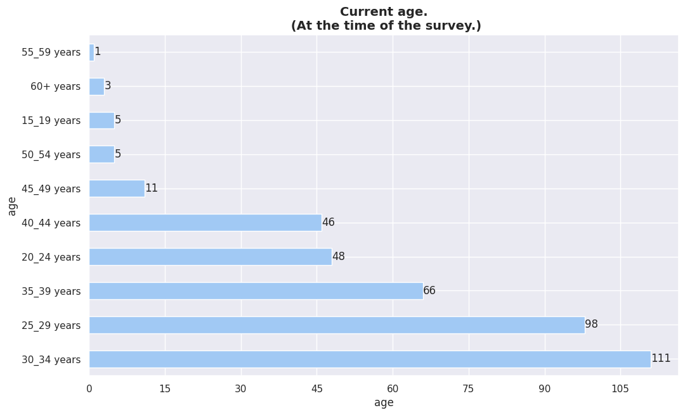

<!--

-->

# **DEMOGRAPHY**       
---
    
- GENDER
- CURRENT AGE 

 

### Gender
---

In terms of **gender classification or identification**. the survey respondents can
be clasificated in one of **3 single categories**. this categories are:

- male
- female
- prefer not to say

Less than 50% of those surveyed are not male. The 2 minorities
existing ones fail to add up to 25% of the total responses. In this case it
assumed that *"prefer not to say" is an irrelevant minority* to be taken
in consideration.

  
Chat GPT

  

  According to data from the population and housing census of Paraguay in 2012,
  <strong>the gender distribution is approximately equal.</strong> According to the Directorate
  General Statistics, Surveys and Censuses (DGEEC), the female population
  represented 49.9% and males represented 50.1% of the total population.

<a href='https://www.dgeec.gov.py/'> Dirección General de Estadística,
Encuestas y Censos (DGEEC) - Censo 2012</a> 

According to a LinkedIn report on diversity in technology in America Latina in
2021, <strong>women represent approximately 30% of the force employment in technology</strong>    
in the region, which reflects a significant gap gender compared to other
sectors.

<a
href='https://business.linkedin.com/talent-solutions/blog/diversity/2021/diversity-in-tech-2021-report'>LinkedIn

- Diversidad en Tecnología en América Latina (2021)</a> 

 

### Current Age[^1]
---
[^1]: The "current age" values in the dataset was provided as **integer ranges**. Ej: 30-40

 

### Ages by Gender
---

 

##### <b> Female   </b> 

| age         | count |
| ----------- | ----- |
| 25_29 years | 19    |
| 35_39 years | 8     |
| 30_34 years | 8     |
| 20_24 years | 8     |
| 40_44 years | 3     |
| 50_54 years | 1     |

<em>
Total count by age range in "females".
</em>

 

##### <b> Male  </b> 

| age         | count |
| ----------- | ----- |
| 30_34 years | 103   |
| 25_29 years | 78    |
| 35_39 years | 58    |
| 40_44 years | 43    |
| 20_24 years | 40    |
| 45_49 years | 10    |
| 15_19 years | 5     |
| 50_54 years | 4     |
| 60+ years   | 3     |
| 55_59 years | 1     |

<em>
Total count by age range in "males".
</em>

 

##### <b> Prefer Not To Say </b> 

    

| age         | count |
| ----------- | ----- |
| 25_29 years | 1     |
| 45_49 years | 1     |

<em>
Total count by age range in "prefer not to say".
</em>

 

