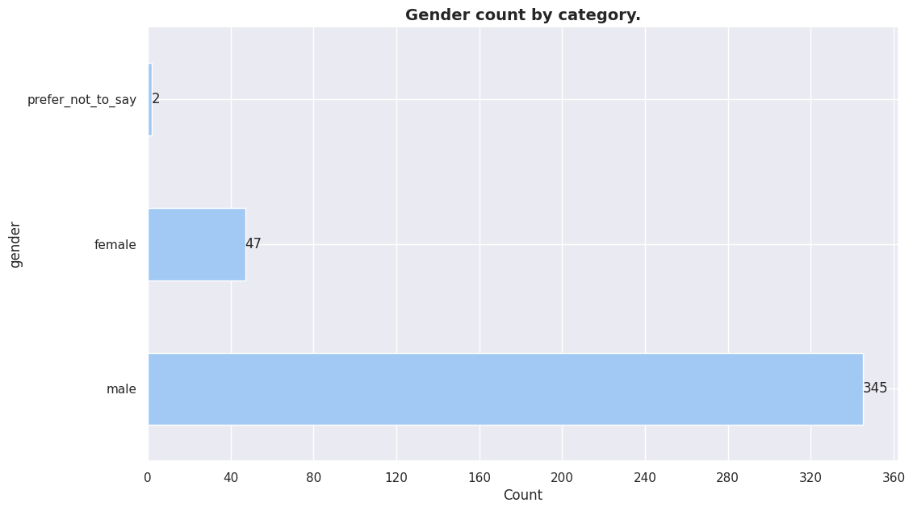
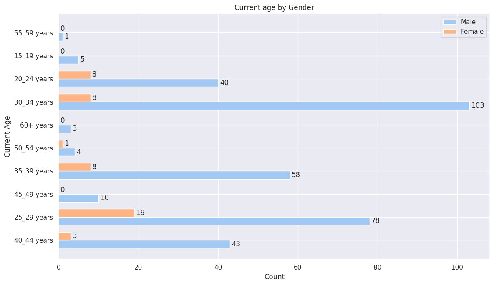

<!--

-->

# **Demographics**

- Género
- Edad actual

  

### Gender

\[op\] en materia de genro se encontraron 3 categorias:

- *male*

- *female*

- *prefer not to say*

Menos de 50% de los encuestados no pertenece al 'sexo masculino'. Las 2
minorias existentes no logran sumar el 25% de las repuestas totales.

  

### Current age.

\[op\] Los grupos mas concentrados de encuestados tienen mas de **35 años**
mientras que la los grupos de menor edad, en todas las categorias, no alcanzan
a sobrepasar el 50%. La mayor concentracion de encuestados esta en el grupo
etario de **30-34** años. El grupo etarios de encuestados que concentra la
mayor cantidad de encuestados comienza en los 30 años y termina el los 39 años.

# Ages by gender.

\[op\] En el caso de la comparacion de distribuciones etarias por genero. Cuando
se comparan genero masculino y femenino. Se observan que en la mayoria de las
categorias etarias, en ningun caso, existe una distribucion "igualitaria" de
representacion de generos. En todos los casos la representacion "masculina"
supera amplamente a la femenina. (No se tomo en consideracion la categoria
"prefiero no contestar debido que no es una categoria representativa.)

Las 4 categorias con mayor reprecentacion som:

- 20-24
- 25-29
- 30-34
- 35-39

En ninguno de los casos anteriores el % de mujeres supera el 50% del total de la categoria.

     

        
     
     
    

        

| Category    | Percentage |
| ----------- | ---------- |
| 30_34 years | 29%        |
| 25_29 years | 22%        |
| 35_39 years | 16%        |
| 40_44 years | 12%        |
| 20_24 years | 11%        |
| 45_49 years | 2%         |
| 15_19 years | 1%         |
| 50_54 years | 1%         |
| 60+ years   | 0%         |
| 55_59 years | 0%         |

 

<em>Gender total counts by age.

(male)

</em>

     

        
     
     
    

        

| Category    | Percentage |
| ----------- | ---------- |
| 25_29 years | 40%        |
| 35_39 years | 17%        |
| 30_34 years | 17%        |
| 20_24 years | 17%        |
| 40_44 years | 6%         |
| 50_54 years | 2%         |

 

<em>Gender total counts by age. 
     
(female)
</em>

 
    

     

        
     
     
    

        

| Category    | Percentage |
| ----------- | ---------- |
| 25_29 years | 50%        |
| 45_49 years | 50%        |

 

<em>Gender total counts by age. 
     
(prefer_not_to_say)
</em>

 
    

## Gender By Majors

     

        
     
     
    

        

| Category | Percentage |
| -------- | ---------- |
| male     | 82%        |
| female   | 17%        |

 

<em>Gender total counts by majors. 
     
(systems_analysis)
</em>

 
    

     

        
     
     
            

        

| Category | Percentage |
| -------- | ---------- |
| male     | 100%       |

 

<em>Gender total counts by majors. 
     
(programming, systems_analysis, computer_engineering, electronic_engineering, graphic_design)
</em>

 
    

     

        
     
     
            

        

| Category | Percentage |
| -------- | ---------- |
| male     | 81%        |
| female   | 18%        |

 

<em>Gender total counts by majors. 
     
(programming)
</em>

 
    

     

        
     
     
            

        

| Category | Percentage |
| -------- | ---------- |
| male     | 100%       |

 

<em>Gender total counts by majors. 
     
(programming, computer_engineering)
</em>

 
    

     

        
     
     
            

        

| Category | Percentage |
| -------- | ---------- |
| male     | 100%       |

 

<em>Gender total counts by majors. 
     
(programming, systems_analysis, computer_engineering, mathematics)
</em>

 
    

     

        
     
     
            

        

| Category | Percentage |
| -------- | ---------- |
| male     | 93%        |
| female   | 6%         |

 

<em>Gender total counts by majors. 
     
(systems_analysis, computer_engineering)
</em>

 
    

     

        
     
     
            

        

| Category | Percentage |
| -------- | ---------- |
| male     | 86%        |
| female   | 13%        |

 

<em>Gender total counts by majors. 
     
(programming, systems_analysis)
</em>

 
    

     

        
     
     
            

        

| Category | Percentage |
| -------- | ---------- |
| male     | 100%       |

 

<em>Gender total counts by majors. 
     
(electronic_engineering)
</em>

 
    

     

        
     
     
            

        

| Category | Percentage |
| -------- | ---------- |
| male     | 90%        |
| female   | 9%         |

 

<em>Gender total counts by majors. 
     
(computer_engineering)
</em>

 
    

     

        
     
     
            

        

| Category          | Percentage |
| ----------------- | ---------- |
| male              | 92%        |
| prefer_not_to_say | 3%         |
| female            | 3%         |

 

<em>Gender total counts by majors. 
     
(programming, systems_analysis, computer_engineering)
</em>

 
    

     

        
     
     
            

        

| Category | Percentage |
| -------- | ---------- |
| male     | 100%       |

 

<em>Gender total counts by majors. 
     
(none)
</em>

 
    

     

        
     
     
            

        

| Category          | Percentage |
| ----------------- | ---------- |
| male              | 87%        |
| prefer_not_to_say | 12%        |

 

<em>Gender total counts by majors. 
     
(computer_engineering, other)
</em>

 
    

     

        
     
     
            

        

| Category | Percentage |
| -------- | ---------- |
| male     | 100%       |

 

<em>Gender total counts by majors. 
     
(systems_analysis, computer_engineering, other ingenerías)
</em>

 
    

     

        
     
     
            

        

| Category | Percentage |
| -------- | ---------- |
| male     | 100%       |

 

<em>Gender total counts by majors. 
     
(other ingenerías)
</em>

 
    

     

        
     
     
            

        

| Category | Percentage |
| -------- | ---------- |
| male     | 100%       |

 

<em>Gender total counts by majors. 
     
(programming, systems_analysis, computer_engineering, other ingenerías)
</em>

 
    

     

        
     
     
            

        

| Category | Percentage |
| -------- | ---------- |
| male     | 100%       |

 

<em>Gender total counts by majors. 
     
(programming, other)
</em>

 
    

        

         
      
      
            

         

| Category | Percentage |
| -------- | ---------- |
| female   | 57%        |
| male     | 42%        |

 

<em>Gender total counts by majors. 

(other)
</em>

 

    

        
     
     
    

        

| Category | Percentage |
| -------- | ---------- |
| male     | 100%       |

 

<em>Gender total counts by majors. 
     
(systems_analysis, computer_engineering, other)
</em>

 
    

     

      
   
   
    

        

| Category | Percentage |
| -------- | ---------- |
| male     | 50%        |
| female   | 50%        |

 

<em>Gender total counts by majors. 
     
(programming, systems_analysis, computer_engineering, mathematics, other)
</em>

 
    

     

       
    
    
           

     

| Category | Percentage |
| -------- | ---------- |
| male     | 50%        |
| female   | 50%        |

 

<em>Gender total counts by majors. 
     
(programming, graphic_design, other)
</em>

 
    

     

      
   
   
      

     

| Category | Percentage |
| -------- | ---------- |
| male     | 66%        |
| female   | 33%        |

 

<em>Gender total counts by majors. 
     
(programming, systems_analysis, other)
</em>

 
    

     

      
   
   
      

     

| Category | Percentage |
| -------- | ---------- |
| male     | 100%       |

 

<em>Gender total counts by majors. 
     
(programming, other ingenerías)
</em>

 
    

     

      
   
   
      

     

| Category | Percentage |
| -------- | ---------- |
| male     | 100%       |

 

<em>Gender total counts by majors. 
     
(systems_analysis, civil_engineering)
</em>

 
    

     

      
   
   
      

     

| Category | Percentage |
| -------- | ---------- |
| female   | 100%       |

 

<em>Gender total counts by majors. 
     
(mathematics, none)
</em>

 
    

     

      
   
   
      

     

| Category | Percentage |
| -------- | ---------- |
| male     | 100%       |

 

<em>Gender total counts by majors. 
     
(computer_engineering, mathematics)
</em>

 
    

     

      
   
   
      

     

| Category | Percentage |
| -------- | ---------- |
| male     | 100%       |

 

<em>Gender total counts by majors. 
     
(graphic_design)
</em>

 
    

     

      
   
   
      

     

| Category | Percentage |
| -------- | ---------- |
| male     | 100%       |

 

<em>Gender total counts by majors. 
     
(programming, computer_engineering, other)
</em>

 
    

     

 
  
  
     

     

| Category | Percentage |
| -------- | ---------- |
| male     | 75%        |
| female   | 25%        |

 

<em>Gender total counts by majors. 
     
(programming, systems_analysis, graphic_design)
</em>

 
    

     

 
  
  
     

     

| Category | Percentage |
| -------- | ---------- |
| male     | 100%       |

 

<em>Gender total counts by majors. 
     
(programming, systems_analysis, electronic_engineering, other ingenerías, other)
</em>

 
    

     

 
  
  
     

     

| Category | Percentage |
| -------- | ---------- |
| female   | 100%       |

 

<em>Gender total counts by majors. 
     
(other ingenerías, other)
</em>

 
    

    

    
     
     
    

    

| Category | Percentage |
| -------- | ---------- |
| female   | 100%       |

 

<em>Gender total counts by majors. 
     
(programming, systems_analysis, computer_engineering, other)
</em>

 
    

     

 
  
  
     

     

| Category | Percentage |
| -------- | ---------- |
| male     | 100%       |

 

<em>Gender total counts by majors. 
     
(programming, systems_analysis, mathematics)
</em>

 
    

     

 
  
  
     

     

| Category | Percentage |
| -------- | ---------- |
| male     | 100%       |

 

<em>Gender total counts by majors. 
     
(programming, electronic_engineering, other)
</em>

 
    

     

      
   
   
      

     

| Category | Percentage |
| -------- | ---------- |
| male     | 100%       |

 

<em>Gender total counts by majors. 
     
(programming, systems_analysis, computer_engineering, electrical_engineering)
</em>

 
    

     

      
   
   
     

     

| Category | Percentage |
| -------- | ---------- |
| male     | 100%       |

 

<em>Gender total counts by majors. 
     
(electrical_engineering)
</em>

 
    

     

      
   
   
     

     

| Category | Percentage |
| -------- | ---------- |
| male     | 100%       |

 

<em>Gender total counts by majors. 
     
(programming, electronic_engineering, mathematics)
</em>

 
    

     

      
   
   
      

     

| Category | Percentage |
| -------- | ---------- |
| male     | 100%       |

 

<em>Gender total counts by majors. 
     
(programming, systems_analysis, civil_engineering)
</em>

 
    

     

      
   
   
      

     

| Category | Percentage |
| -------- | ---------- |
| male     | 100%       |

 

<em>Gender total counts by majors. 
     
(programming, systems_analysis, computer_engineering, graphic_design)
</em>

 
    

     

      
   
   
      

     

| Category | Percentage |
| -------- | ---------- |
| male     | 100%       |

 

<em>Gender total counts by majors. 
     
(programming, systems_analysis, mathematics, other)
</em>

 
    

     

      
   
   
      

      

| Category | Percentage |
| -------- | ---------- |
| male     | 100%       |

 

<em>Gender total counts by majors. 
     
(programming, systems_analysis, electronic_engineering)
</em>

 
    

