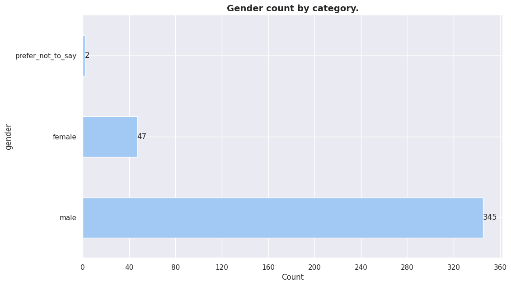

- Género
- Edad actual

<!---
```highlight
**Highlighted Section**

This is a special highlighted section in your Markdown.
You can add more lines here, and they will all be highlighted.
```
--->

### Gender




En materia de genro se presentan 3 categorias:

+ male 

+ female

+ prefer not to say

Menos de 50% de los encuestados no pertenece al sexo masculino. Las 2 minorias
existentes no logran sumar el 25% de las repuestas totales. En este caso se
asumio que **prefer not to say es una minoria irrelevante** para ser tomada en
consideracion.


<details>
  <summary style="background-color: #f0f0f0; font-weight: bold; padding: 10px;">Chat GPT</summary>
  
  <div style="background-color: #f8f8f8; color: black; padding: 10px; margin-top: 10px;">
  Según los datos del censo de población y viviendas del Paraguay del año 2012,
  la distribución por género es aproximadamente equitativa. Según la Dirección
  General de Estadística, Encuestas y Censos (DGEEC), la población femenina
  representaba el 49.9% y la masculina el 50.1% de la población total. 

  <a href='https://www.dgeec.gov.py/'> Dirección General de Estadística, Encuestas y Censos (DGEEC) - Censo 2012</a>
  </div>


  <div style="background-color: #f8f8f8; color: black; padding: 10px; margin-top: 10px;">
  Según un informe de LinkedIn sobre la diversidad en la tecnología en América
  Latina en 2021, las mujeres representan aproximadamente el 30% de la fuerza
  laboral en tecnología en la región, lo que refleja una significativa brecha
  de género en comparación con otros sectores.

  <a href='https://business.linkedin.com/talent-solutions/blog/diversity/2021/diversity-in-tech-2021-report'>LinkedIn - Diversidad en Tecnología en América Latina (2021)</a>
  </div>

</details>


### Current age.


Los grupos mas concentrados de encuestados tienen mas de 35 años
mientras que la los grupos de menor edad, en todas las categorias, no alcanzan
a sobrepasar el 50%. La mayor concentracion de encuestados esta en el grupo
etario de 30-34 años. El grupo etarios de encuestados que concentra la
mayor cantidad de encuestados comienza en los 30 años y termina el los 39 años.

# Ages by gender.


```highlight
[op] En el caso de la comparacion de distribuciones etarias por genero. Cuando
se comparan genero masculino y femenino. Se observan que en la mayoria de las
categorias etarias, en ningun caso, existe una distribucion "igualitaria" de
representacion de generos. En todos los casos la representacion "masculina"
supera amplamente a la femenina. (No se tomo en consideracion la categoria
"prefiero no contestar debido que no es una categoria representativa.)

Las 4 categorias con mayor reprecentacion som:

* 20-24
* 25-29
* 30-34
* 35-39

En ninguno de los casos anteriores el % de mujeres supera el 50% del total de
la categoria.
```

### Female

| age         | count |
| ----------- | ----- |
| 25_29 years | 19    |
| 35_39 years | 8     |
| 30_34 years | 8     |
| 20_24 years | 8     |
| 40_44 years | 3     |
| 50_54 years | 1     |

### male

|    age       |  count  |\
|\--------------|-------|
|    30_34 years  |  103    |\
|    25_29 years  |   78    |\
|    35_39 years  |   58    |\
|    40_44 years  |   43    |\
|    20_24 years  |   40    |\
|    45_49 years  |   10    |\
|    15_19 years  |    5    |\
|    50_54 years  |    4    |\
|    60+ years    |    3    |\
|    55_59 years  |    1    |

# Prefer Not To Say

| age         | count |
| ----------- | ----- |
| 25_29 years | 1     |
| 45_49 years | 1     |
