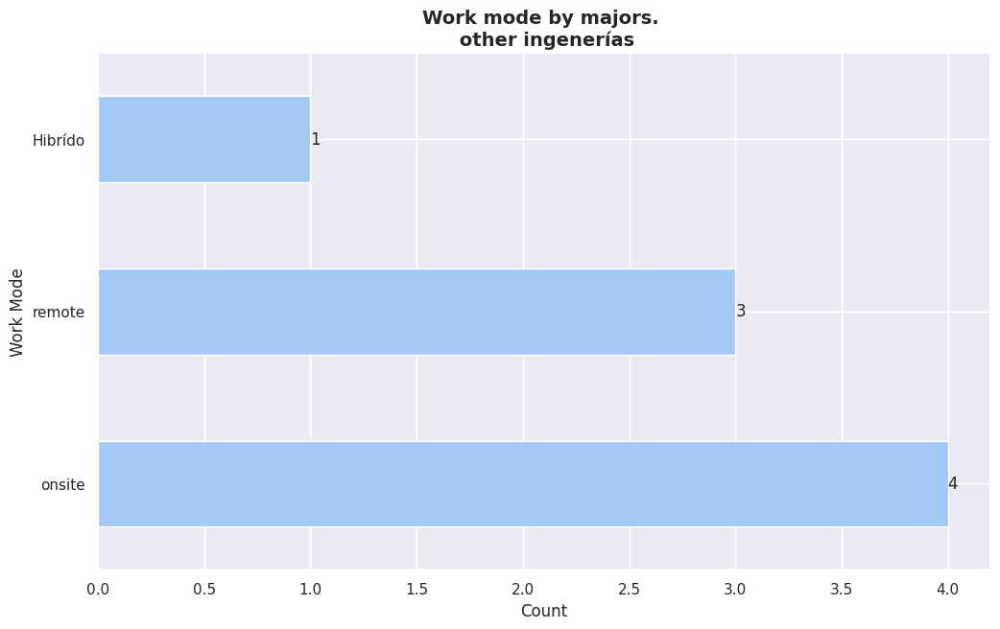
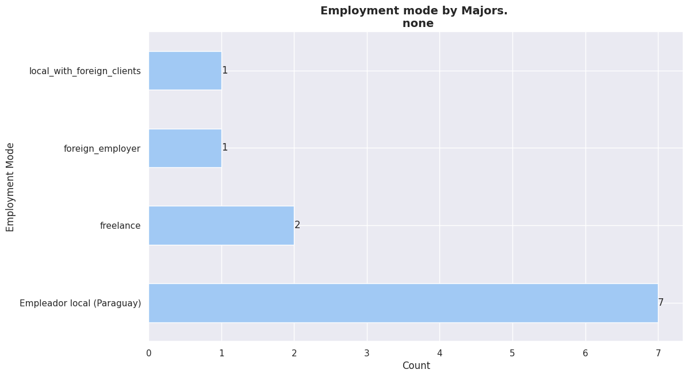
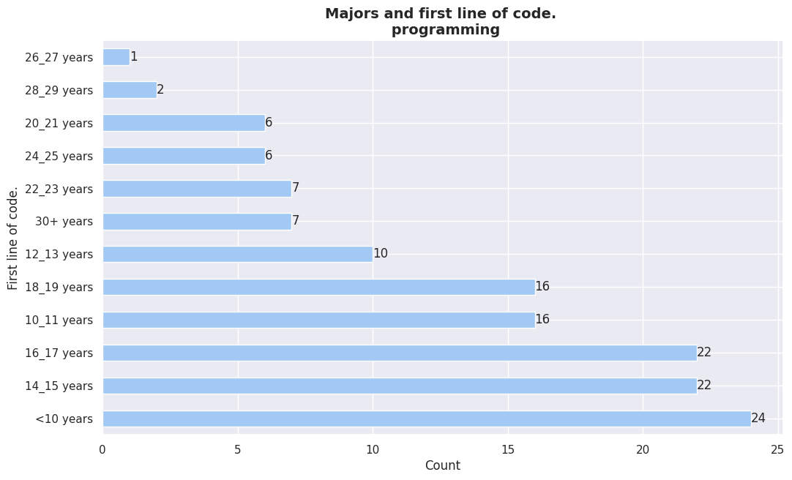
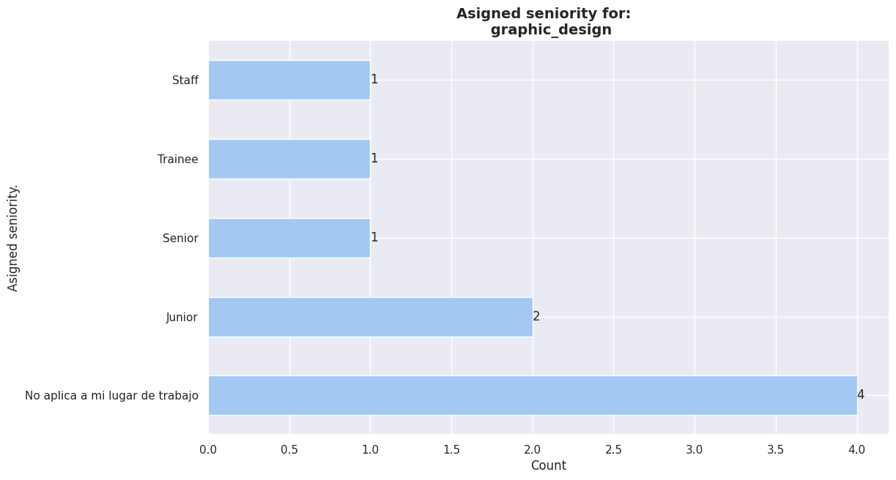
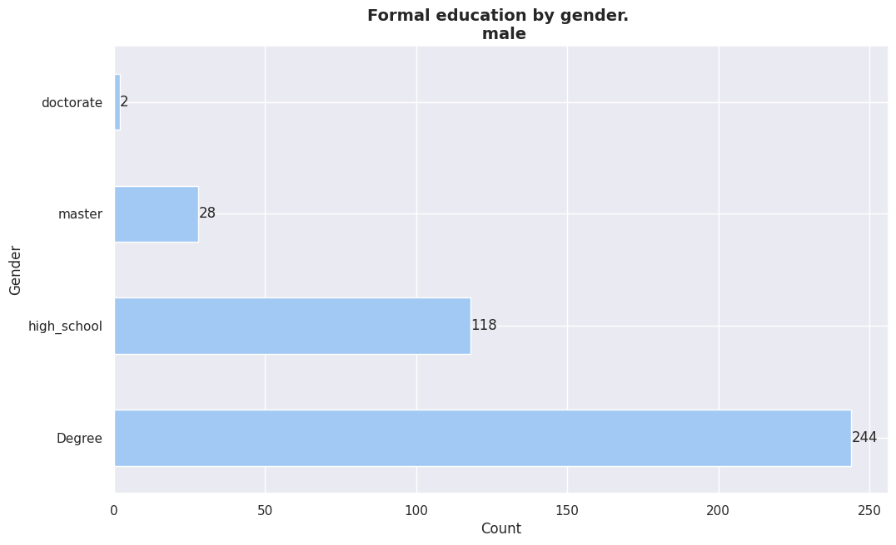
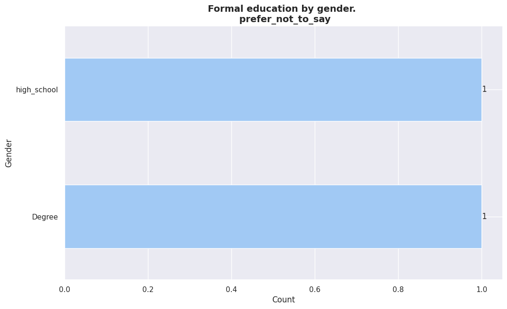
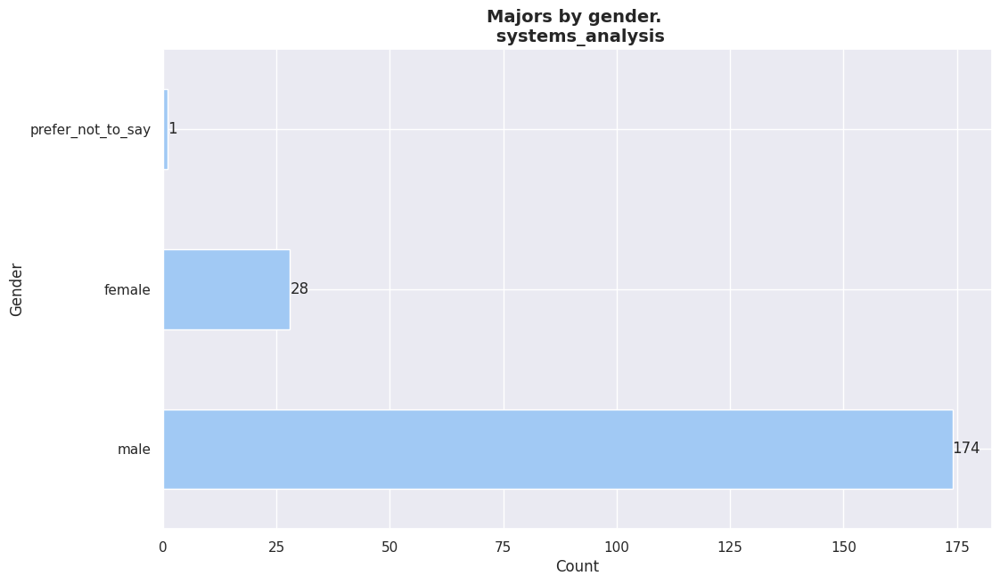

In this section we explore the **"educational aspect"** of the data with
special enphasis in the inpact on the IT world of the paraguayan
profesionals.

 

It can be seen that there is a reduced number of Majors represented in the
data by the survey respondents.

The majors with the highest numbers of representation in the data are:

- Programming
- CS Engineering
- Systems analysis

More than 50% of the representation in the dataset is distributed among these
three majors, with **Systems Analysis** being the major with the highest
representation.

|MAJORS                  | COUNT| 
| ----------- | ----- |            
|systems_analysis        |  203 |   
|computer_engineering    |  195 |   
|programming             |  139 |   
|other                   |   39 |   
|electronic_engineering  |   12 |   
|mathematics             |   11 |   
|none                    |   11 |   
|graphic_design          |    9 |   
|other ingenerías        |    8 |   
|civil_engineering       |    2 |   
|electrical_engineering  |    2 |   

<em>Majors total count by unique values.</em>

 
 

## Education vs work_mode

## Work mode by Majors[^1]
[^1]:   Since there is no way to know the current geographical location of the
    respondent we assume that the respondent its located in Paraguay.
---

<!--

  

  Motivations
  

  

  

    Según lo ón femenina representaba el 49.9% y la masculina el 50.1% de la población total.
      
    <a href='https://www.dgeec.gov.py/' style="color: #0073e6; text-decoration: none; font-weight: bold;">
      Dirección General de Estadística, Encuestas y Censos (DGEEC) - Censo 2012
    </a>
  

-->

+ **systems_analysis**    

|work_mode | percentage  |      
|--------|--------|
|onsite    | 38%         |   
|remote    | 30%         |       
|Hibrído   | 30%         |       
|none      |  0%         |       

 
 

+ **programming, systems_analysis, computer_engineering, electronic_engineering, graphic_design**       
    

|work_mode |  percentage      |   
|----------|-----|    
|onsite   | 100%   | 

 
 

+ **programming**        
    

|work_mode  |     percentage| 
|--------------|------------|
|onsite   |  38%            |    
|remote   |  30%            |        
|Hibrído  |  29%            |    
|none     |   1%            |        

 
 

+ **programming, computer_engineering**    
    

|work_mode|       percentage |        
|----------|---------|                
|remote   |  52%             |       
|onsite   |  30%             |       
|Hibrído  |  17%             |       

 
 

+ **programming, systems_analysis, computer_engineering, mathematics**    
    

|work_mode|       percentage |        
|------|-----|
|remote   |  50%   |     
|Hibrído  |  25%   |         
|onsite   |  25%   |         

 
 

+ **systems_analysis, computer_engineering**    
    

|work_mode|       percentage |        
|------|-----|
|remote   |  41% |       
|onsite   |  30% |   
|Hibrído  |  27% |   

 
 

+ **programming, systems_analysis**        
    

|work_mode|       percentage |        
|------|-----|
|onsite  |   42% |   
|Hibrído |   36% |   
|remote  |   19% |   
|none    |    1% |   

 
 

+ **electronic_engineering**    

|work_mode|       percentage |        
|------|-----|
|remote   |  58%  |      
|onsite   |  25%  |      
|Hibrído  |  16%  |  

 
 

+ **computer_engineering**        
    

|work_mode|       percentage |        
|------|-----|
|remote   |  46%  |          
|onsite   |  30%  |          
|Hibrído  |  22%  |  
|none     |   1%  |      

 
 

+ **programming, systems_analysis, computer_engineering**        
    

|work_mode|       percentage |        
|------|-----|
|Hibrído  |  38%   | 
|onsite   |  30%   | 
|remote   |  30%   | 

 
 

+ **none** [^4]       
[^4]: When we mention None in the university careers category. (Majors) We
    assume the intention was to point out Self-Taught Professionals.

|work_mode|       percentage |        
|------|-----|
|Hibrído  |  45% |   
|remote   |  27% |   
|onsite   |  18% |   
|none     |   9% |   

 
 

+ **computer_engineering, other**        
    

|work_mode|       percentage |        
|------|-----|
|remote   | 81%  |      
|onsite   | 18%  |  

 
 

+ **systems_analysis, computer_engineering, other ingenerías**        
    

|work_mode|       percentage |        
|------|-----|
|remote |   100%|

 
 

+ **other ingenerías**        
    

|work_mode|       percentage |        
|------|-----|
|onsite   |  50%  |      
|remote   |  37%  |      
|Hibrído  |  12%  |  

 
 

+ **programming, systems_analysis, computer_engineering, other ingenerías**        
    

|work_mode|       percentage |        
|------|-----|
|remote   | 100%|

 
 

+ **programming, other**        
    

|work_mode|       percentage |        
|------|-----|
|remote   | 60%    |    
|onsite   | 20%    |        
|none     | 20%    |    

 
 

+ **other**    

|work_mode|       percentage |        
|------|-----|
|remote   |  51%   |     
|onsite   |  35%   |     
|Hibrído  |  11%   |     
|none     |   2%   |     

 
 

+ **systems_analysis, computer_engineering, other**    

    
|work_mode|       percentage |        
|------|-----|
|remote |   100%|

 
 

+ **programming, systems_analysis, computer_engineering, mathematics, other**    

    
|work_mode|       percentage |        
|------|-----|
|remote  |  50%    |    
|onsite  |  50%    |

 
 

+ **programming, graphic_design, other**    
    

|work_mode|       percentage |        
|------|-----|
|remote    | 50%   | 
|Hibrído   | 50%   | 

 
 

+ **programming, systems_analysis, other**    
    

|work_mode|       percentage |        
|------|-----|
|onsite    | 83%  |  
|Hibrído   | 16%  |  

 
 

+ **programming, other ingenerías**    

|work_mode|       percentage |        
|------|-----|
|onsite |   100% |

 
 

+ **systems_analysis, civil_engineering**        
    

|work_mode|       percentage |        
|------|-----|
|onsite  |  50%    |    
|none    |  50%    |

 
 

+ **mathematics, none**        
    

|work_mode|       percentage |        
|------|-----|
|remote  |  100%       | 

 
 

+ **computer_engineering, mathematics**    

    
|work_mode|       percentage |        
|------|-----|
|Hibrído  |  40%    |    
|remote   |  40%    |
|onsite   |  20%    |

 
 

+ **graphic_design**    

|work_mode|       percentage |        
|------|-----|
|Hibrído  |  66%  |      
|onsite   |  22%  |      
|remote   |  11%  |  

 
 

+ **programming, computer_engineering, other**    

|work_mode|       percentage |        
|------|-----|
|remote  |  100%       | 

    
 
 

+ **programming, systems_analysis, graphic_design**    

|work_mode|       percentage |        
|------|-----|
|Hibrído  |  75%   | 
|onsite   |  25%   | 

 
 

+ **programming, systems_analysis, electronic_engineering, other ingenerías, other**        
    

|work_mode|       percentage |        
|------|-----|
|onsite |   100%       | 

    
 
 

+ **programming, systems_analysis, computer_engineering, other**    
    

|work_mode|       percentage |        
|------|-----|
|remote  |  100%   | 

 
 

+ **programming, systems_analysis, mathematics**    
    

|work_mode|       percentage |        
|------|-----|
|onsite   |  50%   | 
|Hibrído  |  25%   |     
|remote   |  25%   | 

 
 

+ **programming, electronic_engineering, other**    
    

|work_mode|       percentage |        
|------|-----|
|remote   | 100%|

 
 

+ **programming, systems_analysis, computer_engineering, electrical_engineering**    
    

|work_mode|       percentage |        
|------|-----|
|remote |   100%|

 
 

+ **electrical_engineering**    

|work_mode|       percentage |        
|------|-----|
|remote    |50%    |    
|onsite    |50%    |

 
 

+ **programming, electronic_engineering, mathematics**        
    

|work_mode|       percentage |        
|------|-----|
|onsite |   100%   | 

 
 

+ **programming, systems_analysis, civil_engineering**        
    

|work_mode|       percentage |        
|------|-----|
|none |   100%|

 
 

+ **programming, systems_analysis, computer_engineering, graphic_design**    

    
|work_mode|       percentage |        
|------|-----|
|Hibrído |   100%   | 

    
 
 

+ **programming, systems_analysis, mathematics, other**       

    
|work_mode|       percentage |        
|------|-----|
|onsite |   100%   | 

    
 
 

+ **programming, systems_analysis, electronic_engineering**    

|work_mode|       percentage |        
|------|-----|
|onsite  |  50%   | 
|remote  |  50%   | 

 
 

## Education vs employment_mode

## Education vs IT_exp

## Education vs first_code

## Education vs assigned_seniority

En la mayoria de los casos, segun la carrera elegida por los encuestados,
se puede observar que la mayoria posee un seniority de **"senior"**.

## Education vs self_assessed_seniority

## Education vs formal_edu

## Education vs formal_edu_importance

Formal education by gender. - male
====================
formal_edu
Degree         62%
high_school    30%
master          7%
doctorate       0%
Name

 
 : proportion, dtype: object

Formal education by gender. - female
====================
formal_edu
Degree         78%
high_school    14%
master          6%
Name

 
 : proportion, dtype: object

Formal education by gender. - prefer_not_to_say
====================
formal_edu
Degree         50%
high_school    50%
Name

 
 : proportion, dtype: object

## Education vs gender

GENDER ->  female
majors
systems_analysis        28
programming             15
computer_engineering    14
other                   10
mathematics              2
graphic_design           2
none                     1
other ingenerías         1
Name

 
 : count, dtype: int64

GENDER ->  male
majors
computer_engineering      179
systems_analysis          174
programming               123
other                      28
electronic_engineering     12
none                       10
mathematics                 9
graphic_design              7
other ingenerías            7
civil_engineering           2
electrical_engineering      2
Name

 
 : count, dtype: int64

GENDER ->  prefer_not_to_say
majors
computer_engineering    2
programming             1
systems_analysis        1
other                   1
Name

 
 : count, dtype: int64

============================================
MAJOR -->  computer_engineering
gender
male      98
female    10
Name

 
 : count, dtype: int64

============================================
MAJOR -->  programming
gender
male      9
female    2
Name

 
 : count, dtype: int64

============================================
MAJOR -->  systems_analysis
gender
male      72
female    15
Name

 
 : count, dtype: int64

## Education vs age

## Education vs monthly_salary

## Education vs AI_replace_dev

## Education vs layoffs_23_24

<!--
You can reference the table using [this link](#table-majors-total-count).
-->
