# Education

In this section we explore the "educational" aspect of the data with special
enphasis in the inpact on the IT world of the paraguayan profesionals.

- 'systems_analysis'
- 'programming'
- 'computer_engineering'
- 'electronic_engineering'
- 'graphic_design'
- 'mathematics'
- 'none'
- 'other'
- 'other ingenerías'
- 'civil_engineering'
- 'electrical_engineering'

* Se puede ver que existe un numero muuy reducido de accrearas representadas.

 

        

Las carreras con **mayor representacion** entre los encuestados son:

- Programming
- CS Engineering
- Systems analysis

Entre estas 3 carreras se ditribuye mas del 50% de los encuestados. Siendo
**systems analysis** la carrera con mas representacion.

     

        
     
     
    

        

| category               | count |
| :--------------------- | ----: |
| systems_analysis       |   203 |
| computer_engineering   |   195 |
| programming            |   139 |
| other                  |    39 |
| electronic_engineering |    12 |
| mathematics            |    11 |
| none                   |    11 |
| graphic_design         |     9 |
| other ingenerías       |     8 |
| civil_engineering      |     2 |

 

<em>Majors total count.</em>

  

<!-- Start IA comment -->
 

 <!-- Comment title. -->
 
 
   
Access to Formal Education in South America: A Gender Perspective
 

 <!-- Ends title. -->
   <!-- Start comment body. -->
 

 <h1>Access to Formal Education in South America: A Gender Perspective</h1>

South America has made significant strides in expanding access to formal education, but disparities persist, particularly along gender lines.

<h2>Gender Disparities in Education</h2>
<ul>
<li><strong>Enrollment:</strong> Historically, girls and women have faced barriers to education, leading to lower enrollment rates compared to boys. However, in recent decades, there has been progress in closing this gap, with many countries achieving gender parity or even female dominance in enrollment.</li>
<li><strong>Completion Rates:</strong> Despite increased enrollment, gender disparities persist in completion rates. While girls and women often outperform boys in primary education, this trend can reverse at higher levels, with more boys completing secondary and tertiary education.</li>
<li><strong>Educational Attainment:</strong> Women are more likely to attain lower levels of education compared to men, contributing to gender gaps in the labor market and economic participation.</li>
</ul>

<h2>Factors Contributing to Gender Disparities</h2>
<ul>
<li><strong>Cultural and Societal Norms:</strong> Traditional gender roles and stereotypes can limit girls' and women's opportunities for education. Early marriages, pregnancy, and domestic responsibilities can also interfere with their schooling.</li>
<li><strong>Economic Factors:</strong> Poverty can disproportionately affect girls' access to education, as families may prioritize education for boys due to economic considerations.</li>
<li><strong>Geographic Location:</strong> Rural areas often have limited educational infrastructure and opportunities, particularly for girls.</li>
<li><strong>Quality of Education:</strong> Differences in the quality of education between schools can impact girls' and boys' learning outcomes.</li>
</ul>

<h2>Efforts to Address Gender Disparities</h2>
<ul>
<li><strong>Gender-sensitive policies:</strong> Developing policies that promote gender equality in education, such as scholarships for girls and affirmative action programs.</li>
<li><strong>Investment in education infrastructure:</strong> Improving access to schools, especially in rural areas, and providing adequate facilities.</li>
<li><strong>Teacher training:</strong> Equipping teachers with the skills to address gender stereotypes and create inclusive classrooms.</li>
<li><strong>Community engagement:</strong> Involving parents and communities in promoting girls' education.</li>
</ul>

While progress has been made, persistent gender disparities in education remain a challenge in many South American countries.

 

(UNESCO Institute for Statistics: Provides data on gender disparities in education. Inter-American Development Bank: Publishes reports and studies on gender and education in the region. United Nations Girls' Education Initiative: Focuses on global efforts to promote girls' education.)
 

 
<!-- End BODY comment -->
 

 <!-- End IA comment -->
 

<!-- Start IA comment -->
 

 <!-- Comment title. -->
 
 
   
IT Careers and Majors in South America
 

 <!-- Ends title. -->
   <!-- Start comment body. -->
 

 

<h1>IT Careers and Majors in South America</h1>

<h2>Common IT Careers in South America</h2>
<ul>
<li><strong>Software Development:</strong> With a strong emphasis on programming languages like Java, Python, and JavaScript, software developers are crucial for building applications and systems.</li>
<li><strong>IT Support and Help Desk:</strong> This role involves providing technical assistance to users. While it might be considered an entry-level position, it offers a solid foundation for those aspiring to advance in IT.</li>
<li><strong>Cybersecurity:</strong> Given the increasing cyber threats, cybersecurity professionals are in high demand. This field encompasses various roles, including network security, information security, and digital forensics.</li>
<li><strong>Data Science and Analytics:</strong> As businesses increasingly rely on data-driven decisions, data scientists and analysts are becoming essential. This career path involves extracting insights from large datasets.</li>
<li><strong>Web Development:</strong> With the growing importance of online presence, web developers are sought after. This role involves creating and maintaining websites and web applications.</li>
</ul>

<h2>Growth Perspectives</h2>

The IT sector in South America is experiencing robust growth, driven by factors like e-commerce, digital government services, and financial technology (fintech). This growth is expected to continue, creating ample opportunities for IT professionals.

<ul>
<li><strong>Software Development:</strong> Given the region's focus on digital transformation, demand for software developers is projected to remain strong.</li>
<li><strong>Cybersecurity:</strong> As cyber threats evolve, the need for cybersecurity experts will continue to rise.</li>
<li><strong>Data Science and Analytics:</strong> The increasing reliance on data-driven decision-making will fuel demand for professionals in this field.</li>
<li><strong>Cloud Computing:</strong> With the adoption of cloud technologies accelerating, cloud computing experts will be in high demand.</li>
</ul>

<h2>Gender Representation</h2>

While the IT industry in South America is growing, it still faces gender disparities. Women are underrepresented in many IT roles, particularly in leadership positions. However, there's a growing awareness of this issue, and initiatives are being implemented to encourage more women to pursue IT careers.

<h2>Popular IT Majors</h2>
<ul>
<li>Computer Science</li>
<li>Software Engineering</li>
<li>Information Systems</li>
<li>Information Technology</li>
<li>Telecommunications Engineering</li>
</ul>

 

(Inter-American Development Bank (IDB) , Latin American and Caribbean Economic System (ECLAC) , National Statistical Offices)
 

 
<!-- End BODY comment -->
 

 <!-- End IA comment -->
 

## **Education vs work_mode**   
   
  

    
      
  

    
   
  

 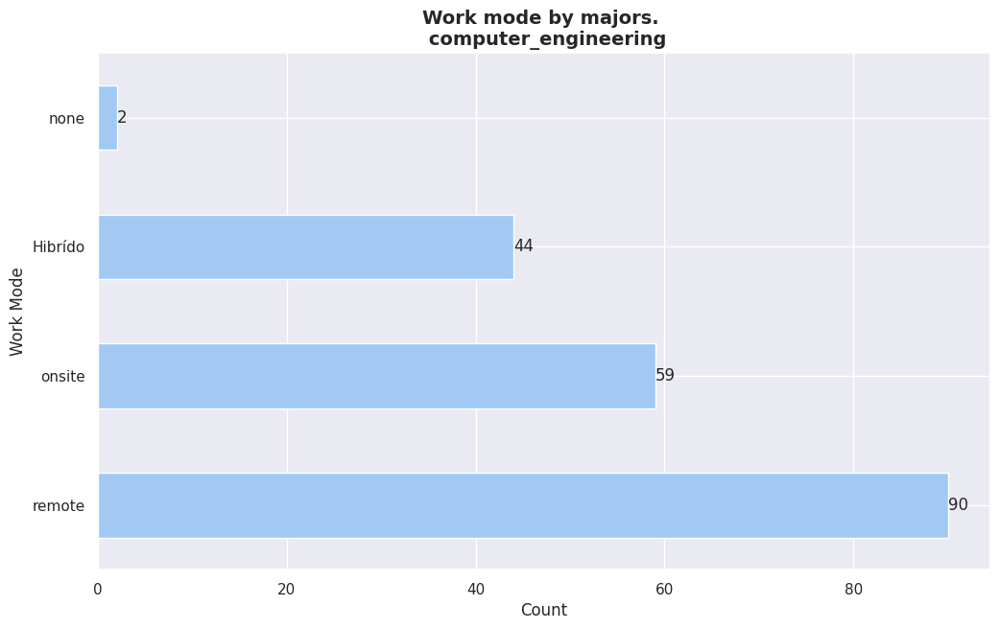   
   
  

    

  

    

  

    

  

    

  

    

  

    

  

 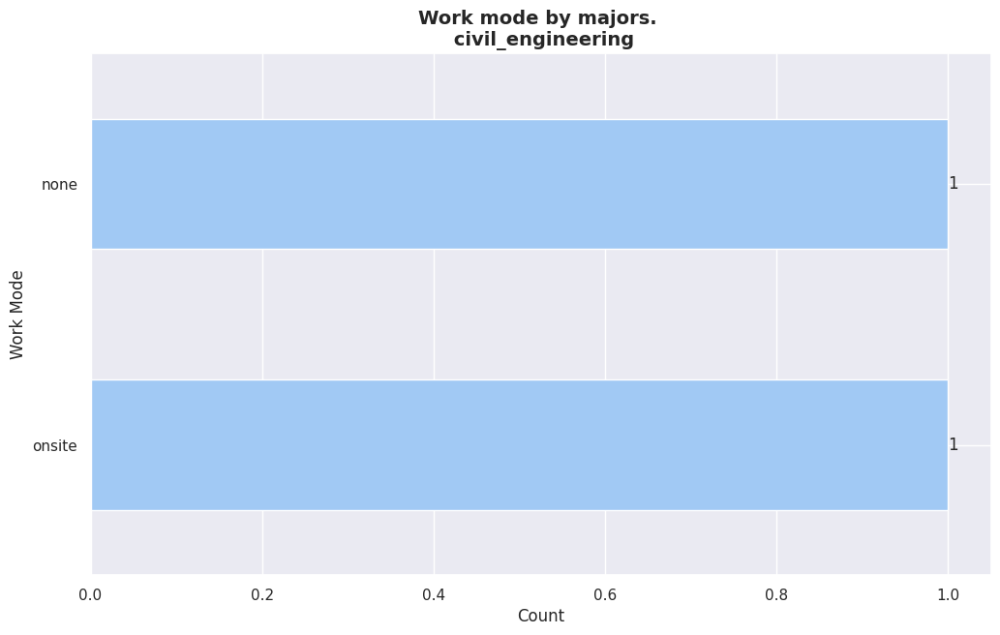   

  

   
 

     

  

| Category                                            | Percentage |
| --------------------------------------------------- | ---------- |
| computer_engineering                                | 32%        |
| systems_analysis                                    | 19%        |
| programming, computer_engineering                   | 6%         |
| systems_analysis, computer_engineering              | 5%         |
| programming                                         | 4%         |
| programming, systems_analysis                       | 3%         |
| programming, systems_analysis, computer_engineering | 3%         |
| electronic_engineering                              | 3%         |
| computer_engineering, other                         | 3%         |
| systems_analysis, computer_engineering, other       | 1%         |
| programming, other                                  | 1%         |
| other                                               | 1%         |
| programming, computer_engineering, other            | 1%         |
| none                                                | 1%         |

<em>Majors by work mode. 

(remote)
</em>

    

 

| Category                                            | Percentage |
| --------------------------------------------------- | ---------- |
| computer_engineering                                | 24%        |
| systems_analysis                                    | 23%        |
| programming, systems_analysis                       | 15%        |
| programming, systems_analysis, computer_engineering | 6%         |
| programming, computer_engineering                   | 5%         |
| systems_analysis, computer_engineering              | 4%         |
| programming, systems_analysis, other                | 3%         |
| computer_engineering, other                         | 2%         |
| programming                                         | 2%         |
| none                                                | 1%         |
| other                                               | 1%         |

<em>Majors by work mode. 

(onsite)
</em>

 

     

 

| Category                                            | Percentage |
| --------------------------------------------------- | ---------- |
| systems_analysis                                    | 24%        |
| computer_engineering                                | 23%        |
| programming, systems_analysis                       | 15%        |
| programming, systems_analysis, computer_engineering | 11%        |
| none                                                | 4%         |
| programming, computer_engineering                   | 3%         |
| programming, systems_analysis, graphic_design       | 2%         |
| other                                               | 1%         |
| electronic_engineering                              | 1%         |

<em>Majors by work mode. 

(Hibrído)
</em>

 

     

 

| Category                                         | Percentage |
| ------------------------------------------------ | ---------- |
| computer_engineering                             | 33%        |
| none                                             | 16%        |
| systems_analysis                                 | 16%        |
| programming, other                               | 16%        |
| programming, systems_analysis, civil_engineering | 16%        |

<em>Majors by work mode. 

(none)
</em>

 

  

## **Education vs employment_mode**   

  

 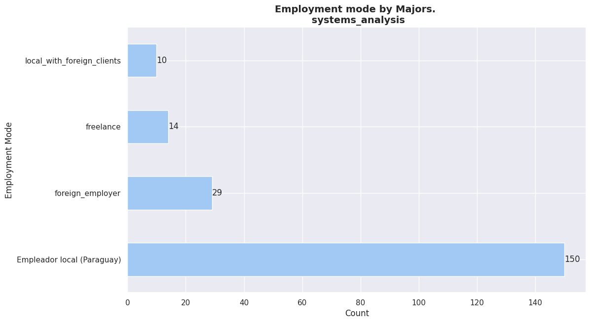   
   
  

    

  

    

  

    

  

    

  

    

  

    

  

    

  

    

  

    

  

   
 

  

## **Education vs IT_exp**   
   
  

  
 
  

  
 
  

  
 
  

  
 
  

  
 
  

  
 
  

  
 
  

  
 
  

  
 
  

  
 
  

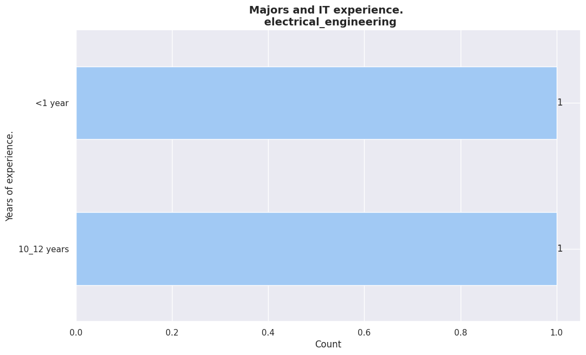 
  

  

## **Education vs first_code**   

("first_code" was interpreted as the age where the survey respondant started to program.)

<!-- Start IA comment -->
 

 <!-- Comment title. -->
 
 
   
 Age of Introduction to Programming in South America
 

 <!-- Ends title. -->
   <!-- Start comment body. -->
 

<h1>Age of Introduction to Programming in South America: A Gender Perspective</h1>

<strong>Disclaimer:</strong> While there's increasing data on coding education and gender disparities in tech, specific data on the exact age of introduction to programming in South America, particularly broken down by gender, can be limited. However, based on global trends and regional observations, we can provide some insights.

<h2>General Trends</h2>
<ul>
<li><strong>Earlier Exposure:</strong> There's a global trend towards introducing children to coding at younger ages. This is influenced by the increasing digitalization of society and the recognition of coding as a fundamental skill.</li>
<li><strong>Educational Initiatives:</strong> Many South American countries have implemented educational programs to introduce coding into the school curriculum, often starting in primary or middle school.</li>
<li><strong>Extracurricular Activities:</strong> Coding clubs, workshops, and online platforms are becoming more accessible, allowing children to explore programming outside of school hours.</li>
</ul>

<h2>Gender Gap</h2>
<ul>
<li><strong>Early Interest:</strong> While there is no definitive data, anecdotal evidence suggests that boys often show earlier interest in technology and gaming, which can naturally lead to an earlier exposure to coding.</li>
<li><strong>Stereotypes and Bias:</strong> Societal stereotypes about gender and technology can influence parents and educators to introduce coding to boys more frequently than girls.</li>
<li><strong>Gap Widening:</strong> If the gap in exposure to coding starts early, it can widen over time, leading to fewer women pursuing IT-related careers.</li>
</ul>

<h2>Factors Influencing Early Exposure</h2>
<ul>
<li><strong>Socioeconomic Status:</strong> Access to technology and educational resources is often correlated with socioeconomic status. Children from more affluent backgrounds may have earlier exposure to coding.</li>
<li><strong>Parental Involvement:</strong> Parents who are interested in technology are more likely to introduce their children to coding at an early age.</li>
<li><strong>Educational Policies:</strong> Government policies promoting STEM education can significantly impact the age at which children are exposed to coding.</li>
</ul>

It's crucial to emphasize that these are general trends, and the situation can vary significantly between countries and regions within South America.

<h2>Bridging the Gap</h2>
<ul>
<li><strong>Promote coding education for girls:</strong> Implement targeted programs and initiatives to encourage girls' interest in coding.</li>
<li><strong>Challenge stereotypes:</strong> Promote positive role models in the tech industry and challenge gender stereotypes.</li>
<li><strong>Provide equal access:</strong> Ensure that all children, regardless of their background, have equal access to coding education and resources.</li>
</ul>

 

(UNESCO: Cracking the Code: Girls' Education in STEM , Girls Who Code: Research & Impact , National Center for Women & Information Technology (NCWIT): Research & Data)
 

 
<!-- End BODY comment -->
 

 <!-- End IA comment -->
 

  

   
   
  

   

  

   

  

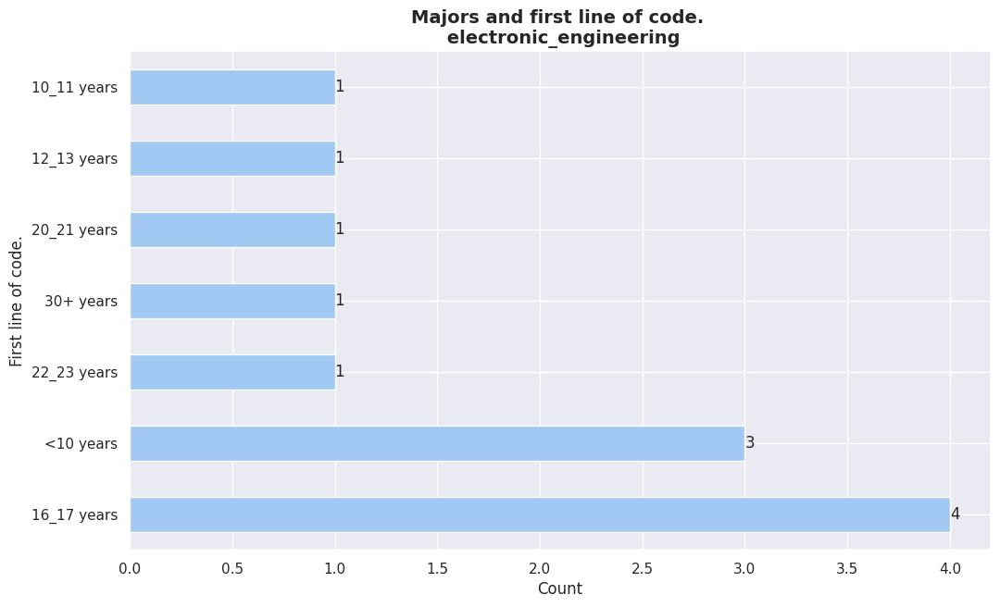   

  

   

  

   

  

   

  

   

  

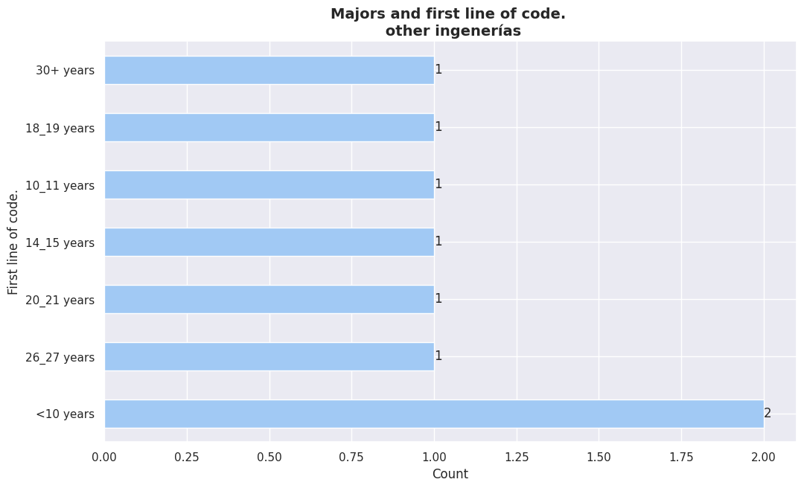   

  

   

  

  
 

  

## **Education vs assigned_seniority**   
   
  

   
 
  

   
    
  

   
 
  

   
 
  

   
 
  

   
 
  

   
 
  

   
 
  

   
 
  

   
 
  

  
  

En la mayoria de los casos, segun la carrera elegida por los encuestados,
se puede observar que la mayoria posee un seniority de **"senior"**.

  

## **Education vs self_assessed_seniority**   

  

  
 
  

  
    
  

  
    
  

  
 
  

  
 
  

  
 
  

  
 
  

  
 
  

  
 
  

  
 
  

 
  

  

## **Education vs formal_edu**   
   
  

   
   
  

   

  

   

  

   

  

   

  

   

  

   

  

   

  

   

  

   

  

  
 

  

## **Education vs formal_edu_importance**   

  

  
 
  

  
 
  

  
 

        

    

| Category    | Percentage |
| ----------- | ---------- |
| Degree      | 60%        |
| high_school | 32%        |
| master      | 7%         |

<em>Formal education by gender. 

(male)
</em>

 

        

    

| Category    | Percentage |
| ----------- | ---------- |
| Degree      | 78%        |
| high_school | 14%        |
| master      | 6%         |

<em>Formal education by gender. 

(female)
</em>

 

        

    

| Category    | Percentage |
| ----------- | ---------- |
| Degree      | 50%        |
| high_school | 50%        |

<em>Formal education by gender. 

(prefer_not_to_say)
</em>

 

  

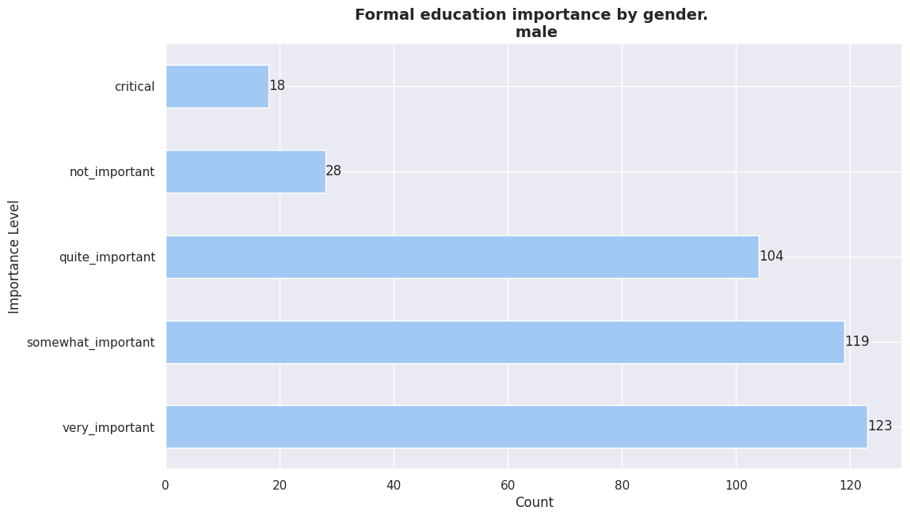  
 
  

  
    
  

  
 
  

  
 

  

## **Education vs gender**   
   
  

  
 
  

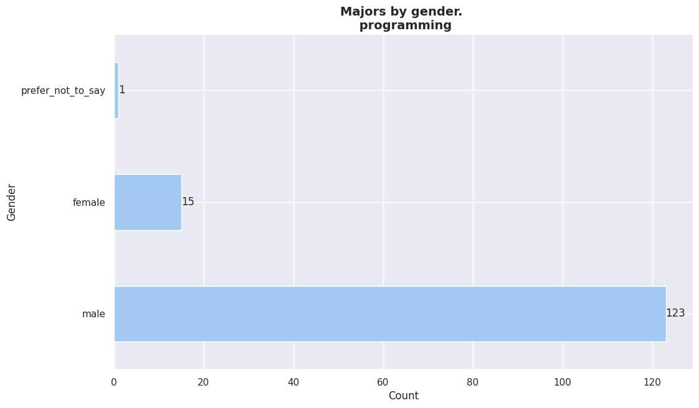  
 
  

  
 
  

  
 
  

  
 
  

  
 
  

  
 
  

  
 
  

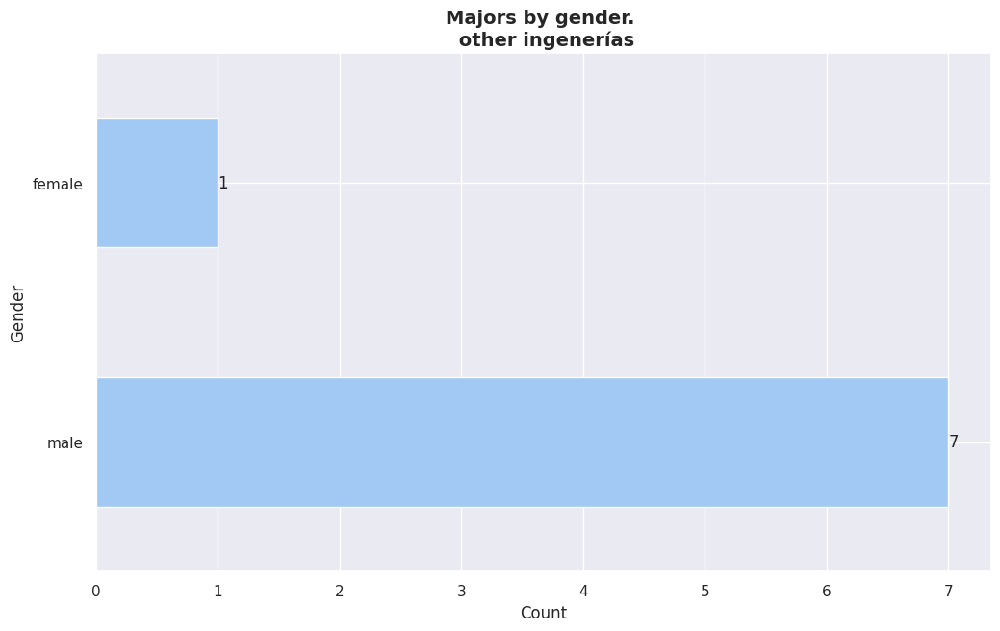  
 
  

  
 
  

 
  
  

  
 
  

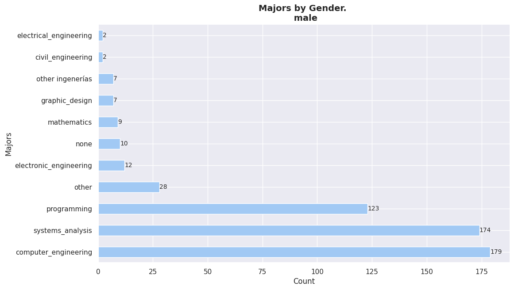  
 
  

  
 

        

    

| category             | count |
| :------------------- | ----: |
| systems_analysis     |    28 |
| programming          |    15 |
| computer_engineering |    14 |
| other                |    10 |
| mathematics          |     2 |
| graphic_design       |     2 |
| none                 |     1 |
| other ingenerías     |     1 |

<em>Majors total count by gender. 

(female)
</em>

 

        

    

| category               | count |
| :--------------------- | ----: |
| computer_engineering   |   179 |
| systems_analysis       |   174 |
| programming            |   123 |
| other                  |    28 |
| electronic_engineering |    12 |
| none                   |    10 |
| mathematics            |     9 |
| graphic_design         |     7 |
| other ingenerías       |     7 |
| civil_engineering      |     2 |

<em>Majors total count by gender. 
 
(male)
</em>

 

     

    

| category             | count |
| :------------------- | ----: |
| computer_engineering |     2 |
| programming          |     1 |
| systems_analysis     |     1 |
| other                |     1 |

<em>Majors total count by gender. 
 
(prefer_not_to_say)
</em>

 

<!--
============================================
MAJOR==================      computer_engineering
gender
male      98
female    10
Name: count, dtype: int64

============================================
MAJOR==================      programming
gender
male      9
female    2
Name: count, dtype: int64

============================================
MAJOR==================      systems_analysis
gender
male      72
female    15
Name: count, dtype: int64

-->

  

 
 

  

## **Education vs age**   

  

   
   
  

   
   
  

   

  

   

  

   

  

   

  

   

  

   

  

   

  

   

  

  
 

  

## **Education vs AI_replace_dev**

<!-- Start IA comment -->
 

 <!-- Comment title. -->
 
 
   
Will AI Replace Devs?
 

 <!-- Ends title. -->
   <!-- Start comment body. -->
 

<h1>Will AI Replace Devs?</h1>

The short answer is: <b>not entirely, at least not in the near future</b>. While AI is rapidly advancing and capable of performing tasks once thought exclusive to humans, it's essential to understand its limitations and the complementary roles AI and developers will play.

<h2>AI as a Tool, Not a Replacement</h2>
<ul>
<li><strong>Augmentation, not Replacement:</strong> AI is more likely to augment developer capabilities than replace them. It can automate repetitive tasks, generate code snippets, and assist in debugging, freeing up developers to focus on higher-level problem-solving and creativity.</li>
<li><strong>Human Element:</strong> AI lacks the ability to fully understand complex problem domains, think critically about abstract concepts, and exhibit creativity in the same way humans do. These qualities are essential for developing innovative software solutions.</li>
<li><strong>Ethical Considerations:</strong> AI systems are built by humans and reflect societal biases. Developers will be crucial in ensuring AI systems are developed and used ethically.</li>
</ul>

<h2>The Future of Work</h2>
<ul>
<li><strong>Shift in Skillset:</strong> Developers will need to adapt their skill sets to work effectively with AI tools. This includes understanding AI concepts, being able to evaluate AI-generated outputs, and developing prompts for AI systems.</li>
<li><strong>New Roles:</strong> The rise of AI will likely create new roles such as AI trainers, prompt engineers, and AI ethics specialists.</li>
<li><strong>Increased Demand for Developers:</strong> As AI becomes more integrated into various industries, the demand for developers who can build and maintain AI systems is expected to grow.</li>
</ul>

In conclusion, while AI will undoubtedly change the landscape of
software development, it's more likely to be a powerful tool that enhances
developer productivity rather than a replacement. The future of software
development will likely involve a collaborative relationship between humans and
AI.

<h2>References</h2>
<strong>Gartner:</strong> Known for its technology predictions and insights, Gartner often publishes reports on the impact of AI on the workforce.        
<strong>McKinsey Global Institute:</strong> Provides in-depth analysis on the economic impact of AI and automation.                                      
<strong>World Economic Forum:</strong> Offers reports on the future of work and the skills needed for the workforce of tomorrow.                         

<!-- End BODY comment -->

<!-- End IA comment -->
 

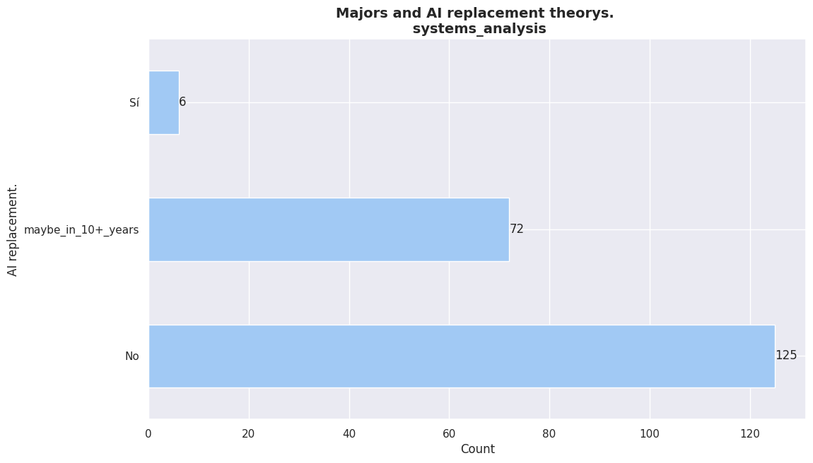   

  

   

  

   

  

   

  

   

  

   

  

   

  

   

  

   

  

   

  

  

  

## **Education vs layoffs_23_24**

  

<!-- Start IA comment -->
 

 <!-- Comment title. -->
 
 
   
IT Layoffs in 2023 and 2024
 

 <!-- Ends title. -->
   <!-- Start comment body. -->
 

<h1>IT Layoffs in 2023 and 2024</h1>

The IT industry, once a bastion of job security, has experienced a wave of
layoffs in recent years. The trend accelerated in 2023 and has continued into
2024.

<h2>Key Statistics</h2>
<ul>
<li><strong>Over 340,000 tech jobs cut:</strong> Combined figures for 2023 and 2024 indicate a substantial number of layoffs within the tech sector.</li>
<li><strong>Major Tech Companies Affected:</strong> High-profile tech giants such as Meta, Amazon, Google, Microsoft, and Salesforce have implemented significant workforce reductions.</li>
<li><strong>Economic Uncertainty and AI:</strong> Contributing factors to these layoffs include economic uncertainty, overhiring during the pandemic, and rapid advancements in AI technology.</li>
</ul>

<h2>Impact on the Industry</h2>

These layoffs have had a ripple effect on the IT job market, leading to
increased competition for available positions and a shift in hiring priorities.
Companies are focusing on hiring candidates with specific skill sets, such as
AI, data science, and cloud computing, while reducing headcount in other
areas.

<h2>Looking Ahead</h2> 
While the situation remains fluid, experts predict
that the pace of layoffs may slow down in the latter part of 2024. However, the
IT industry is likely to undergo a period of transformation as companies adapt
to new technological advancements and economic conditions.

<strong>It's important to note that these statistics primarily reflect the
situation in the United States and other developed economies.</strong> The impact of
layoffs on the IT industry in South America might vary due to regional economic
conditions and the stage of digital development.

<strong>While specific data for South America might be limited, it's
reasonable to assume that the global trend of IT layoffs has had some influence
on the region.</strong>

<strong>Would you like to explore the impact of these layoffs on a specific
country or region?</strong>

<h2>References</h2>
<strong>Crunchbase News:</strong> <a href="https://news.crunchbase.com/startups/tech-layoffs/">https://news.crunchbase.com/startups/tech-layoffs/</a>       
<strong>Techopedia:</strong> <a href="https://www.techopedia.com/tech-layoffs-predictions">https://www.techopedia.com/tech-layoffs-predictions </a>      
 

 
<!-- End BODY comment -->
 

 <!-- End IA comment -->
 

  
 
  

  
    
  

  
 
  

  
 
  

  
 
  

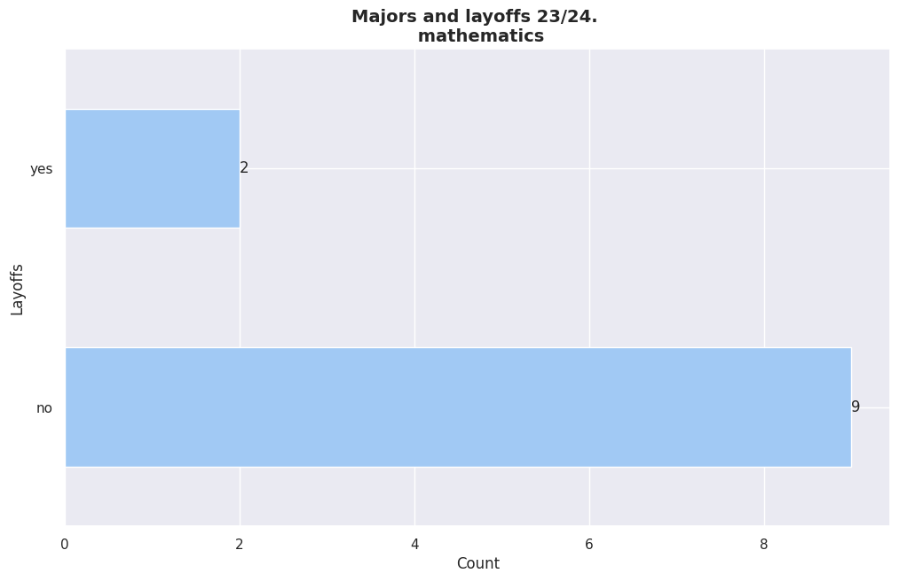  
 
  

  
 
  

  
 
  

  
 
  

  
 
  

 
  

[Go Back](../../intro/#topic_index)

