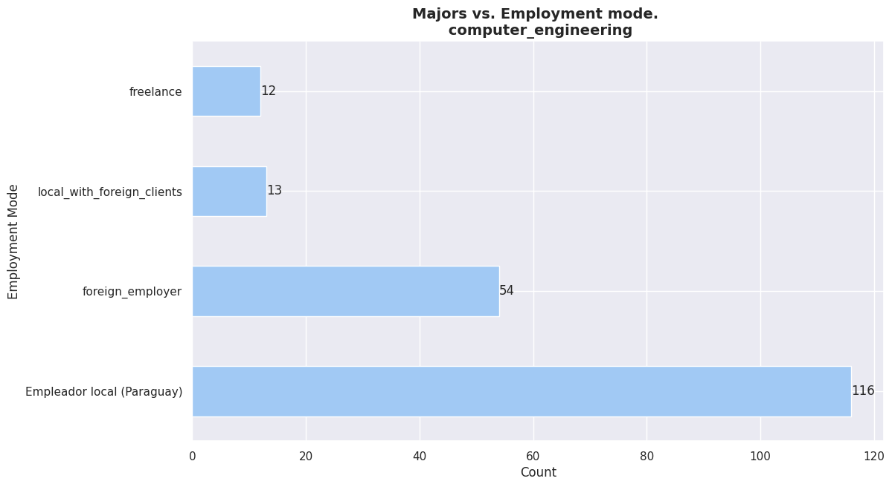
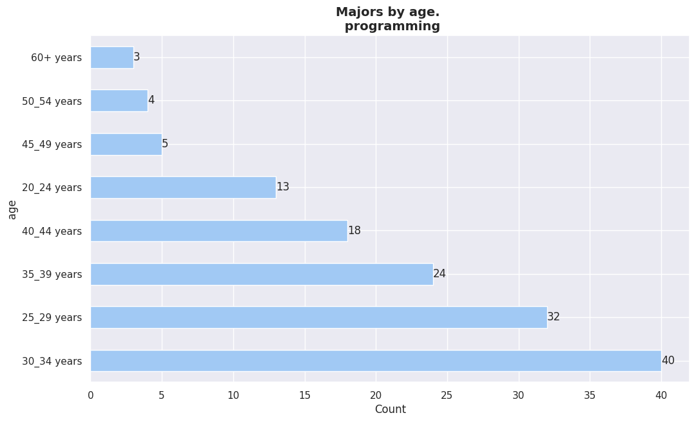
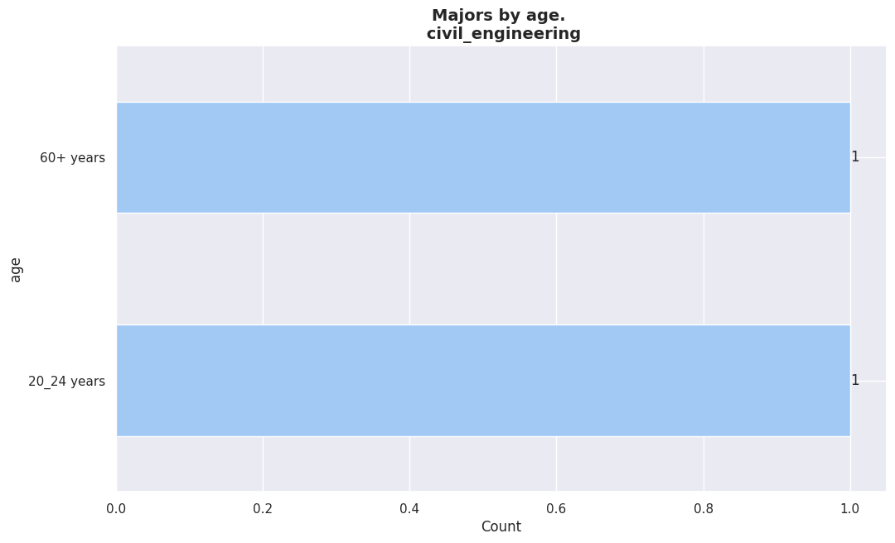
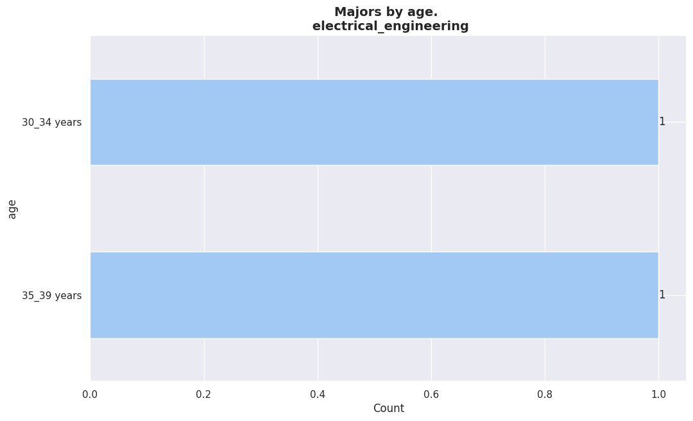
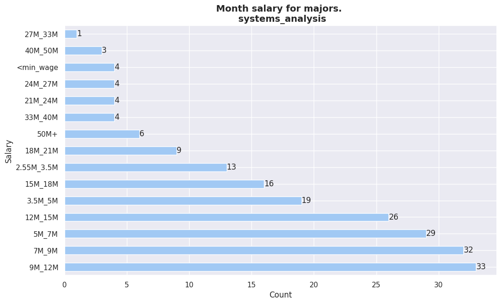
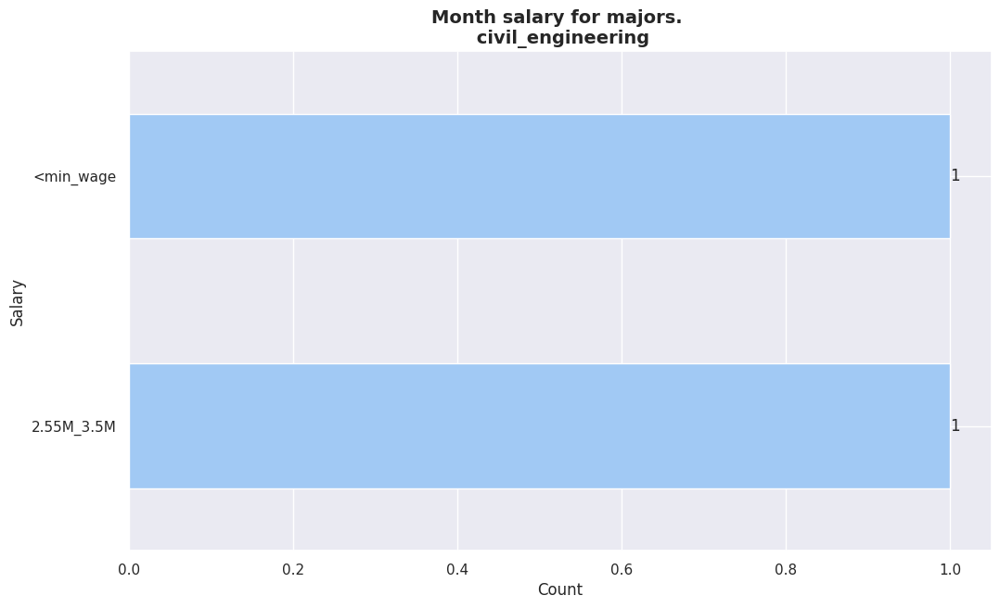

```python
#######################
# CONFIG ZONE
#######################

# Importing Libs
import pandas as pd
import seaborn as sns

import matplotlib.pyplot as plt

from collections import Counter
import numpy as np

# My Tools
import milanesas.eda_helper as eh
from tools.helpers import (
    get_column_uniques,
    get_column_uniques_count,
    plot_grouped_by_category_barh_charts,
    barh_chart_unique_values,
    print_unique_normalized_values_by_group,
    make_horizontal_grouped_chart,
    make_vertical_grouped_chart,
    grouped_grid_pie_chart,
    grouped_grid_barh_chart,
    create_grouped_dataframe_list,
)


%matplotlib inline

# Reseting figure size params.
plt.rcParams["figure.figsize"] = [12, 7]
# Setting seaborn as default plotting lib.
sns.set()
sns.set_palette("pastel")
```


```python
df = pd.read_csv("../data/data_fixed.csv")
```


```python
df = df.drop("Unnamed: 0", axis=1)
df.columns
```


    Index(['work_mode', 'employment_mode', 'role', 'prog_skills_in_role',
           'code_for_job', 'IT_exp', 'prof_prog_exp', 'first_code',
           'assigned_seniority', 'self_assessed_seniority', 'formal_edu', 'majors',
           'formal_edu_importance', 'gender', 'age', 'monthly_salary',
           'pro_languages', 'web_frameworks', 'other_tools', 'databases',
           'platforms', 'fav_language', 'least_fav_language', 'fav_framework',
           'least_fav_framework', 'tools', 'use_AI_tools', 'AI_replace_dev',
           'layoffs_23_24', 'working_now', 'unemployed_duration', 'same_role',
           'current_vs_prev_salary'],
          dtype='object')


# Education
- In this section we explore the "educational" aspect of the data with special enphasis in the inpact on the IT world of the paraguayan profesionals.


```python
get_column_uniques(df, "majors")
```


    ['systems_analysis',
     'programming',
     'computer_engineering',
     'electronic_engineering',
     'graphic_design',
     'mathematics',
     'none',
     'other',
     'other ingenerías',
     'civil_engineering',
     'electrical_engineering']


- Se puede ver que existe un numero muuy reducido de accrearas representadas.


```python
type(df["majors"].value_counts())
```


    pandas.core.series.Series


```python
# Get the unique counts
value_counts = get_column_uniques_count(df, "majors")

# Plot the horizontal bar chart
ax = value_counts.plot(kind="barh", title="Majors count.")

# Annotate the bars with the counts
for index, value in enumerate(value_counts):
    ax.text(value, index, str(value), va="center")

# Show the plot
plt.show()
```


    

    


Las carreras con **mayor representacion** entre los encuestados son:

+ Programming
+ CS Engineering
+ Systems analysis

Entre estas 3 carreras se ditribuye mas del 50% de los encuestados. Siendo **systems analysis** la carrera con mas representacion.


```python
get_column_uniques_count(df, "majors")
```


    majors
    systems_analysis          203
    computer_engineering      195
    programming               139
    other                      39
    electronic_engineering     12
    mathematics                11
    none                       11
    graphic_design              9
    other ingenerías            8
    civil_engineering           2
    electrical_engineering      2
    Name: count, dtype: int64


```python
majors_list = ["systems_analysis", "computer_engineering", "programming"]
```


```python
# Comparative chart for gender and majors.
majors_df = [df[df["majors"] == i] for i in majors_list]


# Grouping by 'column_name'
grouped_df = create_grouped_dataframe_list(majors_df, "majors")
print(grouped_df.groups.keys())
```

    dict_keys(['computer_engineering', 'programming', 'systems_analysis'])


```python
gender_group = df.groupby("gender")
```

## Education vs work_mode


```python
barh_chart_unique_values(df, "majors", "work_mode", "Work mode by majors.", "Work Mode")
```


    

    


    

    


    

    


    

    


    

    


    

    


    

    


    

    


    

    


    

    


    

    


```python
print_unique_normalized_values_by_group(
    df, "majors", "work_mode", "Work mode by majors."
)
```

    Work mode by majors. - systems_analysis
    ====================
    work_mode
    onsite     38%
    remote     30%
    Hibrído    30%
    none        0%
    Name: proportion, dtype: object
    
    
    
    
    Work mode by majors. - programming, systems_analysis, computer_engineering, electronic_engineering, graphic_design
    ====================
    work_mode
    onsite    100%
    Name: proportion, dtype: object
    
    
    
    
    Work mode by majors. - programming
    ====================
    work_mode
    onsite     38%
    remote     30%
    Hibrído    29%
    none        1%
    Name: proportion, dtype: object
    
    
    
    
    Work mode by majors. - programming, computer_engineering
    ====================
    work_mode
    remote     52%
    onsite     30%
    Hibrído    17%
    Name: proportion, dtype: object
    
    
    
    
    Work mode by majors. - programming, systems_analysis, computer_engineering, mathematics
    ====================
    work_mode
    remote     50%
    Hibrído    25%
    onsite     25%
    Name: proportion, dtype: object
    
    
    
    
    Work mode by majors. - systems_analysis, computer_engineering
    ====================
    work_mode
    remote     41%
    onsite     30%
    Hibrído    27%
    Name: proportion, dtype: object
    
    
    
    
    Work mode by majors. - programming, systems_analysis
    ====================
    work_mode
    onsite     42%
    Hibrído    36%
    remote     19%
    none        1%
    Name: proportion, dtype: object
    
    
    
    
    Work mode by majors. - electronic_engineering
    ====================
    work_mode
    remote     58%
    onsite     25%
    Hibrído    16%
    Name: proportion, dtype: object
    
    
    
    
    Work mode by majors. - computer_engineering
    ====================
    work_mode
    remote     46%
    onsite     30%
    Hibrído    22%
    none        1%
    Name: proportion, dtype: object
    
    
    
    
    Work mode by majors. - programming, systems_analysis, computer_engineering
    ====================
    work_mode
    Hibrído    38%
    onsite     30%
    remote     30%
    Name: proportion, dtype: object
    
    
    
    
    Work mode by majors. - none
    ====================
    work_mode
    Hibrído    45%
    remote     27%
    onsite     18%
    none        9%
    Name: proportion, dtype: object
    
    
    
    
    Work mode by majors. - computer_engineering, other
    ====================
    work_mode
    remote    81%
    onsite    18%
    Name: proportion, dtype: object
    
    
    
    
    Work mode by majors. - systems_analysis, computer_engineering, other ingenerías
    ====================
    work_mode
    remote    100%
    Name: proportion, dtype: object
    
    
    
    
    Work mode by majors. - other ingenerías
    ====================
    work_mode
    onsite     50%
    remote     37%
    Hibrído    12%
    Name: proportion, dtype: object
    
    
    
    
    Work mode by majors. - programming, systems_analysis, computer_engineering, other ingenerías
    ====================
    work_mode
    remote    100%
    Name: proportion, dtype: object
    
    
    
    
    Work mode by majors. - programming, other
    ====================
    work_mode
    remote    60%
    onsite    20%
    none      20%
    Name: proportion, dtype: object
    
    
    
    
    Work mode by majors. - other
    ====================
    work_mode
    remote     51%
    onsite     35%
    Hibrído    11%
    none        2%
    Name: proportion, dtype: object
    
    
    
    
    Work mode by majors. - systems_analysis, computer_engineering, other
    ====================
    work_mode
    remote    100%
    Name: proportion, dtype: object
    
    
    
    
    Work mode by majors. - programming, systems_analysis, computer_engineering, mathematics, other
    ====================
    work_mode
    remote    50%
    onsite    50%
    Name: proportion, dtype: object
    
    
    
    
    Work mode by majors. - programming, graphic_design, other
    ====================
    work_mode
    remote     50%
    Hibrído    50%
    Name: proportion, dtype: object
    
    
    
    
    Work mode by majors. - programming, systems_analysis, other
    ====================
    work_mode
    onsite     83%
    Hibrído    16%
    Name: proportion, dtype: object
    
    
    
    
    Work mode by majors. - programming, other ingenerías
    ====================
    work_mode
    onsite    100%
    Name: proportion, dtype: object
    
    
    
    
    Work mode by majors. - systems_analysis, civil_engineering
    ====================
    work_mode
    onsite    50%
    none      50%
    Name: proportion, dtype: object
    
    
    
    
    Work mode by majors. - mathematics, none
    ====================
    work_mode
    remote    100%
    Name: proportion, dtype: object
    
    
    
    
    Work mode by majors. - computer_engineering, mathematics
    ====================
    work_mode
    Hibrído    40%
    remote     40%
    onsite     20%
    Name: proportion, dtype: object
    
    
    
    
    Work mode by majors. - graphic_design
    ====================
    work_mode
    Hibrído    66%
    onsite     22%
    remote     11%
    Name: proportion, dtype: object
    
    
    
    
    Work mode by majors. - programming, computer_engineering, other
    ====================
    work_mode
    remote    100%
    Name: proportion, dtype: object
    
    
    
    
    Work mode by majors. - programming, systems_analysis, graphic_design
    ====================
    work_mode
    Hibrído    75%
    onsite     25%
    Name: proportion, dtype: object
    
    
    
    
    Work mode by majors. - programming, systems_analysis, electronic_engineering, other ingenerías, other
    ====================
    work_mode
    onsite    100%
    Name: proportion, dtype: object
    
    
    
    
    Work mode by majors. - other ingenerías, other
    ====================
    work_mode
    onsite    100%
    Name: proportion, dtype: object
    
    
    
    
    Work mode by majors. - programming, systems_analysis, computer_engineering, other
    ====================
    work_mode
    remote    100%
    Name: proportion, dtype: object
    
    
    
    
    Work mode by majors. - programming, systems_analysis, mathematics
    ====================
    work_mode
    onsite     50%
    Hibrído    25%
    remote     25%
    Name: proportion, dtype: object
    
    
    
    
    Work mode by majors. - programming, electronic_engineering, other
    ====================
    work_mode
    remote    100%
    Name: proportion, dtype: object
    
    
    
    
    Work mode by majors. - programming, systems_analysis, computer_engineering, electrical_engineering
    ====================
    work_mode
    remote    100%
    Name: proportion, dtype: object
    
    
    
    
    Work mode by majors. - electrical_engineering
    ====================
    work_mode
    remote    50%
    onsite    50%
    Name: proportion, dtype: object
    
    
    
    
    Work mode by majors. - programming, electronic_engineering, mathematics
    ====================
    work_mode
    onsite    100%
    Name: proportion, dtype: object
    
    
    
    
    Work mode by majors. - programming, systems_analysis, civil_engineering
    ====================
    work_mode
    none    100%
    Name: proportion, dtype: object
    
    
    
    
    Work mode by majors. - programming, systems_analysis, computer_engineering, graphic_design
    ====================
    work_mode
    Hibrído    100%
    Name: proportion, dtype: object
    
    
    
    
    Work mode by majors. - programming, systems_analysis, mathematics, other
    ====================
    work_mode
    onsite    100%
    Name: proportion, dtype: object
    
    
    
    
    Work mode by majors. - programming, systems_analysis, electronic_engineering
    ====================
    work_mode
    onsite    50%
    remote    50%
    Name: proportion, dtype: object
    
    
    
    


## Education vs employment_mode


```python
barh_chart_unique_values(
    df, "majors", "employment_mode", "Majors vs. Employment mode.", "Employment Mode"
)
```


    

    


    

    


    

    


    

    


    

    


    

    


    

    


    

    


    

    


    

    


    

    


## Education vs IT_exp


```python
barh_chart_unique_values(
    df, "majors", "IT_exp", "Majors and IT experience.", "Years of experience."
)
```


    

    


    

    


    

    


    

    


    

    


    

    


    

    


    

    


    

    


    

    


    

    


## Education vs first_code


```python
barh_chart_unique_values(
    df,
    "majors",
    "first_code",
    "Majors and first line of code.",
    "First line of code. \n(Aproximated age.)",
)
```


    

    


    

    


    

    


    

    


    

    


    

    


    

    


    

    


    

    


    

    


    

    


## Education vs assigned_seniority


```python
barh_chart_unique_values(
    df,
    "majors",
    "assigned_seniority",
    "Asigned seniority for: ",
    "Asigned seniority.",
)
```


    

    


    

    


    

    


    

    


    

    


    

    


    

    


    

    


    

    


    

    


    

    


En la mayoria de los casos, segun la carrera elegida por los encuestados, 
se puede observar que la mayoria posee un seniority de **"senior"**.

## Education vs self_assessed_seniority


```python
barh_chart_unique_values(
    df,
    "majors",
    "self_assessed_seniority",
    "Self assessed seniority by majors.",
    "Self assessed seniority.",
)
```


    

    


    

    


    

    


    

    


    

    


    

    


    

    


    

    


    

    


    

    


    

    


```python
df.columns
```


    Index(['work_mode', 'employment_mode', 'role', 'prog_skills_in_role',
           'code_for_job', 'IT_exp', 'prof_prog_exp', 'first_code',
           'assigned_seniority', 'self_assessed_seniority', 'formal_edu', 'majors',
           'formal_edu_importance', 'gender', 'age', 'monthly_salary',
           'pro_languages', 'web_frameworks', 'other_tools', 'databases',
           'platforms', 'fav_language', 'least_fav_language', 'fav_framework',
           'least_fav_framework', 'tools', 'use_AI_tools', 'AI_replace_dev',
           'layoffs_23_24', 'working_now', 'unemployed_duration', 'same_role',
           'current_vs_prev_salary'],
          dtype='object')


```python

```


```python

```

## Education vs formal_edu


```python
gender_groups = df.groupby("gender")
```


```python
barh_chart_unique_values(
    df,
    "majors",
    "formal_edu",
    "Majors vs. formal education.",
    "Importance level.",
)
```


    

    


    

    


    

    


    

    


    

    


    

    


    

    


    

    


    

    


    

    


    

    


## Education vs formal_edu_importance


```python
df.columns
```


    Index(['work_mode', 'employment_mode', 'role', 'prog_skills_in_role',
           'code_for_job', 'IT_exp', 'prof_prog_exp', 'first_code',
           'assigned_seniority', 'self_assessed_seniority', 'formal_edu', 'majors',
           'formal_edu_importance', 'gender', 'age', 'monthly_salary',
           'pro_languages', 'web_frameworks', 'other_tools', 'databases',
           'platforms', 'fav_language', 'least_fav_language', 'fav_framework',
           'least_fav_framework', 'tools', 'use_AI_tools', 'AI_replace_dev',
           'layoffs_23_24', 'working_now', 'unemployed_duration', 'same_role',
           'current_vs_prev_salary'],
          dtype='object')


```python
get_column_uniques(df,'formal_edu')
```


    ['doctorate', 'Degree', 'high_school', 'master']


```python
# Formal education by gender.
barh_chart_unique_values(
    df, 
    "gender",
    "formal_edu",
    "Formal education by gender.",
    "Gender"
)
```


    

    


    

    


    

    


```python
print_unique_normalized_values_by_group(
    df, "gender", "formal_edu", "Formal education by gender."
)
```

    Formal education by gender. - male
    ====================
    formal_edu
    Degree         62%
    high_school    30%
    master          7%
    doctorate       0%
    Name: proportion, dtype: object
    
    
    
    
    Formal education by gender. - female
    ====================
    formal_edu
    Degree         78%
    high_school    14%
    master          6%
    Name: proportion, dtype: object
    
    
    
    
    Formal education by gender. - prefer_not_to_say
    ====================
    formal_edu
    Degree         50%
    high_school    50%
    Name: proportion, dtype: object
    
    
    
    


```python
# Formal education importance by gender.
barh_chart_unique_values(
    df,
    "gender",
    "formal_edu_importance",
    "Formal education importance by gender.",
    "Importance Level",
)
```


    

    


    

    


    

    


```python
group_config = {
    "title": "Formal education importance. \n (male vs. females)",
    "c1_label": "MAN",
    "c2_label": "WOMAN",
    "xlabel": "Count",
    "ylabel": "formal_edu_importance level",
}

make_horizontal_grouped_chart(
    df,
    gender_group.get_group("male"),
    gender_group.get_group("female"),
    "formal_edu_importance",
    df["formal_edu_importance"].unique(),
    group_config,
)
```


    

    


```python
get_column_uniques(df, "formal_edu_importance")
```


    ['quite_important',
     'critical',
     'somewhat_important',
     'very_important',
     'not_important']


## Education vs gender


```python
gender_group.groups.keys()
```


    dict_keys(['female', 'male', 'prefer_not_to_say'])


```python
barh_chart_unique_values(df, "majors", "gender", "Majors by gender.", "Gender")
```


    

    


    

    


    

    


    

    


    

    


    

    


    

    


    

    


    

    


    

    


    

    


```python
plot_grouped_by_category_barh_charts(
    gender_groups, "majors", "Majors by Gender.", "Majors"
)
```


    

    


    

    


    

    


```python
for i in gender_groups.groups.keys():
    print("GENDER -> ", i)
    c = gender_groups.get_group(i)
    print(get_column_uniques_count(c, "majors"))
    print("\n" * 4)
```

    GENDER ->  female
    majors
    systems_analysis        28
    programming             15
    computer_engineering    14
    other                   10
    mathematics              2
    graphic_design           2
    none                     1
    other ingenerías         1
    Name: count, dtype: int64
    
    
    
    
    
    GENDER ->  male
    majors
    computer_engineering      179
    systems_analysis          174
    programming               123
    other                      28
    electronic_engineering     12
    none                       10
    mathematics                 9
    graphic_design              7
    other ingenerías            7
    civil_engineering           2
    electrical_engineering      2
    Name: count, dtype: int64
    
    
    
    
    
    GENDER ->  prefer_not_to_say
    majors
    computer_engineering    2
    programming             1
    systems_analysis        1
    other                   1
    Name: count, dtype: int64
    
    
    
    
    


```python
for i in grouped_df.groups.keys():
    d = grouped_df.get_group(i)["gender"].value_counts()
    print("=" * 44)
    print("MAJOR --> ", i)
    print(d)
    print("\n" * 3)
```

    ============================================
    MAJOR -->  computer_engineering
    gender
    male      98
    female    10
    Name: count, dtype: int64
    
    
    
    
    ============================================
    MAJOR -->  programming
    gender
    male      9
    female    2
    Name: count, dtype: int64
    
    
    
    
    ============================================
    MAJOR -->  systems_analysis
    gender
    male      72
    female    15
    Name: count, dtype: int64
    
    
    
    


```python
# Defining color for bars
color_neutro_dark = "gray"  # Assuming a color definition for demonstration

# Function call
grouped_grid_barh_chart(
    grouped_df,
    "gender",
    "Majors by gender. \n (Common majors only.)",
    3,
    1,
    color_neutro_dark,
)
```


    

    


## Education vs age


```python
barh_chart_unique_values(df, "majors", "age", "Majors by age.", "age")
```


    

    


    

    


    

    


    

    


    

    


    

    


    

    


    

    


    

    


    

    


    

    


```python

```

## Education vs monthly_salary


```python
barh_chart_unique_values(
    df, 
    "majors",
    "monthly_salary",
    "Month salary for majors.",
    "Salary"
)
```


    

    


    

    


    

    


    

    


    

    


    

    


    

    


    

    


    

    


    

    


    

    


## Education vs AI_replace_dev


```python
get_column_uniques(df, "AI_replace_dev")
```


    ['No', 'maybe_in_10+_years', 'Sí']


```python
barh_chart_unique_values(
    df,
    "majors",
    "AI_replace_dev",
    "Majors and AI replacement theorys.",
    "AI replacement.",
)
```


    

    


    

    


    

    


    

    


    

    


    

    


    

    


    

    


    

    


    

    


    

    


## Education vs layoffs_23_24


```python
barh_chart_unique_values(
    df, 
    "majors",
    "layoffs_23_24",
    "Majors and layoffs 23/24.",
    "Layoffs"
)
```


    

    


    

    


    

    


    

    


    

    


    

    


    

    


    

    


    

    


    

    


    

    


```python

```


```python

```


```python

```


```python

```


```python

```
