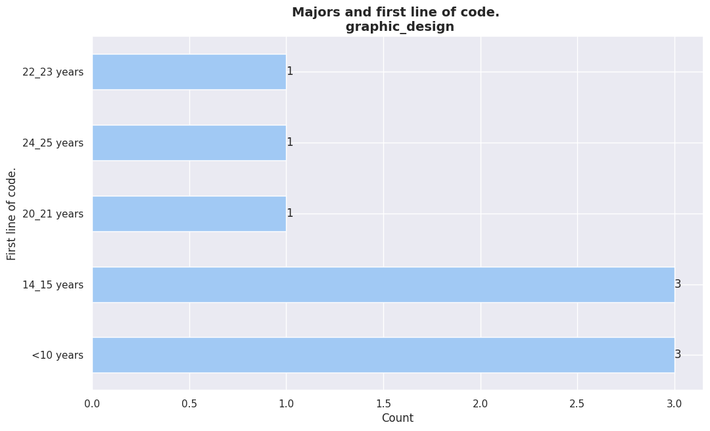
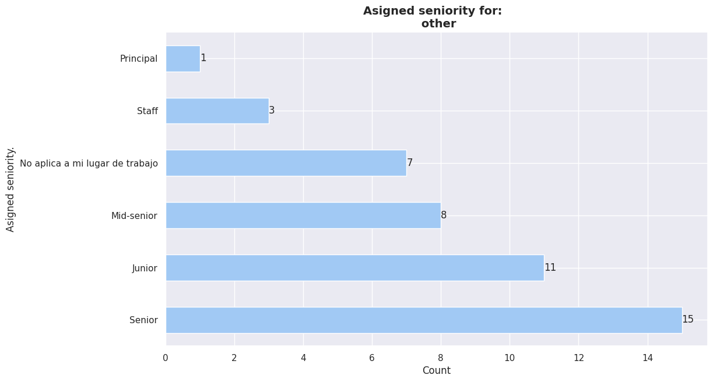
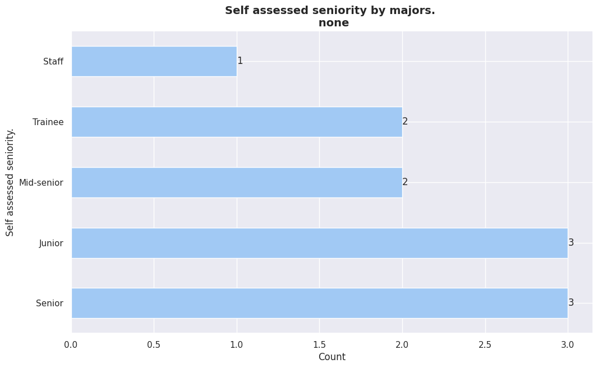
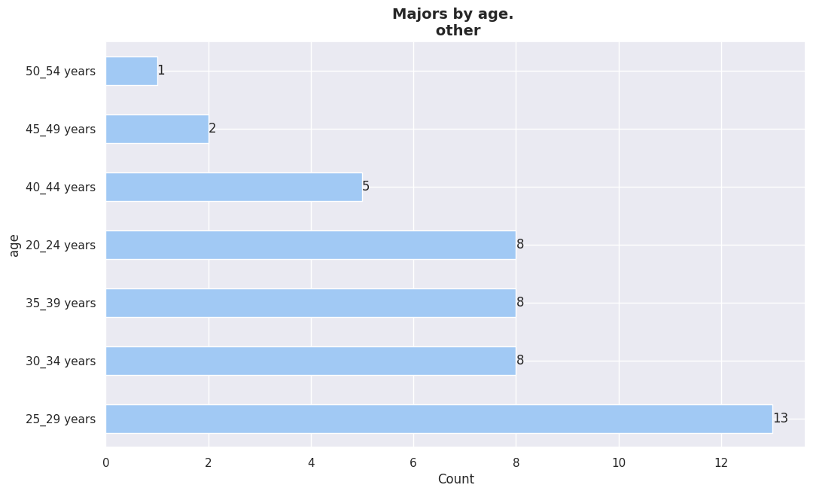
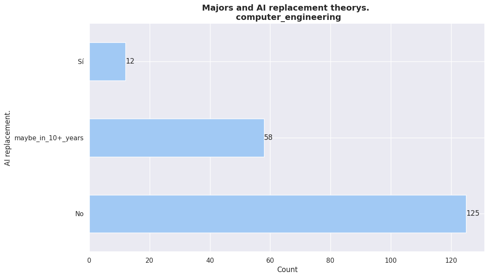

# Education

In this section we explore the "educational" aspect of the data with special
enphasis in the inpact on the IT world of the paraguayan profesionals.

- 'systems_analysis'
- 'programming'
- 'computer_engineering'
- 'electronic_engineering'
- 'graphic_design'
- 'mathematics'
- 'none'
- 'other'
- 'other ingenerías'
- 'civil_engineering'
- 'electrical_engineering'

* Se puede ver que existe un numero muuy reducido de accrearas representadas.

 

        

Las carreras con **mayor representacion** entre los encuestados son:

- Programming
- CS Engineering
- Systems analysis

Entre estas 3 carreras se ditribuye mas del 50% de los encuestados. Siendo
**systems analysis** la carrera con mas representacion.

     

        
     
     
    

        

| category               | count |
| :--------------------- | ----: |
| systems_analysis       |   203 |
| computer_engineering   |   195 |
| programming            |   139 |
| other                  |    39 |
| electronic_engineering |    12 |
| mathematics            |    11 |
| none                   |    11 |
| graphic_design         |     9 |
| other ingenerías       |     8 |
| civil_engineering      |     2 |

 

<em>Majors total count.</em>

  

## Education vs work_mode

  

    
      
  

    
   
  

    
   
  

    

  

    

  

    

  

    

  

    

  

    

  

    

  

   
 

     

  

| Category                                            | Percentage |
| --------------------------------------------------- | ---------- |
| computer_engineering                                | 32%        |
| systems_analysis                                    | 19%        |
| programming, computer_engineering                   | 6%         |
| systems_analysis, computer_engineering              | 5%         |
| programming                                         | 4%         |
| programming, systems_analysis                       | 3%         |
| programming, systems_analysis, computer_engineering | 3%         |
| electronic_engineering                              | 3%         |
| computer_engineering, other                         | 3%         |
| systems_analysis, computer_engineering, other       | 1%         |
| programming, other                                  | 1%         |
| other                                               | 1%         |
| programming, computer_engineering, other            | 1%         |
| none                                                | 1%         |

<em>Majors by work mode. 

(remote)
</em>

    

 

| Category                                            | Percentage |
| --------------------------------------------------- | ---------- |
| computer_engineering                                | 24%        |
| systems_analysis                                    | 23%        |
| programming, systems_analysis                       | 15%        |
| programming, systems_analysis, computer_engineering | 6%         |
| programming, computer_engineering                   | 5%         |
| systems_analysis, computer_engineering              | 4%         |
| programming, systems_analysis, other                | 3%         |
| computer_engineering, other                         | 2%         |
| programming                                         | 2%         |
| none                                                | 1%         |
| other                                               | 1%         |

<em>Majors by work mode. 

(onsite)
</em>

 

     

 

| Category                                            | Percentage |
| --------------------------------------------------- | ---------- |
| systems_analysis                                    | 24%        |
| computer_engineering                                | 23%        |
| programming, systems_analysis                       | 15%        |
| programming, systems_analysis, computer_engineering | 11%        |
| none                                                | 4%         |
| programming, computer_engineering                   | 3%         |
| programming, systems_analysis, graphic_design       | 2%         |
| other                                               | 1%         |
| electronic_engineering                              | 1%         |

<em>Majors by work mode. 

(Hibrído)
</em>

 

     

 

| Category                                         | Percentage |
| ------------------------------------------------ | ---------- |
| computer_engineering                             | 33%        |
| none                                             | 16%        |
| systems_analysis                                 | 16%        |
| programming, other                               | 16%        |
| programming, systems_analysis, civil_engineering | 16%        |

<em>Majors by work mode. 

(none)
</em>

 

  

## Education vs employment_mode

  

    
   
  

    

  

    

  

    

  

    

  

    

  

    

  

    

  

    

  

    

  

   
 

  

## Education vs IT_exp

  

  
 
  

  
 
  

  
 
  

  
 
  

  
 
  

  
 
  

  
 
  

  
 
  

  
 
  

  
 
  

 
  

  

## Education vs first_code

  

   
   
  

   

  

   

  

   

  

   

  

   

  

   

  

   

  

   

  

   

  

  
 

  

## Education vs assigned_seniority

  

   
 
  

   
    
  

   
 
  

   
 
  

   
 
  

   
 
  

   
 
  

   
 
  

   
 
  

   
 
  

  
  

En la mayoria de los casos, segun la carrera elegida por los encuestados,
se puede observar que la mayoria posee un seniority de **"senior"**.

  

## Education vs self_assessed_seniority

  

  
 
  

  
    
  

  
    
  

  
 
  

  
 
  

  
 
  

  
 
  

  
 
  

  
 
  

  
 
  

 
  

  

## Education vs formal_edu

  

   
   
  

   

  

   

  

   

  

   

  

   

  

   

  

   

  

   

  

   

  

  
 

  

## Education vs formal_edu_importance

  

  
 
  

  
 
  

  
 

        

    

| Category    | Percentage |
| ----------- | ---------- |
| Degree      | 60%        |
| high_school | 32%        |
| master      | 7%         |
| doctorate   | 0%         |

<em>Formal education by gender. 

(male)
</em>

 

        

    

| Category    | Percentage |
| ----------- | ---------- |
| Degree      | 78%        |
| high_school | 14%        |
| master      | 6%         |

<em>Formal education by gender. 

(female)
</em>

 

        

    

| Category    | Percentage |
| ----------- | ---------- |
| Degree      | 50%        |
| high_school | 50%        |

<em>Formal education by gender. 

(prefer_not_to_say)
</em>

 

  

  
 
  

  
    
  

  
 
  

  
 

  

## Education vs gender

  

  
 
  

  
 
  

  
 
  

  
 
  

  
 
  

  
 
  

  
 
  

  
 
  

  
 
  

  
 
  

 
  
  

  
 
  

  
 
  

  
 

        

    

| category             | count |
| :------------------- | ----: |
| systems_analysis     |    28 |
| programming          |    15 |
| computer_engineering |    14 |
| other                |    10 |
| mathematics          |     2 |
| graphic_design       |     2 |
| none                 |     1 |
| other ingenerías     |     1 |

<em>Majors total count by gender. 

(female)
</em>

 

        

    

| category               | count |
| :--------------------- | ----: |
| computer_engineering   |   179 |
| systems_analysis       |   174 |
| programming            |   123 |
| other                  |    28 |
| electronic_engineering |    12 |
| none                   |    10 |
| mathematics            |     9 |
| graphic_design         |     7 |
| other ingenerías       |     7 |
| civil_engineering      |     2 |

<em>Majors total count by gender. 
 
(male)
</em>

 

     

    

| category             | count |
| :------------------- | ----: |
| computer_engineering |     2 |
| programming          |     1 |
| systems_analysis     |     1 |
| other                |     1 |

<em>Majors total count by gender. 
 
(prefer_not_to_say)
</em>

 

<!--
============================================
MAJOR==================      computer_engineering
gender
male      98
female    10
Name: count, dtype: int64

============================================
MAJOR==================      programming
gender
male      9
female    2
Name: count, dtype: int64

============================================
MAJOR==================      systems_analysis
gender
male      72
female    15
Name: count, dtype: int64

-->

  

 
 

  

## Education vs age

  

   
   
  

   
   
  

   

  

   

  

   

  

   

  

   

  

   

  

   

  

   

  

  
 

  

## Education vs AI_replace_dev

   
\
  

   

  

   

  

   

  

   

  

   

  

   

  

   

  

   

  

   

  

  

  

## Education vs layoffs_23_24

  

  
 
  

  
    
  

  
 
  

  
 
  

  
 
  

  
 
  

  
 
  

  
 
  

  
 
  

  
 
  

 
  

[Volver](../../intro/#topic_index)

