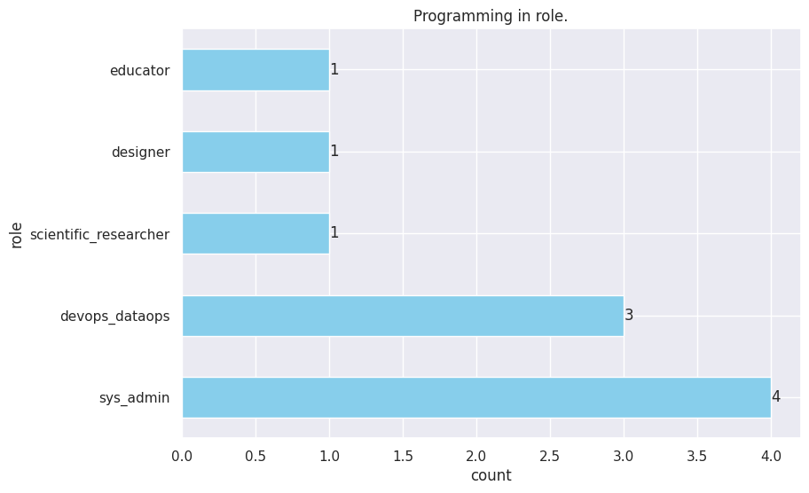
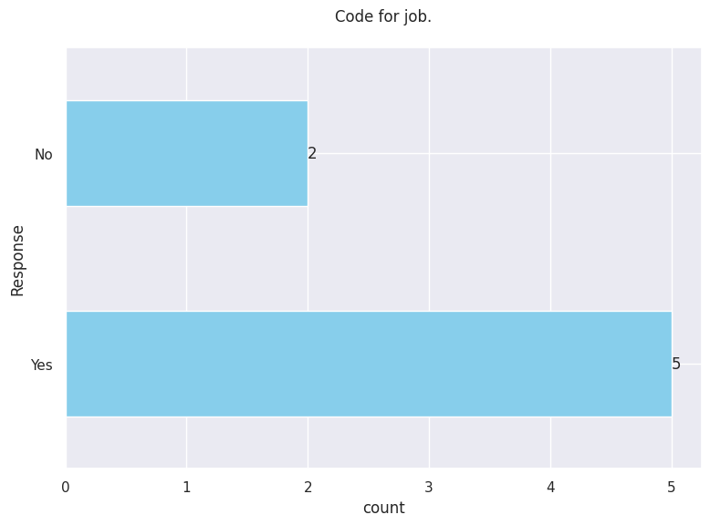
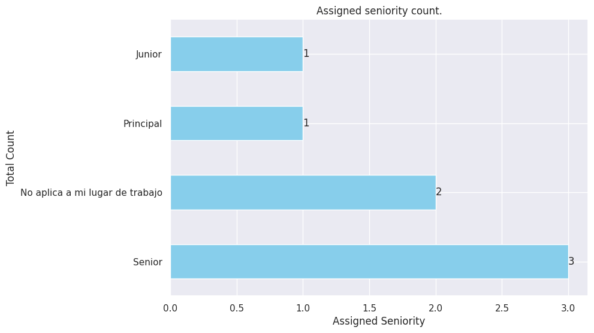
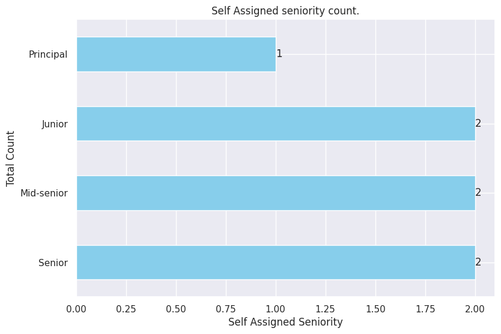

# **Employment and Work Conditions**
   - Modalidad de trabajo
   - Modalidad de empleo
   - Puesto / rol
   - ¿Utilizás habilidades de programación en alguno de los siguientes roles/puestos?
   - ¿Codificás por trabajo?
   - ¿Qué nivel te asignaron en tu trabajo?
   - ¿Cuál considerás que es tu nivel en tu puesto?


## Modalidad de trabajo


```python
get_column_uniques(df, "work_mode")
get_column_uniques_count(df, "work_mode")
```


    work_mode
    remote     4
    none       1
    Hibrído    1
    onsite     1
    Name: count, dtype: int64


```python
test_df = uniques_count_to_dataframe(get_column_uniques_count(df, "work_mode"), 20)
```


```python
md_table('test', test_df, 'TITULO CHOTO!')
```

    
            <center>
            <a id="test"></a>
            
            | role    |   count |
    |:--------|--------:|
    | remote  |       4 |
    | none    |       1 |
    | Hibrído |       1 |
    | onsite  |       1 |
            
            <p style="text-align: center;"><em>TITULO CHOTO!</em></p>
            </center>
            <br/>
            <br/>
        


```python
barh_chart_normal_count(
    df, "work_mode", title="Work mode total count", xlabel="count", ylabel="Work Mode"
)
```


    

    


## Modalidad de empleo


```python
df.columns
```


    Index(['work_mode', 'employment_mode', 'role', 'prog_skills_in_role',
           'code_for_job', 'IT_exp', 'prof_prog_exp', 'first_code',
           'assigned_seniority', 'self_assessed_seniority', 'formal_edu', 'majors',
           'formal_edu_importance', 'gender', 'age', 'monthly_salary',
           'pro_languages', 'web_frameworks', 'other_tools', 'databases',
           'platforms', 'fav_language', 'least_fav_language', 'fav_framework',
           'least_fav_framework', 'tools', 'use_AI_tools', 'AI_replace_dev',
           'layoffs_23_24', 'working_now', 'unemployed_duration', 'same_role',
           'current_vs_prev_salary'],
          dtype='object')


```python
get_column_uniques(df, "employment_mode")
```


    ['Empleador local (Paraguay)',
     'foreign_employer',
     'freelance',
     'local_with_foreign_clients']


```python
barh_chart_normal_count(
    df,
    "employment_mode",
    title="Employment mode count",
    xlabel="count",
    ylabel="Employment Mode",
)
```


    

    


## Puesto / rol


```python
df.columns
```


    Index(['work_mode', 'employment_mode', 'role', 'prog_skills_in_role',
           'code_for_job', 'IT_exp', 'prof_prog_exp', 'first_code',
           'assigned_seniority', 'self_assessed_seniority', 'formal_edu', 'majors',
           'formal_edu_importance', 'gender', 'age', 'monthly_salary',
           'pro_languages', 'web_frameworks', 'other_tools', 'databases',
           'platforms', 'fav_language', 'least_fav_language', 'fav_framework',
           'least_fav_framework', 'tools', 'use_AI_tools', 'AI_replace_dev',
           'layoffs_23_24', 'working_now', 'unemployed_duration', 'same_role',
           'current_vs_prev_salary'],
          dtype='object')


```python
# Assuming get_column_uniques_count returns a Series object
role_counts = get_column_uniques_count(df, "role")

role_counts_df = uniques_count_to_dataframe(role_counts, 10)
```


```python
role_counts
```


    role
    full_stack_dev      3
    backend_dev         2
    mobile_dev          2
    backend_arch        1
    db_admin            1
    data_eng            1
    quality_analyst     1
    frontend_dev        1
    Name: count, dtype: int64


```python
md_table('rolecount_table', 
         role_counts_df,
         "Roles total counts.")
```

    
            <center>
            <a id="rolecount_table"></a>
            
            | role            |   count |
    |:----------------|--------:|
    | full_stack_dev  |       3 |
    | backend_dev     |       2 |
    | mobile_dev      |       2 |
    | backend_arch    |       1 |
    | db_admin        |       1 |
    | data_eng        |       1 |
    | quality_analyst |       1 |
    | frontend_dev    |       1 |
            
            <p style="text-align: center;"><em>Roles total counts.</em></p>
            </center>
            <br/>
            <br/>
        


```python
barh_chart_normal_count(df, "role", "Role total count.", "total count", "role")
```


    

    


## Modalidad vs Seniority asignado.


```python
df.columns
```


    Index(['work_mode', 'employment_mode', 'role', 'prog_skills_in_role',
           'code_for_job', 'IT_exp', 'prof_prog_exp', 'first_code',
           'assigned_seniority', 'self_assessed_seniority', 'formal_edu', 'majors',
           'formal_edu_importance', 'gender', 'age', 'monthly_salary',
           'pro_languages', 'web_frameworks', 'other_tools', 'databases',
           'platforms', 'fav_language', 'least_fav_language', 'fav_framework',
           'least_fav_framework', 'tools', 'use_AI_tools', 'AI_replace_dev',
           'layoffs_23_24', 'working_now', 'unemployed_duration', 'same_role',
           'current_vs_prev_salary'],
          dtype='object')


```python
grouped_grid_barh_chart(
    df.groupby("work_mode"),
    "self_assessed_seniority",
    'Modalidad vs. "self" assessed seniority ',
    2,
    2,
    "gray",
    8.5,
)
```


    

    


```python
grouped_grid_barh_chart(
    df.groupby("work_mode"),
    "assigned_seniority",
    "Modalidad vs. assessed seniority ",
    5,
    1,
    "gray",
    8.5,
)
```


    

    


## Modalidad vs Seniority auto asignado.

## ¿Utilizás habilidades de programación en alguno de los siguientes roles/puestos?


```python
df.columns
```


    Index(['work_mode', 'employment_mode', 'role', 'prog_skills_in_role',
           'code_for_job', 'IT_exp', 'prof_prog_exp', 'first_code',
           'assigned_seniority', 'self_assessed_seniority', 'formal_edu', 'majors',
           'formal_edu_importance', 'gender', 'age', 'monthly_salary',
           'pro_languages', 'web_frameworks', 'other_tools', 'databases',
           'platforms', 'fav_language', 'least_fav_language', 'fav_framework',
           'least_fav_framework', 'tools', 'use_AI_tools', 'AI_replace_dev',
           'layoffs_23_24', 'working_now', 'unemployed_duration', 'same_role',
           'current_vs_prev_salary'],
          dtype='object')


```python
# Get column uniques.
prog_in_rol_uniques = get_column_uniques(df, "prog_skills_in_role")
```


```python
prog_in_rol_uniques
```


    ['devops_dataops',
     'scientific_researcher',
     'sys_admin',
     'designer',
     'educator']


```python
# Obtenemos el conteo total por categoria.
prog_in_role_count = get_column_uniques_count(df, "prog_skills_in_role")
prog_in_role_df = uniques_count_to_dataframe(prog_in_role_count, 10)
```


```python
prog_in_role_df.columns
```


    Index(['role', 'count'], dtype='object')


```python
md_table(
    'programming_in_role_table',
    prog_in_role_df,
    'Programming in role.'
)
```

    
            <center>
            <a id="programming_in_role_table"></a>
            
            | role                  |   count |
    |:----------------------|--------:|
    | sys_admin             |       4 |
    | devops_dataops        |       3 |
    | scientific_researcher |       1 |
    | designer              |       1 |
    | educator              |       1 |
            
            <p style="text-align: center;"><em>Programming in role.</em></p>
            </center>
            <br/>
            <br/>
        


```python
plot_uniques_count(prog_in_role_df, "Programming in role.", "count", "role")
```


    

    


```python

```

## ¿Codificás por trabajo?


```python
df.columns
```


    Index(['work_mode', 'employment_mode', 'role', 'prog_skills_in_role',
           'code_for_job', 'IT_exp', 'prof_prog_exp', 'first_code',
           'assigned_seniority', 'self_assessed_seniority', 'formal_edu', 'majors',
           'formal_edu_importance', 'gender', 'age', 'monthly_salary',
           'pro_languages', 'web_frameworks', 'other_tools', 'databases',
           'platforms', 'fav_language', 'least_fav_language', 'fav_framework',
           'least_fav_framework', 'tools', 'use_AI_tools', 'AI_replace_dev',
           'layoffs_23_24', 'working_now', 'unemployed_duration', 'same_role',
           'current_vs_prev_salary'],
          dtype='object')


```python
# Unique values in column.
get_column_uniques(df, "code_for_job")
```


    ['Yes', 'No']


```python
prog_in_job_count = get_column_uniques_count(df, "code_for_job")
```


```python
cod_for_job_df = uniques_count_to_dataframe(prog_in_job_count)
```


```python
md_table(
    'coding_for_job_table',
    cod_for_job_df,
    'Coding for job.'
)
```

    
            <center>
            <a id="coding_for_job_table"></a>
            
            | role   |   count |
    |:-------|--------:|
    | Yes    |       5 |
    | No     |       2 |
            
            <p style="text-align: center;"><em>Coding for job.</em></p>
            </center>
            <br/>
            <br/>
        


```python
plot_uniques_count(cod_for_job_df, "Code for job.\n", "count", "Response")
```


    

    


## ¿Qué nivel te asignaron en tu trabajo?


```python
df.columns
```


    Index(['work_mode', 'employment_mode', 'role', 'prog_skills_in_role',
           'code_for_job', 'IT_exp', 'prof_prog_exp', 'first_code',
           'assigned_seniority', 'self_assessed_seniority', 'formal_edu', 'majors',
           'formal_edu_importance', 'gender', 'age', 'monthly_salary',
           'pro_languages', 'web_frameworks', 'other_tools', 'databases',
           'platforms', 'fav_language', 'least_fav_language', 'fav_framework',
           'least_fav_framework', 'tools', 'use_AI_tools', 'AI_replace_dev',
           'layoffs_23_24', 'working_now', 'unemployed_duration', 'same_role',
           'current_vs_prev_salary'],
          dtype='object')


```python
# Get unique values in column.
get_column_uniques(df, "assigned_seniority")
```


    ['Senior', 'Principal', 'No aplica a mi lugar de trabajo', 'Junior']


```python
get_column_uniques_count(df, "assigned_seniority")
```


    assigned_seniority
    Senior                             3
    No aplica a mi lugar de trabajo    2
    Principal                          1
    Junior                             1
    Name: count, dtype: int64


```python
len(df["assigned_seniority"])
```


    7


```python
df["assigned_seniority"]
```


    2                               Senior
    40                           Principal
    152    No aplica a mi lugar de trabajo
    206                             Senior
    303                             Junior
    312    No aplica a mi lugar de trabajo
    391                             Senior
    Name: assigned_seniority, dtype: object


```python
assigned_seniority_df = uniques_count_to_dataframe(
    get_column_uniques_count(df, "assigned_seniority")
)
```


```python
md_table(
    'assigned_seniority_table',
    assigned_seniority_df,
    'Assigned seniority.',
)
```

    
            <center>
            <a id="assigned_seniority_table"></a>
            
            | role                            |   count |
    |:--------------------------------|--------:|
    | Senior                          |       3 |
    | No aplica a mi lugar de trabajo |       2 |
    | Principal                       |       1 |
    | Junior                          |       1 |
            
            <p style="text-align: center;"><em>Assigned seniority.</em></p>
            </center>
            <br/>
            <br/>
        


```python
plot_uniques_count(
    assigned_seniority_df,
    "Assigned seniority count.",
    "Assigned Seniority",
    "Total Count",
)
```


    

    


## ¿Cuál considerás que es tu nivel en tu puesto?


```python
# Obtener los valores unicos de la columna.
get_column_uniques(df, "self_assessed_seniority")
```


    ['Senior', 'Principal', 'Mid-senior', 'Junior']


```python
# Obtener el conteo total de la columns.
```


```python
get_column_uniques_count(df, "self_assessed_seniority")
```


    self_assessed_seniority
    Senior        2
    Mid-senior    2
    Junior        2
    Principal     1
    Name: count, dtype: int64


    

    


