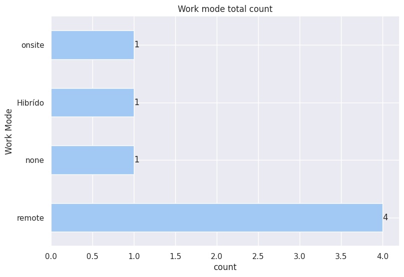
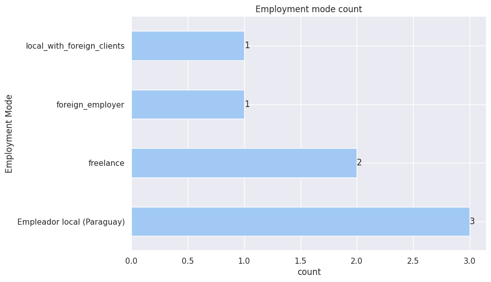
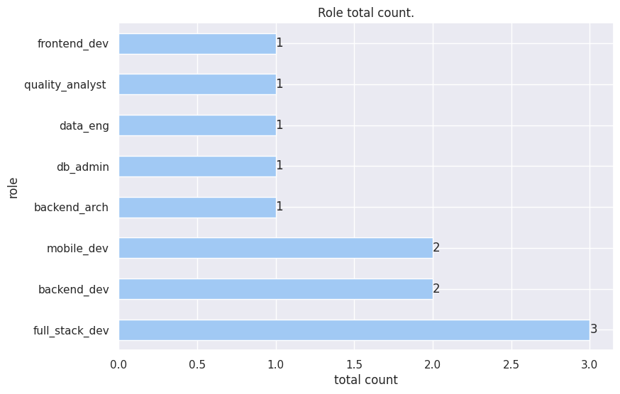
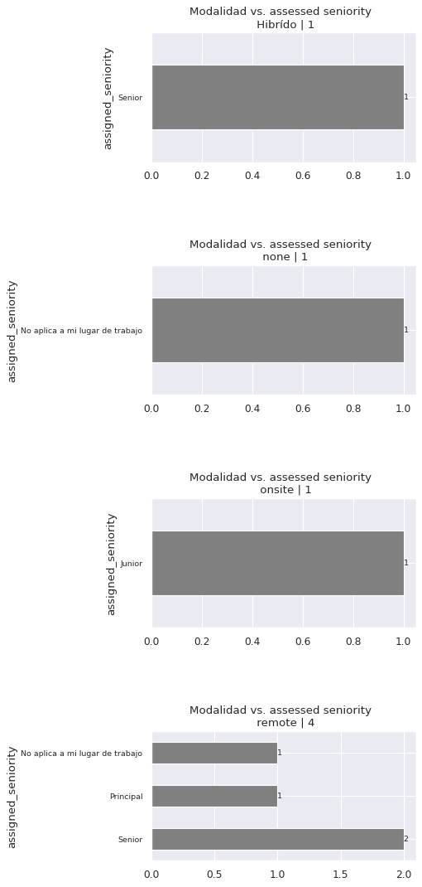
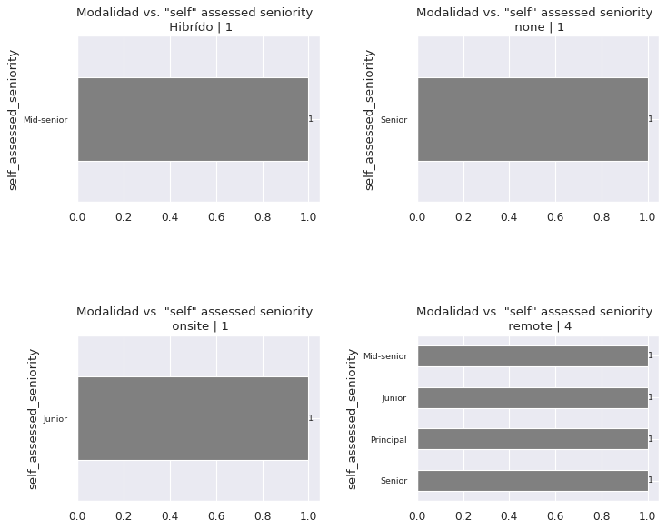
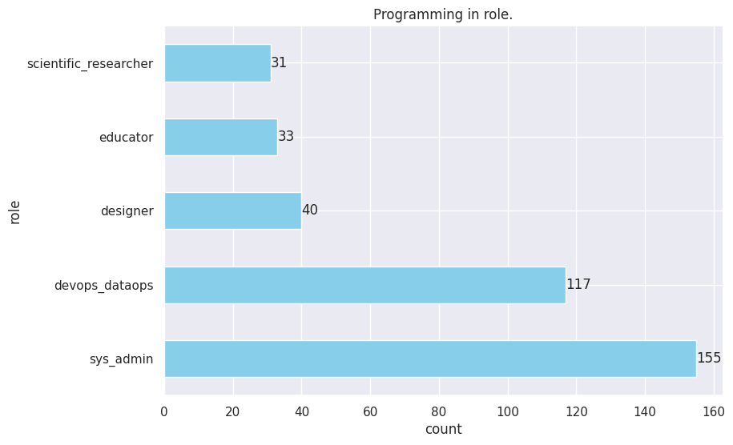
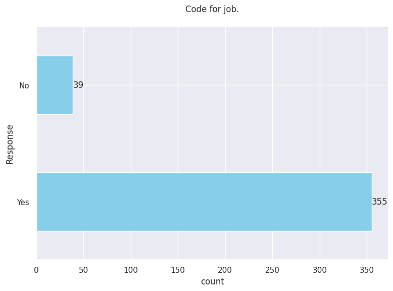
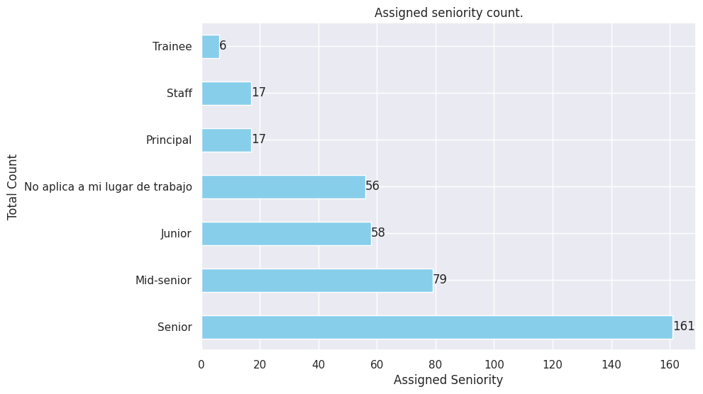
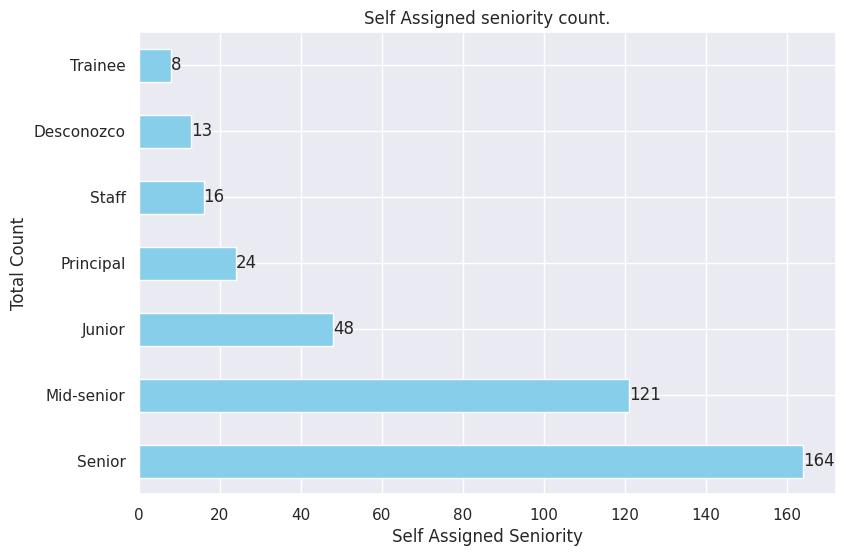

# **Employment and Work Conditions**

- Modalidad de trabajo
- Modalidad de empleo
- Puesto / rol
- ¿Utilizás habilidades de programación en alguno de los siguientes roles/puestos?
- ¿Codificás por trabajo?
- ¿Qué nivel te asignaron en tu trabajo?
- ¿Cuál considerás que es tu nivel en tu puesto?

  

## Modalidad de trabajo

     

        

| category | count |
| :------- | ----: |
| remote   |   152 |
| onsite   |   133 |
| Hibrído  |   103 |
| none     |     6 |

<em>Work mode total count.</em>

        

  

## Modalidad de empleo

- 'Empleador local (Paraguay)',
- 'foreign_employer',
- 'freelance',
- 'local_with_foreign_clients'

  

## Puesto / rol

     

 

| category         | count |
| :--------------- | ----: |
| full_stack_dev   |   170 |
| backend_dev      |   140 |
| frontend_dev     |    80 |
| proj_lead        |    52 |
| mobile_dev       |    51 |
| desktop_apps     |    49 |
| db_admin         |    49 |
| data_analyst     |    33 |
| dev_ops          |    32 |
| data_eng         |    28 |
| qa_testing       |    27 |
| ux_ui            |    14 |
| data_sci         |    13 |
| embedded_sys_dev |    13 |
| ai_specialist    |    10 |
| game_dev         |     4 |
| sys_analyst      |     2 |
| qa_tester        |     1 |
| cloud_dev        |     1 |
| api_rest         |     1 |

<em>Roles total counts.</em>

  

## Modalidad vs Seniority asignado.

  

## Modalidad vs Seniority auto asignado.

  

## ¿Utilizás habilidades de programación en alguno de los siguientes roles/puestos?

     

     

| prog_skills_in_role                                                  | count |
| :------------------------------------------------------------------- | ----: |
| sys_admin                                                            |    72 |
| devops_dataops                                                       |    57 |
| sys_admin, devops_dataops                                            |    37 |
| designer                                                             |    19 |
| sys_admin, educator                                                  |    12 |
| sys_admin, designer                                                  |    11 |
| educator                                                             |     9 |
| scientific_researcher                                                |     6 |
| sys_admin, devops_dataops, scientific_researcher                     |     6 |
| devops_dataops, scientific_researcher                                |     5 |
| sys_admin, scientific_researcher, educator                           |     4 |
| sys_admin, scientific_researcher                                     |     4 |
| sys_admin, devops_dataops, designer                                  |     3 |
| devops_dataops, designer                                             |     3 |
| sys_admin, devops_dataops, educator                                  |     3 |
| scientific_researcher, educator                                      |     2 |
| devops_dataops, educator                                             |     1 |
| scientific_researcher, designer, educator                            |     1 |
| sys_admin, devops_dataops, scientific_researcher, designer, educator |     1 |
| sys_admin, scientific_researcher, designer                           |     1 |
| sys_admin, devops_dataops, scientific_researcher, designer           |     1 |

<em>Uses programming skills in role.</em>

     

 

| category              | count |
| :-------------------- | ----: |
| sys_admin             |   155 |
| devops_dataops        |   117 |
| designer              |    40 |
| educator              |    33 |
| scientific_researcher |    31 |

<em>Programming in role.

(Needs to program in role?)
</em>
 </em>

  

## ¿Codificás por trabajo?

     

 

| category | count |
| :------- | ----: |
| Yes      |   355 |
| No       |    39 |

<em>Coding for job.</em>

  

## ¿Qué nivel te asignaron en tu trabajo?

    

    

| category                        | count |
| :------------------------------ | ----: |
| Senior                          |   161 |
| Mid-senior                      |    79 |
| Junior                          |    58 |
| No aplica a mi lugar de trabajo |    56 |
| Principal                       |    17 |
| Staff                           |    17 |
| Trainee                         |     6 |

<em>Assigned seniority.</em>

  

## ¿Cuál considerás que es tu nivel en tu puesto?

    

    

| category   | count |
| :--------- | ----: |
| Senior     |   164 |
| Mid-senior |   121 |
| Junior     |    48 |
| Principal  |    24 |
| Staff      |    16 |
| Desconozco |    13 |
| Trainee    |     8 |

<em>Self assessed seniority.</em>

