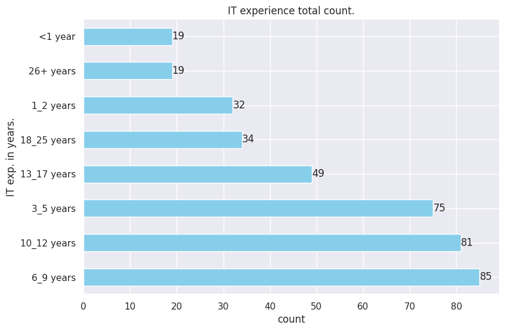
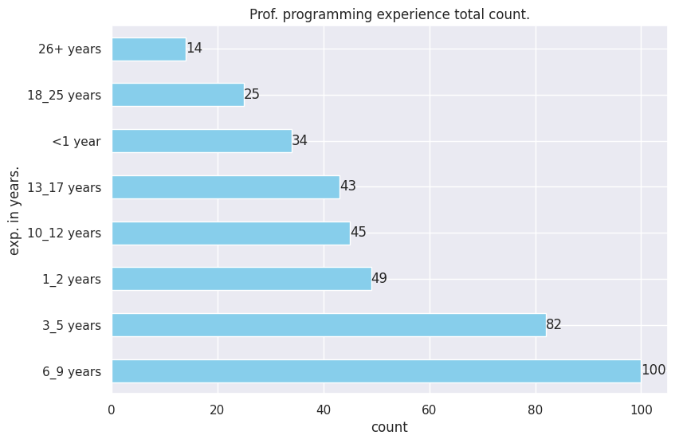
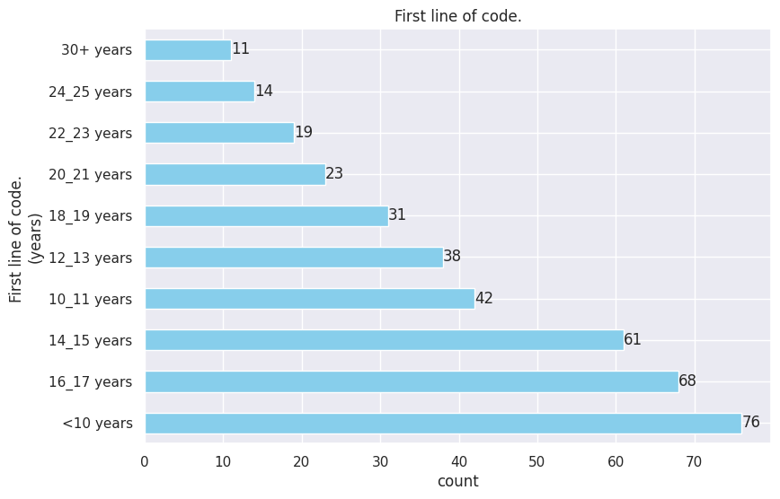
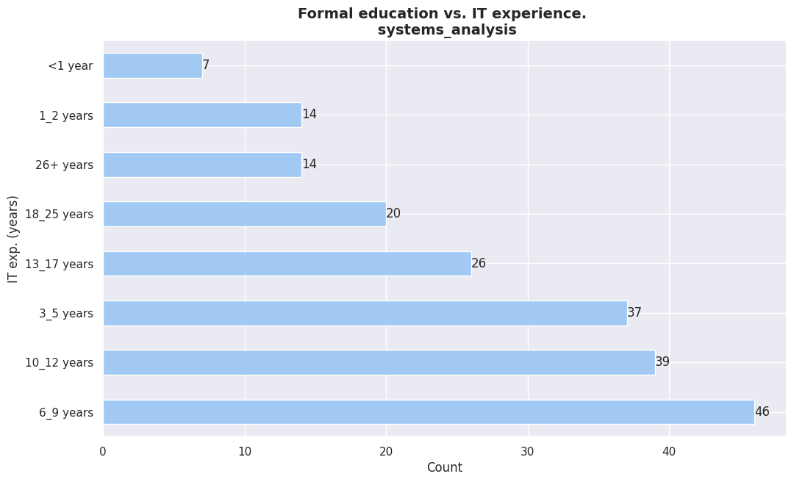
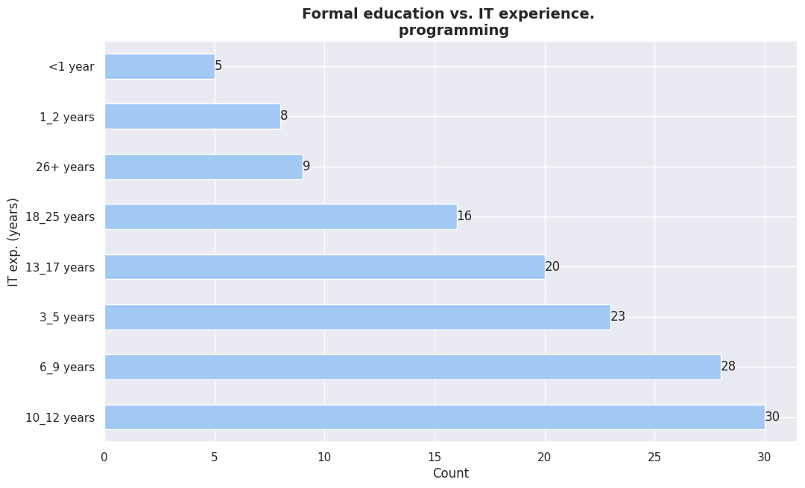

```python
#######################
# CONFIG ZONE
#######################

# Importing Libs
import pandas as pd
import seaborn as sns

import matplotlib.pyplot as plt

from collections import Counter
import numpy as np

# My Tools
import milanesas.eda_helper as eh
from tools.helpers import (
    get_column_uniques,
    get_column_uniques_count,
    plot_grouped_by_category_barh_charts,
    barh_chart_unique_values,
    print_unique_normalized_values_by_group,
    make_vertical_grouped_chart,
    plot_uniques_count,
    uniques_count_to_dataframe,
    md_table,
)


%matplotlib inline

# Reseting figure size params.
plt.rcParams["figure.figsize"] = [12, 7]
# Setting seaborn as default plotting lib.
sns.set()
sns.set_palette("pastel")
```

```python
df = pd.read_csv("../data/data_fixed.csv")
```

```python
df = df.drop("Unnamed: 0", axis=1)

```

```python
gender_group = df.groupby("gender")
```

### 3. **Experience and Education**

- Experiencia en TI
- Experiencia programando profesionalmente
- Primera línea de código en una máquina
- Educación Formal
- Carreras o especialidades
- Importancia educación formal

### Experiencia en TI

```python
# Print column uniques.
get_column_uniques(df, "IT_exp")
```

```
['18_25 years',
 '3_5 years',
 '10_12 years',
 '26+ years',
 '13_17 years',
 '6_9 years',
 '1_2 years',
 '<1 year']
```

```python
it_exp_df = uniques_count_to_dataframe(get_column_uniques_count(df, "IT_exp"))
```

```python
it_exp_df
```

<div>
<style scoped>
    .dataframe tbody tr th:only-of-type {
        vertical-align: middle;
    }

```
.dataframe tbody tr th {
    vertical-align: top;
}

.dataframe thead th {
    text-align: right;
}
```

</style>
<table border="1" class="dataframe">
  <thead>
    <tr style="text-align: right;">
      <th></th>
      <th>category</th>
      <th>count</th>
    </tr>
  </thead>
  <tbody>
    <tr>
      <th>0</th>
      <td>6_9 years</td>
      <td>85</td>
    </tr>
    <tr>
      <th>1</th>
      <td>10_12 years</td>
      <td>81</td>
    </tr>
    <tr>
      <th>2</th>
      <td>3_5 years</td>
      <td>75</td>
    </tr>
    <tr>
      <th>3</th>
      <td>13_17 years</td>
      <td>49</td>
    </tr>
    <tr>
      <th>4</th>
      <td>18_25 years</td>
      <td>34</td>
    </tr>
    <tr>
      <th>5</th>
      <td>1_2 years</td>
      <td>32</td>
    </tr>
    <tr>
      <th>6</th>
      <td>26+ years</td>
      <td>19</td>
    </tr>
    <tr>
      <th>7</th>
      <td>&lt;1 year</td>
      <td>19</td>
    </tr>
  </tbody>
</table>
</div>

```python
md_table(
    "exp_en_it_total_count_table",
    it_exp_df,
    "IT experience total count."
)
```

```
        <center>
        <a id="exp_en_it_total_count_table_JzJ6Q"></a>
        
        | category    |   count |
|:------------|--------:|
| 6_9 years   |      85 |
| 10_12 years |      81 |
| 3_5 years   |      75 |
| 13_17 years |      49 |
| 18_25 years |      34 |
| 1_2 years   |      32 |
| 26+ years   |      19 |
| <1 year     |      19 |
        
        <p style="text-align: center;"><em>IT experience total count.</em></p>
        </center>
        <br/>
        <br/>
```

```python
plot_uniques_count(
    it_exp_df, "IT experience total count.", "count", "IT exp. in years."
)
```



### Experiencia programando profesionalmente

```python
# Get the unique values in the column.
get_column_uniques(df, "prof_prog_exp")
```

```
['13_17 years',
 '3_5 years',
 '6_9 years',
 '18_25 years',
 '26+ years',
 '10_12 years',
 '1_2 years',
 '<1 year',
 nan]
```

```python
prof_prog_exp_count = uniques_count_to_dataframe(
    get_column_uniques_count(df, "prof_prog_exp")
)


plot_uniques_count(
    prof_prog_exp_count,
    "Prof. programming experience total count.",
    "count",
    "exp. in years.",
)
```



### Primera línea de código en una máquina

```python
# Obtener los valores unicos en la columna.
get_column_uniques(df, "first_code")
```

```
['16_17 years',
 '<10 years',
 '14_15 years',
 '12_13 years',
 '28_29 years',
 '30+ years',
 '10_11 years',
 '18_19 years',
 '24_25 years',
 '26_27 years',
 '20_21 years',
 '22_23 years']
```

```python
plot_uniques_count(
    uniques_count_to_dataframe(get_column_uniques_count(df, "first_code")),
    "First line of code.",
    "count",
    "First line of code. \n(years)",
)
```



### Educación Formal

```python
barh_chart_unique_values(
    df, "majors", "IT_exp", "Formal education vs. IT experience.", "IT exp. (years)"
)
```





### Carreras o especialidades

```python
barh_chart_unique_values(
    df, "formal_edu", "IT_exp", "Formal education. vs. IT exp. ", "IT exp."
)
```

### Importancia educación formal

```python
gender_group
```

```python
plot_grouped_by_category_barh_charts(
    gender_group,
    "formal_edu_importance",
    "Formal education importance by GENDER",
    "Importance Level",
)
```

```python
# Get column uniques.
get_column_uniques(df, "formal_edu_importance")
```

```python
plot_uniques_count(
    uniques_count_to_dataframe(get_column_uniques_count(df, "formal_edu_importance")),
    "Formal education importance.\n (GENERAL)",
    "count",
    "Importance levels.",
)
```

```python

```

```python

```

```python

```

```python

```

```python

```

```python

```
