# **Compensation**

- Salario mensual


# TIPO DE TRABAJO

## Salarios segun - work_mode

- Varia el salario segun el "modo de trabajo"?


## Salarios segun - employment_mode

- Varia el salario segun el "modo de empleo"?

- Tipo de empleo.

\["Empleador local (Paraguay)",
"foreign_employer",
"freelance",
"local_with_foreign_clients"\]


## Salarios segun - role

- Varia el salario segun el rol que desempeña?

<center>
        <div class="stats_table">
<a id="monthly_salary_by_role_table_lphhC"></a>

| Category | Percentage |
| -------- | ---------- |
| 15M_18M  | 25%        |
| 40M_50M  | 25%        |
| 50M+     | 25%        |
| 24M_27M  | 25%        |

<p class="table_title" class='table_title' style="text-align: center;"><em>Monthly salary by role. 
<p class="table_subtitle">(data_eng)<p></em></p>
<br/>
</div>
</center>

<center>
    <div class="stats_table">
<a id="monthly_salary_by_role_table_wnfpN"></a>

| Category | Percentage |
| -------- | ---------- |
| 3.5M_5M  | 100%       |

<p class="table_title" class='table_title' style="text-align: center;"><em>Monthly salary by role. 
<p class="table_subtitle">(desktop_apps, qa_testing, data_analyst)<p></em></p>
<br/>
</div>
</center>

<center>
        <div class="stats_table">
    <a id="monthly_salary_by_role_table_tCVfc"></a>

| Category | Percentage |
| -------- | ---------- |
| 18M_21M  | 100%       |

<p class="table_title" class='table_title' style="text-align: center;"><em>Monthly salary by role. 
<p class="table_subtitle">(backend_arch)<p></em></p>
<br/>
</div>
</center>

<center>
    <div class="stats_table">
<a id="monthly_salary_by_role_table_8T8RN"></a>

| Category | Percentage |
| -------- | ---------- |
| 15M_18M  | 66%        |
| 7M_9M    | 33%        |

<p class="table_title" class='table_title' style="text-align: center;"><em>Monthly salary by role. 
<p class="table_subtitle">(desktop_apps, db_admin, proj_lead)<p></em></p>
<br/>
</div>
</center>

<center>
     <div class="stats_table">
 <a id="monthly_salary_by_role_table_jzag1"></a>

| Category | Percentage |
| -------- | ---------- |
| 33M_40M  | 50%        |
| 9M_12M   | 50%        |

<p class="table_title" class='table_title' style="text-align: center;"><em>Monthly salary by role. 
<p class="table_subtitle">(full_stack_dev, dev_ops)<p></em></p>
   <br/>
   </div>
</center>

<center>
    <div class="stats_table">
 <a id="monthly_salary_by_role_table_NNCND"></a>

| Category | Percentage |
| -------- | ---------- |
| 50M+     | 100%       |

<p class="table_title" class='table_title' style="text-align: center;"><em>Monthly salary by role. 
<p class="table_subtitle">(backend_dev, full_stack_dev, desktop_apps, db_admin, proj_lead, dev_ops)<p></em></p>
 <br/>
 </div>
</center>

<center>
    <div class="stats_table">
 <a id="monthly_salary_by_role_table_9taiY"></a>

| Category | Percentage |
| -------- | ---------- |
| 7M_9M    | 100%       |

<p class="table_title" class='table_title' style="text-align: center;"><em>Monthly salary by role. 
<p class="table_subtitle">(backend_dev, frontend_dev, full_stack_dev, desktop_apps, db_admin, dev_ops, sre)<p></em></p>
 <br/>
 </div>
</center>

<center>
     <div class="stats_table">
 <a id="monthly_salary_by_role_table_fk1yM"></a>

| Category | Percentage |
| -------- | ---------- |
| 18M_21M  | 100%       |

<p class="table_title"  class='table_title' style="text-align: center;"><em>Monthly salary by role. 
<p class="table_subtitle">(full_stack_dev, qa_testing)<p></em></p>
 <br/>
 </div>
</center>

<center>
    <div class="stats_table">
 <a id="monthly_salary_by_role_table_qNVSD"></a>

| Category | Percentage |
| -------- | ---------- |
| 7M_9M    | 100%       |

<p class='table_title' style="text-align: center;"><em>Monthly salary by role. 
<p class="table_subtitle">(backend_dev, frontend_dev, full_stack_dev, dev_ops)<p></em></p>
 <br/>
 </div>
</center>

<center>
    <div class="stats_table">
  <a id="monthly_salary_by_role_table_dgFkR"></a>

| Category | Percentage |
| -------- | ---------- |
| 3.5M_5M  | 100%       |

<p class="table_title" class='table_title' style="text-align: center;"><em>Monthly salary by role. 
<p class="table_subtitle"> (qa_tester) <p></em></p>
 <br/>
 </div>
</center>

<center>
    <div class="stats_table">
 <a id="monthly_salary_by_role_table_tRmPj"></a>

| Category | Percentage |
| -------- | ---------- |
| 24M_27M  | 33%        |
| 9M_12M   | 33%        |
| 27M_33M  | 33%        |

<p class='table_title' style="text-align: center;"><em>Monthly salary by role. 
<p class="table_subtitle">(backend_dev, proj_lead)<p></em></p>
   <br/>
   </div>
</center>

<center>
    <div class="stats_table">
 <a id="monthly_salary_by_role_table_9cqs6"></a>

| Category | Percentage |
| -------- | ---------- |
| 3.5M_5M  | 100%       |

<p class='table_title' style="text-align: center;"><em>Monthly salary by role. 
<p class="table_subtitle">(backend_dev, frontend_dev, full_stack_dev, desktop_apps, db_admin, data_analyst, data_eng, data_sci, ai_specialist)<p></em></p>
   <br/>
   </div>
</center>

<center>
    <div class="stats_table">
 <a id="monthly_salary_by_role_table_kmFex"></a>

| Category | Percentage |
| -------- | ---------- |
| 9M_12M   | 100%       |

<p class='table_title' style="text-align: center;"><em>Monthly salary by role. 
<p class="table_subtitle">(digital_analyst)<p></em></p>
   <br/>
   </div>
</center>

<center>
    <div class="stats_table">
 <a id="monthly_salary_by_role_table_IO0B0"></a>

| Category              | Percentage |
| --------------------- | ---------- |
| 7M_9M                 | 13%        |
| 5M_7M                 | 13%        |
| 9M_12M                | 13%        |
| 15M_18M               | 9%         |
| 24M_27M               | 9%         |
| 2.55M_3.5M            | 6%         |
| 50M+                  | 6%         |
| 3.5M_5M               | 6%         |
| 12M_15M               | 6%         |
| 33M_40M               | 4%         |
| 40M_50M               | 2%         |
| min_wage              | 2%         |
| 21M_24M               | 2%         |
| les_than_minimum_wage | 2%         |

<p class="table_title" class='table_title' style="text-align: center;"><em>Monthly salary by role.
<p class="table_subtitle">(backend_dev)<p></em></p>
 <br/>
 </div>
</center>

<center>
     <div class="stats_table">
 <a id="monthly_salary_by_role_table_SPJ0F"></a>

| Category   | Percentage |
| ---------- | ---------- |
| 7M_9M      | 16%        |
| 9M_12M     | 14%        |
| 2.55M_3.5M | 14%        |
| 5M_7M      | 14%        |
| 12M_15M    | 7%         |
| 3.5M_5M    | 7%         |
| 18M_21M    | 6%         |
| 50M+       | 5%         |
| 27M_33M    | 3%         |
| 15M_18M    | 3%         |
| min_wage   | 2%         |
| 24M_27M    | 1%         |
| 33M_40M    | 1%         |

<p class="table_title"  class='table_title' style="text-align: center;"><em>Monthly salary by role. 
<p class="table_subtitle">(full_stack_dev)<p></em></p>
   <br/>
   </div>
</center>

<center>
     <div class="stats_table">
 <a id="monthly_salary_by_role_table_vd71V"></a>

| Category   | Percentage |
| ---------- | ---------- |
| 3.5M_5M    | 16%        |
| 2.55M_3.5M | 16%        |
| 7M_9M      | 16%        |
| 15M_18M    | 16%        |
| 24M_27M    | 16%        |
| 33M_40M    | 16%        |

<p class='table_title' style="text-align: center;"><em>Monthly salary by role. 
<p class="table_subtitle">(backend_dev, frontend_dev, full_stack_dev, mobile_dev)<p></em></p>
 <br/>
 </div>
</center>

<center>
    <div class="stats_table">
 <a id="monthly_salary_by_role_table_ulF8F"></a>

| Category | Percentage |
| -------- | ---------- |
| 7M_9M    | 100%       |

<p class='table_title' style="text-align: center;"><em>Monthly salary by role. 
<p class="table_subtitle">(sys_coord)<p></em></p>
 <br/>
 </div>
</center>

<center>
    <div class="stats_table">
    <a id="monthly_salary_by_role_table_VgxmR"></a>

| Category | Percentage |
| -------- | ---------- |
| 3.5M_5M  | 100%       |

<p class='table_title' style="text-align: center;"><em>Monthly salary by role. 
<p class="table_subtitle">(it)<p></em></p>
 <br/>
 </div>
</center>

<center>
    <div class="stats_table">
 <a id="monthly_salary_by_role_table_jayH5"></a>

| Category | Percentage |
| -------- | ---------- |
| 3.5M_5M  | 50%        |
| 24M_27M  | 25%        |
| 7M_9M    | 25%        |

<p class='table_title' style="text-align: center;"><em>Monthly salary by role. 
<p class="table_subtitle">(full_stack_dev, db_admin)<p></em></p>
  <br/>
  </div>
</center>

<center>
     <div clasS="stats_table">
 <a id="monthly_salary_by_role_table_SjnXu"></a>

| Category | Percentage |
| -------- | ---------- |
| 9M_12M   | 40%        |
| 24M_27M  | 20%        |
| 15M_18M  | 20%        |
| 21M_24M  | 20%        |

<p class='table_title' style="text-align: center;"><em>Monthly salary by role. 
<p class="table_subtitle">(full_stack_dev, mobile_dev)<p></em></p>
 <br/>
 </div>
</center>

<center>
     <div class="stats_table">
 <a id="monthly_salary_by_role_table_9Zsc9"></a>

| Category | Percentage |
| -------- | ---------- |
| 7M_9M    | 100%       |

<p class='table_title' style="text-align: center;"><em>Monthly salary by role. 
<p class="table_subtitle">(frontend_dev, game_dev)<p></em></p>
 <br/>
 </div>
</center>

<center>
    <div class="stats_table">
 <a id="monthly_salary_by_role_table_49ega"></a>

| Category | Percentage |
| -------- | ---------- |
| 24M_27M  | 50%        |
| 15M_18M  | 50%        |

<p class='table_title' style="text-align: center;"><em>Monthly salary by role. 
<p class="table_subtitle">(backend_dev, full_stack_dev)<p></em></p>
 <br/>
 </div>
</center>

<center>
    <div class="stats_table">
  <a id="monthly_salary_by_role_table_eHAJy"></a>

| Category | Percentage |
| -------- | ---------- |
| 9M_12M   | 44%        |
| 12M_15M  | 22%        |
| 40M_50M  | 11%        |
| 15M_18M  | 11%        |
| 27M_33M  | 11%        |

<p class='table_title' style="text-align: center;"><em>Monthly salary by role. 
<p class="table_subtitle">(proj_lead)<p></em></p>
  <br/>
  </div>
</center>

<center>
     <div class="stats_table">
  <a id="monthly_salary_by_role_table_GQaAF"></a>

| Category | Percentage |
| -------- | ---------- |
| 15M_18M  | 100%       |

<p class='table_title' style="text-align: center;"><em>Monthly salary by role. 
<p class="table_subtitle">(backend_dev, frontend_dev, full_stack_dev, mobile_dev, proj_lead)<p></em></p>
  <br/>
  </div>
</center>

<center>
    <div class="stats_table">
 <a id="monthly_salary_by_role_table_MDi4x"></a>

| Category | Percentage |
| -------- | ---------- |
| 3.5M_5M  | 18%        |
| 9M_12M   | 18%        |
| 12M_15M  | 18%        |
| 5M_7M    | 18%        |
| 15M_18M  | 9%         |
| 33M_40M  | 9%         |
| 21M_24M  | 9%         |

<p class='table_title' style="text-align: center;"><em>Monthly salary by role. 
<p class="table_subtitle">(mobile_dev)<p></em></p>
 <br/>
 </div>
</center>

<center>
    <div class="stats_table">
 <a id="monthly_salary_by_role_table_i64ds"></a>

| Category | Percentage |
| -------- | ---------- |
| 12M_15M  | 50%        |
| 7M_9M    | 16%        |
| 33M_40M  | 16%        |
| 15M_18M  | 16%        |

<p class='table_title' style="text-align: center;"><em>Monthly salary by role. 
<p class="table_subtitle">(full_stack_dev, proj_lead)<p></em></p>
 <br/>
 </div>
</center>

<center>
    <div class="stats_table">
 <a id="monthly_salary_by_role_table_nLWNp"></a>

| Category | Percentage |
| -------- | ---------- |
| 5M_7M    | 100%       |

<p class='table_title' style="text-align: center;"><em>Monthly salary by role. 
<p class="table_subtitle">(backend_dev, frontend_dev, full_stack_dev, db_admin)<p></em></p>
 <br/>
 </div>
</center>

<center>
    <div class="stats_table">
 <a id="monthly_salary_by_role_table_JUvwc"></a>

| Category | Percentage |
| -------- | ---------- |
| 7M_9M    | 100%       |

<p class='table_title' style="text-align: center;"><em>Monthly salary by role. 
<p class="table_subtitle">(mobile_dev, desktop_apps, db_admin)<p></em></p>
 <br/>
 </div>
</center>

<center>
     <div class="stats_table">
 <a id="monthly_salary_by_role_table_J6mhd"></a>

| Category              | Percentage |
| --------------------- | ---------- |
| 5M_7M                 | 30%        |
| 7M_9M                 | 15%        |
| 9M_12M                | 15%        |
| 12M_15M               | 7%         |
| 18M_21M               | 7%         |
| les_than_minimum_wage | 7%         |
| 3.5M_5M               | 7%         |
| 15M_18M               | 7%         |

<p class='table_title' style="text-align: center;"><em>Monthly salary by role. 
<p class="table_subtitle">(desktop_apps)<p></em></p>
 <br/>
 </div>
</center>

<center>
    <div clasS="stats_table">
 <a id="monthly_salary_by_role_table_u7W1i"></a>

| Category | Percentage |
| -------- | ---------- |
| 9M_12M   | 28%        |
| 21M_24M  | 14%        |
| 5M_7M    | 14%        |
| 12M_15M  | 14%        |
| 33M_40M  | 14%        |
| 7M_9M    | 14%        |

<p class='table_title' style="text-align: center;"><em>Monthly salary by role. 
<p class="table_subtitle">(backend_dev, frontend_dev, full_stack_dev)<p></em></p>
 <br/>
 </div>
</center>

<center>
    <div class="stats_table">
  <a id="monthly_salary_by_role_table_LOkDY"></a>

| Category | Percentage |
| -------- | ---------- |
| 5M_7M    | 100%       |

<p class='table_title' style="text-align: center;"><em>Monthly salary by role. 
 <p class="table_subtitle">(full_stack_dev, db_admin, ai_specialist, sales)<p></em></p>
  <br/>
  </div>
</center>

<center>
    <div class="stats_table">
 <a id="monthly_salary_by_role_table_ILmKn"></a>

| Category | Percentage |
| -------- | ---------- |
| 9M_12M   | 25%        |
| 3.5M_5M  | 25%        |
| 15M_18M  | 25%        |
| 12M_15M  | 25%        |

<p class='table_title' style="text-align: center;"><em>Monthly salary by role. 
<p class="table_subtitle">(data_analyst, data_eng)<p></em></p>
  <br/>
  </div>
</center>

<center>
    <div class="stats_table">
 <a id="monthly_salary_by_role_table_FL20C"></a>

| Category | Percentage |
| -------- | ---------- |
| 5M_7M    | 100%       |

<p class='table_title' style="text-align: center;"><em>Monthly salary by role. 
<p class="table_subtitle">(support_analyst)<p></em></p>
  <br/>
  </div>
</center>

<center>
     <div class="stats_table">
 <a id="monthly_salary_by_role_table_uIYPW"></a>

| Category              | Percentage |
| --------------------- | ---------- |
| 5M_7M                 | 40%        |
| 21M_24M               | 20%        |
| 24M_27M               | 10%        |
| 3.5M_5M               | 10%        |
| les_than_minimum_wage | 10%        |
| 7M_9M                 | 10%        |

<p class='table_title' style="text-align: center;"><em>Monthly salary by role. 
<p class="table_subtitle">(frontend_dev)<p></em></p>
   <br/>
   </div>
</center>

<center>
    <div class='stats_table'>
 <a id="monthly_salary_by_role_table_dnC43"></a>

| Category | Percentage |
| -------- | ---------- |
| 7M_9M    | 33%        |
| 50M+     | 33%        |
| 40M_50M  | 33%        |

<p class='table_title' style="text-align: center;"><em>Monthly salary by role. 
<p class="table_subtitle">(frontend_dev, full_stack_dev, mobile_dev)<p></em></p>
 <br/>
 </div>
</center>

<center>
     <div class='stats_table'>
 <a id="monthly_salary_by_role_table_mHocE"></a>

| Category | Percentage |
| -------- | ---------- |
| 18M_21M  | 50%        |
| 40M_50M  | 50%        |

<p class='table_title' style="text-align: center;"><em>Monthly salary by role. 
<p class="table_subtitle">(backend_dev, proj_lead, dev_ops)<p></em></p>
 <br/>
 </div>
</center>

<center>
    <div class='stats_table'>
  <a id="monthly_salary_by_role_table_kTP0j"></a>

| Category   | Percentage |
| ---------- | ---------- |
| 27M_33M    | 33%        |
| 2.55M_3.5M | 33%        |
| 12M_15M    | 33%        |

<p class='table_title' style="text-align: center;"><em>Monthly salary by role. 
 <p class="table_subtitle">(backend_dev, mobile_dev)<p></em></p>
  <br/>
  </div>
</center>

<center>
    <div class='stats_table'>
 <a id="monthly_salary_by_role_table_dIUtZ"></a>

| Category              | Percentage |
| --------------------- | ---------- |
| 9M_12M                | 40%        |
| 7M_9M                 | 20%        |
| les_than_minimum_wage | 20%        |
| 5M_7M                 | 20%        |

<p class='table_title' style="text-align: center;"><em>Monthly salary by role. 
<p class="table_subtitle">(frontend_dev, mobile_dev)<p></em></p>
  <br/>
  </div>
</center>

<center>
     <div class='stats_table'>
 <a id="monthly_salary_by_role_table_KyKM7"></a>

| Category | Percentage |
| -------- | ---------- |
| 50M+     | 100%       |

<p class='table_title' style="text-align: center;"><em>Monthly salary by role. 
<p class="table_subtitle">(data_eng, ai_specialist)<p></em></p>
 <br/>
 </div>
</center>

<center>
    <div class='stats_table'>
 <a id="monthly_salary_by_role_table_KBFlE"></a>

| Category | Percentage |
| -------- | ---------- |
| 3.5M_5M  | 100%       |

<p class='table_title' style="text-align: center;"><em>Monthly salary by role. 
<p class="table_subtitle">(backend_dev, frontend_dev, qa_testing, data_analyst)<p></em></p>
 <br/>
 </div>
</center>

<center>
    <div class='stats_table'>
 <a id="monthly_salary_by_role_table_dG7B6"></a>

| Category | Percentage |
| -------- | ---------- |
| 12M_15M  | 50%        |
| 5M_7M    | 50%        |

<p class='table_title' style="text-align: center;"><em>Monthly salary by role. 
<p class="table_subtitle">(frontend_dev, full_stack_dev)<p></em></p>
  <br/>
  </div>
</center>

<center>
    <div class='stats_table'>
  <a id="monthly_salary_by_role_table_isVWe"></a>

| Category | Percentage |
| -------- | ---------- |
| 9M_12M   | 50%        |
| 3.5M_5M  | 50%        |

<p class='table_title' style="text-align: center;"><em>Monthly salary by role. 
 <p class="table_subtitle">(backend_dev, qa_testing)<p></em></p>
  <br/>
  </div>
</center>

<center>
    <div class='stats_table'>
 <a id="monthly_salary_by_role_table_D91XK"></a>

| Category | Percentage |
| -------- | ---------- |
| 9M_12M   | 100%       |

<p class='table_title' class='table_title' style="text-align: center;"><em>Monthly salary by role. 
<p class="table_subtitle">(backend_dev, frontend_dev, desktop_apps, qa_testing, db_admin)<p></em></p>
  <br/>
  </div>
</center>

<center>
    <div class='stats_table'>
  <a id="monthly_salary_by_role_table_vu4BF"></a>

| Category | Percentage |
| -------- | ---------- |
| 5M_7M    | 100%       |

<p class='table_title' class='table_title' style="text-align: center;"><em>Monthly salary by role. 
<p class="table_subtitle">(full_stack_dev, data_analyst)<p></em></p>
  <br/>
  </div>
</center>

<center>
    <div class='stats_table'>
  <a id="monthly_salary_by_role_table_3o5ei"></a>

| Category              | Percentage |
| --------------------- | ---------- |
| 5M_7M                 | 33%        |
| 7M_9M                 | 33%        |
| les_than_minimum_wage | 16%        |
| 3.5M_5M               | 16%        |

<p class='table_title' class='table_title' style="text-align: center;"><em>Monthly salary by role. 
<p class="table_subtitle">(qa_testing)<p></em></p>
  <br/>
  </div>
</center>

<center>
    <div class='stats_table'>
 <a id="monthly_salary_by_role_table_864Xx"></a>

| Category | Percentage |
| -------- | ---------- |
| 3.5M_5M  | 100%       |

<p  class='table_title' class='table_title' style="text-align: center;"><em>Monthly salary by role. 
<p class="table_subtitle">(backend_dev, frontend_dev, dev_ops, ai_specialist)<p></em></p>
   <br/>
   </div>
</center>

<center>
    <div calss='stats_table'>
  <a id="monthly_salary_by_role_table_8b5Hr"></a>

| Category | Percentage |
| -------- | ---------- |
| 12M_15M  | 100%       |

<p  class='table_title' class='table_title' style="text-align: center;"><em>Monthly salary by role. 
<p class="table_subtitle">(backend_dev, dev_ops, sys_arch)<p></em></p>
 <br/>
 </div>
</center>

<center>
     <div class='stats_table'>
  <a id="monthly_salary_by_role_table_Zmy0r"></a>

| Category | Percentage |
| -------- | ---------- |
| 7M_9M    | 100%       |

<p  class='table_title' class='table_title' style="text-align: center;"><em>Monthly salary by role. 
<p class="table_subtitle">(full_stack_dev, desktop_apps, db_admin)<p></em></p>
  <br/>
  </div>
</center>

<center>
    <div class='stats_table'>
 <a id="monthly_salary_by_role_table_BgQGs"></a>

| Category | Percentage |
| -------- | ---------- |
| 7M_9M    | 50%        |
| 15M_18M  | 50%        |

<p  class='table_title' class='table_title' style="text-align: center;"><em>Monthly salary by role. 
<p class="table_subtitle">(full_stack_dev, desktop_apps)<p></em></p>
  <br/>
  </div>
</center>

<center>
    <div class='stats_table'>
  <a id="monthly_salary_by_role_table_JLIz8"></a>

| Category | Percentage |
| -------- | ---------- |
| 3.5M_5M  | 100%       |

<p class='table_title' style="text-align: center;"><em>Monthly salary by role. 
<p class="table_subtitle">(frontend_dev, mobile_dev, qa_testing)<p></em></p>
  <br/>
  </div>
</center>

<center>
    <div class='stats_table'>
 <a id="monthly_salary_by_role_table_Q0lU7"></a>

| Category | Percentage |
| -------- | ---------- |
| 50M+     | 100%       |

<p class='table_title' style="text-align: center;"><em>Monthly salary by role. 
<p class="table_subtitle">(backend_dev, full_stack_dev, desktop_apps, qa_testing, dev_ops)<p></em></p>
  <br/>
  </div>
</center>

<center>
    <div class='stats_table'>
 <a id="monthly_salary_by_role_table_AeTls"></a>

| Category | Percentage |
| -------- | ---------- |
| 5M_7M    | 100%       |

<p class='table_title' style="text-align: center;"><em>Monthly salary by role. 
<p class="table_subtitle">(full_stack_dev, db_admin, dev_ops)<p></em></p>
  <br/>
  </div>
</center>

<center>
     <div class='stats_table'>
 <a id="monthly_salary_by_role_table_2TBwI"></a>

| Category | Percentage |
| -------- | ---------- |
| 5M_7M    | 100%       |

<p class='table_title' style="text-align: center;"><em>Monthly salary by role. 
<p class="table_subtitle">(frontend_dev, full_stack_dev, qa_testing, db_admin, ux_ui)<p></em></p>
  <br/>
  </div>
</center>

<center>
    <div class='stats_table'>
  <a id="monthly_salary_by_role_table_yq1CH"></a>

| Category | Percentage |
| -------- | ---------- |
| 5M_7M    | 33%        |
| 7M_9M    | 33%        |
| 9M_12M   | 33%        |

<p class='table_title' style="text-align: center;"><em>Monthly salary by role. 
<p class="table_subtitle">(backend_dev, desktop_apps)<p></em></p>
  <br/>
  </div>
</center>

<center>
    <div calss='stats_table'>
  <a id="monthly_salary_by_role_table_Y6XSv"></a>

| Category   | Percentage |
| ---------- | ---------- |
| 2.55M_3.5M | 100%       |

<p class='table_title' style="text-align: center;"><em>Monthly salary by role. 
<p class="table_subtitle">(qa_testing, db_admin)<p></em></p>
  <br/>
  </div>
</center>

<center>
     <div class='stats_table'>
 <a id="monthly_salary_by_role_table_4aVhQ"></a>

| Category | Percentage |
| -------- | ---------- |
| 15M_18M  | 100%       |

<p class='table_title' style="text-align: center;"><em>Monthly salary by role. 
<p class="table_subtitle">(desktop_apps, proj_lead, sys_analyst)<p></em></p>
  <br/>
  </div>
</center>

<center>
    <div class='stats_table'>
 <a id="monthly_salary_by_role_table_JxBhm"></a>

| Category   | Percentage |
| ---------- | ---------- |
| 2.55M_3.5M | 100%       |

<p class='table_title' style="text-align: center;"><em>Monthly salary by role. 
<p class="table_subtitle">(backend_dev, db_admin, dev_ops)<p></em></p>
  <br/>
  </div>
</center>

<center>
     <div class='stats_table'>
  <a id="monthly_salary_by_role_table_GXDLl"></a>

| Category | Percentage |
| -------- | ---------- |
| 33M_40M  | 100%       |

<p class='table_title' style="text-align: center;"><em>Monthly salary by role. 
<p class="table_subtitle">(data_sci, ml_eng)<p></em></p>
  <br/>
  </div>
</center>

<center>
    <div class='stats_table'>
  <a id="monthly_salary_by_role_table_zNsWt"></a>

| Category   | Percentage |
| ---------- | ---------- |
| 2.55M_3.5M | 40%        |
| 3.5M_5M    | 40%        |
| 12M_15M    | 20%        |

<p class='table_title' style="text-align: center;"><em>Monthly salary by role. 
<p class="table_subtitle">(backend_dev, frontend_dev)<p></em></p>
  <br/>
  </div>
</center>

<center>
    <div class='stats_table'>
  <a id="monthly_salary_by_role_table_DFNbN"></a>

| Category   | Percentage |
| ---------- | ---------- |
| 2.55M_3.5M | 100%       |

<p class='table_title' style="text-align: center;"><em>Monthly salary by role. 
<p class="table_subtitle">(backend_dev, frontend_dev, full_stack_dev, mobile_dev, db_admin)<p></em></p>
  <br/>
  </div>
</center>

<center>
    <div class='stats_table'>
 <a id="monthly_salary_by_role_table_EHQY6"></a>

| Category | Percentage |
| -------- | ---------- |
| 12M_15M  | 100%       |

<p class='table_title' style="text-align: center;"><em>Monthly salary by role. 
<p class="table_subtitle">(backend_dev, frontend_dev, embedded_sys_dev, desktop_apps, proj_lead)<p></em></p>
  <br/>
  </div>
</center>

<center>
    <div class='stats_table'>
  <a id="monthly_salary_by_role_table_8PLIl"></a>

| Category | Percentage |
| -------- | ---------- |
| 12M_15M  | 100%       |

<p class='table_title' style="text-align: center;"><em>Monthly salary by role. 
<p class="table_subtitle">(backend_dev, frontend_dev, full_stack_dev, embedded_sys_dev, db_admin, proj_lead, data_analyst, data_eng, ux_ui)<p></em></p>
  <br/>
  </div>
</center>

<center>
    <div class='stats_table'>
<a id="monthly_salary_by_role_table_DLZy4"></a>

| Category | Percentage |
| -------- | ---------- |
| 9M_12M   | 100%       |

<p class='table_title' style="text-align: center;"><em>Monthly salary by role. 
<p class="table_subtitle">(data_sci)<p></em></p>
  <br/>
  </div>
</center>

<center>
    <div class='stats_table'>
  <a id="monthly_salary_by_role_table_loUoy"></a>

| Category              | Percentage |
| --------------------- | ---------- |
| 24M_27M               | 50%        |
| les_than_minimum_wage | 50%        |

<p class='table_title' style="text-align: center;"><em>Monthly salary by role. 
<p class="table_subtitle">(full_stack_dev, mobile_dev, db_admin)<p></em></p>
  <br/>
  </div>
</center>

<center>
    <div class='stats_table'>
  <a id="monthly_salary_by_role_table_lIOto"></a>

| Category | Percentage |
| -------- | ---------- |
| 9M_12M   | 100%       |

<p class='table_title' style="text-align: center;"><em>Monthly salary by role. 
<p class="table_subtitle">(backend_dev, qa_testing, data_analyst)<p></em></p>
  <br/>
  </div>
</center>

<center>
     <div class='stats_table'>
 <a id="monthly_salary_by_role_table_nMG3s"></a>

| Category | Percentage |
| -------- | ---------- |
| 15M_18M  | 100%       |

<p class='table_title' style="text-align: center;"><em>Monthly salary by role. 
<p class="table_subtitle">(tech_lead )<p></em></p>
  <br/>
  </div>
</center>

<center>
    <div class='stats_table'>
  <a id="monthly_salary_by_role_table_yxphc"></a>

| Category | Percentage |
| -------- | ---------- |
| 18M_21M  | 100%       |

<p class='table_title' style="text-align: center;"><em>Monthly salary by role. 
<p class="table_subtitle">(solution_arch)<p></em></p>
  <br/>
  </div>
</center>

<center>
    <div class='stats_table'>
 <a id="monthly_salary_by_role_table_lrw63"></a>

| Category | Percentage |
| -------- | ---------- |
| 27M_33M  | 40%        |
| 21M_24M  | 20%        |
| 3.5M_5M  | 20%        |
| 15M_18M  | 20%        |

<p class='table_title' style="text-align: center;"><em>Monthly salary by role. 
<p class="table_subtitle">(dev_ops)<p></em></p>
  <br/>
  </div>
</center>

<center>
    <div class='stats_table'>
 <a id="monthly_salary_by_role_table_qwt7W"></a>

| Category              | Percentage |
| --------------------- | ---------- |
| les_than_minimum_wage | 50%        |
| 2.55M_3.5M            | 50%        |

<p class='table_title' style="text-align: center;"><em>Monthly salary by role. 
<p class="table_subtitle">(game_dev)<p></em></p>
  <br/>
  </div>
</center>

<center>
    <div class='stats_table'>
  <a id="monthly_salary_by_role_table_C6Dw6"></a>

| Category   | Percentage |
| ---------- | ---------- |
| 2.55M_3.5M | 50%        |
| 3.5M_5M    | 50%        |

<p class='table_title' style="text-align: center;"><em>Monthly salary by role. 
<p class="table_subtitle">(backend_dev, frontend_dev, full_stack_dev, ux_ui)<p></em></p>
  <br/>
  </div>
</center>

<center>
    <div class='stats_table'>
  <a id="monthly_salary_by_role_table_h93Ne"></a>

| Category | Percentage |
| -------- | ---------- |
| 18M_21M  | 100%       |

<p class='table_title' style="text-align: center;"><em>Monthly salary by role. 
<p class="table_subtitle">(backend_dev, full_stack_dev, db_admin)<p></em></p>
  <br/>
  </div>
</center>

<center>
    <div class='stats_table'>
 <a id="monthly_salary_by_role_table_y3W6J"></a>

| Category | Percentage |
| -------- | ---------- |
| 12M_15M  | 50%        |
| 3.5M_5M  | 50%        |

<p class='table_title' style="text-align: center;"><em>Monthly salary by role. 
<p class="table_subtitle">(embedded_sys_dev)<p></em></p>
  <br/>
  </div>
</center>

<center>
    <div class='stats_table'>
 <a id="monthly_salary_by_role_table_AYCYK"></a>

| Category | Percentage |
| -------- | ---------- |
| 40M_50M  | 100%       |

<p class='table_title' style="text-align: center;"><em>Monthly salary by role. 
<p class="table_subtitle">(backend_dev, full_stack_dev, proj_lead)<p></em></p>
  <br/>
  </div>
</center>

<center>
    <div class='stats_table'>
  <a id="monthly_salary_by_role_table_c0prl"></a>

| Category | Percentage |
| -------- | ---------- |
| 33M_40M  | 100%       |

<p class='table_title' style="text-align: center;"><em>Monthly salary by role. 
<p class="table_subtitle">(backend_dev, frontend_dev, full_stack_dev, qa_testing, proj_lead)<p></em></p>
  <br/>
  </div>
</center>

<center>
    <div class='stats_table'>
  <a id="monthly_salary_by_role_table_TtZK4"></a>

| Category | Percentage |
| -------- | ---------- |
| 15M_18M  | 100%       |

<p class='table_title' style="text-align: center;"><em>Monthly salary by role. 
<p class="table_subtitle">(software_arch)<p></em></p>
  <br/>
  </div>
</center>

<center>
    <div class='stats_table'>
  <a id="monthly_salary_by_role_table_La1HF"></a>

| Category | Percentage |
| -------- | ---------- |
| 12M_15M  | 100%       |

<p class='table_title' style="text-align: center;"><em>Monthly salary by role. 
<p class="table_subtitle">(full_stack_dev, mobile_dev, dev_ops)<p></em></p>
  <br/>
  </div>
</center>

<center>
    <div class='stats_table'>
  <a id="monthly_salary_by_role_table_rgonQ"></a>

| Category              | Percentage |
| --------------------- | ---------- |
| les_than_minimum_wage | 50%        |
| 7M_9M                 | 50%        |

<p class='table_title' style="text-align: center;"><em>Monthly salary by role. 
<p class="table_subtitle">(backend_dev, frontend_dev, qa_testing)<p></em></p>
   <br/>
   </div>
</center>

<center>
    <div class='stats_table'>
  <a id="monthly_salary_by_role_table_zoLyU"></a>

| Category | Percentage |
| -------- | ---------- |
| 50M+     | 50%        |
| 18M_21M  | 50%        |

<p class='table_title' style="text-align: center;"><em>Monthly salary by role. 
<p class="table_subtitle">(backend_dev, data_eng)<p></em></p>
  <br/>
  </div>
</center>

<center>
    <div class='stats_table'>
  <a id="monthly_salary_by_role_table_fzrcm"></a>

| Category | Percentage |
| -------- | ---------- |
| 3.5M_5M  | 100%       |

<p class='table_title' style="text-align: center;"><em>Monthly salary by role. 
<p class="table_subtitle">(full_stack_dev, ux_ui)<p></em></p>
  <br/>
  </div>
</center>

<center>
     <div class='stats_table'>
  <a id="monthly_salary_by_role_table_W5Cm1"></a>

| Category | Percentage |
| -------- | ---------- |
| 18M_21M  | 100%       |

<p class='table_title' style="text-align: center;"><em>Monthly salary by role. 
<p class="table_subtitle">(backend_dev, full_stack_dev, mobile_dev, embedded_sys_dev)<p></em></p>
  <br/>
  </div>
</center>

<center>
    <div class='stats_table'>
  <a id="monthly_salary_by_role_table_0a8M9"></a>

| Category | Percentage |
| -------- | ---------- |
| 12M_15M  | 100%       |

<p class='table_title' style="text-align: center;"><em>Monthly salary by role. 
<p class="table_subtitle">(proj_lead, data_analyst)<p></em></p>
  <br/>
  </div>
</center>

<center>
     <div class='stats_table'>
  <a id="monthly_salary_by_role_table_Urk5F"></a>

| Category | Percentage |
| -------- | ---------- |
| 9M_12M   | 100%       |

<p class='table_title' style="text-align: center;"><em>Monthly salary by role. 
<p class="table_subtitle">(backend_dev, frontend_dev, embedded_sys_dev, desktop_apps)<p></em></p>
  <br/>
  </div>
</center>

<center>
    <div class='stats_table'>
   <a id="monthly_salary_by_role_table_pbIKo"></a>

| Category | Percentage |
| -------- | ---------- |
| 15M_18M  | 100%       |

<p class='table_title' style="text-align: center;"><em>Monthly salary by role. 
<p class="table_subtitle">(backend_dev, frontend_dev, full_stack_dev, mobile_dev, db_admin, proj_lead, data_analyst)<p></em></p>
   <br/>
   </div>
</center>

<center>
     <div class='stats_table'>
   <a id="monthly_salary_by_role_table_8GGXT"></a>

| Category | Percentage |
| -------- | ---------- |
| 15M_18M  | 50%        |
| 5M_7M    | 50%        |

<p class='table_title' style="text-align: center;"><em>Monthly salary by role. 
<p class="table_subtitle">(backend_dev, db_admin)<p></em></p>
   <br/>
   </div>
</center>

<center>
    <div class='stats_table'>
  <a id="monthly_salary_by_role_table_bb7Uo"></a>

| Category | Percentage |
| -------- | ---------- |
| 7M_9M    | 100%       |

<p class='table_title' style="text-align: center;"><em>Monthly salary by role. 
<p class="table_subtitle">(backend_dev, frontend_dev, full_stack_dev, desktop_apps, db_admin)<p></em></p>
  <br/>
  </div>
</center>

<center>
    <div class='stats_table'>
   <a id="monthly_salary_by_role_table_5Cojm"></a>

| Category | Percentage |
| -------- | ---------- |
| 9M_12M   | 100%       |

<p class='table_title' style="text-align: center;"><em>Monthly salary by role. 
<p class="table_subtitle">(qa_testing, ux_ui)<p></em></p>
  <br/>
  </div>
</center>

<center>
    <div class='stats_table'>
   <a id="monthly_salary_by_role_table_dgOSl"></a>

| Category   | Percentage |
| ---------- | ---------- |
| 50M+       | 25%        |
| 5M_7M      | 25%        |
| 2.55M_3.5M | 25%        |
| 7M_9M      | 25%        |

<p class='table_title' style="text-align: center;"><em>Monthly salary by role. 
<p class="table_subtitle">(data_analyst)<p></em></p>
   <br/>
   </div>
</center>

<center>
    <div class='stats_table'>
  <a id="monthly_salary_by_role_table_Rjd5s"></a>

| Category | Percentage |
| -------- | ---------- |
| 12M_15M  | 100%       |

<p class='table_title' style="text-align: center;"><em>Monthly salary by role. 
<p class="table_subtitle">(db_admin, proj_lead, data_analyst, data_eng, data_sci, ai_specialist)<p></em></p>
   <br/>
   </div>
</center>

<center>
     <div class='stats_table'>
  <a id="monthly_salary_by_role_table_PTRxX"></a>

| Category | Percentage |
| -------- | ---------- |
| 9M_12M   | 100%       |

<p class='table_title' style="text-align: center;"><em>Monthly salary by role. 
<p class="table_subtitle">(it_analyst)<p></em></p>
   <br/>
   </div>
</center>

<center>
     <div class='stats_table'>
  <a id="monthly_salary_by_role_table_1CLW6"></a>

| Category | Percentage |
| -------- | ---------- |
| 7M_9M    | 100%       |

<p class='table_title' style="text-align: center;"><em>Monthly salary by role. 
<p class="table_subtitle">(mobile_dev, community_lead)<p></em></p>
  <br/>
  </div>
</center>

<center>
    <div class='stats_table'>
  <a id="monthly_salary_by_role_table_m7dru"></a>

| Category | Percentage |
| -------- | ---------- |
| 7M_9M    | 50%        |
| 15M_18M  | 50%        |

<p class='table_title' style="text-align: center;"><em>Monthly salary by role. 
<p class="table_subtitle">(full_stack_dev, data_eng)<p></em></p>
  <br/>
 </div>
</center>

<center>
    <div class='stats_table'>
 <a id="monthly_salary_by_role_table_dNTGS"></a>

| Category | Percentage |
| -------- | ---------- |
| 9M_12M   | 100%       |

<p class='table_title' style="text-align: center;"><em>Monthly salary by role. 
<p class="table_subtitle">(backend_dev, data_analyst)<p></em></p>
  <br/>
  </div>
</center>

<center>
    <div class='stats_table'>
 <a id="monthly_salary_by_role_table_28Szm"></a>

| Category   | Percentage |
| ---------- | ---------- |
| 2.55M_3.5M | 100%       |

<p class='table_title' style="text-align: center;"><em>Monthly salary by role. 
<p class="table_subtitle">(backend_dev, frontend_dev, embedded_sys_dev, desktop_apps, db_admin, data_analyst)<p></em></p>
  <br/>
  </div>
</center>

<center>
     <div class='stats_table'>
 <a id="monthly_salary_by_role_table_P0qUk"></a>

| Category | Percentage |
| -------- | ---------- |
| 3.5M_5M  | 100%       |

<p class='table_title' style="text-align: center;"><em>Monthly salary by role. 
<p class="table_subtitle">(backend_dev, frontend_dev, desktop_apps)<p></em></p>
  <br/>
  </div>
</center>

<center>
    <div class='stats_table'>
  <a id="monthly_salary_by_role_table_x2Xgy"></a>

| Category | Percentage |
| -------- | ---------- |
| 33M_40M  | 100%       |

<p class='table_title' style="text-align: center;"><em>Monthly salary by role. 
<p class="table_subtitle">(frontend_dev, mobile_dev, proj_lead)<p></em></p>
  <br/>
  </div>   
</center>   

<center>
      <div class='stats_table'>
 <a id="monthly_salary_by_role_table_aIWB5"></a>

| Category | Percentage |
| -------- | ---------- |
| 7M_9M    | 100%       |

<p class='table_title' style="text-align: center;"><em>Monthly salary by role. 
<p class="table_subtitle">(tech_lead)<p></em></p>
   <br/>
   </div>
</center>

<center>
    <div class='stats_table'>
  <a id="monthly_salary_by_role_table_4vCnc"></a>

| Category | Percentage |
| -------- | ---------- |
| 3.5M_5M  | 100%       |

<p class='table_title' style="text-align: center;"><em>Monthly salary by role. 
<p class="table_subtitle">(desktop_apps, db_admin)<p></em></p>
  <br/>
  </div>
</center>

<center>
    <div class='stats_table'>
  <a id="monthly_salary_by_role_table_uUgVI"></a>

| Category | Percentage |
| -------- | ---------- |
| 3.5M_5M  | 100%       |

<p class='table_title' style="text-align: center;"><em>Monthly salary by role. 
<p class="table_subtitle">(db_admin, data_analyst)<p></em></p>
   <br/>
   </div>
</center>

<center>
    <div class='stats_table'>
  <a id="monthly_salary_by_role_table_2ba2c"></a>

| Category | Percentage |
| -------- | ---------- |
| 9M_12M   | 100%       |

<p class='table_title' style="text-align: center;"><em>Monthly salary by role. 
<p class="table_subtitle">(desktop_apps, qa_testing, db_admin)<p></em></p>
  <br/>
  </div>   
</center>   

<center>
    <div class='stats_table'>
  <a id="monthly_salary_by_role_table_J1Gbt"></a>

| Category | Percentage |
| -------- | ---------- |
| 40M_50M  | 100%       |

<p class='table_title' style="text-align: center;"><em>Monthly salary by role. 
<p class="table_subtitle">(full_stack_dev, embedded_sys_dev, desktop_apps, proj_lead, data_analyst, ux_ui, dba)<p></em></p>
  <br/>
  </div>
</center>

<center>
     <div class='stats_table'>
 <a id="monthly_salary_by_role_table_Fp7Ov"></a>

| Category   | Percentage |
| ---------- | ---------- |
| 2.55M_3.5M | 100%       |

<p class='table_title' style="text-align: center;"><em>Monthly salary by role. 
<p class="table_subtitle">(desktop_apps, qa_testing, db_admin, proj_lead)<p></em></p>
  <br/>
  </div>
</center>

<center>
    <div class='stats_table'>
  <a id="monthly_salary_by_role_table_7yqSK"></a>

| Category | Percentage |
| -------- | ---------- |
| 5M_7M    | 100%       |

<p class='table_title' style="text-align: center;"><em>Monthly salary by role. 
<p class="table_subtitle">(full_stack_dev, qa_testing, db_admin, proj_lead, data_analyst, data_eng, api_rest)<p></em></p>
   <br/>
   </div>
</center>

<center>
     <div class='stats_table'>
  <a id="monthly_salary_by_role_table_j6PUc"></a>

| Category | Percentage |
| -------- | ---------- |
| 7M_9M    | 100%       |

<p class='table_title' style="text-align: center;"><em>Monthly salary by role. 
<p class="table_subtitle">(tableau_dev)<p></em></p>
  <br/>
  </div>
</center>

<center>
    <div class='stats_table'>
  <a id="monthly_salary_by_role_table_RllxZ"></a>

| Category | Percentage |
| -------- | ---------- |
| 5M_7M    | 50%        |
| 18M_21M  | 50%        |

<p class='table_title' style="text-align: center;"><em>Monthly salary by role. 
<p class="table_subtitle">(db_admin)<p></em></p>
  <br/>
  </div>
</center>

<center>   
     <div class='stats_table'>   
  <a id="monthly_salary_by_role_table_Xq3WQ"></a>

| Category | Percentage |
| -------- | ---------- |
| 50M+     | 100%       |

<p class='table_title' style="text-align: center;"><em>Monthly salary by role. 
<p class="table_subtitle">(full_stack_dev, embedded_sys_dev, data_eng, dev_ops)<p></em></p>
   <br/>
   </div>
</center>

<center>
     <div class='stats_table'>
  <a id="monthly_salary_by_role_table_YUkED"></a>

| Category | Percentage |
| -------- | ---------- |
| 5M_7M    | 100%       |

<p class='table_title' style="text-align: center;"><em>Monthly salary by role. 
<p class="table_subtitle">(backend_dev, frontend_dev, full_stack_dev, crm)<p></em></p>
  <br/>
  </div>
</center>

<center>
     <div class='stats_table'>
 <a id="monthly_salary_by_role_table_Xqt9Z"></a>

| Category | Percentage |
| -------- | ---------- |
| 9M_12M   | 100%       |

<p class='table_title' style="text-align: center;"><em>Monthly salary by role. 
<p class="table_subtitle">(full_stack_dev, db_admin, proj_lead, data_eng, data_sci, dev_ops, ai_specialist)<p></em></p>
  <br/>
  </div>
</center>

<center>
    <div class='stats_table'>
  <a id="monthly_salary_by_role_table_DcIw4"></a>

| Category | Percentage |
| -------- | ---------- |
| 7M_9M    | 100%       |

<p class='table_title' style="text-align: center;"><em>Monthly salary by role. 
<p class="table_subtitle">(backend_dev, cloud_dev)<p></em></p>
  <br/>
  </div>
</center>

<center>
    <div class='stats_table'>
  <a id="monthly_salary_by_role_table_RXvIg"></a>

| Category | Percentage |
| -------- | ---------- |
| 9M_12M   | 100%       |

<p class='table_title' style="text-align: center;"><em>Monthly salary by role. 
<p class="table_subtitle">(backend_dev, frontend_dev, full_stack_dev, db_admin, proj_lead)<p></em></p>
  <br/>
  </div>
</center>

<center>
    <div class=stats_table'>
  <a id="monthly_salary_by_role_table_RxNyC"></a>

| Category   | Percentage |
| ---------- | ---------- |
| 2.55M_3.5M | 100%       |

<p class='table_title' style="text-align: center;"><em>Monthly salary by role. 
<p class="table_subtitle">(frontend_dev, full_stack_dev, data_eng)<p></em></p>
  <br/>
  </div>
</center>

<center>
    <div class='stats_table'>
  <a id="monthly_salary_by_role_table_Xf2s8"></a>

| Category | Percentage |
| -------- | ---------- |
| 5M_7M    | 100%       |

<p class='table_title' style="text-align: center;"><em>Monthly salary by role. 
<p class="table_subtitle">(frontend_dev, ux_ui)<p></em></p>
  <br/>
  </div>
</center>

<center>
    <div class='stats_table'>
  <a id="monthly_salary_by_role_table_s4iAm"></a>

| Category | Percentage |
| -------- | ---------- |
| 27M_33M  | 100%       |

<p class='table_title' style="text-align: center;"><em>Monthly salary by role. 
<p class="table_subtitle">(backend_dev, full_stack_dev, platform_dev)<p></em></p>
   <br/>
   </div>
</center>

<center>
    <div class='stats_table'>
  <a id="monthly_salary_by_role_table_nEG8W"></a>

| Category | Percentage |
| -------- | ---------- |
| 5M_7M    | 100%       |

<p class='table_title' style="text-align: center;"><em>Monthly salary by role. 
<p class="table_subtitle">(proj_lead, data_analyst, data_eng, data_sci)<p></em></p>
  <br/>
  </div>
</center>

<center>
    <div class='stats_table'>
  <a id="monthly_salary_by_role_table_F2k4Z"></a>

| Category | Percentage |
| -------- | ---------- |
| 5M_7M    | 100%       |

<p class='table_title' style="text-align: center;"><em>Monthly salary by role. 
<p class="table_subtitle">(frontend_dev, full_stack_dev, proj_lead)<p></em></p>
  <br/>
  </div>
</center>

<center>
     <div class='stats_table'>
  <a id="monthly_salary_by_role_table_jeaAX"></a>

| Category | Percentage |
| -------- | ---------- |
| 21M_24M  | 100%       |

<p class='table_title' style="text-align: center;"><em>Monthly salary by role. 
<p class="table_subtitle">(backend_dev, team_lead )<p></em></p>
  <br/>
  </div>
</center>

<center>
     <div class='stats_table'>
  <a id="monthly_salary_by_role_table_WObmQ"></a>

| Category | Percentage |
| -------- | ---------- |
| 24M_27M  | 100%       |

<p class='table_title' style="text-align: center;"><em>Monthly salary by role. 
<p class="table_subtitle">(backend_dev, full_stack_dev, desktop_apps, dev_ops)<p></em></p>
  <br/>
</div>
</center>

<center>
     <div class='stats_table'>
  <a id="monthly_salary_by_role_table_Jg1MD"></a>

| Category | Percentage |
| -------- | ---------- |
| 18M_21M  | 100%       |

<p class='table_title' style="text-align: center;"><em>Monthly salary by role. 
<p class="table_subtitle">(frontend_dev, data_analyst, ux_ui)<p></em></p>
  <br/>
  </div>
</center>

<center>
    <div class='stats_table'>
  <a id="monthly_salary_by_role_table_TgsUN"></a>

| Category | Percentage |
| -------- | ---------- |
| 5M_7M    | 50%        |
| 40M_50M  | 25%        |
| 18M_21M  | 25%        |

<p class='table_title' style="text-align: center;"><em>Monthly salary by role. 
<p class="table_subtitle">(backend_dev, dev_ops)<p></em></p>
  <br/>
  </div>
</center>

<center>
    <div class='stats_table'>
  <a id="monthly_salary_by_role_table_Yx93G"></a>

| Category              | Percentage |
| --------------------- | ---------- |
| les_than_minimum_wage | 100%       |

<p class='table_title' style="text-align: center;"><em>Monthly salary by role. 
<p class="table_subtitle">(data_analyst, data_eng, data_sci, ai_specialist)<p></em></p>
  <br/>
  </div>
</center>

<center>
     <div class='stats_table'>
  <a id="monthly_salary_by_role_table_0iAjq"></a>

| Category | Percentage |
| -------- | ---------- |
| 9M_12M   | 100%       |

<p class='table_title' style="text-align: center;"><em>Monthly salary by role. 
<p class="table_subtitle">(backend_dev, frontend_dev, full_stack_dev, mobile_dev, qa_testing)<p></em></p>
   <br/>
   </div>
</center>

<center>
     <div class='stats_table'>
  <a id="monthly_salary_by_role_table_z6Xjh"></a>

| Category | Percentage |
| -------- | ---------- |
| 9M_12M   | 100%       |

<p class='table_title' style="text-align: center;"><em>Monthly salary by role. 
<p class="table_subtitle">(ux_ui)<p></em></p>
 <br/>
 </div>
</center>

<center>
    <div class='stats_table'>
  <a id="monthly_salary_by_role_table_TsvE4"></a>

| Category | Percentage |
| -------- | ---------- |
| 18M_21M  | 100%       |

<p class='table_title' style="text-align: center;"><em>Monthly salary by role. 
<p class="table_subtitle">(mobile_dev, proj_lead)<p></em></p>
   <br/>
   </div>
</center>

<center>
    <div class='stats_table'>
  <a id="monthly_salary_by_role_table_rPogM"></a>

| Category | Percentage |
| -------- | ---------- |
| 9M_12M   | 50%        |
| 7M_9M    | 50%        |

<p class='table_title' style="text-align: center;"><em>Monthly salary by role. 
<p class="table_subtitle">(data_analyst, data_sci)<p></em></p>
  <br/>
  </div>
</center>

<center>
    <div class='stats_table'>
  <a id="monthly_salary_by_role_table_512lg"></a>

| Category | Percentage |
| -------- | ---------- |
| 12M_15M  | 100%       |

<p class='table_title' style="text-align: center;"><em>Monthly salary by role. 
<p class="table_subtitle">(full_stack_dev, qa_testing, proj_lead, dev_ops, ux_ui, ai_specialist)<p></em></p>
  <br/>
  </div>
</center>

<center>
    <div class='stats_table'>
  <a id="monthly_salary_by_role_table_JsbmN"></a>

| Category | Percentage |
| -------- | ---------- |
| 9M_12M   | 100%       |

<p class='table_title' style="text-align: center;"><em>Monthly salary by role. 
<p class="table_subtitle">(jr_electrical_eng)<p></em></p>
  <br/>
  </div>
</center>

<center>
    <div class='stats_table'>
  <a id="monthly_salary_by_role_table_LJJkc"></a>

| Category | Percentage |
| -------- | ---------- |
| 9M_12M   | 100%       |

<p class='table_title' style="text-align: center;"><em>Monthly salary by role. 
<p class="table_subtitle">(backend_dev, frontend_dev, full_stack_dev, desktop_apps, db_admin, data_analyst, data_eng, data_sci, dev_ops, ux_ui)<p></em></p>
   <br/>
   </div>
</center>

<center>
    <div class='stats_table'>
  <a id="monthly_salary_by_role_table_njmzI"></a>

| Category | Percentage |
| -------- | ---------- |
| 7M_9M    | 100%       |

<p class='table_title' style="text-align: center;"><em>Monthly salary by role. 
<p class="table_subtitle">(full_stack_dev, embedded_sys_dev, proj_lead, dev_ops, ux_ui)<p></em></p>
  <br/>
  </div>
</center>

<center>
     <div class='stats_table'>
  <a id="monthly_salary_by_role_table_hdxDv"></a>

| Category | Percentage |
| -------- | ---------- |
| 9M_12M   | 100%       |

<p class='table_title' style="text-align: center;"><em>Monthly salary by role. 
<p class="table_subtitle">(backend_dev, embedded_sys_dev, desktop_apps, proj_lead)<p></em></p>
   <br/>
   </div>
</center>

<center>
    <div class='stats_table'>
 <a id="monthly_salary_by_role_table_qUHP1"></a>

| Category | Percentage |
| -------- | ---------- |
| 9M_12M   | 100%       |

<p class='table_title' style="text-align: center;"><em>Monthly salary by role. 
<p class="table_subtitle">(backend_dev, mobile_dev, desktop_apps)<p></em></p>
  <br/>
  </div>
</center>

<center>
    <div class='stats_table'>
 <a id="monthly_salary_by_role_table_ztRLj"></a>

| Category   | Percentage |
| ---------- | ---------- |
| 2.55M_3.5M | 100%       |

<p class='table_title' style="text-align: center;"><em>Monthly salary by role. 
 <p class="table_subtitle">(quality_analyst )<p></em></p>
  <br/>
  </div>
</center>

<center>
    <div class='stats_table'>
 <a id="monthly_salary_by_role_table_dGel1"></a>

| Category | Percentage |
| -------- | ---------- |
| 5M_7M    | 100%       |

<p class='table_title' style="text-align: center;"><em>Monthly salary by role. 
<p class="table_subtitle">(full_stack_dev, game_dev)<p></em></p>
   <br/>
   </div>
</center>

<center>
    <div class='stats_table'>
 <a id="monthly_salary_by_role_table_fJauF"></a>

| Category | Percentage |
| -------- | ---------- |
| 33M_40M  | 100%       |

<p class='table_title' style="text-align: center;"><em>Monthly salary by role. 
<p class="table_subtitle">(backend_dev, data_eng, dev_ops)<p></em></p>
  <br/>
  </div>
</center>

<center>
       <div class='stats_table'>
   <a id="monthly_salary_by_role_table_kol37"></a>

| Category | Percentage |
| -------- | ---------- |
| 15M_18M  | 100%       |

<p class='table_title' style="text-align: center;"><em>Monthly salary by role. 
<p class="table_subtitle">(full_stack_dev, data_analyst, data_eng)<p></em></p>
  <br/>
  </div>
</center>

<center>
     <div class='stats_table'>
 <a id="monthly_salary_by_role_table_BYfpm"></a>

| Category | Percentage |
| -------- | ---------- |
| 12M_15M  | 100%       |

<p class='table_title' style="text-align: center;"><em>Monthly salary by role. 
<p class="table_subtitle">(frontend_dev, proj_lead)<p></em></p>
  <br/>
  </div>
</center>

<center>
      <div class='stats_table'>
 <a id="monthly_salary_by_role_table_LR6kt"></a>

| Category | Percentage |
| -------- | ---------- |
| 3.5M_5M  | 100%       |

<p class='table_title' style="text-align: center;"><em>Monthly salary by role. 
<p class="table_subtitle">(backend_dev, frontend_dev, mobile_dev)<p></em></p>
  <br/>
  </div>
</center>

<center>
    <div class='stats_table'>
 <a id="monthly_salary_by_role_table_lX19x"></a>

| Category | Percentage |
| -------- | ---------- |
| 9M_12M   | 100%       |

<p class='table_title' style="text-align: center;"><em>Monthly salary by role. 
<p class="table_subtitle">(sys_analyst)<p></em></p>
   <br/>
   </div>
</center>

<center>
     <div class='stats_table'>
  <a id="monthly_salary_by_role_table_aoauk"></a>

| Category | Percentage |
| -------- | ---------- |
| 12M_15M  | 100%       |

<p class='table_title' style="text-align: center;"><em>Monthly salary by role. 
<p class="table_subtitle">(backend_dev, frontend_dev, mobile_dev, desktop_apps)<p></em></p>
  <br/>
  </div>
</center>

<center>
     <div class='stats_table'>
 <a id="monthly_salary_by_role_table_oRqiM"></a>

| Category | Percentage |
| -------- | ---------- |
| 5M_7M    | 100%       |

<p class='table_title' style="text-align: center;"><em>Monthly salary by role. 
 <p class="table_subtitle">(backend_dev, frontend_dev, proj_lead)<p></em></p>
  <br/>
  </div>
</center>

<center>
    <div class='stats_table'>
  <a id="monthly_salary_by_role_table_3DtaU"></a>

| Category | Percentage |
| -------- | ---------- |
| 7M_9M    | 100%       |

<p class='table_title' style="text-align: center;"><em>Monthly salary by role. 
<p class="table_subtitle">(full_stack_dev, mobile_dev, desktop_apps, db_admin)<p></em></p>
  <br/>
  </div>
</center>

<center>
     <div class='stats_table'>
 <a id="monthly_salary_by_role_table_PxgcK"></a>

| Category   | Percentage |
| ---------- | ---------- |
| 2.55M_3.5M | 100%       |

<p class='table_title' style="text-align: center;"><em>Monthly salary by role. 
<p class="table_subtitle">(frontend_dev, data_eng, data_sci)<p></em></p>
   <br/>
   </div>
</center>

<center>
     <div class='stats_table'>
  <a id="monthly_salary_by_role_table_NwMb9"></a>

| Category | Percentage |
| -------- | ---------- |
| 3.5M_5M  | 100%       |

<p class='table_title' style="text-align: center;"><em>Monthly salary by role. 
<p class="table_subtitle">(backend_dev, embedded_sys_dev)<p></em></p>
  <br/>
  </div>
</center>

<center>
    <div class='stats_table'>
 <a id="monthly_salary_by_role_table_7O67m"></a>

| Category | Percentage |
| -------- | ---------- |
| 3.5M_5M  | 100%       |

<p class='table_title' style="text-align: center;"><em>Monthly salary by role. 
<p class="table_subtitle">(backend_dev, frontend_dev, full_stack_dev, db_admin, ux_ui)<p></em></p>
  <br/>
  </div>
</center>

<center>
      <div class='stats_table'>
  <a id="monthly_salary_by_role_table_PL7uC"></a>

| Category | Percentage |
| -------- | ---------- |
| 15M_18M  | 100%       |

<p class='table_title' style="text-align: center;"><em>Monthly salary by role. 
<p class="table_subtitle">(backend_dev, frontend_dev, desktop_apps, db_admin, data_eng, data_sci, ai_specialist)<p></em></p>
  <br/>
  </div>
</center>

<center>
    <div class='stats_table'>
  <a id="monthly_salary_by_role_table_eANZ2"></a>

| Category | Percentage |
| -------- | ---------- |
| 7M_9M    | 100%       |

<p class='table_title' style="text-align: center;"><em>Monthly salary by role. 
<p class="table_subtitle">(full_stack_dev, db_admin, data_analyst)<p></em></p>
   <br/>
   </div>
</center>

<center>
    <div class='stats_table'>
 <a id="monthly_salary_by_role_table_cHI83"></a>

| Category   | Percentage |
| ---------- | ---------- |
| 2.55M_3.5M | 100%       |

<p class='table_title' style="text-align: center;"><em>Monthly salary by role. 
<p class="table_subtitle">(backend_dev, db_admin, proj_lead)<p></em></p>
 <br/>
 </div>
</center>

<center>
    <div class='stats_table'>
  <a id="monthly_salary_by_role_table_elUvs"></a>

| Category | Percentage |
| -------- | ---------- |
| 5M_7M    | 100%       |

<p class='table_title' style="text-align: center;"><em>Monthly salary by role. 
<p class="table_subtitle">(backend_dev, frontend_dev, full_stack_dev, data_analyst)<p></em></p>
  <br/>
  </div>
</center>

<center>
    <div class='stats_table'>
  <a id="monthly_salary_by_role_table_LVdV4"></a>

| Category | Percentage |
| -------- | ---------- |
| 50M+     | 100%       |

<p class='table_title' style="text-align: center;"><em>Monthly salary by role. 
 <p class="table_subtitle">(full_stack_dev, embedded_sys_dev, proj_lead, dev_ops)<p></em></p>
  <br/>
  </div>
</center>

<center>
    <div class='stats_table'>
 <a id="monthly_salary_by_role_table_rnp14"></a>

| Category | Percentage |
| -------- | ---------- |
| 9M_12M   | 100%       |

<p class='table_title' style="text-align: center;"><em>Monthly salary by role. 
<p class="table_subtitle">(it_auditor)<p></em></p>
  <br/>
  </div>
</center>

<center>
     <div class='stats_table'>
 <a id="monthly_salary_by_role_table_dyeeI"></a>

| Category | Percentage |
| -------- | ---------- |
| 12M_15M  | 100%       |

<p class='table_title' style="text-align: center;"><em>Monthly salary by role. 
<p class="table_subtitle">(backend_dev, full_stack_dev, desktop_apps, data_analyst, ai_specialist)<p></em></p>
   <br/>
   </div>
</center>

<center>
     <div class='stats_table'>
 <a id="monthly_salary_by_role_table_98q1r"></a>

| Category | Percentage |
| -------- | ---------- |
| 15M_18M  | 100%       |

<p class='table_title' style="text-align: center;"><em>Monthly salary by role. 
<p class="table_subtitle">(full_stack_dev, mobile_dev, db_admin, proj_lead, dev_ops)<p></em></p>
  <br/>
  </div>
</center>

<center>
    <div class='stats_table'>
 <a id="monthly_salary_by_role_table_ZnrJl"></a>

| Category | Percentage |
| -------- | ---------- |
| 27M_33M  | 100%       |

<p class='table_title' style="text-align: center;"><em>Monthly salary by role. 
<p class="table_subtitle">(backend_dev, platform_eng )<p></em></p>
  <br/>
  </div>
</center>

<center>
     <div class='stats_table'>
 <a id="monthly_salary_by_role_table_164BI"></a>

| Category | Percentage |
| -------- | ---------- |
| 12M_15M  | 100%       |

<p class='table_title' style="text-align: center;"><em>Monthly salary by role. 
<p class="table_subtitle">(backend_dev, desktop_apps, qa_testing, db_admin, proj_lead)<p></em></p>
  <br/>
  </div>
</center>

<center>
    <div class='stats_table'>
 <a id="monthly_salary_by_role_table_WwVhP"></a>

| Category | Percentage |
| -------- | ---------- |
| 15M_18M  | 100%       |

<p class='table_title' style="text-align: center;"><em>Monthly salary by role. 
<p class="table_subtitle">(backend_dev, frontend_dev, full_stack_dev, proj_lead)<p></em></p>
   <br/>
   </div>
</center>

<center>
    <div class='stats_table'>
  <a id="monthly_salary_by_role_table_V2vpK"></a>

| Category | Percentage |
| -------- | ---------- |
| 50M+     | 100%       |

<p class='table_title' style="text-align: center;"><em>Monthly salary by role. 
<p class="table_subtitle">(data_analyst, data_eng, data_sci)<p></em></p>
  <br/>
  </div>
</center>

<center>
     <div class='stats_table'>
 <a id="monthly_salary_by_role_table_rDc5H"></a>

| Category | Percentage |
| -------- | ---------- |
| 12M_15M  | 100%       |

<p class='table_title' style="text-align: center;"><em>Monthly salary by role. 
<p class="table_subtitle">(backend_dev, full_stack_dev, desktop_apps, db_admin)<p></em></p>
  <br/>
  </div>
</center>

<center>
    <div class='stats_table'>
 <a id="monthly_salary_by_role_table_NhIqR"></a>

| Category | Percentage |
| -------- | ---------- |
| 15M_18M  | 100%       |

<p class='table_title' style="text-align: center;"><em>Monthly salary by role. 
<p class="table_subtitle">(db_admin, dev_ops)<p></em></p>
   <br/>
   </div>
</center>

<center>
    <div class='stats_table'>
  <a id="monthly_salary_by_role_table_Ga1eN"></a>

| Category | Percentage |
| -------- | ---------- |
| 3.5M_5M  | 100%       |

<p class='table_title' style="text-align: center;"><em>Monthly salary by role. 
<p class="table_subtitle">(analyst_qa)<p></em></p>
  <br/>
  </div>
</center>

<center>
    <div class='stats_table'>
 <a id="monthly_salary_by_role_table_znaTp"></a>

| Category | Percentage |
| -------- | ---------- |
| 9M_12M   | 100%       |

<p class='table_title' style="text-align: center;"><em>Monthly salary by role. 
<p class="table_subtitle">(backend_dev, analyst)<p></em></p>
  <br/>
  </div>
</center>

# SKILLS

## Salarios segun - code_for_job

- Si programa en su trabajo. Influye en la paga?


## Salarios segun - IT_exp

- La experiencia en IT influye en el pago?
- Cuanto deberia valer el trabajo

* get_column_uniques(df, "IT_exp")

\["18_25 years",
"3_5 years",
"10_12 years",
"26+ years",
"13_17 years",
"6_9 years",
"1_2 years",
"\<1 year"\]


## Salarios segun - prof_prog_exp

- Salarios segun "experiencia profesional programando".

get_column_uniques(df, "prof_prog_exp")

\["13_17 years",
"3_5 years",
"6_9 years",
"18_25 years",
"26+ years",
"10_12 years",
"1_2 years",
"\<1 year",
nan\]


## Salarios segun - first_code

- La edad a la que empezo a programar influye o tiene relacion en el salario?.

<center>
     <div class'stats_table'>
 <a id="monthly_salary_vs_first_code_tVh8q"></a>

| Category    | Percentage |
| ----------- | ---------- |
| 16_17 years | 21%        |
| 14_15 years | 12%        |
| 18_19 years | 12%        |
| 10_11 years | 9%         |
| 24_25 years | 9%         |
| 22_23 years | 9%         |
| 20_21 years | 6%         |
| 30+ years   | 6%         |
| 12_13 years | 6%         |
| 28_29 years | 3%         |
| 26_27 years | 3%         |

<p class='table_title' style="text-align: center;"><em>Monthly salary by first line of code. 
 (in Years). 
<p class="table_subtitle">(15M_18M)<p></em></p>
  <br/>
  </div>
</center>

<center>
     <div class='stats_table'>
 <a id="monthly_salary_vs_first_code_nmiDZ"></a>

| Category    | Percentage |
| ----------- | ---------- |
| \<10 years  | 38%        |
| 16_17 years | 20%        |
| 14_15 years | 17%        |
| 10_11 years | 10%        |
| 20_21 years | 5%         |
| 18_19 years | 5%         |
| 24_25 years | 2%         |

<p class='table_title' style="text-align: center;"><em>Monthly salary by first line of code. 
 (in Years). 
<p class="table_subtitle">(3.5M_5M)<p></em></p>
   <br/>
   </div>
</center>

<center>
    <div class='stats_table'>
 <a id="monthly_salary_vs_first_code_zwPBP"></a>

| Category    | Percentage |
| ----------- | ---------- |
| 16_17 years | 23%        |
| 14_15 years | 17%        |
| 18_19 years | 17%        |
| \<10 years  | 11%        |
| 22_23 years | 5%         |
| 26_27 years | 5%         |
| 12_13 years | 5%         |
| 10_11 years | 5%         |
| 20_21 years | 5%         |

<p class='table_title' style="text-align: center;"><em>Monthly salary by first line of code. 
 (in Years). 
<p class="table_subtitle">(18M_21M)<p></em></p>
  <br/>
  </div>
</center>

<center>
     <div class='stats_table'>
 <a id="monthly_salary_vs_first_code_5h429"></a>

| Category    | Percentage |
| ----------- | ---------- |
| 14_15 years | 25%        |
| 16_17 years | 25%        |
| 12_13 years | 16%        |
| 10_11 years | 8%         |
| 18_19 years | 8%         |
| 22_23 years | 8%         |
| 26_27 years | 8%         |

<p class='table_title' style="text-align: center;"><em>Monthly salary by first line of code. 
 (in Years). 
<p class="table_subtitle">(33M_40M)<p></em></p>
   <br/>
   </div>
</center>

<center>
    <div class='stats_table'>
 <a id="monthly_salary_vs_first_code_SiAFa"></a>

| Category    | Percentage |
| ----------- | ---------- |
| 12_13 years | 25%        |
| 18_19 years | 25%        |
| 10_11 years | 12%        |
| 30+ years   | 12%        |
| 16_17 years | 12%        |
| 14_15 years | 12%        |

<p class='table_title' style="text-align: center;"><em>Monthly salary by first line of code. 
 (in Years). 
<p class="table_subtitle">(40M_50M)<p></em></p>
  <br/>
  </div>
</center>

<center>
    <div class='stats_table'>
 <a id="monthly_salary_vs_first_code_agtDt"></a>

| Category    | Percentage |
| ----------- | ---------- |
| 14_15 years | 23%        |
| 12_13 years | 17%        |
| 20_21 years | 11%        |
| 16_17 years | 11%        |
| 22_23 years | 11%        |
| 18_19 years | 5%         |
| 24_25 years | 5%         |
| \<10 years  | 5%         |
| 30+ years   | 5%         |

<p class='table_title' style="text-align: center;"><em>Monthly salary by first line of code. 
 (in Years). 
<p class="table_subtitle">(50M+)<p></em></p>
  <br/>
  </div>
</center>

<center>
    <div class='stats_table'>
 <a id="monthly_salary_vs_first_code_MXb8j"></a>

| Category    | Percentage |
| ----------- | ---------- |
| \<10 years  | 21%        |
| 16_17 years | 17%        |
| 12_13 years | 13%        |
| 10_11 years | 9%         |
| 20_21 years | 9%         |
| 18_19 years | 7%         |
| 24_25 years | 5%         |
| 14_15 years | 3%         |
| 26_27 years | 3%         |
| 28_29 years | 1%         |
| 30+ years   | 1%         |
| 22_23 years | 1%         |

<p class='table_title' style="text-align: center;"><em>Monthly salary by first line of code. 
 (in Years). 
<p class="table_subtitle">(7M_9M)<p></em></p>
  <br/>
  </div>
</center>

<center>
    <div class='stats_table'>
 <a id="monthly_salary_vs_first_code_6s3y3"></a>

| Category    | Percentage |
| ----------- | ---------- |
| 14_15 years | 19%        |
| 16_17 years | 17%        |
| 12_13 years | 14%        |
| \<10 years  | 14%        |
| 18_19 years | 8%         |
| 10_11 years | 8%         |
| 22_23 years | 5%         |
| 20_21 years | 5%         |
| 26_27 years | 1%         |
| 24_25 years | 1%         |
| 30+ years   | 1%         |
| 28_29 years | 1%         |

<p class='table_title' style="text-align: center;"><em>Monthly salary by first line of code. 
 (in Years). 
<p class="table_subtitle">(9M_12M)<p></em></p>
  <br/>
  </div>
</center>

<center>
    <div class='stats_table'>
 <a id="monthly_salary_vs_first_code_aEPUz"></a>

| Category    | Percentage |
| ----------- | ---------- |
| 14_15 years | 21%        |
| 16_17 years | 21%        |
| 12_13 years | 14%        |
| 30+ years   | 7%         |
| 24_25 years | 7%         |
| \<10 years  | 7%         |
| 10_11 years | 7%         |
| 28_29 years | 7%         |
| 20_21 years | 7%         |

<p class='table_title' style="text-align: center;"><em>Monthly salary by first line of code. 
 (in Years). 
<p class="table_subtitle">(24M_27M)<p></em></p>
  <br/>
  </div>
</center>

<center>
    <div class='stats_table'>
 <a id="monthly_salary_vs_first_code_0AGwz"></a>

| Category    | Percentage |
| ----------- | ---------- |
| \<10 years  | 66%        |
| 18_19 years | 33%        |

<p class='table_title' style="text-align: center;"><em>Monthly salary by first line of code. 
 (in Years). 
<p class="table_subtitle">(min_wage)<p></em></p>
  <br/>
  </div>
</center>

<center>
    <div class ='stats_table'>
 <a id="monthly_salary_vs_first_code_UE52g"></a>

| Category    | Percentage |
| ----------- | ---------- |
| \<10 years  | 50%        |
| 10_11 years | 16%        |
| 16_17 years | 16%        |
| 14_15 years | 10%        |
| 22_23 years | 6%         |

<p class='table_title' style="text-align: center;"><em>Monthly salary by first line of code. 
 (in Years). 
<p class="table_subtitle">(2.55M_3.5M)<p></em></p>
  <br/>
  </div>
</center>

<center>
    <div class='stats_table'>
 <a id="monthly_salary_vs_first_code_gvI4z"></a>

| Category    | Percentage |
| ----------- | ---------- |
| 16_17 years | 14%        |
| 22_23 years | 14%        |
| 14_15 years | 14%        |
| 12_13 years | 11%        |
| 10_11 years | 8%         |
| \<10 years  | 8%         |
| 20_21 years | 8%         |
| 24_25 years | 8%         |
| 18_19 years | 5%         |
| 30+ years   | 2%         |
| 26_27 years | 2%         |

<p class='table_title' style="text-align: center;"><em>Monthly salary by first line of code. 
 (in Years). 
<p class="table_subtitle">(12M_15M)<p></em></p>
  <br/>
  </div>
</center>

<center>
    <div class='stats_table'>
 <a id="monthly_salary_vs_first_code_LNNXg"></a>

| Category    | Percentage |
| ----------- | ---------- |
| \<10 years  | 23%        |
| 16_17 years | 15%        |
| 10_11 years | 13%        |
| 14_15 years | 13%        |
| 12_13 years | 11%        |
| 18_19 years | 11%        |
| 20_21 years | 5%         |
| 30+ years   | 3%         |
| 22_23 years | 1%         |

<p class='table_title' style="text-align: center;"><em>Monthly salary by first line of code. 
 (in Years). 
<p class="table_subtitle">(5M_7M)<p></em></p>
 <br/>
 </div>
</center>

<center>
    <div class='stats_table'>
 <a id="monthly_salary_vs_first_code_9FqTv"></a>

| Category    | Percentage |
| ----------- | ---------- |
| 14_15 years | 62%        |
| 10_11 years | 25%        |
| 16_17 years | 12%        |

<p class='table_title' style="text-align: center;"><em>Monthly salary by first line of code. 
 (in Years). 
<p class="table_subtitle">(21M_24M)<p></em></p>
  <br/>
  </div>
</center>

<center>
    <div class='stats_table'>
 <a id="monthly_salary_vs_first_code_qH7uB"></a>

| Category    | Percentage |
| ----------- | ---------- |
| 14_15 years | 30%        |
| 10_11 years | 30%        |
| 16_17 years | 10%        |
| \<10 years  | 10%        |
| 24_25 years | 10%        |
| 20_21 years | 10%        |

<p class='table_title' style="text-align: center;"><em>Monthly salary by first line of code. 
 (in Years). 
<p class="table_subtitle">(27M_33M)<p></em></p>
  <br/>
  </div>
</center>

<center>
    <div class='stats_table'>
 <a id="monthly_salary_vs_first_code_ZrdwS"></a>

| Category    | Percentage |
| ----------- | ---------- |
| \<10 years  | 55%        |
| 16_17 years | 11%        |
| 10_11 years | 11%        |
| 12_13 years | 11%        |
| 30+ years   | 11%        |

<p class='table_title' style="text-align: center;"><em>Monthly salary by first line of code. 
 (in Years). 
<p class="table_subtitle">(les_than_minimum_wage)<p></em></p>
  <br/>
  </div>
</center>

# Seniority

______________________________________________________________________

## Salarios segun - assigned_seniority

- El "señority" asignado influye en el salario final.?

- column uniques for  "assigned_seniority"
  \["Mid-senior",
  "Junior",
  "Senior",
  "Principal",
  "No aplica a mi lugar de trabajo",
  "Trainee",
  "Staff"\]


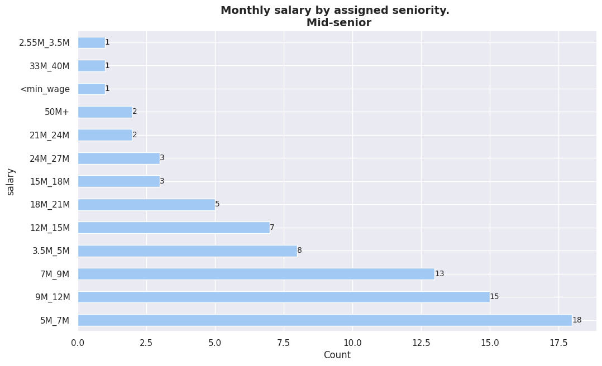


## Salarios segun - self_assessed_seniority

- El "seniority" que me asigno yo. Influye en el salario final?

column uniques for "self_assessed_seniority"

\["Junior",
"Senior",
"Principal",
"Mid-senior",
"Trainee",
"Desconozco",
"Staff"\]


## Salarios vs seniority and modality


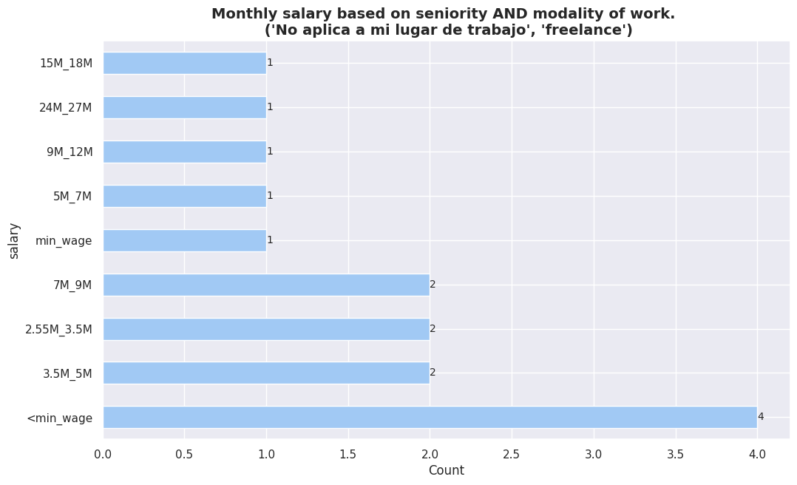


# EDUCACION

______________________________________________________________________

## Salarios segun - formal_edu

- La educacion formal influye en el salario?

column uniques for  "formal_edu"

\["doctorate", "Degree", "high_school", "master"\]


## Salarios segun - majors

- Salarios segun el "titulo".

column uniques for  "majors"

\["systems_analysis",
"programming",
"computer_engineering",
"electronic_engineering",
"graphic_design",
"mathematics",
"none",
"other",
"other ingenerías",
"civil_engineering",
"electrical_engineering"\]


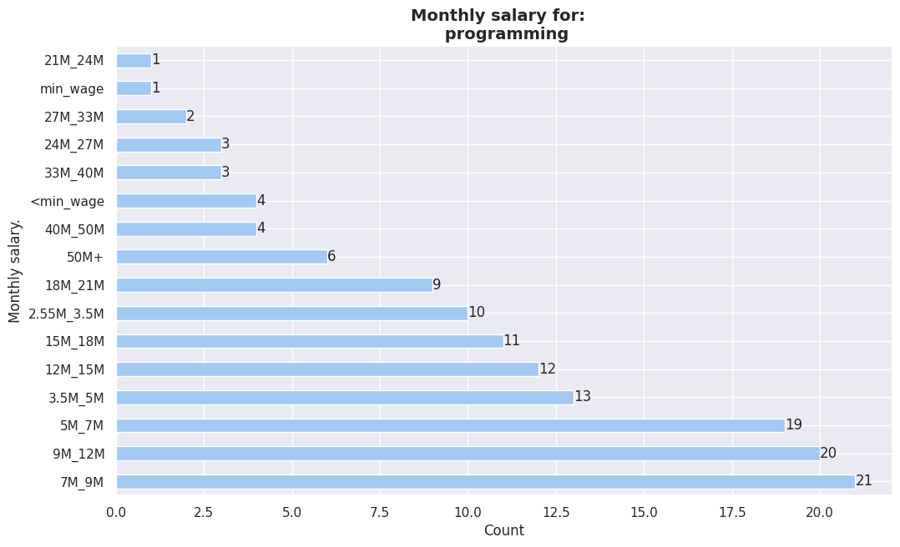


## Salarios segun - formal_edu_importance

- Percepcion sobre la "importancia de la educacion formal" influye en el salario?

column uniques for "formal_edu_importance"

\["quite_important",
"critical",
"somewhat_important",
"very_important",
"not_important"\]

```
GRUPO: critical 
 TAMAÑO: 18
=======================================================
GRUPO: not_important 
 TAMAÑO: 28
=======================================================
GRUPO: quite_important 
 TAMAÑO: 104
=======================================================
GRUPO: somewhat_important 
 TAMAÑO: 121
=======================================================
GRUPO: very_important 
 TAMAÑO: 123
=======================================================
```


# DEMOGRAPHICS

______________________________________________________________________

## Salarios segun - gender

- Salarios segun "genero".


## Salarios segun - age

- Salarios segun la edad.


# HERRAMIENTAS

______________________________________________________________________

## Salarios segun - tools

<center>
    <div class='stats_table'>
 <a id="monthly_salary_vs_tools_table_GpiFz"></a>

| Category                                                                                         | Percentage |
| ------------------------------------------------------------------------------------------------ | ---------- |
| GitLab                                                                                           | 6%         |
| Microsoft Team                                                                                   | 6%         |
| Microsoft Team, Microsoft Azure, Notion, Jira, GitHub                                            | 3%         |
| GitHub, Trello                                                                                   | 3%         |
| Microsoft Azure, Microsoft Team, Slack, GitLab                                                   | 3%         |
| Microsoft Team, Microsoft Azure                                                                  | 3%         |
| Confluence, GitHub, Facebook Workplace, Slack, GitLab, Google Suite (Docs, Meet, etc), Jira      | 3%         |
| Jira, Google Suite (Docs, Meet, etc), Slack, GitLab                                              | 3%         |
| GitHub, Trello, Slack, GitLab                                                                    | 3%         |
| Microsoft Azure, Microsoft Team                                                                  | 3%         |
| Jira, GitLab, Microsoft Team, Microsoft Azure, Trello, Google Suite (Docs, Meet, etc), GitHub    | 3%         |
| Slack, Google Suite (Docs, Meet, etc), Jira, Notion, GitLab, Microsoft Team                      | 3%         |
| Trello, Google Suite (Docs, Meet, etc), GitLab, Discord, Notion, GitHub, Jira, Slack             | 3%         |
| Jira, Slack, Google Suite (Docs, Meet, etc), GitHub                                              | 3%         |
| GitHub, Microsoft Team                                                                           | 3%         |
| Confluence, Jira, Microsoft Team, GitLab                                                         | 3%         |
| Google Suite (Docs, Meet, etc), Microsoft Team                                                   | 3%         |
| Confluence, Trello, Notion, GitHub, Jira, Google Suite (Docs, Meet, etc), Microsoft Azure, Slack | 3%         |
| Microsoft Team, Google Suite (Docs, Meet, etc)                                                   | 3%         |
| Google Suite (Docs, Meet, etc), GitHub, Trello                                                   | 3%         |
| Microsoft Team, GitLab, Jira                                                                     | 3%         |
| Slack, Google Suite (Docs, Meet, etc)                                                            | 3%         |
| Google Suite (Docs, Meet, etc), Trello                                                           | 3%         |
| Google Suite (Docs, Meet, etc), GitLab                                                           | 3%         |
| Microsoft Team, Trello                                                                           | 3%         |
| Jira, Google Suite (Docs, Meet, etc), Slack, Notion                                              | 3%         |
| GitLab, GitHub, Google Suite (Docs, Meet, etc)                                                   | 3%         |
| Slack, Trello, Microsoft Team, GitHub                                                            | 3%         |
| GitLab, Google Suite (Docs, Meet, etc)                                                           | 3%         |

<p class='table_title' style="text-align: center;"><em>Monthly salary by tools stack. 
<p class="table_subtitle">(15M_18M)<p></em></p>
  <br/>
  </div>
</center>

<center>
    <div class='stats_table'>
 <a id="monthly_salary_vs_tools_table_4sbJk"></a>

| Category                                                                               | Percentage |
| -------------------------------------------------------------------------------------- | ---------- |
| GitLab                                                                                 | 11%        |
| GitHub                                                                                 | 8%         |
| Google Suite (Docs, Meet, etc), Discord, GitHub, GitLab, Trello                        | 2%         |
| Google Suite (Docs, Meet, etc), GitHub, Microsoft Team                                 | 2%         |
| Google Suite (Docs, Meet, etc), Trello, Jira, Slack                                    | 2%         |
| GitLab, Google Suite (Docs, Meet, etc)                                                 | 2%         |
| Jira, Google Suite (Docs, Meet, etc)                                                   | 2%         |
| Notion, Trello, Jira, GitHub, Google Suite (Docs, Meet, etc), Discord                  | 2%         |
| GitHub, Google Suite (Docs, Meet, etc), Microsoft Team, Jira                           | 2%         |
| Discord, GitLab, Google Suite (Docs, Meet, etc), Jira, GitHub                          | 2%         |
| GitLab, Microsoft Team, Jira                                                           | 2%         |
| GitHub, Jira                                                                           | 2%         |
| Microsoft Team, GitHub, Discord                                                        | 2%         |
| Microsoft Team, Jira                                                                   | 2%         |
| Jira, GitHub, Google Suite (Docs, Meet, etc)                                           | 2%         |
| GitHub, Microsoft Team                                                                 | 2%         |
| Google Suite (Docs, Meet, etc)                                                         | 2%         |
| GitLab, Notion, Discord                                                                | 2%         |
| Microsoft Team, Microsoft Azure                                                        | 2%         |
| Confluence, Google Suite (Docs, Meet, etc), GitHub, Jira, Slack                        | 2%         |
| GitLab, Google Suite (Docs, Meet, etc), Jira                                           | 2%         |
| Slack, Jira, Google Suite (Docs, Meet, etc)                                            | 2%         |
| Notion, Slack, Confluence, GitHub, Discord, GitLab, Trello, Jira                       | 2%         |
| GitHub, Slack                                                                          | 2%         |
| Google Suite (Docs, Meet, etc), GitLab, Microsoft Team, GitHub                         | 2%         |
| Notion, Jira, Confluence, GitLab, Discord                                              | 2%         |
| Google Suite (Docs, Meet, etc), Facebook Workplace, Slack, Discord, Confluence, GitHub | 2%         |
| GitHub, Notion                                                                         | 2%         |
| Microsoft Team, Notion                                                                 | 2%         |
| Trello, GitHub                                                                         | 2%         |

<p class='table_title' style="text-align: center;"><em>Monthly salary by tools stack. 
<p class="table_subtitle">(3.5M_5M)<p></em></p>
   <br/>
   </div>
</center>

<center>
    <div class='stats_table'>
 <a id="monthly_salary_vs_tools_table_uE99o"></a>

| Category                                                                                            | Percentage |
| --------------------------------------------------------------------------------------------------- | ---------- |
| Facebook Workplace, Jira, GitHub, Google Suite (Docs, Meet, etc), Slack, Confluence                 | 5%         |
| Jira, Confluence, GitLab, Slack, Google Suite (Docs, Meet, etc)                                     | 5%         |
| Microsoft Team, Microsoft Azure, GitLab, Jira                                                       | 5%         |
| Microsoft Team, Jira, Slack, Confluence, Facebook Workplace, GitHub, Google Suite (Docs, Meet, etc) | 5%         |
| GitHub, Slack                                                                                       | 5%         |
| GitLab, Jira, GitHub, Microsoft Azure, Trello                                                       | 5%         |
| Google Suite (Docs, Meet, etc), Microsoft Azure, Slack                                              | 5%         |
| Google Suite (Docs, Meet, etc), Jira, Slack, GitHub, Confluence, Microsoft Team                     | 5%         |
| Google Suite (Docs, Meet, etc), Trello, Discord, Jira, GitHub, Confluence, GitLab                   | 5%         |
| Slack, GitLab, Confluence, Jira, Google Suite (Docs, Meet, etc)                                     | 5%         |
| Confluence, Jira, Trello, GitLab, GitHub, Notion, Slack                                             | 5%         |
| Confluence, Jira, Microsoft Team, GitLab, GitHub, Microsoft Azure                                   | 5%         |
| Microsoft Team                                                                                      | 5%         |
| Google Suite (Docs, Meet, etc)                                                                      | 5%         |
| Trello, Confluence, Google Suite (Docs, Meet, etc), GitHub, Microsoft Team, Jira                    | 5%         |
| Notion, GitHub, Slack, Google Suite (Docs, Meet, etc), Jira                                         | 5%         |
| Microsoft Team, GitHub, Trello, Jira, Microsoft Azure                                               | 5%         |

<p class='table_title' style="text-align: center;"><em>Monthly salary by tools stack. 
<p class="table_subtitle">(18M_21M)<p></em></p>
  <br/>
  </div>
</center>

<center>
    <div class='stats_table'>
 <a id="monthly_salary_vs_tools_table_A6whF"></a>

| Category                                                                         | Percentage |
| -------------------------------------------------------------------------------- | ---------- |
| GitHub, Confluence, Slack, Google Suite (Docs, Meet, etc), Jira                  | 8%         |
| Jira, GitHub, Microsoft Azure, Facebook Workplace, Confluence, Microsoft Team    | 8%         |
| Jira, Google Suite (Docs, Meet, etc), Microsoft Team, Slack, GitHub              | 8%         |
| Jira, GitHub, Google Suite (Docs, Meet, etc), Confluence, GitLab, Slack, Discord | 8%         |
| Google Suite (Docs, Meet, etc), Slack, Jira, GitHub                              | 8%         |
| Slack, Confluence, Google Suite (Docs, Meet, etc), Notion, GitHub, Jira          | 8%         |
| Notion, Confluence, Slack, Google Suite (Docs, Meet, etc), GitLab, GitHub, Jira  | 8%         |
| GitHub, Slack, Google Suite (Docs, Meet, etc)                                    | 8%         |
| Google Suite (Docs, Meet, etc), Notion, Discord, Slack, Trello, GitHub, Jira     | 8%         |
| Google Suite (Docs, Meet, etc), Slack, GitHub, Jira, Confluence                  | 8%         |
| Jira, Confluence, Microsoft Team, Google Suite (Docs, Meet, etc), Slack, GitHub  | 8%         |
| GitHub, Notion, Slack, Jira                                                      | 8%         |

<p class='table_title' style="text-align: center;"><em>Monthly salary by tools stack. 
<p class="table_subtitle">(33M_40M)<p></em></p>
   <br/>
   </div>
</center>

<center>
     <div class='stats_table'>
 <a id="monthly_salary_vs_tools_table_xZtw2"></a>

| Category                                                                                                   | Percentage |
| ---------------------------------------------------------------------------------------------------------- | ---------- |
| Google Suite (Docs, Meet, etc), Slack, GitHub, GitLab                                                      | 12%        |
| Jira, Slack, GitLab, Confluence, Microsoft Team                                                            | 12%        |
| Jira, Microsoft Azure, GitHub, Trello, Discord, Microsoft Team, Google Suite (Docs, Meet, etc), Confluence | 12%        |
| Discord, GitLab, Google Suite (Docs, Meet, etc), Slack, Confluence, Jira                                   | 12%        |
| Google Suite (Docs, Meet, etc), Confluence, Jira, Microsoft Team                                           | 12%        |
| GitHub, Slack                                                                                              | 12%        |
| Slack, Confluence, GitHub, Google Suite (Docs, Meet, etc), Jira                                            | 12%        |
| Microsoft Team, Slack, GitHub, Google Suite (Docs, Meet, etc), Confluence, Jira                            | 12%        |

<p class='table_title' style="text-align: center;"><em>Monthly salary by tools stack. 
<p class="table_subtitle">(40M_50M)<p></em></p>
  <br/>
  </div>
</center>

<center>
    <div class='stats_table'>
 <a id="monthly_salary_vs_tools_table_HAXyL"></a>

| Category                                                                                                                  | Percentage |
| ------------------------------------------------------------------------------------------------------------------------- | ---------- |
| Google Suite (Docs, Meet, etc), GitLab, Slack                                                                             | 5%         |
| GitLab, Microsoft Team, Jira, Microsoft Azure, Google Suite (Docs, Meet, etc), Trello, GitHub, Slack, Discord, Confluence | 5%         |
| Jira                                                                                                                      | 5%         |
| Jira, Microsoft Team, Google Suite (Docs, Meet, etc)                                                                      | 5%         |
| GitHub, Jira, Google Suite (Docs, Meet, etc), Slack, Confluence                                                           | 5%         |
| Confluence, Jira, Slack, Google Suite (Docs, Meet, etc), GitHub                                                           | 5%         |
| GitHub, Confluence, Jira, GitLab, Slack, Microsoft Team, Google Suite (Docs, Meet, etc)                                   | 5%         |
| Slack, Google Suite (Docs, Meet, etc), Jira, GitLab                                                                       | 5%         |
| GitHub, Trello, Google Suite (Docs, Meet, etc), Jira, Notion, Slack                                                       | 5%         |
| Slack, Notion, Jira, Google Suite (Docs, Meet, etc), GitHub                                                               | 5%         |
| Slack, Trello, GitHub, Confluence                                                                                         | 5%         |
| GitHub, GitLab, Google Suite (Docs, Meet, etc)                                                                            | 5%         |
| Slack, GitHub, Confluence, Google Suite (Docs, Meet, etc), Jira                                                           | 5%         |
| Microsoft Team, GitLab, Google Suite (Docs, Meet, etc), Trello, Slack, Confluence, GitHub, Jira                           | 5%         |
| Jira, Slack, Confluence, Microsoft Team, GitHub, Google Suite (Docs, Meet, etc)                                           | 5%         |
| Slack, GitLab, Google Suite (Docs, Meet, etc), Microsoft Team, GitHub, Jira                                               | 5%         |
| Microsoft Azure, Microsoft Team                                                                                           | 5%         |

<p class='table_title' style="text-align: center;"><em>Monthly salary by tools stack. 
<p class="table_subtitle">(50M+)<p></em></p>
   <br/>
   </div>
</center>

<center>
    <div class='stats_table'>
 <a id="monthly_salary_vs_tools_table_oVccg"></a>

| Category                                                                                                     | Percentage |
| ------------------------------------------------------------------------------------------------------------ | ---------- |
| GitHub, GitLab                                                                                               | 4%         |
| Microsoft Team                                                                                               | 4%         |
| GitLab, GitHub                                                                                               | 4%         |
| Jira, Microsoft Team, GitLab                                                                                 | 2%         |
| GitLab, Jira, Microsoft Team                                                                                 | 2%         |
| Google Suite (Docs, Meet, etc)                                                                               | 2%         |
| GitLab                                                                                                       | 2%         |
| Discord                                                                                                      | 2%         |
| Google Suite (Docs, Meet, etc), Slack, GitHub                                                                | 2%         |
| Google Suite (Docs, Meet, etc), Confluence, Jira, Slack                                                      | 2%         |
| GitLab, Microsoft Team, Slack                                                                                | 2%         |
| Notion, GitLab, GitHub                                                                                       | 2%         |
| GitLab, Google Suite (Docs, Meet, etc), GitHub                                                               | 2%         |
| GitHub, GitLab, Microsoft Team                                                                               | 2%         |
| Slack, Confluence, Jira, Microsoft Team, GitLab                                                              | 2%         |
| Confluence, Google Suite (Docs, Meet, etc), GitLab, Slack, Jira, GitHub                                      | 2%         |
| GitHub, Jira, Google Suite (Docs, Meet, etc), Confluence, Slack, Notion                                      | 2%         |
| Google Suite (Docs, Meet, etc), GitLab                                                                       | 2%         |
| Jira, GitLab, Confluence, Microsoft Team                                                                     | 2%         |
| Google Suite (Docs, Meet, etc), GitLab, GitHub                                                               | 2%         |
| Trello, Microsoft Team, Jira, GitLab                                                                         | 2%         |
| Confluence, Microsoft Team, Jira                                                                             | 2%         |
| Google Suite (Docs, Meet, etc), Notion, Slack, Discord, GitHub                                               | 2%         |
| Discord, GitLab                                                                                              | 2%         |
| Microsoft Azure, GitHub, Google Suite (Docs, Meet, etc), Trello, GitLab, Notion, Slack                       | 2%         |
| Jira, GitHub, Slack, Confluence, Trello, GitLab                                                              | 2%         |
| Google Suite (Docs, Meet, etc), GitHub                                                                       | 2%         |
| GitHub, Jira, Slack, Microsoft Team                                                                          | 2%         |
| Microsoft Team, Jira, Google Suite (Docs, Meet, etc)                                                         | 2%         |
| Google Suite (Docs, Meet, etc), Notion, Jira, GitHub                                                         | 2%         |
| Facebook Workplace, Google Suite (Docs, Meet, etc), Notion, Discord, Slack, GitLab, Confluence, GitHub, Jira | 2%         |
| Notion, Discord, Confluence, GitLab, Google Suite (Docs, Meet, etc), Jira, Trello                            | 2%         |
| GitHub, Slack, GitLab, Microsoft Team, Google Suite (Docs, Meet, etc), Microsoft Azure                       | 2%         |
| Microsoft Team, GitHub, Jira                                                                                 | 2%         |
| Trello, GitHub, Google Suite (Docs, Meet, etc)                                                               | 2%         |
| GitHub, Trello, Microsoft Team, Notion                                                                       | 2%         |
| Confluence, GitLab, Jira, Slack, GitHub                                                                      | 2%         |
| GitLab, Jira, Microsoft Team, Discord, Slack                                                                 | 2%         |
| Google Suite (Docs, Meet, etc), GitHub, Jira, Trello, Confluence                                             | 2%         |
| Jira, Confluence                                                                                             | 2%         |
| Notion, Slack                                                                                                | 2%         |
| Trello, Microsoft Team, GitLab                                                                               | 2%         |
| Google Suite (Docs, Meet, etc), Confluence, Slack, Jira, GitHub, Microsoft Azure                             | 2%         |
| GitHub                                                                                                       | 2%         |

<p class='table_title' style="text-align: center;"><em>Monthly salary by tools stack. 
<p class="table_subtitle">(7M_9M)<p></em></p>
  <br/>
  </div>
</center>

<center>
    <div class='stats_table'>
 <a id="monthly_salary_vs_tools_table_zU9rT"></a>

| Category                                                                                          | Percentage |
| ------------------------------------------------------------------------------------------------- | ---------- |
| GitHub                                                                                            | 3%         |
| Microsoft Team                                                                                    | 3%         |
| Notion, Google Suite (Docs, Meet, etc), Confluence, Microsoft Team                                | 1%         |
| GitHub, Google Suite (Docs, Meet, etc), Confluence, Jira                                          | 1%         |
| Jira, Google Suite (Docs, Meet, etc), GitLab, Slack, Trello, GitHub                               | 1%         |
| Microsoft Team, Microsoft Azure, Discord, Notion                                                  | 1%         |
| Jira, Microsoft Team, Discord, GitLab, Microsoft Azure                                            | 1%         |
| Trello, Google Suite (Docs, Meet, etc), Microsoft Team, Jira                                      | 1%         |
| Trello, Microsoft Team                                                                            | 1%         |
| Jira, Microsoft Azure, Microsoft Team                                                             | 1%         |
| Microsoft Azure, Microsoft Team, Jira, Confluence, Google Suite (Docs, Meet, etc), GitHub, GitLab | 1%         |
| GitHub, GitLab, Google Suite (Docs, Meet, etc)                                                    | 1%         |
| Trello, Confluence, GitHub, Jira, Discord, GitLab, Slack, Microsoft Team                          | 1%         |
| GitHub, Google Suite (Docs, Meet, etc)                                                            | 1%         |
| Microsoft Team, GitHub, Discord, Trello, Notion                                                   | 1%         |
| GitLab, GitHub, Notion, Discord, Google Suite (Docs, Meet, etc)                                   | 1%         |
| Trello, Google Suite (Docs, Meet, etc), GitHub                                                    | 1%         |
| Notion, Google Suite (Docs, Meet, etc), GitHub                                                    | 1%         |
| Jira, Microsoft Team, GitHub, Confluence                                                          | 1%         |
| Trello                                                                                            | 1%         |
| GitLab, Discord, Google Suite (Docs, Meet, etc), Notion, Trello, GitHub, Microsoft Team           | 1%         |
| Google Suite (Docs, Meet, etc), Microsoft Team, Trello                                            | 1%         |
| Confluence, Trello, Slack, GitHub, GitLab, Google Suite (Docs, Meet, etc)                         | 1%         |
| Trello, Slack, Google Suite (Docs, Meet, etc), Notion, GitHub, Jira, Discord                      | 1%         |
| Jira, Microsoft Team, Slack, Google Suite (Docs, Meet, etc), GitLab, Confluence                   | 1%         |
| Microsoft Team, GitHub, Google Suite (Docs, Meet, etc)                                            | 1%         |
| Jira, GitHub, Confluence                                                                          | 1%         |
| Trello, GitLab, Confluence, Google Suite (Docs, Meet, etc), Slack, Jira                           | 1%         |
| Slack, Jira, Google Suite (Docs, Meet, etc), Microsoft Team, GitLab                               | 1%         |
| GitHub, Notion, Trello, Google Suite (Docs, Meet, etc)                                            | 1%         |
| Google Suite (Docs, Meet, etc), GitHub, Trello, Slack                                             | 1%         |
| GitLab, Slack                                                                                     | 1%         |
| Microsoft Team, Jira                                                                              | 1%         |
| Microsoft Team, GitLab                                                                            | 1%         |
| Google Suite (Docs, Meet, etc), Jira, Confluence, GitLab, Slack, GitHub                           | 1%         |
| Jira, GitHub, GitLab                                                                              | 1%         |
| Discord, Jira, Trello, GitHub, Slack                                                              | 1%         |
| GitLab, Microsoft Team, Google Suite (Docs, Meet, etc)                                            | 1%         |
| Slack, Jira, Confluence, GitHub                                                                   | 1%         |
| GitLab, Microsoft Team, Google Suite (Docs, Meet, etc), GitHub, Jira                              | 1%         |
| GitHub, Slack, Google Suite (Docs, Meet, etc)                                                     | 1%         |
| Trello, GitHub, Jira                                                                              | 1%         |
| Slack, Confluence, Jira, GitHub, Google Suite (Docs, Meet, etc), Facebook Workplace               | 1%         |
| GitHub, Slack, Jira, Google Suite (Docs, Meet, etc), Confluence, Facebook Workplace               | 1%         |
| GitLab, Confluence, Microsoft Azure, Jira, GitHub, Microsoft Team                                 | 1%         |
| GitHub, Jira, GitLab                                                                              | 1%         |
| Microsoft Team, Jira, Slack, Trello, Confluence                                                   | 1%         |
| Microsoft Team, Jira, Confluence                                                                  | 1%         |
| GitLab                                                                                            | 1%         |
| Confluence, GitLab, Microsoft Team                                                                | 1%         |
| Microsoft Team, GitLab, Jira, Slack, Notion                                                       | 1%         |
| Slack, GitHub, Google Suite (Docs, Meet, etc), Microsoft Team, Jira                               | 1%         |
| Slack, Jira, Google Suite (Docs, Meet, etc), GitHub                                               | 1%         |

<p class='table_title' style="text-align: center;"><em>Monthly salary by tools stack. 
<p class="table_subtitle">(9M_12M)<p></em></p>
   <br/>
   </div>
</center>

<center>
    <div class='stats_table'>
 <a id="monthly_salary_vs_tools_table_WDoxq"></a>

| Category                                                                                                                     | Percentage |
| ---------------------------------------------------------------------------------------------------------------------------- | ---------- |
| Google Suite (Docs, Meet, etc), Slack, Confluence, Jira, Microsoft Team, Facebook Workplace, Discord, Trello, Notion, GitHub | 7%         |
| Jira, GitLab, Confluence, Google Suite (Docs, Meet, etc), Microsoft Team, GitHub                                             | 7%         |
| Slack, GitHub, GitLab, Trello, Microsoft Team                                                                                | 7%         |
| GitLab, Slack, Jira, Google Suite (Docs, Meet, etc), GitHub                                                                  | 7%         |
| GitHub, GitLab, Slack, Jira, Confluence                                                                                      | 7%         |
| GitHub, Jira, Google Suite (Docs, Meet, etc), Trello, Microsoft Team                                                         | 7%         |
| Jira, Notion, Slack, GitLab, Google Suite (Docs, Meet, etc)                                                                  | 7%         |
| Jira, GitLab, Slack                                                                                                          | 7%         |
| Google Suite (Docs, Meet, etc), Trello, GitHub                                                                               | 7%         |
| Jira, Google Suite (Docs, Meet, etc), GitHub, Slack, Confluence                                                              | 7%         |
| Confluence, Jira, GitHub, Microsoft Azure, GitLab, Microsoft Team                                                            | 7%         |
| Jira, Microsoft Team, Slack, Discord, GitLab, Confluence                                                                     | 7%         |
| Microsoft Team, Google Suite (Docs, Meet, etc), GitLab, Slack, Jira                                                          | 7%         |
| GitHub, Slack, Google Suite (Docs, Meet, etc), GitLab                                                                        | 7%         |

<p class='table_title' style="text-align: center;"><em>Monthly salary by tools stack. 
<p class="table_subtitle">(24M_27M)<p></em></p>
  <br/>
  </div>
</center>

<center>
    <div class='stats_table'>
 <a id="monthly_salary_vs_tools_table_i48kx"></a>

| Category                                                              | Percentage |
| --------------------------------------------------------------------- | ---------- |
| Jira, Trello, GitHub, Notion, Google Suite (Docs, Meet, etc), Discord | 33%        |
| Discord, GitHub                                                       | 33%        |
| Discord                                                               | 33%        |

<p class='table_title' style="text-align: center;"><em>Monthly salary by tools stack. 
<p class="table_subtitle">(min_wage)<p></em></p>
  <br/>
  </div>
</center>

<center>
    <div class='stats_table'>
 <a id="monthly_salary_vs_tools_table_sBvz1"></a>

| Category                                                                                | Percentage |
| --------------------------------------------------------------------------------------- | ---------- |
| GitHub                                                                                  | 8%         |
| Google Suite (Docs, Meet, etc), GitHub                                                  | 8%         |
| Discord, Google Suite (Docs, Meet, etc), Trello, GitHub                                 | 4%         |
| GitHub, Google Suite (Docs, Meet, etc)                                                  | 4%         |
| GitHub, Discord, Trello                                                                 | 4%         |
| Trello, Microsoft Team, Jira, Discord, GitLab, Slack, GitHub                            | 4%         |
| GitHub, GitLab                                                                          | 4%         |
| Slack                                                                                   | 4%         |
| Slack, GitHub, Jira, Confluence, Google Suite (Docs, Meet, etc)                         | 4%         |
| Microsoft Team, GitHub, Discord                                                         | 4%         |
| Microsoft Team                                                                          | 4%         |
| Discord, GitHub, Jira, Google Suite (Docs, Meet, etc)                                   | 4%         |
| Discord, GitHub, Notion                                                                 | 4%         |
| GitHub, Microsoft Team, Confluence, Jira, Slack, Google Suite (Docs, Meet, etc), GitLab | 4%         |
| Slack, GitLab, GitHub, Confluence                                                       | 4%         |
| Google Suite (Docs, Meet, etc), Slack, Trello, GitHub, Discord                          | 4%         |
| Slack, GitHub                                                                           | 4%         |
| Jira, GitHub                                                                            | 4%         |
| Trello, Microsoft Team, Jira                                                            | 4%         |
| Google Suite (Docs, Meet, etc)                                                          | 4%         |
| Microsoft Azure, Discord, Jira, GitHub, Google Suite (Docs, Meet, etc)                  | 4%         |
| Confluence, GitHub, Slack, Jira                                                         | 4%         |
| Trello, Jira, GitLab                                                                    | 4%         |

<p class='table_title' style="text-align: center;"><em>Monthly salary by tools stack. 
<p class="table_subtitle">(2.55M_3.5M)<p></em></p>
  <br/>
  </div>
</center>

<center>
    <div class='stats_table'>
 <a id="monthly_salary_vs_tools_table_jlGyo"></a>

| Category                                                                             | Percentage |
| ------------------------------------------------------------------------------------ | ---------- |
| GitHub                                                                               | 3%         |
| GitHub, Microsoft Team, Jira                                                         | 3%         |
| Jira, Google Suite (Docs, Meet, etc), Confluence, Slack                              | 3%         |
| Confluence, Jira, GitLab, Slack                                                      | 3%         |
| GitHub, Slack, Trello, GitLab                                                        | 3%         |
| Confluence, GitLab                                                                   | 3%         |
| Jira, Google Suite (Docs, Meet, etc), Microsoft Team                                 | 3%         |
| Slack, Jira, Microsoft Team, GitHub, Google Suite (Docs, Meet, etc)                  | 3%         |
| Notion, Trello, GitLab                                                               | 3%         |
| Google Suite (Docs, Meet, etc), GitHub                                               | 3%         |
| Jira, Microsoft Team, GitLab, Slack                                                  | 3%         |
| Google Suite (Docs, Meet, etc), Microsoft Team, GitLab, Jira, Confluence, Slack      | 3%         |
| Slack, Microsoft Team                                                                | 3%         |
| Slack, Jira, Confluence, GitHub                                                      | 3%         |
| Facebook Workplace, Confluence, Microsoft Team, Slack, GitLab, Discord, Jira, GitHub | 3%         |
| Discord, GitHub                                                                      | 3%         |
| Confluence, Jira, GitLab, Slack, Google Suite (Docs, Meet, etc), GitHub              | 3%         |
| Microsoft Team, Notion, Google Suite (Docs, Meet, etc)                               | 3%         |
| GitLab, GitHub, Jira, Google Suite (Docs, Meet, etc), Slack                          | 3%         |
| GitLab, Google Suite (Docs, Meet, etc), GitHub, Jira, Trello, Slack, Microsoft Team  | 3%         |
| GitLab, Microsoft Team, Google Suite (Docs, Meet, etc), GitHub                       | 3%         |
| Trello, GitLab, Notion                                                               | 3%         |
| Confluence, Jira, GitLab                                                             | 3%         |
| Confluence, Facebook Workplace, Jira, Google Suite (Docs, Meet, etc), Slack, GitLab  | 3%         |
| Microsoft Azure, Confluence, Microsoft Team, Jira                                    | 3%         |
| Jira, Microsoft Team, Slack, GitHub, Confluence                                      | 3%         |
| Google Suite (Docs, Meet, etc), Jira, Confluence                                     | 3%         |
| GitHub, Discord, GitLab, Jira, Confluence, Microsoft Team                            | 3%         |
| Jira, Google Suite (Docs, Meet, etc), Slack                                          | 3%         |
| Jira, GitLab, Microsoft Team                                                         | 3%         |
| Microsoft Team, Facebook Workplace, Slack, Jira, GitHub                              | 3%         |
| Google Suite (Docs, Meet, etc)                                                       | 3%         |

<p class='table_title' style="text-align: center;"><em>Monthly salary by tools stack. 
<p class="table_subtitle">(12M_15M)<p></em></p>
  <br/>
  </div>
</center>

<center>
     <div class='stats_table'>
 <a id="monthly_salary_vs_tools_table_puovK"></a>

| Category                                                                                                             | Percentage |
| -------------------------------------------------------------------------------------------------------------------- | ---------- |
| GitHub                                                                                                               | 4%         |
| GitLab, GitHub, Trello                                                                                               | 4%         |
| Microsoft Team, Google Suite (Docs, Meet, etc)                                                                       | 4%         |
| Google Suite (Docs, Meet, etc)                                                                                       | 2%         |
| Google Suite (Docs, Meet, etc), Microsoft Team                                                                       | 2%         |
| Jira, Microsoft Team, Discord, GitHub                                                                                | 2%         |
| Discord                                                                                                              | 2%         |
| Discord, GitLab, Microsoft Team, GitHub                                                                              | 2%         |
| Microsoft Team, GitHub, Slack, Google Suite (Docs, Meet, etc), Jira                                                  | 2%         |
| Microsoft Azure, GitLab, Jira, Notion, GitHub                                                                        | 2%         |
| Jira, Google Suite (Docs, Meet, etc), GitHub, Confluence                                                             | 2%         |
| GitLab, GitHub, Notion                                                                                               | 2%         |
| Notion, Microsoft Team, Google Suite (Docs, Meet, etc)                                                               | 2%         |
| Notion, Google Suite (Docs, Meet, etc), Slack, GitHub, Jira, Discord                                                 | 2%         |
| GitLab                                                                                                               | 2%         |
| Google Suite (Docs, Meet, etc), Microsoft Team, Slack, GitHub, Discord, Jira                                         | 2%         |
| Slack, Google Suite (Docs, Meet, etc), Jira, GitHub                                                                  | 2%         |
| Confluence, GitLab, Jira, Microsoft Team                                                                             | 2%         |
| GitHub, Discord, Slack, Confluence, Trello, GitLab                                                                   | 2%         |
| Google Suite (Docs, Meet, etc), Confluence, Microsoft Team, Notion, GitHub, Slack, Discord, Jira, Facebook Workplace | 2%         |
| Jira, GitLab, Slack, Trello                                                                                          | 2%         |
| Jira, GitHub, Confluence, Slack                                                                                      | 2%         |
| Jira, GitLab, Slack                                                                                                  | 2%         |
| Notion, Google Suite (Docs, Meet, etc), GitHub, GitLab, Trello, Discord                                              | 2%         |
| Microsoft Azure, Microsoft Team                                                                                      | 2%         |
| GitHub, Google Suite (Docs, Meet, etc), Jira                                                                         | 2%         |
| Microsoft Team, Microsoft Azure                                                                                      | 2%         |
| Discord, Google Suite (Docs, Meet, etc)                                                                              | 2%         |
| Slack, Google Suite (Docs, Meet, etc), GitHub                                                                        | 2%         |
| Google Suite (Docs, Meet, etc), Slack, Trello, Jira, Discord                                                         | 2%         |
| Microsoft Team, Discord, Notion                                                                                      | 2%         |
| Discord, GitHub, Jira, Confluence, Slack                                                                             | 2%         |
| Microsoft Team, GitHub                                                                                               | 2%         |
| Microsoft Team, Microsoft Azure, GitHub                                                                              | 2%         |
| Google Suite (Docs, Meet, etc), GitHub, Microsoft Team, Notion, GitLab, Jira                                         | 2%         |
| Microsoft Azure, GitHub, Microsoft Team                                                                              | 2%         |
| Notion, GitHub, Microsoft Team                                                                                       | 2%         |
| Discord, Trello, Slack, GitHub                                                                                       | 2%         |
| GitLab, Google Suite (Docs, Meet, etc), GitHub, Jira                                                                 | 2%         |
| Slack, Jira, Confluence, GitHub                                                                                      | 2%         |
| Slack, Jira, Microsoft Team, GitHub                                                                                  | 2%         |
| GitLab, GitHub                                                                                                       | 2%         |
| GitHub, Jira, Slack                                                                                                  | 2%         |
| Discord, GitHub                                                                                                      | 2%         |
| GitHub, Google Suite (Docs, Meet, etc), Jira, Slack, GitLab                                                          | 2%         |

<p class='table_title' style="text-align: center;"><em>Monthly salary by tools stack. 
<p class="table_subtitle">(5M_7M)<p></em></p>
  <br/>
  </div>
</center>

<center>
    <div class='stats_table'>
 <a id="monthly_salary_vs_tools_table_pS9mb"></a>

| Category                                                                                          | Percentage |
| ------------------------------------------------------------------------------------------------- | ---------- |
| Microsoft Team, Jira, Confluence, Microsoft Azure, GitLab, Google Suite (Docs, Meet, etc)         | 12%        |
| GitHub, Microsoft Team, Google Suite (Docs, Meet, etc), Confluence, Jira, GitLab, Microsoft Azure | 12%        |
| Discord, Slack, Notion, Google Suite (Docs, Meet, etc), Jira, Microsoft Team, GitHub              | 12%        |
| GitLab, Slack, Trello, Confluence, GitHub, Jira, Google Suite (Docs, Meet, etc)                   | 12%        |
| Confluence, Slack, Jira, Discord, GitHub, Google Suite (Docs, Meet, etc)                          | 12%        |
| Google Suite (Docs, Meet, etc), Slack, GitHub                                                     | 12%        |
| Google Suite (Docs, Meet, etc), Notion, Slack                                                     | 12%        |
| GitHub, Slack, Notion                                                                             | 12%        |

<p class='table_title' style="text-align: center;"><em>Monthly salary by tools stack. 
<p class="table_subtitle">(21M_24M)<p></em></p>
  <br/>
  </div>
</center>

<center>
    <div class='stats_tab'>
 <a id="monthly_salary_vs_tools_table_aP1SN"></a>

| Category                                                                                        | Percentage |
| ----------------------------------------------------------------------------------------------- | ---------- |
| Microsoft Team, Microsoft Azure, Slack, Jira                                                    | 10%        |
| GitHub, Microsoft Team, Trello                                                                  | 10%        |
| GitLab, Slack, Google Suite (Docs, Meet, etc)                                                   | 10%        |
| Slack, Notion, GitHub, GitLab, Confluence, Google Suite (Docs, Meet, etc), Jira, Microsoft Team | 10%        |
| GitHub, Microsoft Azure, Slack, Notion, Google Suite (Docs, Meet, etc)                          | 10%        |
| Confluence, Slack, Microsoft Team, Jira, GitHub, Notion, Facebook Workplace                     | 10%        |
| Slack, Google Suite (Docs, Meet, etc), GitLab                                                   | 10%        |
| GitLab, Microsoft Team, Microsoft Azure, Confluence, Jira, Slack                                | 10%        |
| GitHub, Slack, Confluence, Notion, Facebook Workplace, Jira                                     | 10%        |
| GitHub, Slack, Microsoft Team                                                                   | 10%        |

<p class='table_title' style="text-align: center;"><em>Monthly salary by tools stack. 
<p class="table_subtitle">(27M_33M)<p></em></p>
   <br/>
   </div>
</center>

<center>
     <div class='stats_table'>
 <a id="monthly_salary_vs_tools_table_Rroy6"></a>

| Category                                        | Percentage |
| ----------------------------------------------- | ---------- |
| GitHub                                          | 33%        |
| GitHub, Google Suite (Docs, Meet, etc), Discord | 16%        |
| Discord, GitHub                                 | 16%        |
| Discord, GitHub, Google Suite (Docs, Meet, etc) | 16%        |
| GitLab, Discord, GitHub, Microsoft Team         | 16%        |

<p class='table_title' style="text-align: center;"><em>Monthly salary by tools stack. 
<p class="table_subtitle">(les_than_minimum_wage)<p></em></p>
   <br/>
   </div>
</center>

## Salarios segun - other_tools

- Salarios segun las herramientas que utiliza.

<center>
    <div class='stats_table'>
 <a id="monthly_salary_vs_other_tools_table_Z85eD"></a>

| Category                                 | Percentage |
| ---------------------------------------- | ---------- |
| Node.js                                  | 22%        |
| .NET                                     | 13%        |
| Flutter                                  | 9%         |
| Node.js, Flutter                         | 9%         |
| .NET, NET Core, Xamarin                  | 9%         |
| Pandas, TensorFlow, Keras, Torch/PyTorch | 4%         |
| Node.js, React Native                    | 4%         |
| Pandas, Torch/PyTorch                    | 4%         |
| Node.js, Ansible                         | 4%         |
| Node.js, Ansible, Puppet                 | 4%         |
| Node.js, Pandas                          | 4%         |
| .NET, NET Core, Pandas                   | 4%         |
| .NET, NET Core                           | 4%         |

<p class='table_title' style="text-align: center;"><em>Monthly salary by "other tools" stack. 
<p class="table_subtitle">(15M_18M)<p></em></p>
  <br/>
  </div>
</center>

<center>
     <div class='stats_table'>
 <a id="monthly_salary_vs_other_tools_table_rXmXA"></a>

| Category                                                 | Percentage |
| -------------------------------------------------------- | ---------- |
| Node.js                                                  | 37%        |
| Node.js, Flutter                                         | 12%        |
| Flutter                                                  | 8%         |
| Node.js, React Native                                    | 8%         |
| Node.js, .NET, NET Core, Pandas                          | 4%         |
| Node.js, Pandas, TensorFlow, React Native, Torch/PyTorch | 4%         |
| Pandas                                                   | 4%         |
| Node.js, Pandas, Torch/PyTorch                           | 4%         |
| .NET, NET Core                                           | 4%         |
| Node.js, NET Core                                        | 4%         |
| Node.js, .NET, NET Core                                  | 4%         |
| .NET                                                     | 4%         |

<p class='table_title' style="text-align: center;"><em>Monthly salary by "other tools" stack. 
<p class="table_subtitle">(3.5M_5M)<p></em></p>
  <br/>
  </div>
</center>

<center>
    <div class='stats_table'>
<a id="monthly_salary_vs_other_tools_table_RFvTg"></a>

| Category                            | Percentage |
| ----------------------------------- | ---------- |
| Node.js                             | 46%        |
| NET Core, TensorFlow, Torch/PyTorch | 7%         |
| .NET, React Native                  | 7%         |
| .NET, NET Core                      | 7%         |
| Flutter                             | 7%         |
| React Native, Torch/PyTorch         | 7%         |
| Node.js, React Native               | 7%         |
| Node.js, .NET                       | 7%         |

<p class='table_title' style="text-align: center;"><em>Monthly salary by "other tools" stack. 
<p class="table_subtitle">(18M_21M)<p></em></p>
  <br/>
  </div>
</center>

<center>
     <div class='stats_table'>
 <a id="monthly_salary_vs_other_tools_table_stOQp"></a>

| Category                                    | Percentage |
| ------------------------------------------- | ---------- |
| Node.js                                     | 37%        |
| Node.js, Ansible                            | 12%        |
| Pandas, Torch/PyTorch                       | 12%        |
| Node.js, Flutter                            | 12%        |
| Node.js, Pandas, TensorFlow, Hadoop, Puppet | 12%        |
| React Native                                | 12%        |

<p class='table_title' style="text-align: center;"><em>Monthly salary by "other tools" stack. 
<p class="table_subtitle">(33M_40M)<p></em></p>
  <br/>
  </div>
</center>

<center>
    <div class='stats_table'>
 <a id="monthly_salary_vs_other_tools_table_3xNbK"></a>

| Category               | Percentage |
| ---------------------- | ---------- |
| Node.js                | 33%        |
| Pandas, TensorFlow     | 16%        |
| Pandas, Hadoop         | 16%        |
| Flutter                | 16%        |
| .NET, Flutter, Cordova | 16%        |

<p class='table_title' style="text-align: center;"><em>Monthly salary by "other tools" stack. 
<p class="table_subtitle">(40M_50M)<p></em></p>
  <br/>
  </div>
</center>

<center>
     <div class='stats_table'>
  <a id="monthly_salary_vs_other_tools_table_h17d7"></a>

| Category                               | Percentage |
| -------------------------------------- | ---------- |
| Node.js                                | 28%        |
| Node.js, React Native                  | 14%        |
| Node.js, Flutter                       | 7%         |
| Node.js, Ansible, Puppet, Chef         | 7%         |
| Pandas, Ansible, Torch/PyTorch, Hadoop | 7%         |
| Unity 3D                               | 7%         |
| Pandas                                 | 7%         |
| Node.js, Pandas, React Native, Cordova | 7%         |
| Ansible                                | 7%         |
| Flutter                                | 7%         |

<p class='table_title' style="text-align: center;"><em>Monthly salary by "other tools" stack. 
<p class="table_subtitle">(50M+)<p></em></p>
   <br/>
   </div>
</center>

<center>
    <div class='stats_table'>
  <a id="monthly_salary_vs_other_tools_table_HoUw3"></a>

| Category                                              | Percentage |
| ----------------------------------------------------- | ---------- |
| Node.js                                               | 31%        |
| Node.js, React Native                                 | 12%        |
| .NET                                                  | 9%         |
| Flutter                                               | 9%         |
| Pandas                                                | 9%         |
| Node.js, React Native, Flutter                        | 6%         |
| Node.js, Pandas                                       | 3%         |
| Unity 3D                                              | 3%         |
| Node.js, Pandas, React Native, Flutter, Cordova       | 3%         |
| Node.js, Flutter                                      | 3%         |
| React Native                                          | 3%         |
| .NET, NET Core                                        | 3%         |
| Node.js, TensorFlow, Unity 3D, Cordova, Unreal Engine | 3%         |

<p class='table_title' style="text-align: center;"><em>Monthly salary by "other tools" stack. 
 <p class="table_subtitle">(7M_9M)<p></em></p>
   <br/>
   </div>
</center>

<center>
    <div class='stats_table'>
  <a id="monthly_salary_vs_other_tools_table_TzEuW"></a>

| Category                          | Percentage |
| --------------------------------- | ---------- |
| Node.js                           | 16%        |
| .NET, NET Core                    | 13%        |
| .NET                              | 11%        |
| Ansible                           | 8%         |
| Pandas                            | 8%         |
| Node.js, React Native, Flutter    | 8%         |
| Node.js, Flutter                  | 5%         |
| Flutter, Cordova                  | 2%         |
| .NET, Flutter                     | 2%         |
| Node.js, Pandas, Hadoop           | 2%         |
| Node.js, TensorFlow               | 2%         |
| NET Core                          | 2%         |
| React Native                      | 2%         |
| Pandas, TensorFlow, Torch/PyTorch | 2%         |
| Flutter                           | 2%         |
| .NET, NET Core, Flutter           | 2%         |
| Node.js, React Native             | 2%         |

<p class='table_title' style="text-align: center;"><em>Monthly salary by "other tools" stack. 
<p class="table_subtitle">(9M_12M)<p></em></p>
  <br/>
  </div>
</center>

<center>
      <div class='stats_table'>
  <a id="monthly_salary_vs_other_tools_table_zB2pS"></a>

| Category                                    | Percentage |
| ------------------------------------------- | ---------- |
| Node.js                                     | 37%        |
| Node.js, Flutter, Cordova                   | 12%        |
| Node.js, Pandas, TensorFlow, Flutter, Keras | 12%        |
| Node.js, React Native                       | 12%        |
| .NET, NET Core                              | 12%        |
| Pandas                                      | 12%        |

<p class='table_title' style="text-align: center;"><em>Monthly salary by "other tools" stack. 
<p class="table_subtitle">(24M_27M)<p></em></p>
 <br/>
 </div>
</center>

<center>
    <div class='stats_table'>
 <a id="monthly_salary_vs_other_tools_table_mNVuW"></a>

| Category | Percentage |
| -------- | ---------- |
| Pandas   | 50%        |
| Node.js  | 50%        |

<p class='table_title' style="text-align: center;"><em>Monthly salary by "other tools" stack. 
<p class="table_subtitle">(min_wage)<p></em></p>
  <br/>
  </div>
</center>

<center>
      <div class='stats_table'>
  <a id="monthly_salary_vs_other_tools_table_R3BVJ"></a>

| Category                                                 | Percentage |
| -------------------------------------------------------- | ---------- |
| Node.js                                                  | 21%        |
| Node.js, Flutter                                         | 13%        |
| Flutter                                                  | 13%        |
| Pandas                                                   | 13%        |
| .NET                                                     | 8%         |
| Node.js, Cordova                                         | 8%         |
| Node.js, React Native                                    | 4%         |
| Node.js, .NET, NET Core, Flutter                         | 4%         |
| Pandas, TensorFlow, Ansible, Keras, Torch/PyTorch        | 4%         |
| React Native                                             | 4%         |
| .NET, NET Core, Pandas, TensorFlow, Keras, Torch/PyTorch | 4%         |

<p class='table_title' style="text-align: center;"><em>Monthly salary by "other tools" stack. 
<p class="table_subtitle">(12M_15M)<p></em></p>
  <br/>
  </div>
</center>

<center>
    <div class='stats_table'>
 <a id="monthly_salary_vs_other_tools_table_mAuBh"></a>

| Category                | Percentage |
| ----------------------- | ---------- |
| Node.js                 | 40%        |
| .NET, NET Core          | 12%        |
| Node.js, React Native   | 12%        |
| React Native            | 8%         |
| TensorFlow              | 4%         |
| .NET, NET Core, Flutter | 4%         |
| Cordova                 | 4%         |
| Pandas                  | 4%         |
| Node.js, .NET, Pandas   | 4%         |
| .NET, Unity 3D          | 4%         |
| Node.js, Flutter        | 4%         |

<p class='table_title' style="text-align: center;"><em>Monthly salary by "other tools" stack. 
<p class="table_subtitle">(5M_7M)<p></em></p>
  <br/>
  </div>
</center>

<center>
    <div class='stats_table'>
  <a id="monthly_salary_vs_other_tools_table_za5Ni"></a>

| Category                                       | Percentage |
| ---------------------------------------------- | ---------- |
| Node.js                                        | 37%        |
| Node.js, Flutter                               | 18%        |
| Node.js, .NET, NET Core, React Native, Flutter | 6%         |
| .NET, NET Core, TensorFlow                     | 6%         |
| Node.js, Keras                                 | 6%         |
| Unity 3D                                       | 6%         |
| .NET, Pandas, Hadoop                           | 6%         |
| Pandas, TensorFlow, Keras, Torch/PyTorch       | 6%         |
| Flutter                                        | 6%         |

<p class='table_title' style="text-align: center;"><em>Monthly salary by "other tools" stack. 
<p class="table_subtitle">(2.55M_3.5M)<p></em></p>
  <br/>
  </div>
</center>

<center>
    <div class='stats_table'>
   <a id="monthly_salary_vs_other_tools_table_fwkv7"></a>

| Category                                  | Percentage |
| ----------------------------------------- | ---------- |
| Node.js, .NET                             | 16%        |
| .NET, NET Core                            | 16%        |
| Node.js, Pandas, TensorFlow, Puppet, Chef | 16%        |
| Hadoop                                    | 16%        |
| Chef                                      | 16%        |
| Node.js, React Native                     | 16%        |

<p class='table_title' style="text-align: center;"><em>Monthly salary by "other tools" stack. 
<p class="table_subtitle">(27M_33M)<p></em></p>
  <br/>
  </div>
</center>

<center>
    <div class='stats_table'>
  <a id="monthly_salary_vs_other_tools_table_OXRk3"></a>

| Category                | Percentage |
| ----------------------- | ---------- |
| Node.js                 | 33%        |
| Node.js, React Native   | 33%        |
| Node.js, Pandas, Hadoop | 16%        |
| Node.js, TensorFlow     | 16%        |

<p class='table_title' style="text-align: center;"><em>Monthly salary by "other tools" stack. 
<p class="table_subtitle">(21M_24M)<p></em></p>
   <br/>
   </div>
</center>

<center>
    <div class='stats_table'>
 <a id="monthly_salary_vs_other_tools_table_RqutB"></a>

| Category                                          | Percentage |
| ------------------------------------------------- | ---------- |
| Node.js                                           | 20%        |
| .NET, Flutter                                     | 20%        |
| Flutter                                           | 20%        |
| Pandas, Flutter                                   | 20%        |
| TensorFlow, Flutter, Keras, Torch/PyTorch, Hadoop | 20%        |

<p class='table_title' style="text-align: center;"><em>Monthly salary by "other tools" stack. 
<p class="table_subtitle">(les_than_minimum_wage)<p></em></p>
   <br/>
   </div>
</center>

## Salarios segun - databases


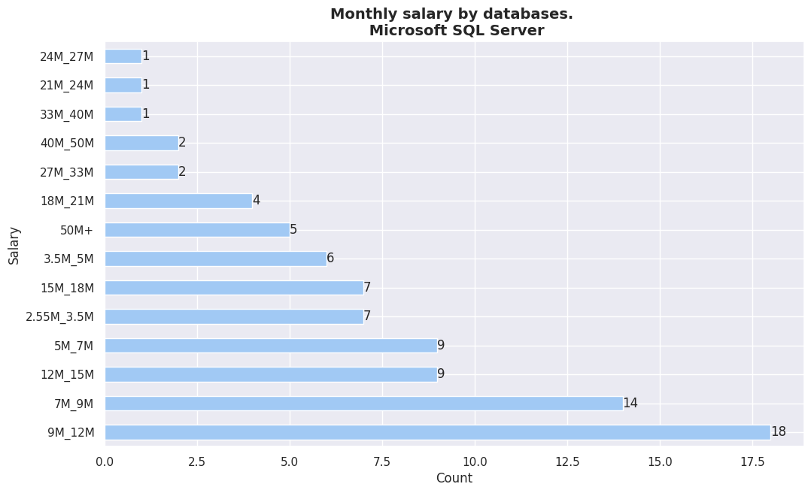


## Salarios segun - platforms

column uniques for "platforms"

\["GNU/Linux",
"Microsoft Windows",
"Azure",
"Microsoft Azure",
"MacOS",
"Docker",
"Arduino",
"AWS",
"Kubernetes",
"Android",
"WordPress",
"Google Cloud Platform",
"Heroku",
"iOS",
"Raspberry Pi"\]


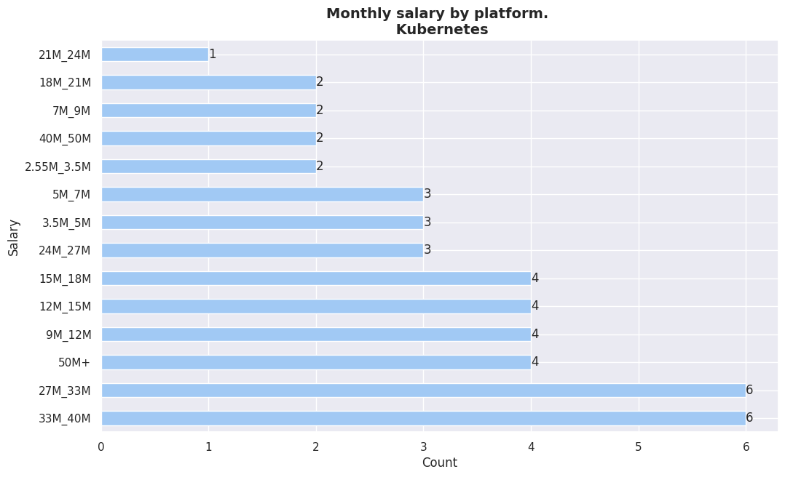


# LENGUAJES/FRAMEWORKS

______________________________________________________________________

## Salarios segun - web_frameworks

- Salarios segun los "web frameworks" que utiliza.

column uniques for "web_frameworks"

\[nan,
"Angular",
"Angular.js",
"JQuery",
"Vue.js",
"Spring",
"Django",
"Laravel",
"Symfony",
"CodeIgniter",
"React.js",
"Express",
"Flask",
"ASP.NET Core",
"Gatsby",
"Ruby on Rails",
"CakePHP",
"ASP.NET"\]

<center>
    <div class='stats_table'>
 <a id="monthly_salary_vs_web_frameworks_table_XN3mv"></a>

| Category                                                                           | Percentage |
| ---------------------------------------------------------------------------------- | ---------- |
| JQuery                                                                             | 12%        |
| React.js                                                                           | 12%        |
| Laravel                                                                            | 8%         |
| Django                                                                             | 8%         |
| JQuery, Spring                                                                     | 4%         |
| ASP.NET                                                                            | 4%         |
| React.js, Express                                                                  | 4%         |
| Spring                                                                             | 4%         |
| Symfony                                                                            | 4%         |
| Angular, Vue.js, Django, Laravel                                                   | 4%         |
| Angular, Angular.js, ASP.NET, ASP.NET Core                                         | 4%         |
| Angular, Angular.js, JQuery, Vue.js, Spring, Django, Laravel, Symfony, CodeIgniter | 4%         |
| React.js, JQuery, Express, Django                                                  | 4%         |
| ASP.NET, ASP.NET Core, Spring                                                      | 4%         |
| Angular, Spring                                                                    | 4%         |
| JQuery, Express, Vue.js, Laravel                                                   | 4%         |
| JQuery, ASP.NET                                                                    | 4%         |
| Angular, Angular.js                                                                | 4%         |
| React.js, JQuery, Express, Laravel, CodeIgniter                                    | 4%         |

<p class='table_title' style="text-align: center;"><em>Monthly salary by web frameworks. 
<p class="table_subtitle">(3.5M_5M)<p></em></p>
   <br/>
   </div>
</center>

<center>
     <div class='stats_table'>
 <a id="monthly_salary_vs_web_frameworks_table_CPpNy"></a>

| Category                                          | Percentage |
| ------------------------------------------------- | ---------- |
| React.js, Express, Spring, Django, Flask, Laravel | 7%         |
| React.js, Gatsby                                  | 7%         |
| React.js, Django                                  | 7%         |
| Angular, ASP.NET Core                             | 7%         |
| React.js, Ruby on Rails                           | 7%         |
| React.js, Angular, JQuery, Laravel, Symfony       | 7%         |
| Angular, Express                                  | 7%         |
| Django, CakePHP                                   | 7%         |
| Angular, Angular.js                               | 7%         |
| React.js, Express                                 | 7%         |
| React.js, Angular, Angular.js, Spring             | 7%         |
| React.js                                          | 7%         |
| Express, Spring                                   | 7%         |

<p class='table_title' style="text-align: center;"><em>Monthly salary by web frameworks. 
<p class="table_subtitle">(18M_21M)<p></em></p>
  <br/>
  </div>
</center>

<center>
    <div class='stats_table'>
 <a id="monthly_salary_vs_web_frameworks_table_OXmoM"></a>

| Category                         | Percentage |
| -------------------------------- | ---------- |
| React.js, Django                 | 20%        |
| React.js, Ruby on Rails          | 20%        |
| Vue.js, Spring                   | 10%        |
| React.js, Spring                 | 10%        |
| React.js                         | 10%        |
| React.js, Express, Ruby on Rails | 10%        |
| Spring                           | 10%        |
| React.js, Express                | 10%        |

<p class='table_title' style="text-align: center;"><em>Monthly salary by web frameworks. 
<p class="table_subtitle">(33M_40M)<p></em></p>
   <br/>
   </div>
</center>

<center>
    <div class='stats_table'>
 <a id="monthly_salary_vs_web_frameworks_table_xtOxc"></a>

| Category                                               | Percentage |
| ------------------------------------------------------ | ---------- |
| Django                                                 | 16%        |
| Spring                                                 | 16%        |
| React.js, Spring                                       | 16%        |
| React.js, Angular, Angular.js, JQuery, Django, Laravel | 16%        |
| React.js, Express                                      | 16%        |
| React.js                                               | 16%        |

<p class='table_title' style="text-align: center;"><em>Monthly salary by web frameworks. 
<p class="table_subtitle">(40M_50M)<p></em></p>
   <br/>
   </div>
</center>

<center>
    <div class='stats_table'>
  <a id="monthly_salary_vs_web_frameworks_table_a4hA8"></a>

| Category                                                               | Percentage |
| ---------------------------------------------------------------------- | ---------- |
| React.js, Django                                                       | 15%        |
| JQuery, Vue.js, Laravel, Symfony                                       | 7%         |
| Angular, Spring                                                        | 7%         |
| React.js, Angular.js, JQuery, Vue.js, Spring, Django, CodeIgniter      | 7%         |
| Flask                                                                  | 7%         |
| Django, Flask                                                          | 7%         |
| React.js                                                               | 7%         |
| React.js, JQuery, ASP.NET, ASP.NET Core, Vue.js, Spring, Django, Flask | 7%         |
| React.js, Angular, Angular.js, Express, Django, Flask                  | 7%         |
| JQuery                                                                 | 7%         |
| React.js, JQuery                                                       | 7%         |
| JQuery, Spring                                                         | 7%         |

<p class='table_title' style="text-align: center;"><em>Monthly salary by web frameworks. 
<p class="table_subtitle">(50M+)<p></em></p>
  <br/>
  </div>
</center>

<center>
    <div class='stats_table'>
 <a id="monthly_salary_vs_web_frameworks_table_SV1KA"></a>

| Category                                                                    | Percentage |
| --------------------------------------------------------------------------- | ---------- |
| JQuery, Laravel                                                             | 9%         |
| JQuery                                                                      | 7%         |
| Spring                                                                      | 7%         |
| Laravel                                                                     | 4%         |
| React.js                                                                    | 4%         |
| Angular                                                                     | 4%         |
| JQuery, Express                                                             | 2%         |
| Flask                                                                       | 2%         |
| ASP.NET                                                                     | 2%         |
| React.js, Angular, Angular.js, JQuery, Spring                               | 2%         |
| Angular.js, Spring                                                          | 2%         |
| Angular, Spring                                                             | 2%         |
| Angular, JQuery, Spring                                                     | 2%         |
| React.js, Angular, Angular.js, Django, Flask, Laravel                       | 2%         |
| React.js, Angular, Angular.js, JQuery, ASP.NET, ASP.NET Core, Spring        | 2%         |
| React.js, Angular, Express                                                  | 2%         |
| React.js, Spring                                                            | 2%         |
| React.js, JQuery, Spring                                                    | 2%         |
| ASP.NET, Express, ASP.NET Core, Vue.js                                      | 2%         |
| React.js, Angular, Angular.js, JQuery, Vue.js, Django, Flask                | 2%         |
| React.js, Express, Django                                                   | 2%         |
| JQuery, ASP.NET, ASP.NET Core, Vue.js                                       | 2%         |
| Angular, Laravel                                                            | 2%         |
| React.js, Angular.js, Spring                                                | 2%         |
| ASP.NET, Spring, Django                                                     | 2%         |
| Angular, Angular.js, JQuery                                                 | 2%         |
| React.js, Angular, Angular.js, Vue.js, Spring                               | 2%         |
| React.js, Angular.js, JQuery, Vue.js, Django, Flask, Laravel, Ruby on Rails | 2%         |
| React.js, Angular, JQuery, Express, Spring, Laravel, Symfony, CodeIgniter   | 2%         |
| React.js, Express, Spring, Laravel                                          | 2%         |
| Angular.js, JQuery                                                          | 2%         |

<p class='table_title' style="text-align: center;"><em>Monthly salary by web frameworks. 
<p class="table_subtitle">(7M_9M)<p></em></p>
  <br/>
  </div>
</center>

<center>
     <div class='stats_table'>
  <a id="monthly_salary_vs_web_frameworks_table_n9I8d"></a>

| Category                                                                            | Percentage |
| ----------------------------------------------------------------------------------- | ---------- |
| Laravel                                                                             | 7%         |
| Spring                                                                              | 7%         |
| ASP.NET                                                                             | 4%         |
| React.js                                                                            | 4%         |
| React.js, ASP.NET Core                                                              | 4%         |
| ASP.NET Core                                                                        | 2%         |
| React.js, Laravel                                                                   | 2%         |
| React.js, Angular, Angular.js, JQuery, Spring                                       | 2%         |
| React.js, Express, Vue.js, Django                                                   | 2%         |
| React.js, Express, Flask                                                            | 2%         |
| Express, Django                                                                     | 2%         |
| React.js, Express, Symfony                                                          | 2%         |
| Angular.js, Spring, Django                                                          | 2%         |
| React.js, Angular, JQuery, ASP.NET, Express, Vue.js, Spring, Django, Flask, Laravel | 2%         |
| Angular.js, JQuery, Spring                                                          | 2%         |
| React.js, Angular, Angular.js, JQuery, Express, Vue.js, Spring, Flask               | 2%         |
| CakePHP                                                                             | 2%         |
| JQuery, Spring                                                                      | 2%         |
| React.js, Angular.js, Django                                                        | 2%         |
| JQuery, ASP.NET, ASP.NET Core, Spring                                               | 2%         |
| React.js, Angular, Spring                                                           | 2%         |
| ASP.NET Core, Spring                                                                | 2%         |
| Express                                                                             | 2%         |
| Django, Flask, Laravel                                                              | 2%         |
| Angular, Django                                                                     | 2%         |
| React.js, Express                                                                   | 2%         |
| ASP.NET, ASP.NET Core, Spring                                                       | 2%         |
| ASP.NET, Express, ASP.NET Core, Vue.js                                              | 2%         |
| JQuery, Ruby on Rails                                                               | 2%         |
| Spring, Laravel                                                                     | 2%         |
| React.js, Ruby on Rails                                                             | 2%         |
| Angular, Spring                                                                     | 2%         |
| React.js, Express, Vue.js, Flask                                                    | 2%         |
| React.js, ASP.NET, Express                                                          | 2%         |

<p class='table_title' style="text-align: center;"><em>Monthly salary by web frameworks. 
<p class="table_subtitle">(9M_12M)<p></em></p>
   <br/>
   </div>
</center>

<center>
     <div classs='stats_table'>
 <a id="monthly_salary_vs_web_frameworks_table_VqRX8"></a>

| Category                                       | Percentage |
| ---------------------------------------------- | ---------- |
| JQuery, Spring                                 | 8%         |
| JQuery, ASP.NET, ASP.NET Core                  | 8%         |
| Spring                                         | 8%         |
| Angular, Angular.js, JQuery, Spring, Django    | 4%         |
| React.js, Spring                               | 4%         |
| Angular, Angular.js, JQuery, Spring            | 4%         |
| Angular, Spring                                | 4%         |
| ASP.NET, ASP.NET Core, Spring, Django, Flask   | 4%         |
| Angular, JQuery, ASP.NET, ASP.NET Core, Django | 4%         |
| Django                                         | 4%         |
| React.js, Express, Spring, Django, Flask       | 4%         |
| Vue.js, Ruby on Rails                          | 4%         |
| Angular.js, JQuery, Vue.js, Laravel            | 4%         |
| Express                                        | 4%         |
| React.js                                       | 4%         |
| JQuery, Vue.js, Laravel                        | 4%         |
| Angular, Angular.js, Spring                    | 4%         |
| Angular.js, JQuery                             | 4%         |
| Spring, Symfony                                | 4%         |
| React.js, Angular.js, ASP.NET                  | 4%         |
| React.js, Express, Laravel                     | 4%         |
| React.js, Django, Flask                        | 4%         |

<p class='table_title' style="text-align: center;"><em>Monthly salary by web frameworks. 
<p class="table_subtitle">(15M_18M)<p></em></p>
   <br/>
   </div>
</center>

<center>
     <div class='stats_table'>
  <a id="monthly_salary_vs_web_frameworks_table_5dKuk"></a>

| Category                                                        | Percentage |
| --------------------------------------------------------------- | ---------- |
| Spring                                                          | 23%        |
| Express, Vue.js                                                 | 7%         |
| Angular, JQuery, Vue.js, Django, Laravel, Ruby on Rails, Gatsby | 7%         |
| React.js, JQuery, Express, Laravel, CakePHP                     | 7%         |
| React.js, Express                                               | 7%         |
| React.js, JQuery                                                | 7%         |
| Laravel                                                         | 7%         |
| React.js                                                        | 7%         |
| JQuery, Vue.js, Laravel, CodeIgniter                            | 7%         |
| Angular, ASP.NET, ASP.NET Core                                  | 7%         |
| Angular, Spring                                                 | 7%         |

<p class='table_title' style="text-align: center;"><em>Monthly salary by web frameworks. 
<p class="table_subtitle">(24M_27M)<p></em></p>
  <br/>
  </div>
</center>

<center>
     <div class='stats_table'>
  <a id="monthly_salary_vs_web_frameworks_table_QwNh9"></a>

| Category                | Percentage |
| ----------------------- | ---------- |
| React.js, Django, Flask | 33%        |
| React.js                | 33%        |
| JQuery                  | 33%        |

<p class='table_title' style="text-align: center;"><em>Monthly salary by web frameworks. 
<p class="table_subtitle">(min_wage)<p></em></p>
   <br/>
   </div>
</center>

<center>
     <div class='stats_table'>
 <a id="monthly_salary_vs_web_frameworks_table_WKtT8"></a>

| Category                                                 | Percentage |
| -------------------------------------------------------- | ---------- |
| JQuery                                                   | 14%        |
| React.js, Django                                         | 9%         |
| Spring                                                   | 4%         |
| Django                                                   | 4%         |
| Angular, Spring                                          | 4%         |
| React.js                                                 | 4%         |
| Laravel, CodeIgniter                                     | 4%         |
| JQuery, Laravel, Ruby on Rails                           | 4%         |
| JQuery, Laravel, CodeIgniter                             | 4%         |
| ASP.NET Core                                             | 4%         |
| Express                                                  | 4%         |
| React.js, Express                                        | 4%         |
| React.js, Angular.js, Express, Django                    | 4%         |
| Vue.js, Django                                           | 4%         |
| JQuery, Laravel                                          | 4%         |
| ASP.NET, ASP.NET Core, Flask                             | 4%         |
| React.js, ASP.NET, ASP.NET Core, Vue.js, Spring, Laravel | 4%         |
| React.js, Laravel                                        | 4%         |

<p class='table_title' style="text-align: center;"><em>Monthly salary by web frameworks. 
<p class="table_subtitle">(2.55M_3.5M)<p></em></p>
   <br/>
   </div>
</center>

<center>
     <div class='stats_table'>
  <a id="monthly_salary_vs_web_frameworks_table_cjrgl"></a>

| Category                                               | Percentage |
| ------------------------------------------------------ | ---------- |
| React.js                                               | 12%        |
| JQuery, Laravel                                        | 7%         |
| ASP.NET, ASP.NET Core                                  | 7%         |
| React.js, Django                                       | 5%         |
| JQuery                                                 | 5%         |
| Spring                                                 | 5%         |
| JQuery, Flask, Ruby on Rails                           | 2%         |
| Angular, Angular.js, JQuery, Spring                    | 2%         |
| Angular.js, JQuery, ASP.NET, ASP.NET Core, Spring      | 2%         |
| Ruby on Rails                                          | 2%         |
| React.js, Express, Django, Flask                       | 2%         |
| ASP.NET                                                | 2%         |
| Angular, Angular.js, Spring                            | 2%         |
| React.js, Express, Flask                               | 2%         |
| React.js, JQuery, Express                              | 2%         |
| React.js, Express, Ruby on Rails                       | 2%         |
| Express                                                | 2%         |
| Laravel, CodeIgniter                                   | 2%         |
| JQuery, Spring, Django                                 | 2%         |
| JQuery, Express                                        | 2%         |
| Spring, Django                                         | 2%         |
| React.js, Express                                      | 2%         |
| React.js, JQuery, Vue.js, Spring, Laravel, CodeIgniter | 2%         |
| ASP.NET, ASP.NET Core, Vue.js                          | 2%         |
| Vue.js                                                 | 2%         |
| React.js, Angular.js, Laravel                          | 2%         |
| React.js, Spring                                       | 2%         |
| JQuery, Django, Laravel                                | 2%         |
| JQuery, Django                                         | 2%         |

<p class='table_title' style="text-align: center;"><em>Monthly salary by web frameworks. 
<p class="table_subtitle">(5M_7M)<p></em></p>
   <br/>
   </div>
</center>

<center>
     <div class='stats_table'>
 <a id="monthly_salary_vs_web_frameworks_table_1EFiH"></a>

| Category                                         | Percentage |
| ------------------------------------------------ | ---------- |
| Spring                                           | 8%         |
| Flask                                            | 8%         |
| React.js, JQuery, Spring                         | 8%         |
| React.js, Django                                 | 4%         |
| Angular, Angular.js, JQuery, Spring              | 4%         |
| React.js, Spring                                 | 4%         |
| Angular, Express                                 | 4%         |
| Angular.js, JQuery, ASP.NET, ASP.NET Core, Flask | 4%         |
| JQuery, Spring, Django                           | 4%         |
| Django, Flask                                    | 4%         |
| React.js, Angular, Spring                        | 4%         |
| Vue.js, Laravel                                  | 4%         |
| JQuery, Vue.js, Spring, Laravel, CakePHP         | 4%         |
| JQuery, Vue.js, Laravel, Symfony                 | 4%         |
| JQuery                                           | 4%         |
| Express                                          | 4%         |
| Angular, JQuery, Express, Vue.js, Spring         | 4%         |
| JQuery, ASP.NET, ASP.NET Core, Vue.js            | 4%         |
| Vue.js, Spring                                   | 4%         |
| React.js, Angular                                | 4%         |
| React.js, JQuery, Express, Vue.js, Ruby on Rails | 4%         |
| Spring, CodeIgniter                              | 4%         |

<p class='table_title' style="text-align: center;"><em>Monthly salary by web frameworks. 
<p class="table_subtitle">(12M_15M)<p></em></p>
  <br/>
  </div>
</center>

<center>
     <div class='stats_table'>
  <a id="monthly_salary_vs_web_frameworks_table_bWWaQ"></a>

| Category                             | Percentage |
| ------------------------------------ | ---------- |
| React.js                             | 37%        |
| Vue.js, Spring                       | 12%        |
| React.js, Angular, Angular.js        | 12%        |
| React.js, Angular, Flask             | 12%        |
| Spring                               | 12%        |
| Spring, Django, Flask, Ruby on Rails | 12%        |

<p class='table_title' style="text-align: center;"><em>Monthly salary by web frameworks. 
<p class="table_subtitle">(21M_24M)<p></em></p>
  <br/>
  </div>
</center>

<center>
    <div class='stats_table'>
  <a id="monthly_salary_vs_web_frameworks_table_tfbTG"></a>

| Category                             | Percentage |
| ------------------------------------ | ---------- |
| Express, Vue.js                      | 11%        |
| React.js, ASP.NET, ASP.NET Core      | 11%        |
| JQuery, Laravel, CakePHP             | 11%        |
| React.js, Angular.js, JQuery, Django | 11%        |
| Ruby on Rails                        | 11%        |
| Angular, Spring                      | 11%        |
| Angular, Angular.js, JQuery, Spring  | 11%        |
| Spring                               | 11%        |
| React.js, Express                    | 11%        |

<p class='table_title' style="text-align: center;"><em>Monthly salary by web frameworks. 
<p class="table_subtitle">(27M_33M)<p></em></p>
  <br/>
  </div>
</center>

<center>
    <div class = 'stats_table'>>
  <a id="monthly_salary_vs_web_frameworks_table_XEYPn"></a>

| Category                           | Percentage |
| ---------------------------------- | ---------- |
| React.js, ASP.NET, Django, Laravel | 20%        |
| React.js, Flask, Laravel           | 20%        |
| JQuery                             | 20%        |
| Spring, Django, Flask, Laravel     | 20%        |
| Flask                              | 20%        |

<p class='table_title' style="text-align: center;"><em>Monthly salary by web frameworks. 
<p class="table_subtitle">(les_than_minimum_wage)<p></em></p>
   <br/>
   </div>
</center>


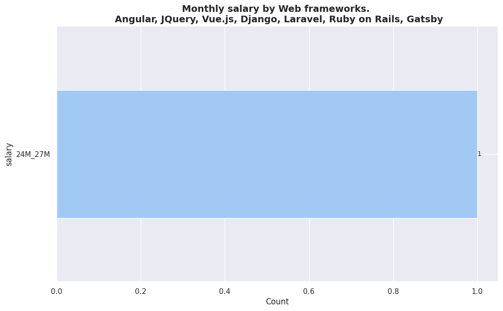


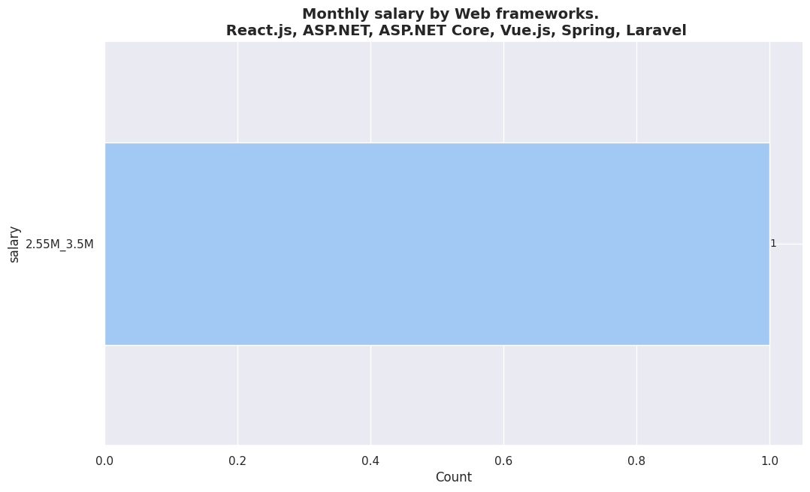


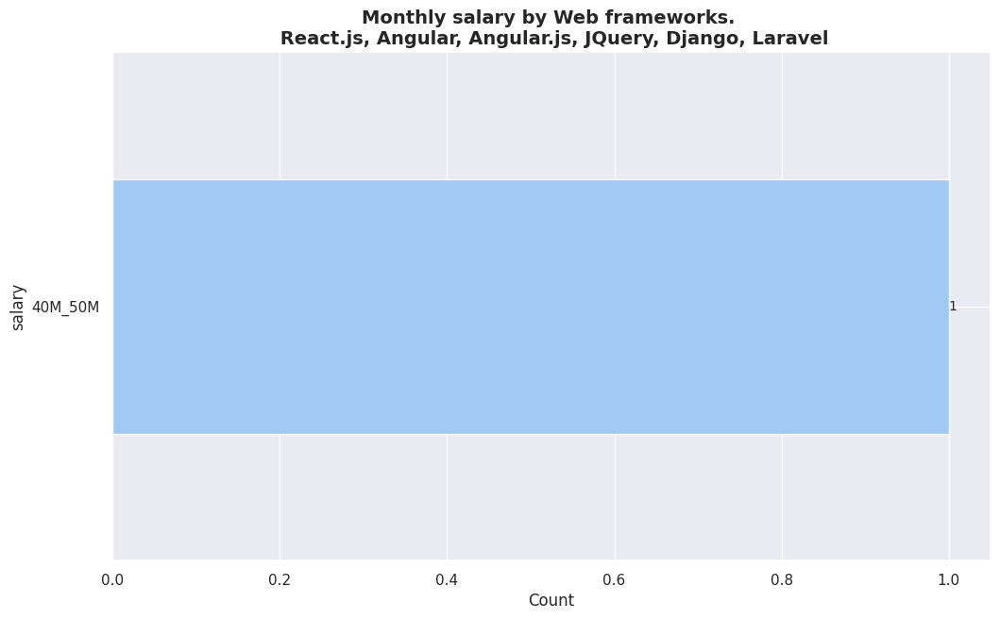


## Salarios segun - pro_languages

- Salarios segun los lenguajes de programacion con los que trabaja.

# Print uniques by column.

column uniques for "pro_languages"

\["Python",
"C",
"SQL",
"R",
"Fox Pro",
"JavaScript",
"PHP",
"Java",
"C#",
"HTML/CSS",
"Bash/Shell/PowerShell",
"VBA",
"TypeScript",
"Oracle Forms",
"Dart",
"Go",
"RPG",
"Abap",
"C++",
"Pascal",
"XML",
"Kotlin",
"Swift",
"v",
"LUA",
"X++",
"Genexus",
"Rust",
"Google AppSheets",
"Yaml",
"Objective-C",
"Ruby",
"",
"Scala",
"COBOL",
nan,
"PL/SQL",
"Delphi",
"Genexus ",
"Assembly",
"Perl",
"Xquery",
"Oracle Apex",
"Powerbuilder",
"PLSQL",
"React",
"Yammel",
"M",
"Oracle APEX",
"PSQL",
"ORACLE APEX",
"ORACLE PLSQL",
"Vb .net",
"Elixir ",
"Terraform",
"Groovy",
"Power Builder",
"Visual básic net ",
"Pascal/Delphi",
"Power builder",
"Lenguaje o comandos scripteado en python "\]

<center>
    <div class='stats_table'>
  <a id="monthly_salary_vs_programming_languagues_table_trdnU"></a>

| Category                                                                                | Percentage |
| --------------------------------------------------------------------------------------- | ---------- |
| Python, C, SQL, R, Fox Pro                                                              | 3%         |
| Java, SQL, Bash/Shell/PowerShell, Oracle Forms                                          | 3%         |
| JavaScript, Java, HTML/CSS, SQL, Bash/Shell/PowerShell                                  | 3%         |
| JavaScript, C#, HTML/CSS, SQL, R                                                        | 3%         |
| Java, SQL                                                                               | 3%         |
| JavaScript, TypeScript, Python, Java, HTML/CSS, SQL, Bash/Shell/PowerShell              | 3%         |
| JavaScript, TypeScript, Python, Java, HTML/CSS, SQL, Swift, Dart                        | 3%         |
| JavaScript, C#, HTML/CSS, SQL                                                           | 3%         |
| Fox Pro                                                                                 | 3%         |
| Python, Java, C#, HTML/CSS, SQL, Oracle Forms, Fox Pro, COBOL, RPG,                     | 3%         |
| JavaScript, Python, C#, HTML/CSS, SQL                                                   | 3%         |
| JavaScript, Python, SQL, Bash/Shell/PowerShell                                          | 3%         |
| JavaScript, TypeScript, Python, Java, C, HTML/CSS, SQL, Bash/Shell/PowerShell           | 3%         |
| Java, HTML/CSS, SQL, Genexus, Power Builder                                             | 3%         |
| JavaScript, Ruby, SQL, Bash/Shell/PowerShell                                            | 3%         |
| JavaScript, TypeScript, Kotlin, SQL, Dart, Oracle Forms                                 | 3%         |
| JavaScript, Java, HTML/CSS, SQL, Oracle Forms, PLSQL                                    | 3%         |
| SQL, Bash/Shell/PowerShell, Yammel                                                      | 3%         |
| Python, R                                                                               | 3%         |
| C#                                                                                      | 3%         |
| Python, HTML/CSS, SQL, Bash/Shell/PowerShell, React                                     | 3%         |
| JavaScript, TypeScript, PHP, C#, HTML/CSS, SQL, Dart, Powerbuilder                      | 3%         |
| JavaScript, TypeScript, Java, HTML/CSS, SQL                                             | 3%         |
| JavaScript, TypeScript, PHP, Java, HTML/CSS, SQL, Bash/Shell/PowerShell, Fox Pro, COBOL | 3%         |
| SQL                                                                                     | 3%         |
| PHP, Java, SQL                                                                          | 3%         |
| JavaScript, Python, Java, C#, SQL                                                       | 3%         |
| JavaScript, TypeScript, PHP, Dart                                                       | 3%         |
| Swift                                                                                   | 3%         |
| JavaScript, TypeScript, PHP, HTML/CSS, SQL, Dart                                        | 3%         |
| JavaScript, Python, Java, SQL                                                           | 3%         |
| JavaScript, Python, Java, C#, SQL, Bash/Shell/PowerShell                                | 3%         |

<p class='table_title' style="text-align: center;"><em>Monthly salary by "programming languague". 
<p class="table_subtitle">(15M_18M)<p></em></p>
  <br/>
  </div>
</center>

<center>
     <div class='stats_table'>
  <a id="monthly_salary_vs_programming_languagues_table_95xGY"></a>

| Category                                                                        | Percentage |
| ------------------------------------------------------------------------------- | ---------- |
| SQL                                                                             | 5%         |
| JavaScript, TypeScript, Java, HTML/CSS, SQL                                     | 5%         |
| PHP, Java, HTML/CSS, SQL                                                        | 2%         |
| Java                                                                            | 2%         |
| JavaScript, C++, HTML/CSS, SQL, R                                               | 2%         |
| JavaScript, TypeScript, Python, Java, HTML/CSS, SQL, Bash/Shell/PowerShell      | 2%         |
| JavaScript, PHP, Java, SQL, Oracle Forms                                        | 2%         |
| JavaScript, TypeScript, C#, VBA                                                 | 2%         |
| JavaScript, TypeScript, PHP, Python, HTML/CSS, SQL                              | 2%         |
| JavaScript, PHP, Python, Java, C, C#, HTML/CSS, SQL, Bash/Shell/PowerShell, VBA | 2%         |
| Python, HTML/CSS, SQL, Oracle Forms                                             | 2%         |
| JavaScript, Java                                                                | 2%         |
| JavaScript, HTML/CSS, SQL, Bash/Shell/PowerShell, Dart                          | 2%         |
| JavaScript, SQL, Pascal/Delphi                                                  | 2%         |
| JavaScript, Java, C#, SQL                                                       | 2%         |
| JavaScript, TypeScript, PHP, HTML/CSS, Bash/Shell/PowerShell                    | 2%         |
| JavaScript, PHP, Java, SQL, Dart                                                | 2%         |
| JavaScript, PHP, Python, Java, HTML/CSS, SQL                                    | 2%         |
| JavaScript, PHP, Python, HTML/CSS, SQL, Bash/Shell/PowerShell                   | 2%         |
| JavaScript, HTML/CSS, SQL, PL/SQL                                               | 2%         |
| Java, C#, SQL, Bash/Shell/PowerShell, Fox Pro                                   | 2%         |
| JavaScript, PHP, HTML/CSS, SQL                                                  | 2%         |
| TypeScript, PHP, Java, HTML/CSS, VBA, Fox Pro                                   | 2%         |
| JavaScript, TypeScript, PHP, HTML/CSS, SQL                                      | 2%         |
| JavaScript, TypeScript, HTML/CSS                                                | 2%         |
| JavaScript, Python, HTML/CSS, SQL                                               | 2%         |
| JavaScript, TypeScript                                                          | 2%         |
| JavaScript, TypeScript, Python                                                  | 2%         |
| JavaScript, Ruby, Java, HTML/CSS, SQL                                           | 2%         |
| Dart                                                                            | 2%         |
| TypeScript, Dart                                                                | 2%         |
| Python, SQL, Oracle Forms                                                       | 2%         |
| Python, SQL, Bash/Shell/PowerShell                                              | 2%         |
| JavaScript, Python, HTML/CSS, SQL, Bash/Shell/PowerShell                        | 2%         |
| Java, HTML/CSS, SQL                                                             | 2%         |

<p class='table_title' style="text-align: center;"><em>Monthly salary by "programming languague". 
<p class="table_subtitle">(3.5M_5M)<p></em></p>
  <br/>
  </div>
</center>

<center>
     <div class='stats_table'>
 <a id="monthly_salary_vs_programming_languagues_table_pQmYb"></a>

| Category                                                                       | Percentage |
| ------------------------------------------------------------------------------ | ---------- |
| JavaScript, TypeScript, PHP, Python, Java, SQL                                 | 5%         |
| TypeScript, Python, Java, HTML/CSS, SQL, Bash/Shell/PowerShell                 | 5%         |
| JavaScript, Python, Java, SQL, Bash/Shell/PowerShell                           | 5%         |
| JavaScript, TypeScript, Python, Java, C#, HTML/CSS, SQL, Bash/Shell/PowerShell | 5%         |
| JavaScript, TypeScript, HTML/CSS, SQL                                          | 5%         |
| PHP, Python, C++, HTML/CSS, COBOL                                              | 5%         |
| PHP, Python, Java, SQL, Fox Pro                                                | 5%         |
| Kotlin                                                                         | 5%         |
| JavaScript, TypeScript, PHP, Java, HTML/CSS, SQL, Bash/Shell/PowerShell        | 5%         |
| JavaScript, TypeScript, Python, SQL, Bash/Shell/PowerShell                     | 5%         |
| JavaScript, Ruby, HTML/CSS, SQL                                                | 5%         |
| JavaScript, TypeScript, Java, C#, HTML/CSS, SQL                                | 5%         |
| JavaScript, PHP, Python, HTML/CSS, SQL                                         | 5%         |
| JavaScript, TypeScript, PHP, Python                                            | 5%         |
| Java, C, C#, Go, Bash/Shell/PowerShell, Objective-C                            | 5%         |
| JavaScript, TypeScript, Python, HTML/CSS, SQL, Bash/Shell/PowerShell           | 5%         |
| JavaScript, TypeScript, Python, Java                                           | 5%         |

<p class='table_title' style="text-align: center;"><em>Monthly salary by "programming languague". 
<p class="table_subtitle">(18M_21M)<p></em></p>
   <br/>
   </div>
</center>

<center>
     <div class='stats_table'>
  <a id="monthly_salary_vs_programming_languagues_table_3jTaZ"></a>

| Category                                                              | Percentage |
| --------------------------------------------------------------------- | ---------- |
| JavaScript, TypeScript, Python, Java, HTML/CSS, Bash/Shell/PowerShell | 8%         |
| JavaScript, Java, SQL, Bash/Shell/PowerShell                          | 8%         |
| Python, SQL                                                           | 8%         |
| Java, Kotlin, Swift, Dart                                             | 8%         |
| JavaScript, TypeScript, Ruby                                          | 8%         |
| JavaScript, TypeScript, Java, HTML/CSS, SQL, Bash/Shell/PowerShell    | 8%         |
| JavaScript, TypeScript, Go, HTML/CSS, Bash/Shell/PowerShell           | 8%         |
| JavaScript, TypeScript, Ruby, SQL                                     | 8%         |
| JavaScript, TypeScript, Ruby, HTML/CSS                                | 8%         |
| TypeScript, Python, Java, HTML/CSS, SQL, Scala                        | 8%         |
| Java, SQL                                                             | 8%         |
| TypeScript                                                            | 8%         |

<p class='table_title' style="text-align: center;"><em>Monthly salary by "programming languague". 
<p class="table_subtitle">(33M_40M)<p></em></p>
  <br/>
  </div>
</center>

<center>
    <div class='stats_table'>
 <a id="monthly_salary_vs_programming_languagues_table_FITkP"></a>

| Category                                                                                     | Percentage |
| -------------------------------------------------------------------------------------------- | ---------- |
| Python, SQL                                                                                  | 12%        |
| Python, SQL, Bash/Shell/PowerShell, Scala                                                    | 12%        |
| JavaScript, PHP, Java, SQL                                                                   | 12%        |
| JavaScript, Java, Scala                                                                      | 12%        |
| JavaScript, PHP, Python, Java, HTML/CSS, SQL, Bash/Shell/PowerShell, Dart, VBA, Oracle Forms | 12%        |
| JavaScript, TypeScript, Terraform                                                            | 12%        |
| JavaScript, TypeScript                                                                       | 12%        |
| JavaScript, TypeScript, Java                                                                 | 12%        |

<p class='table_title' style="text-align: center;"><em>Monthly salary by "programming languague". 
<p class="table_subtitle">(40M_50M)<p></em></p>
  <br/>
  </div>
</center>

<center>
      <div class='stats_table'>
 <a id="monthly_salary_vs_programming_languagues_table_5v58x"></a>

| Category                                                                                                       | Percentage |
| -------------------------------------------------------------------------------------------------------------- | ---------- |
| Python, SQL                                                                                                    | 11%        |
| JavaScript, PHP, Python, SQL, Bash/Shell/PowerShell, Dart                                                      | 5%         |
| JavaScript, TypeScript, Python                                                                                 | 5%         |
| JavaScript, TypeScript, PHP, Java, Kotlin, HTML/CSS, SQL, Bash/Shell/PowerShell                                | 5%         |
| JavaScript, TypeScript, Python, Go, HTML/CSS, SQL, Bash/Shell/PowerShell, v                                    | 5%         |
| JavaScript, TypeScript, Python, Java, C++, Go, SQL, Bash/Shell/PowerShell, Rust                                | 5%         |
| TypeScript, Python, Bash/Shell/PowerShell, Scala                                                               | 5%         |
| JavaScript, Python, C                                                                                          | 5%         |
| JavaScript, TypeScript, HTML/CSS                                                                               | 5%         |
| Python, SQL, Bash/Shell/PowerShell                                                                             | 5%         |
| JavaScript, TypeScript, Python, Java, Kotlin, C#, Go, HTML/CSS, SQL, Bash/Shell/PowerShell, Swift, Objective-C | 5%         |
| JavaScript, TypeScript, Python, HTML/CSS, SQL, Bash/Shell/PowerShell, Elixir                                   | 5%         |
| Python, C++, Bash/Shell/PowerShell                                                                             | 5%         |
| JavaScript, SQL                                                                                                | 5%         |
| JavaScript, TypeScript, Python, HTML/CSS, SQL, Bash/Shell/PowerShell, Swift                                    | 5%         |
| Python, SQL, R, Scala                                                                                          | 5%         |

<p class='table_title' style="text-align: center;"><em>Monthly salary by "programming languague". 
<p class="table_subtitle">(50M+)<p></em></p>
   <br/>
   </div>
</center>

<center>
      <div class='stats_table'>
 <a id="monthly_salary_vs_programming_languagues_table_EITF9"></a>

| Category                                                                                                         | Percentage |
| ---------------------------------------------------------------------------------------------------------------- | ---------- |
| JavaScript, TypeScript, Java, HTML/CSS, SQL                                                                      | 5%         |
| JavaScript, Java, HTML/CSS, SQL                                                                                  | 3%         |
| Java, HTML/CSS                                                                                                   | 3%         |
| JavaScript, TypeScript, HTML/CSS, Bash/Shell/PowerShell                                                          | 3%         |
| Python, SQL                                                                                                      | 3%         |
| JavaScript, Java, HTML/CSS                                                                                       | 3%         |
| JavaScript, Python, Java, Go, HTML/CSS, SQL, Bash/Shell/PowerShell                                               | 1%         |
| SQL                                                                                                              | 1%         |
| JavaScript, Python, Java, HTML/CSS, SQL, Genexus, RPG                                                            | 1%         |
| SQL, Oracle Forms                                                                                                | 1%         |
| JavaScript, PHP, Java, HTML/CSS, SQL, Bash/Shell/PowerShell                                                      | 1%         |
| Oracle Forms                                                                                                     | 1%         |
| Java, HTML/CSS, SQL, Oracle Forms                                                                                | 1%         |
| Java, SQL, Fox Pro                                                                                               | 1%         |
| TypeScript, Python, SQL, Bash/Shell/PowerShell                                                                   | 1%         |
| JavaScript, TypeScript, Java, HTML/CSS, SQL, Bash/Shell/PowerShell                                               | 1%         |
| JavaScript, TypeScript, PHP, HTML/CSS, SQL, RPG                                                                  | 1%         |
| Java, Dart                                                                                                       | 1%         |
| Python, Kotlin, Oracle Forms, Fox Pro                                                                            | 1%         |
| PHP, HTML/CSS, SQL                                                                                               | 1%         |
| JavaScript, PHP, Bash/Shell/PowerShell                                                                           | 1%         |
| JavaScript, TypeScript, PHP, HTML/CSS                                                                            | 1%         |
| JavaScript, Python, Java, C#, SQL, PL/SQL                                                                        | 1%         |
| JavaScript, HTML/CSS, SQL, Oracle Forms, Oracle Apex                                                             | 1%         |
| JavaScript, Java, Kotlin, HTML/CSS, Swift, Dart                                                                  | 1%         |
| JavaScript, TypeScript, PHP, HTML/CSS, SQL, Bash/Shell/PowerShell, Assembly, Rust                                | 1%         |
| JavaScript, TypeScript, PHP, Python, Ruby, Java, Kotlin, C, HTML/CSS, SQL, Bash/Shell/PowerShell, Fox Pro, COBOL | 1%         |
| JavaScript, TypeScript, Python, HTML/CSS                                                                         | 1%         |
| JavaScript, Python                                                                                               | 1%         |
| JavaScript, PHP, HTML/CSS, SQL                                                                                   | 1%         |
| PHP, HTML/CSS, SQL, Bash/Shell/PowerShell, VBA                                                                   | 1%         |
| JavaScript, PHP, SQL, Fox Pro                                                                                    | 1%         |
| JavaScript, TypeScript, PHP, Java, HTML/CSS, Swift, Dart                                                         | 1%         |
| JavaScript, TypeScript, PHP, Java, HTML/CSS, SQL, Bash/Shell/PowerShell, Dart                                    | 1%         |
| Java, SQL, Abap                                                                                                  | 1%         |
| SQL, RPG, Abap                                                                                                   | 1%         |
| JavaScript, PHP, HTML/CSS, SQL, Bash/Shell/PowerShell, Dart                                                      | 1%         |
| Python, Java, Bash/Shell/PowerShell, Genexus                                                                     | 1%         |
| JavaScript, TypeScript, Java, HTML/CSS                                                                           | 1%         |
| JavaScript, Python, Java, C#, HTML/CSS, SQL, VBA                                                                 | 1%         |
| PHP, SQL, Dart                                                                                                   | 1%         |
| JavaScript, C#, HTML/CSS, SQL                                                                                    | 1%         |
| JavaScript, Python, C++, HTML/CSS                                                                                | 1%         |
| Lenguaje o comandos scripteado en python                                                                         | 1%         |

<p class='table_title' style="text-align: center;"><em>Monthly salary by "programming languague". 
<p class="table_subtitle">(7M_9M)<p></em></p>
   <br/>
   </div>
</center>

<center>
    <div class='stats_table'>
 <a id="monthly_salary_vs_programming_languagues_table_a57wr"></a>

| Category                                                                                                                   | Percentage |
| -------------------------------------------------------------------------------------------------------------------------- | ---------- |
| JavaScript, HTML/CSS, SQL                                                                                                  | 3%         |
| JavaScript, Java                                                                                                           | 3%         |
| JavaScript, TypeScript                                                                                                     | 3%         |
| JavaScript, C#, HTML/CSS, SQL                                                                                              | 1%         |
| JavaScript, TypeScript, HTML/CSS                                                                                           | 1%         |
| Python, SQL, PSQL                                                                                                          | 1%         |
| JavaScript, PHP, Kotlin, HTML/CSS, SQL                                                                                     | 1%         |
| JavaScript, Java, HTML/CSS, SQL                                                                                            | 1%         |
| SQL, Oracle Forms, Vb .net                                                                                                 | 1%         |
| Oracle Forms                                                                                                               | 1%         |
| JavaScript, PHP, C#                                                                                                        | 1%         |
| JavaScript, Python, HTML/CSS, SQL, Bash/Shell/PowerShell                                                                   | 1%         |
| Java, SQL                                                                                                                  | 1%         |
| JavaScript, TypeScript, Python, HTML/CSS                                                                                   | 1%         |
| JavaScript, PHP, SQL, COBOL, Visual básic net                                                                              | 1%         |
| Python, SQL                                                                                                                | 1%         |
| JavaScript, Python, Java, HTML/CSS, SQL                                                                                    | 1%         |
| Python, Go, Dart                                                                                                           | 1%         |
| JavaScript, Python, Java, SQL                                                                                              | 1%         |
| C#, SQL                                                                                                                    | 1%         |
| JavaScript, TypeScript, PHP, Python, Ruby, Java, C++, Go, HTML/CSS, SQL, Bash/Shell/PowerShell, VBA, Oracle Forms, Fox Pro | 1%         |
| Python, Genexus                                                                                                            | 1%         |
| JavaScript, Java, C, C++, HTML/CSS, SQL, Bash/Shell/PowerShell                                                             | 1%         |
| JavaScript, TypeScript, PHP, Python, Java, C, C++, Go, HTML/CSS, SQL, Bash/Shell/PowerShell, VBA, Oracle Forms             | 1%         |
| VBA, Power builder                                                                                                         | 1%         |
| Java, HTML/CSS, SQL                                                                                                        | 1%         |
| Python, Java, HTML/CSS, SQL                                                                                                | 1%         |
| JavaScript, TypeScript, Java, Kotlin, Swift                                                                                | 1%         |
| JavaScript, TypeScript, Python, Java, SQL                                                                                  | 1%         |
| Dart                                                                                                                       | 1%         |
| JavaScript, TypeScript, Python, HTML/CSS, Dart                                                                             | 1%         |
| PHP, Oracle Forms                                                                                                          | 1%         |
| TypeScript, Java, HTML/CSS, SQL                                                                                            | 1%         |
| SQL, VBA                                                                                                                   | 1%         |
| Python, SQL, VBA, Yaml                                                                                                     | 1%         |
| Java, Kotlin, SQL, Bash/Shell/PowerShell, Swift                                                                            | 1%         |
| JavaScript, Ruby, C++, HTML/CSS, SQL                                                                                       | 1%         |
| JavaScript, PHP, Java, Kotlin, HTML/CSS, SQL, Bash/Shell/PowerShell,                                                       | 1%         |
| JavaScript, Ruby, Java, HTML/CSS, SQL, Bash/Shell/PowerShell                                                               | 1%         |
| JavaScript, TypeScript, C#, HTML/CSS, SQL, Dart                                                                            | 1%         |
| JavaScript, Python, Java, HTML/CSS, SQL, Bash/Shell/PowerShell                                                             | 1%         |
| JavaScript, PHP, SQL                                                                                                       | 1%         |
| Java, Kotlin, C#, SQL, Oracle Forms, Genexus                                                                               | 1%         |
| TypeScript, Python, SQL                                                                                                    | 1%         |
| Python, Java, Genexus                                                                                                      | 1%         |
| JavaScript, C#                                                                                                             | 1%         |
| JavaScript, Python, Java, Bash/Shell/PowerShell                                                                            | 1%         |
| JavaScript, Python, SQL                                                                                                    | 1%         |
| Java, C#, SQL                                                                                                              | 1%         |
| Java, SQL, Xquery                                                                                                          | 1%         |
| JavaScript, Python, Java, C#, HTML/CSS                                                                                     | 1%         |
| PHP, Python, HTML/CSS, SQL, Oracle Forms, Oracle Apex                                                                      | 1%         |
| JavaScript, TypeScript, C#, SQL                                                                                            | 1%         |

<p class='table_title' style="text-align: center;"><em>Monthly salary by "programming languague". 
<p class="table_subtitle">(9M_12M)<p></em></p>
  <br/>
  </div>
</center>

<center>
     <div class='stats_table'>
   <a id="monthly_salary_vs_programming_languagues_table_WADkq"></a>

| Category                                                                                       | Percentage |
| ---------------------------------------------------------------------------------------------- | ---------- |
| JavaScript, C, C++, SQL, Bash/Shell/PowerShell, Dart, Pascal                                   | 7%         |
| JavaScript, TypeScript, PHP, Python, Kotlin, HTML/CSS, SQL, Bash/Shell/PowerShell, Swift, Dart | 7%         |
| JavaScript, PHP, HTML/CSS, SQL, Bash/Shell/PowerShell                                          | 7%         |
| JavaScript, TypeScript, SQL                                                                    | 7%         |
| Java, HTML/CSS                                                                                 | 7%         |
| JavaScript, Java, HTML/CSS, SQL, Bash/Shell/PowerShell, Swift                                  | 7%         |
| JavaScript, PHP, SQL                                                                           | 7%         |
| JavaScript, TypeScript, HTML/CSS                                                               | 7%         |
| JavaScript, PHP, Python, HTML/CSS, SQL, Bash/Shell/PowerShell                                  | 7%         |
| JavaScript, Java, HTML/CSS, SQL, Scala                                                         | 7%         |
| TypeScript, Python, C#, HTML/CSS, SQL, Bash/Shell/PowerShell                                   | 7%         |
| Python, SQL                                                                                    | 7%         |
| Java, SQL, Bash/Shell/PowerShell                                                               | 7%         |
| JavaScript, TypeScript, Java, Kotlin, HTML/CSS, SQL, Bash/Shell/PowerShell                     | 7%         |

<p class='table_title' style="text-align: center;"><em>Monthly salary by "programming languague". 
<p class="table_subtitle">(24M_27M)<p></em></p>
  <br/>
  </div>
</center>

<center>
    <div class='stats_table'>
 <a id="monthly_salary_vs_programming_languagues_table_g9JQF"></a>

| Category                         | Percentage |
| -------------------------------- | ---------- |
| Python                           | 33%        |
| JavaScript, TypeScript, HTML/CSS | 33%        |
| JavaScript, Java, HTML/CSS       | 33%        |

<p class='table_title' style="text-align: center;"><em>Monthly salary by "programming languague". 
<p class="table_subtitle">(min_wage)<p></em></p>
  <br/>
  </div>
</center>

<center>
    <div class='stats_table'>
 <a id="monthly_salary_vs_programming_languagues_table_jaGRG"></a>

| Category                                                                                  | Percentage |
| ----------------------------------------------------------------------------------------- | ---------- |
| JavaScript, Python, HTML/CSS                                                              | 6%         |
| JavaScript, PHP, Python, HTML/CSS, SQL                                                    | 6%         |
| Python, HTML/CSS, XML                                                                     | 3%         |
| Python, SQL, R, VBA                                                                       | 3%         |
| Python, HTML/CSS                                                                          | 3%         |
| JavaScript, TypeScript, Java, HTML/CSS, SQL, Bash/Shell/PowerShell, Oracle Forms, Fox Pro | 3%         |
| JavaScript, TypeScript, PHP, HTML/CSS, SQL                                                | 3%         |
| JavaScript, Python, HTML/CSS, SQL, Bash/Shell/PowerShell                                  | 3%         |
| JavaScript, Bash/Shell/PowerShell                                                         | 3%         |
| JavaScript, Java, SQL                                                                     | 3%         |
| Python, C++                                                                               | 3%         |
| SQL, Oracle Forms                                                                         | 3%         |
| JavaScript, SQL                                                                           | 3%         |
| JavaScript, PHP, HTML/CSS, SQL, Bash/Shell/PowerShell                                     | 3%         |
| Java, HTML/CSS, SQL, Bash/Shell/PowerShell, Oracle Forms                                  | 3%         |
| PHP, C#, SQL, LUA                                                                         | 3%         |
| JavaScript, Dart                                                                          | 3%         |
| JavaScript, TypeScript, PHP, Python, HTML/CSS                                             | 3%         |
| JavaScript, PHP, HTML/CSS                                                                 | 3%         |
| SQL, Delphi                                                                               | 3%         |
| JavaScript, Python, Kotlin, HTML/CSS, SQL                                                 | 3%         |
| JavaScript, PHP, HTML/CSS, SQL, Dart                                                      | 3%         |
| JavaScript, Python, SQL, Bash/Shell/PowerShell                                            | 3%         |
| Python, C++, SQL, VBA, Genexus, Fox Pro                                                   | 3%         |
| JavaScript, TypeScript, PHP, Java, C#, HTML/CSS, SQL                                      | 3%         |
| JavaScript, TypeScript, Python, HTML/CSS, SQL, Bash/Shell/PowerShell                      | 3%         |
| JavaScript, PHP, HTML/CSS, SQL                                                            | 3%         |

<p class='table_title' style="text-align: center;"><em>Monthly salary by "programming languague". 
<p class="table_subtitle">(2.55M_3.5M)<p></em></p>
   <br/>
   </div>
</center>

<center>
    <div class='stats_table'>
 <a id="monthly_salary_vs_programming_languagues_table_Vs55o"></a>

| Category                                                                                                          | Percentage |
| ----------------------------------------------------------------------------------------------------------------- | ---------- |
| Java                                                                                                              | 5%         |
| JavaScript, TypeScript, PHP, HTML/CSS, SQL                                                                        | 5%         |
| SQL, Oracle Forms                                                                                                 | 5%         |
| Java, Oracle Forms                                                                                                | 2%         |
| JavaScript, PHP, Python, Java, C, C#, C++, HTML/CSS, SQL, Bash/Shell/PowerShell, Perl, VBA, Oracle Forms, Fox Pro | 2%         |
| Java, Kotlin, Swift, Dart                                                                                         | 2%         |
| JavaScript, TypeScript, Java, HTML/CSS                                                                            | 2%         |
| Java, Kotlin, Swift                                                                                               | 2%         |
| Python, SQL, Bash/Shell/PowerShell                                                                                | 2%         |
| Python, Java, HTML/CSS                                                                                            | 2%         |
| Python, SQL, R                                                                                                    | 2%         |
| PHP, Java, SQL                                                                                                    | 2%         |
| JavaScript, TypeScript, HTML/CSS, SQL, Bash/Shell/PowerShell                                                      | 2%         |
| C#, SQL, VBA                                                                                                      | 2%         |
| TypeScript, Java, HTML/CSS, SQL, Dart                                                                             | 2%         |
| Java, SQL, Oracle Forms                                                                                           | 2%         |
| JavaScript, TypeScript, Python, HTML/CSS, SQL                                                                     | 2%         |
| JavaScript, PHP, HTML/CSS, SQL                                                                                    | 2%         |
| JavaScript, PHP, Java, HTML/CSS, SQL                                                                              | 2%         |
| JavaScript, HTML/CSS, SQL, Oracle Forms, Oracle APEX                                                              | 2%         |
| JavaScript, Python, Java, HTML/CSS, SQL, R                                                                        | 2%         |
| JavaScript, Java, HTML/CSS, SQL, Oracle Forms, PLSQL                                                              | 2%         |
| Python, R                                                                                                         | 2%         |
| JavaScript, TypeScript, Java, HTML/CSS, SQL                                                                       | 2%         |
| JavaScript, C#, HTML/CSS, SQL, Bash/Shell/PowerShell, Dart                                                        | 2%         |
| JavaScript, TypeScript, Python, Java, C#, SQL, Bash/Shell/PowerShell                                              | 2%         |
| JavaScript, TypeScript, HTML/CSS, SQL                                                                             | 2%         |
| JavaScript, Java, HTML/CSS, SQL                                                                                   | 2%         |
| Python, Kotlin, SQL, Dart                                                                                         | 2%         |
| SQL                                                                                                               | 2%         |
| JavaScript, PHP, Java, SQL, Dart                                                                                  | 2%         |
| JavaScript, HTML/CSS, SQL, Bash/Shell/PowerShell, Oracle Forms, Oracle APEX                                       | 2%         |

<p class='table_title' style="text-align: center;"><em>Monthly salary by "programming languague". 
<p class="table_subtitle">(12M_15M)<p></em></p>
  <br/>
  </div>
</center>

<center>
    <div class='stats_table'>
  <a id="monthly_salary_vs_programming_languagues_table_j7Bxr"></a>

| Category                                                                        | Percentage |
| ------------------------------------------------------------------------------- | ---------- |
| JavaScript, PHP, HTML/CSS, SQL                                                  | 5%         |
| JavaScript, PHP, HTML/CSS, SQL, Bash/Shell/PowerShell                           | 3%         |
| JavaScript, TypeScript, Java, HTML/CSS, SQL, Bash/Shell/PowerShell              | 3%         |
| Python, Ruby, Go, Bash/Shell/PowerShell                                         | 1%         |
| JavaScript, Python, Java, HTML/CSS, SQL, Bash/Shell/PowerShell, Oracle Forms    | 1%         |
| JavaScript, Python, Java, Oracle Forms                                          | 1%         |
| JavaScript, Java, HTML/CSS, SQL                                                 | 1%         |
| JavaScript, HTML/CSS                                                            | 1%         |
| JavaScript, TypeScript, PHP, Python, Java, HTML/CSS, SQL, Bash/Shell/PowerShell | 1%         |
| JavaScript, TypeScript, Python, HTML/CSS                                        | 1%         |
| Python, SQL, R, VBA                                                             | 1%         |
| JavaScript, TypeScript, Python, HTML/CSS, SQL                                   | 1%         |
| JavaScript, TypeScript, HTML/CSS                                                | 1%         |
| JavaScript, Java, HTML/CSS, Bash/Shell/PowerShell                               | 1%         |
| JavaScript, Python, Oracle Forms, ORACLE APEX, ORACLE PLSQL                     | 1%         |
| Java, SQL                                                                       | 1%         |
| JavaScript, Python, Ruby, HTML/CSS, Bash/Shell/PowerShell                       | 1%         |
| JavaScript, TypeScript, Java, C#, SQL                                           | 1%         |
| JavaScript, TypeScript, Java, Dart                                              | 1%         |
| SQL                                                                             | 1%         |
| JavaScript, Java, HTML/CSS, Genexus                                             | 1%         |
| Fox Pro                                                                         | 1%         |
| JavaScript, TypeScript, Python, Ruby, HTML/CSS, SQL                             | 1%         |
| JavaScript, Python, HTML/CSS                                                    | 1%         |
| Python, SQL, M                                                                  | 1%         |
| Oracle Forms                                                                    | 1%         |
| JavaScript, PHP, HTML/CSS, SQL, LUA                                             | 1%         |
| C#, SQL, Oracle Forms                                                           | 1%         |
| SQL, X++                                                                        | 1%         |
| JavaScript, PHP, Python, HTML/CSS, SQL, Google AppSheets                        | 1%         |
| JavaScript, TypeScript, PHP, Python, HTML/CSS                                   | 1%         |
| TypeScript, HTML/CSS, Dart                                                      | 1%         |
| C#, HTML/CSS, SQL, Dart                                                         | 1%         |
| JavaScript, C#, HTML/CSS, SQL                                                   | 1%         |
| PHP, SQL                                                                        | 1%         |
| JavaScript, TypeScript, PHP, Java, HTML/CSS, SQL                                | 1%         |
| JavaScript, TypeScript, Java, Go, HTML/CSS, SQL, Bash/Shell/PowerShell          | 1%         |
| PHP, SQL,                                                                       | 1%         |
| JavaScript, TypeScript, Python, HTML/CSS, SQL, Dart                             | 1%         |
| JavaScript                                                                      | 1%         |
| JavaScript, SQL, PL/SQL                                                         | 1%         |
| JavaScript, Python, Java, HTML/CSS, SQL, Fox Pro                                | 1%         |
| TypeScript, HTML/CSS                                                            | 1%         |
| JavaScript, SQL                                                                 | 1%         |
| C#, SQL                                                                         | 1%         |
| Java, HTML/CSS, SQL, Oracle Forms                                               | 1%         |
| JavaScript, Python, Java, HTML/CSS, SQL                                         | 1%         |

<p class='table_title' style="text-align: center;"><em>Monthly salary by "programming languague". 
<p class="table_subtitle">(5M_7M)<p></em></p>
  <br/>
  </div>
</center>

<center>
     <div class='stats_table'>
  <a id="monthly_salary_vs_programming_languagues_table_TPQ74"></a>

| Category                                                                                          | Percentage |
| ------------------------------------------------------------------------------------------------- | ---------- |
| JavaScript, Python, Java, HTML/CSS, SQL, Dart, Oracle Forms, Genexus                              | 12%        |
| JavaScript, TypeScript, Python, Java, C++, HTML/CSS, SQL                                          | 12%        |
| JavaScript, TypeScript, Python, HTML/CSS, SQL, Bash/Shell/PowerShell                              | 12%        |
| JavaScript                                                                                        | 12%        |
| JavaScript, Java, SQL                                                                             | 12%        |
| JavaScript, TypeScript, Python, Ruby, Java, C, C++, SQL, Bash/Shell/PowerShell, Objective-C, Perl | 12%        |
| JavaScript, TypeScript, Kotlin, Swift                                                             | 12%        |
| JavaScript, TypeScript, Java, Kotlin, Swift                                                       | 12%        |

<p class='table_title' style="text-align: center;"><em>Monthly salary by "programming languague". 
<p class="table_subtitle">(21M_24M)<p></em></p>
  <br/>
  </div>
</center>

<center>
    <div class='stats_table'>
 <a id="monthly_salary_vs_programming_languagues_table_GJh4f"></a>

| Category                                                                     | Percentage |
| ---------------------------------------------------------------------------- | ---------- |
| JavaScript, TypeScript, C#, HTML/CSS, SQL, Bash/Shell/PowerShell             | 10%        |
| Java, Kotlin, C#, HTML/CSS, SQL                                              | 10%        |
| JavaScript, PHP, HTML/CSS, SQL                                               | 10%        |
| JavaScript, TypeScript, Python, C, C#, C++, Go, SQL, Assembly, R, Rust, Perl | 10%        |
| Ruby, SQL, Bash/Shell/PowerShell                                             | 10%        |
| JavaScript, TypeScript, Java, Scala, Groovy                                  | 10%        |
| JavaScript, TypeScript, Java, HTML/CSS, SQL, Bash/Shell/PowerShell           | 10%        |
| Python, Ruby, SQL, Bash/Shell/PowerShell                                     | 10%        |
| Python, Java, Bash/Shell/PowerShell, Scala, Groovy                           | 10%        |
| JavaScript, TypeScript, Python, SQL                                          | 10%        |

<p class='table_title' style="text-align: center;"><em>Monthly salary by "programming languague". 
<p class="table_subtitle">(27M_33M)<p></em></p>
   <br/>
   </div>
</center>

<center>
     <div class='stats_table'>
  <a id="monthly_salary_vs_programming_languagues_table_V0IxY"></a>

| Category                                                                     | Percentage |
| ---------------------------------------------------------------------------- | ---------- |
| Python, C++, SQL                                                             | 12%        |
| JavaScript, TypeScript                                                       | 12%        |
| JavaScript, PHP, Python, C#, C++, HTML/CSS, SQL                              | 12%        |
| JavaScript, PHP, HTML/CSS                                                    | 12%        |
| JavaScript, Java, HTML/CSS, SQL                                              | 12%        |
| JavaScript, PHP, Python, Java, C#, C++, HTML/CSS, SQL, Bash/Shell/PowerShell | 12%        |
| Python, C, HTML/CSS, SQL, R                                                  | 12%        |
| SQL, Genexus, Fox Pro, COBOL                                                 | 12%        |

<p class='table_title' style="text-align: center;"><em>Monthly salary by "programming languague". 
<p class="table_subtitle">(les_than_minimum_wage)<p></em></p>
  <br/>
  </div>
</center>


## Salarios segun - fav_language


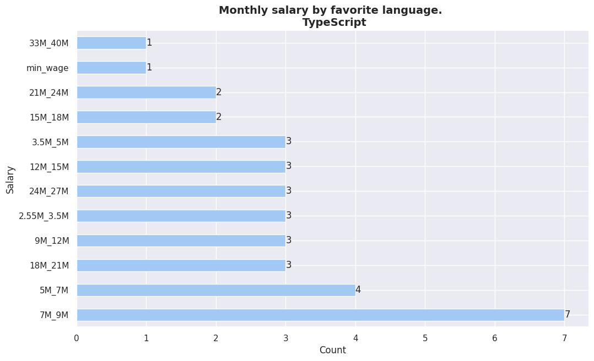


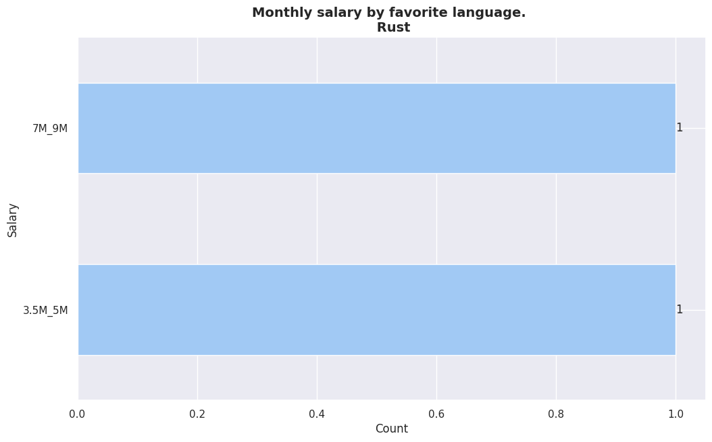


## Salarios segun lenguaje favorito y seniority


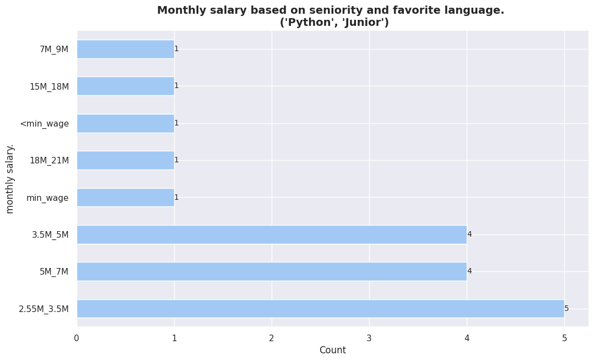


## Salarios segun - least_fav_language

<center>
     <div class='stats_table'>
  <a id="monthly_salary_vs_least_fav_languague_table_QhLMG"></a>

| Category     | Percentage |
| ------------ | ---------- |
| PHP          | 19%        |
| Java         | 15%        |
| JavaScript   | 15%        |
| Genexus      | 11%        |
| RPG          | 7%         |
| Python       | 3%         |
| Objective-C  | 3%         |
| TypeScript   | 3%         |
| Assembly     | 3%         |
| C++          | 3%         |
| HTML/CSS     | 3%         |
| Fox Pro      | 3%         |
| Oracle Forms | 3%         |

<p class='table_title' style="text-align: center;"><em>Monthly salary by "least favorite language". 
<p class="table_subtitle">(15M_18M)<p></em></p>
  <br/>
  </div>
</center>

<center>
    <div clasS='stats_table'>
 <a id="monthly_salary_vs_least_fav_languague_table_0nkT4"></a>

| Category   | Percentage |
| ---------- | ---------- |
| Java       | 24%        |
| PHP        | 21%        |
| JavaScript | 12%        |
| Assembly   | 6%         |
| Python     | 6%         |
| Fox Pro    | 6%         |
| C++        | 3%         |
| C#         | 3%         |
| Spring     | 3%         |
| SQL        | 3%         |
| TypeScript | 3%         |
| Genexus    | 3%         |
| VBA        | 3%         |
| R          | 3%         |

<p class='table_title' style="text-align: center;"><em>Monthly salary by "least favorite language". 
<p class="table_subtitle">(3.5M_5M)<p></em></p>
  <br/>
  </div>
</center>

<center>
     <div class='stats_table'>
  <a id="monthly_salary_vs_least_fav_languague_table_cTE7k"></a>

| Category     | Percentage |
| ------------ | ---------- |
| Java         | 35%        |
| PHP          | 17%        |
| JavaScript   | 11%        |
| Ruby         | 5%         |
| Genexus      | 5%         |
| Python       | 5%         |
| Objective-C  | 5%         |
| Assembly     | 5%         |
| Oracle Forms | 5%         |

<p class='table_title' style="text-align: center;"><em>Monthly salary by "least favorite language". 
<p class="table_subtitle">(18M_21M)<p></em></p>
  <br/>
  </div>
</center>

<center>
     <div class='stats_table'>
  <a id="monthly_salary_vs_least_fav_languague_table_3s1pV"></a>

| Category   | Percentage |
| ---------- | ---------- |
| PHP        | 25%        |
| JavaScript | 16%        |
| Python     | 8%         |
| Kotlin     | 8%         |
| HTML/CSS   | 8%         |
| Genexus    | 8%         |
| SQL        | 8%         |
| Dart       | 8%         |
| Java       | 8%         |

<p class='table_title' style="text-align: center;"><em>Monthly salary by "least favorite language". 
<p class="table_subtitle">(33M_40M)<p></em></p>
   <br/>
   </div>
</center>

<center>
     <div class='stats_table'>
  <a id="monthly_salary_vs_least_fav_languague_table_H9h9h"></a>

| Category | Percentage |
| -------- | ---------- |
| Java     | 50%        |
| COBOL    | 12%        |
| PHP      | 12%        |
| Kotlin   | 12%        |
| Python   | 12%        |

<p class='table_title' style="text-align: center;"><em>Monthly salary by "least favorite language". 
<p class="table_subtitle">(40M_50M)<p></em></p>
   <br/>
   </div>
</center>

<center>
    <div ='stats_table'>
  <a id="monthly_salary_vs_least_fav_languague_table_nrXET"></a>

| Category              | Percentage |
| --------------------- | ---------- |
| Java                  | 43%        |
| JavaScript            | 18%        |
| Bash/Shell/PowerShell | 12%        |
| C#                    | 6%         |
| Python                | 6%         |
| Genexus               | 6%         |
| Oracle Forms          | 6%         |

<p class='table_title' style="text-align: center;"><em>Monthly salary by "least favorite language". 
<p class="table_subtitle">(50M+)<p></em></p>
  <br/>
  </div>
</center>

<center>
    <div class='stats_table'>
 <a id="monthly_salary_vs_least_fav_languague_table_VfAgt"></a>

| Category     | Percentage |
| ------------ | ---------- |
| Java         | 25%        |
| PHP          | 21%        |
| Assembly     | 8%         |
| COBOL        | 6%         |
| Fox Pro      | 6%         |
| JavaScript   | 6%         |
| C            | 6%         |
| C#           | 4%         |
| Genexus      | 4%         |
| RPG          | 4%         |
| HTML/CSS     | 2%         |
| Oracle Forms | 2%         |
| VBA          | 2%         |

<p class='table_title' style="text-align: center;"><em>Monthly salary by "least favorite language". 
<p class="table_subtitle">(7M_9M)<p></em></p>
  <br/>
  </div>
</center>

<center>
    <div class='stats_table'>
 <a id="monthly_salary_vs_least_fav_languague_table_2wUM3"></a>

| Category   | Percentage |
| ---------- | ---------- |
| PHP        | 31%        |
| Java       | 22%        |
| Assembly   | 13%        |
| Genexus    | 9%         |
| JavaScript | 4%         |
| C          | 4%         |
| HTML/CSS   | 4%         |
| Ruby       | 2%         |
| C#         | 2%         |
| COBOL      | 2%         |
| C++        | 2%         |

<p class='table_title' style="text-align: center;"><em>Monthly salary by "least favorite language". 
<p class="table_subtitle">(9M_12M)<p></em></p>
  <br/>
  </div>
</center>

<center>
     <div class='stats_table'>
 <a id="monthly_salary_vs_least_fav_languague_table_OH8E4"></a>

| Category   | Percentage |
| ---------- | ---------- |
| PHP        | 30%        |
| Java       | 15%        |
| Genexus    | 15%        |
| C++        | 7%         |
| JavaScript | 7%         |
| Fox Pro    | 7%         |
| VBA        | 7%         |
| Python     | 7%         |

<p class='table_title' style="text-align: center;"><em>Monthly salary by "least favorite language". 
<p class="table_subtitle">(24M_27M)<p></em></p>
  <br/>
  </div>
</center>

<center>
    <div class='stats_table'>
 <a id="monthly_salary_vs_least_fav_languague_table_tsH9Y"></a>

| Category     | Percentage |
| ------------ | ---------- |
| HTML/CSS     | 33%        |
| Java         | 33%        |
| Oracle Forms | 33%        |

<p class='table_title' style="text-align: center;"><em>Monthly salary by "least favorite language". 
<p class="table_subtitle">(min_wage)<p></em></p>
  <br/>
  </div>
</center>

<center>
     <div class='stats_table'>
  <a id="monthly_salary_vs_least_fav_languague_table_waxDU"></a>

| Category     | Percentage |
| ------------ | ---------- |
| PHP          | 33%        |
| Java         | 20%        |
| COBOL        | 8%         |
| JavaScript   | 8%         |
| Genexus      | 4%         |
| C++          | 4%         |
| C            | 4%         |
| Python       | 4%         |
| Oracle Forms | 4%         |
| Kotlin       | 4%         |
| VBA          | 4%         |

<p class='table_title' style="text-align: center;"><em>Monthly salary by "least favorite language". 
<p class="table_subtitle">(2.55M_3.5M)<p></em></p>
  <br/>
  </div>
</center>

<center>
     <div class='stats_table'>
  <a id="monthly_salary_vs_least_fav_languague_table_g6d68"></a>

| Category              | Percentage |
| --------------------- | ---------- |
| Java                  | 30%        |
| PHP                   | 11%        |
| JavaScript            | 11%        |
| Python                | 7%         |
| Oracle Forms          | 7%         |
| Perl                  | 3%         |
| VBA                   | 3%         |
| C++                   | 3%         |
| RPG                   | 3%         |
| Fox Pro               | 3%         |
| C#                    | 3%         |
| Bash/Shell/PowerShell | 3%         |
| Assembly              | 3%         |

<p class='table_title' style="text-align: center;"><em>Monthly salary by "least favorite language". 
<p class="table_subtitle">(12M_15M)<p></em></p>
  <br/>
  </div>
</center>

<center>
      <div class='stats_table'>
 <a id="monthly_salary_vs_least_fav_languague_table_EAlbU"></a>

| Category     | Percentage |
| ------------ | ---------- |
| PHP          | 20%        |
| Java         | 18%        |
| C#           | 11%        |
| C            | 6%         |
| Python       | 6%         |
| JavaScript   | 6%         |
| TypeScript   | 4%         |
| Assembly     | 4%         |
| C++          | 4%         |
| Oracle Forms | 4%         |
| Dart         | 2%         |
| Ruby         | 2%         |
| Fox Pro      | 2%         |
| R            | 2%         |
| VBA          | 2%         |

<p class='table_title' style="text-align: center;"><em>Monthly salary by "least favorite language". 
<p class="table_subtitle">(5M_7M)<p></em></p>
  <br/>
  </div>
</center>

<center>
     <div class='stats_table'>
 <a id="monthly_salary_vs_least_fav_languague_table_FVzwl"></a>

| Category    | Percentage |
| ----------- | ---------- |
| Java        | 28%        |
| Objective-C | 14%        |
| C#          | 14%        |
| PHP         | 14%        |
| JavaScript  | 14%        |
| HTML/CSS    | 14%        |

<p class='table_title' style="text-align: center;"><em>Monthly salary by "least favorite language". 
<p class="table_subtitle">(21M_24M)<p></em></p>
  <br/>
  </div>
</center>

<center>
     <div class='stats_table'>
   <a id="monthly_salary_vs_least_fav_languague_table_vT8qd"></a>

| Category    | Percentage |
| ----------- | ---------- |
| Assembly    | 30%        |
| JavaScript  | 20%        |
| Java        | 10%        |
| Fox Pro     | 10%        |
| PHP         | 10%        |
| HTML/CSS    | 10%        |
| Objective-C | 10%        |

<p class='table_title' style="text-align: center;"><em>Monthly salary by "least favorite language". 
<p class="table_subtitle">(27M_33M)<p></em></p>
   <br/>
   </div>
</center>

<center>
     <div class='stats_table'>
  <a id="monthly_salary_vs_least_fav_languague_table_Dd7QL"></a>

| Category | Percentage |
| -------- | ---------- |
| Java     | 28%        |
| SQL      | 14%        |
| Assembly | 14%        |
| Ruby     | 14%        |
| C        | 14%        |
| RPG      | 14%        |

<p class='table_title' style="text-align: center;"><em>Monthly salary by "least favorite language".
<p class="table_subtitle">(les_than_minimum_wage)<p></em></p>
  <br/>
  </div>
</center>

## Salarios segun - fav_framework

<center>
     <div class='stats_table'>
 <a id="monthly_salary_vs_favorite_framework_table_VPrOT"></a>

| Category     | Percentage |
| ------------ | ---------- |
| React.js     | 23%        |
| Django       | 16%        |
| Vue.js       | 10%        |
| ASP.NET Core | 10%        |
| Laravel      | 10%        |
| Angular      | 6%         |
| Spring       | 6%         |
| Flask        | 3%         |
| Express      | 3%         |
| CodeIgniter  | 3%         |
| ASP.NET      | 3%         |
| JQuery       | 3%         |

<p class="table_subtitle">(3.5M_5M)<p></em></p>
   </div>
   </div>
</center>

<center>
      <div class='stats_table'>
  <a id="monthly_salary_vs_favorite_framework_table_gSrmH"></a>

| Category      | Percentage |
| ------------- | ---------- |
| React.js      | 26%        |
| Angular       | 20%        |
| Laravel       | 13%        |
| Django        | 13%        |
| Express       | 6%         |
| ASP.NET Core  | 6%         |
| Ruby on Rails | 6%         |
| Spring        | 6%         |

<p class='table_title' style="text-align: center;"><em>Monthly salary by favorite frameworks.
<p class="table_subtitle">(18M_21M)<p></em></p>
   <br/>
   </div>
</center>

<center>
    <a id="monthly_salary_vs_favorite_framework_table_GueyJ"></a>
    <br/>
    <br/>

| Category | Percentage |
| -------- | ---------- |

```
| Spring | 50% |
```

| React.js | 40% |
| Ruby on Rails | 10% |
    </div>
<br/>
    <p class='table_title' style="text-align: center;"><em>Monthly salary by favorite frameworks.

<p class="table_subtitle">(33M_40M)<p></em></p>
    <br/>
</center>

<center>
    <a id="monthly_salary_vs_favorite_framework_table_eUWVG"></a>
    <br/>
    <br/>

| Category | Percentage |
| -------- | ---------- |

```
| Django | 50% |
```

| Spring | 33% |
| Laravel | 16% |
    </div>
<br/>
    <p class='table_title' style="text-align: center;"><em>Monthly salary by favorite frameworks.

<p class="table_subtitle">(40M_50M)<p></em></p>
    <br/>
</center>

<center>
    <a id="monthly_salary_vs_favorite_framework_table_6JtDd"></a>
    <br/>
    <br/>

| Category | Percentage |
| -------- | ---------- |

```
| Django | 21% |
```

| React.js | 21% |
| Spring | 14% |
| Ruby on Rails | 14% |
| Laravel | 7% |
| Vue.js | 7% |
| ASP.NET Core | 7% |
| JQuery | 7% |
    </div>
<br/>
    <p class='table_title' style="text-align: center;"><em>Monthly salary by favorite frameworks.

<p class="table_subtitle">(50M+)<p></em></p>
    <br/>
</center>

<center>
    <a id="monthly_salary_vs_favorite_framework_table_eFhuH"></a>
    <br/>
    <br/>

| Category | Percentage |
| -------- | ---------- |

```
| Spring | 27% |
```

| Laravel | 20% |
| React.js | 15% |
| Django | 10% |
| Angular | 10% |
| ASP.NET Core | 7% |
| JQuery | 5% |
| Express | 2% |
| Flask | 2% |
    </div>
<br/>
    <p class='table_title' style="text-align: center;"><em>Monthly salary by favorite frameworks.

<p class="table_subtitle">(7M_9M)<p></em></p>
    <br/>
</center>

<center>
    <a id="monthly_salary_vs_favorite_framework_table_hp9em"></a>
    <br/>
    <br/>

| Category | Percentage |
| -------- | ---------- |

```
| Spring | 30% |
```

| Django | 18% |
| React.js | 12% |
| ASP.NET Core | 10% |
| Express | 8% |
| Laravel | 6% |
| Vue.js | 4% |
| Ruby on Rails | 4% |
| Angular | 4% |
| ASP.NET | 2% |
    </div>
<br/>
    <p class='table_title' style="text-align: center;"><em>Monthly salary by favorite frameworks.

<p class="table_subtitle">(9M_12M)<p></em></p>
    <br/>
</center>

<center>
    <a id="monthly_salary_vs_favorite_framework_table_R3upE"></a>
    <br/>
    <br/>

| Category | Percentage |
| -------- | ---------- |

```
| Spring | 32% |
```

| Django | 20% |
| Laravel | 8% |
| Flask | 8% |
| ASP.NET Core | 8% |
| Vue.js | 4% |
| ASP.NET | 4% |
| Express | 4% |
| Ruby on Rails | 4% |
| React.js | 4% |
| JQuery | 4% |
    </div>
<br/>
    <p class='table_title' style="text-align: center;"><em>Monthly salary by favorite frameworks.

<p class="table_subtitle">(15M_18M)<p></em></p>
    <br/>
</center>

<center>
    <a id="monthly_salary_vs_favorite_framework_table_7zzz3"></a>
    <br/>
    <br/>

| Category | Percentage |
| -------- | ---------- |

```
| Spring | 28% |
```

| Laravel | 21% |
| Vue.js | 14% |
| React.js | 14% |
| JQuery | 7% |
| ASP.NET Core | 7% |
| Flask | 7% |
    </div>
<br/>
    <p class='table_title' style="text-align: center;"><em>Monthly salary by favorite frameworks.

<p class="table_subtitle">(24M_27M)<p></em></p>
    <br/>
</center>

<center>
    <a id="monthly_salary_vs_favorite_framework_table_JT9sb"></a>
    <br/>
    <br/>

| Category | Percentage |
| -------- | ---------- |

```
| Django | 33% |
```

| React.js | 33% |
| JQuery | 33% |
    </div>
<br/>
    <p class='table_title' style="text-align: center;"><em>Monthly salary by favorite frameworks.

<p class="table_subtitle">(min_wage)<p></em></p>
    <br/>
</center>

<center>
    <a id="monthly_salary_vs_favorite_framework_table_jVpxq"></a>
    <br/>
    <br/>

| Category | Percentage |
| -------- | ---------- |

```
| React.js | 45% |
```

| Django | 13% |
| Vue.js | 9% |
| Laravel | 9% |
| Spring | 4% |
| Flask | 4% |
| Express | 4% |
| Ruby on Rails | 4% |
| Angular | 4% |
    </div>
<br/>
    <p class='table_title' style="text-align: center;"><em>Monthly salary by favorite frameworks.

<p class="table_subtitle">(2.55M_3.5M)<p></em></p>
    <br/>
</center>

<center>
    <a id="monthly_salary_vs_favorite_framework_table_8XjVX"></a>
    <br/>
    <br/>

| Category | Percentage |
| -------- | ---------- |

```
| Spring | 35% |
```

| Laravel | 14% |
| Flask | 14% |
| ASP.NET Core | 10% |
| React.js | 7% |
| Ruby on Rails | 3% |
| Vue.js | 3% |
| JQuery | 3% |
| Angular | 3% |
| Angular.js | 3% |
    </div>
<br/>
    <p class='table_title' style="text-align: center;"><em>Monthly salary by favorite frameworks.

<p class="table_subtitle">(12M_15M)<p></em></p>
    <br/>
</center>

<center>
    <a id="monthly_salary_vs_favorite_framework_table_bDY5S"></a>
    <br/>
    <br/>

| Category | Percentage |
| -------- | ---------- |

```
| React.js | 21% |
```

| Laravel | 14% |
| ASP.NET Core | 9% |
| Spring | 9% |
| Express | 7% |
| Ruby on Rails | 7% |
| JQuery | 7% |
| Django | 4% |
| Vue.js | 4% |
| Flask | 4% |
| Angular | 4% |
| Angular.js | 2% |
    </div>
<br/>
    <p class='table_title' style="text-align: center;"><em>Monthly salary by favorite frameworks.

<p class="table_subtitle">(5M_7M)<p></em></p>
    <br/>
</center>

<center>
    <a id="monthly_salary_vs_favorite_framework_table_AX6VG"></a>
    <br/>
    <br/>

| Category | Percentage |
| -------- | ---------- |

```
| React.js | 57% |
```

| Spring | 28% |
| Vue.js | 14% |
    </div>
<br/>
    <p class='table_title' style="text-align: center;"><em>Monthly salary by favorite frameworks.

<p class="table_subtitle">(21M_24M)<p></em></p>
    <br/>
</center>

<center>
    <a id="monthly_salary_vs_favorite_framework_table_NzSSk"></a>
    <br/>
    <br/>

| Category | Percentage |
| -------- | ---------- |

```
| Django | 30% |
```

| Spring | 30% |
| ASP.NET Core | 20% |
| Laravel | 10% |
| React.js | 10% |
    </div>
<br/>
    <p class='table_title' style="text-align: center;"><em>Monthly salary by favorite frameworks.

<p class="table_subtitle">(27M_33M)<p></em></p>
    <br/>
</center>

<center>
    <a id="monthly_salary_vs_favorite_framework_table_sVS7n"></a>
    <br/>
    <br/>

| Category | Percentage |
| -------- | ---------- |

```
| Django | 50% |
```

| Express | 16% |
| React.js | 16% |
| Flask | 16% |
    </div>
<br/>
    <p class='table_title' style="text-align: center;"><em>Monthly salary by favorite frameworks.

<p class="table_subtitle">(les_than_minimum_wage)<p></em></p>
    <br/>
</center>

## Salarios segun - least_fav_framework

<center>
    <a id="monthly_salary_vs_least_fav_framework_table_QdKYg"></a>
    <br/>
    <br/>

| Category | Percentage |
| -------- | ---------- |

```
| Spring | 16% |
```

| JQuery | 12% |
| CakePHP | 12% |
| Laravel | 12% |
| Angular | 12% |
| Angular.js | 8% |
| React.js | 8% |
| Ruby on Rails | 8% |
| CodeIgniter | 4% |
| ASP.NET Core | 4% |
| ASP.NET | 4% |
    </div>
<br/>
    <p class='table_title' style="text-align: center;"><em>Monthly salary by "least favorite framewor".

<p class="table_subtitle">(3.5M_5M)<p></em></p>
    <br/>
</center>

<center>
    <a id="monthly_salary_vs_least_fav_framework_table_4cVt0"></a>
    <br/>
    <br/>

| Category | Percentage |
| -------- | ---------- |

```
| Django | 14% |
```

| Laravel | 14% |
| Angular.js | 14% |
| CodeIgniter | 14% |
| JQuery | 14% |
| Ruby on Rails | 7% |
| Gastby | 7% |
| Angular | 7% |
| Spring | 7% |
    </div>
<br/>
    <p class='table_title' style="text-align: center;"><em>Monthly salary by "least favorite framewor".

<p class="table_subtitle">(18M_21M)<p></em></p>
    <br/>
</center>

<center>
    <a id="monthly_salary_vs_least_fav_framework_table_7Al7C"></a>
    <br/>
    <br/>

| Category | Percentage |
| -------- | ---------- |

```
| JQuery | 42% |
```

| Django | 28% |
| ASP.NET Core | 14% |
| Angular | 14% |
    </div>
<br/>
    <p class='table_title' style="text-align: center;"><em>Monthly salary by "least favorite framewor".

<p class="table_subtitle">(33M_40M)<p></em></p>
    <br/>
</center>

<center>
    <a id="monthly_salary_vs_least_fav_framework_table_sqpH9"></a>
    <br/>
    <br/>

| Category | Percentage |
| -------- | ---------- |

```
| Spring | 20% |
```

| React.js | 20% |
| Ruby on Rails | 20% |
| ASP.NET | 20% |
| Django | 20% |
    </div>
<br/>
    <p class='table_title' style="text-align: center;"><em>Monthly salary by "least favorite framewor".

<p class="table_subtitle">(40M_50M)<p></em></p>
    <br/>
</center>

<center>
    <a id="monthly_salary_vs_least_fav_framework_table_XATw8"></a>
    <br/>
    <br/>

| Category | Percentage |
| -------- | ---------- |

```
| Spring | 30% |
```

| Angular | 20% |
| Django | 10% |
| CodeIgniter | 10% |
| ASP.NET Core | 10% |
| ASP.NET | 10% |
| Flask | 10% |
    </div>
<br/>
    <p class='table_title' style="text-align: center;"><em>Monthly salary by "least favorite framewor".

<p class="table_subtitle">(50M+)<p></em></p>
    <br/>
</center>

<center>
    <a id="monthly_salary_vs_least_fav_framework_table_hc0eq"></a>
    <br/>
    <br/>

| Category | Percentage |
| -------- | ---------- |

```
| JQuery | 21% |
```

| Spring | 18% |
| ASP.NET | 15% |
| CodeIgniter | 15% |
| Laravel | 9% |
| React.js | 6% |
| Angular.js | 3% |
| Angular | 3% |
| ASP.NET Core | 3% |
| CakePHP | 3% |
| Django | 3% |
    </div>
<br/>
    <p class='table_title' style="text-align: center;"><em>Monthly salary by "least favorite framewor".

<p class="table_subtitle">(7M_9M)<p></em></p>
    <br/>
</center>

<center>
    <a id="monthly_salary_vs_least_fav_framework_table_ZoU51"></a>
    <br/>
    <br/>

| Category | Percentage |
| -------- | ---------- |

```
| Spring | 18% |
```

| JQuery | 15% |
| Angular | 15% |
| ASP.NET Core | 10% |
| CakePHP | 10% |
| CodeIgniter | 5% |
| Angular.js | 5% |
| Laravel | 5% |
| Django | 2% |
| Vue.js | 2% |
| Express | 2% |
| Ruby on Rails | 2% |
| React.js | 2% |
    </div>
<br/>
    <p class='table_title' style="text-align: center;"><em>Monthly salary by "least favorite framewor".

<p class="table_subtitle">(9M_12M)<p></em></p>
    <br/>
</center>

<center>
    <a id="monthly_salary_vs_least_fav_framework_table_wjiQj"></a>
    <br/>
    <br/>

| Category | Percentage |
| -------- | ---------- |

```
| React.js | 18% |
```

| JQuery | 18% |
| ASP.NET Core | 13% |
| ASP.NET | 13% |
| Angular | 13% |
| Laravel | 9% |
| Spring | 4% |
| Angular.js | 4% |
| Ruby on Rails | 4% |
    </div>
<br/>
    <p class='table_title' style="text-align: center;"><em>Monthly salary by "least favorite framewor".

<p class="table_subtitle">(15M_18M)<p></em></p>
    <br/>
</center>

<center>
    <a id="monthly_salary_vs_least_fav_framework_table_wqL9K"></a>
    <br/>
    <br/>

| Category | Percentage |
| -------- | ---------- |

```
| Angular.js | 16% |
```

| Angular | 16% |
| Laravel | 8% |
| React.js | 8% |
| Ruby on Rails | 8% |
| JQuery | 8% |
| ASP.NET Core | 8% |
| Vue.js | 8% |
| Spring | 8% |
| Express | 8% |
    </div>
<br/>
    <p class='table_title' style="text-align: center;"><em>Monthly salary by "least favorite framewor".

<p class="table_subtitle">(24M_27M)<p></em></p>
    <br/>
</center>

<center>
    <a id="monthly_salary_vs_least_fav_framework_table_6rkkn"></a>
    <br/>
    <br/>

| Category | Percentage |
| -------- | ---------- |

```
| Laravel | 66% |
```

| Angular.js | 33% |
    </div>
<br/>
    <p class='table_title' style="text-align: center;"><em>Monthly salary by "least favorite framewor".

<p class="table_subtitle">(min_wage)<p></em></p>
    <br/>
</center>

<center>
    <a id="monthly_salary_vs_least_fav_framework_table_xUeWu"></a>
    <br/>
    <br/>

| Category | Percentage |
| -------- | ---------- |

```
| JQuery | 22% |
```

| Vue.js | 16% |
| React.js | 11% |
| Django | 11% |
| CakePHP | 11% |
| Laravel | 11% |
| Spring | 5% |
| Angular | 5% |
| CodeIgniter | 5% |
    </div>
<br/>
    <p class='table_title' style="text-align: center;"><em>Monthly salary by "least favorite framewor".

<p class="table_subtitle">(2.55M_3.5M)<p></em></p>
    <br/>
</center>

<center>
    <a id="monthly_salary_vs_least_fav_framework_table_KlPRc"></a>
    <br/>
    <br/>

| Category | Percentage |
| -------- | ---------- |

```
| JQuery | 19% |
```

| ASP.NET | 14% |
| Spring | 14% |
| Angular | 9% |
| Django | 9% |
| Angular.js | 9% |
| Laravel | 4% |
| CodeIgniter | 4% |
| Flask | 4% |
| Gastby | 4% |
| Vue.js | 4% |
    </div>
<br/>
    <p class='table_title' style="text-align: center;"><em>Monthly salary by "least favorite framewor".

<p class="table_subtitle">(12M_15M)<p></em></p>
    <br/>
</center>

<center>
    <a id="monthly_salary_vs_least_fav_framework_table_px2CO"></a>
    <br/>
    <br/>

| Category | Percentage |
| -------- | ---------- |

```
| Spring | 12% |
```

| React.js | 12% |
| CakePHP | 9% |
| ASP.NET | 9% |
| Angular | 9% |
| Vue.js | 9% |
| Laravel | 9% |
| Ruby on Rails | 6% |
| ASP.NET Core | 6% |
| Flask | 6% |
| Express | 3% |
| CodeIgniter | 3% |
| Django | 3% |
    </div>
<br/>
    <p class='table_title' style="text-align: center;"><em>Monthly salary by "least favorite framewor".

<p class="table_subtitle">(5M_7M)<p></em></p>
    <br/>
</center>

<center>
    <a id="monthly_salary_vs_least_fav_framework_table_meSyq"></a>
    <br/>
    <br/>

| Category | Percentage |
| -------- | ---------- |

```
| Angular.js | 57% |
```

| ASP.NET | 14% |
| Vue.js | 14% |
| Angular | 14% |
    </div>
<br/>
    <p class='table_title' style="text-align: center;"><em>Monthly salary by "least favorite framewor".

<p class="table_subtitle">(21M_24M)<p></em></p>
    <br/>
</center>

<center>
    <a id="monthly_salary_vs_least_fav_framework_table_a7krl"></a>
    <br/>
    <br/>

| Category | Percentage |
| -------- | ---------- |

```
| ASP.NET | 30% |
```

| Angular.js | 20% |
| ASP.NET Core | 20% |
| Spring | 10% |
| CodeIgniter | 10% |
| Django | 10% |
    </div>
<br/>
    <p class='table_title' style="text-align: center;"><em>Monthly salary by "least favorite framewor".

<p class="table_subtitle">(27M_33M)<p></em></p>
    <br/>
</center>

<center>
    <a id="monthly_salary_vs_least_fav_framework_table_JOefL"></a>
    <br/>
    <br/>

| Category | Percentage |
| -------- | ---------- |

```
| ASP.NET Core | 33% |
```

| Ruby on Rails | 16% |
| JQuery | 16% |
| Laravel | 16% |
| CakePHP | 16% |
    </div>
<br/>
    <p class='table_title' style="text-align: center;"><em>Monthly salary by "least favorite framewor".

<p class="table_subtitle">(les_than_minimum_wage)<p></em></p>
    <br/>
</center>

# AI

______________________________________________________________________

## Salarios segun - use_AI_tools

# Monthly salary by "use AI tools". - 15M_18M

use_AI_tools
ChatGPT                                 69%
Github Copilot, ChatGPT                  7%
Codeium                                  3%
Github Copilot                           3%
ChatGPT, Github Copilot                  3%
Github Copilot, ChatGPT, Google Bard     3%
ChatGPT, Google Bard                     3%
Bing AI, ChatGPT                         3%
Name: proportion, dtype: object

# Monthly salary by "use AI tools". - 3.5M_5M

use_AI_tools
ChatGPT                                 57%
Github Copilot, ChatGPT                  9%
ChatGPT, Bing AI                         6%
Bing AI                                  3%
Bing AI, ChatGPT, Notion AI              3%
ChatGPT, Bing AI, Google Bard            3%
ChatGPT, Github Copilot, Google Bard     3%
Google Bard, ChatGPT                     3%
Bing AI, Github Copilot, ChatGPT         3%
Bing AI, ChatGPT, Github Copilot         3%
WolframAlpha, ChatGPT, Claude Ai         3%
Talkai                                   3%
Name: proportion, dtype: object

# Monthly salary by "use AI tools". - 18M_21M

use_AI_tools
ChatGPT                                        35%
Github Copilot, ChatGPT                        14%
ChatGPT, Github Copilot, Notion AI, Bing AI     7%
ChatGPT, Bing AI                                7%
Bing AI, Github Copilot                         7%
Bing AI, AWS CodeWhisperer, ChatGPT             7%
Bing AI, ChatGPT                                7%
Notion AI                                       7%
Github Copilot, Bing AI                         7%
Name: proportion, dtype: object

# Monthly salary by "use AI tools". - 33M_40M

use_AI_tools
ChatGPT, Github Copilot                                     16%
ChatGPT                                                     16%
Github Copilot, ChatGPT                                      8%
AiDE                                                         8%
Github Copilot                                               8%
Github Copilot, IntelliJ Assistant                           8%
ChatGPT, Google Bard                                         8%
Google Bard, ChatGPT, Notion AI, Bing AI, Github Copilot     8%
Github Copilot, AWS CodeWhisperer, ChatGPT, Google Bard      8%
Notion AI, Github Copilot, ChatGPT                           8%
Name: proportion, dtype: object

# Monthly salary by "use AI tools". - 40M_50M

use_AI_tools
ChatGPT                         57%
Microsoft Copilot               14%
Github Copilot, WolframAlpha    14%
Github Copilot, ChatGPT         14%
Name: proportion, dtype: object

# Monthly salary by "use AI tools". - 7M_9M

use_AI_tools
ChatGPT                                                                        45%
ChatGPT, Github Copilot                                                         8%
Github Copilot, ChatGPT                                                         8%
Google Bard, ChatGPT                                                            5%
ChatGPT, Google Bard                                                            5%
Github Copilot                                                                  5%
Google Bard, Google Geminis                                                     2%
ChatGPT, Google Bard, Github Copilot                                            2%
ChatGPT, Google Bard, CODEGEEX                                                  2%
Bing AI                                                                         2%
Github Copilot, Bing AI                                                         2%
ChatGPT, AWS CodeWhisperer, Github Copilot, Notion AI, Bing AI, Google Bard     2%
ChatGPT, Bing AI                                                                2%
Notion AI                                                                       2%
Name: proportion, dtype: object

# Monthly salary by "use AI tools". - 9M_12M

use_AI_tools
ChatGPT                                                   46%
Github Copilot, ChatGPT                                   10%
ChatGPT, Github Copilot                                   10%
ChatGPT, Google Bard                                       6%
Google Bard, ChatGPT                                       4%
ChatGPT, Bing AI                                           4%
Google Bard, ChatGPT, Notion AI                            2%
ChatGPT, Google Bard, Github Copilot, Bing AI              2%
Google Bard, Github Copilot, ChatGPT, Notion AI            2%
Google Bard, Bing AI, ChatGPT                              2%
Github Copilot, Notion AI, Google Bard, ChatGPT            2%
Google Bard                                                2%
Bing AI, Google Bard, ChatGPT, WolframAlpha, Notion AI     2%
Notion AI, ChatGPT, Bing AI                                2%
ChatGPT, Bing AI, Github Copilot                           2%
Name: proportion, dtype: object

# Monthly salary by "use AI tools". - 50M+

use_AI_tools
ChatGPT                                 42%
ChatGPT, Github Copilot                 15%
Github Copilot, ChatGPT                 10%
Microsoft Copilot                        5%
Github Copilot                           5%
Bing AI, ChatGPT                         5%
Github Copilot, WolframAlpha             5%
WolframAlpha, Github Copilot             5%
ChatGPT, Github Copilot, Google Bard     5%
Name: proportion, dtype: object

# Monthly salary by "use AI tools". - 24M_27M

use_AI_tools
ChatGPT                               69%
ChatGPT, Github Copilot               23%
Github Copilot, Notion AI, ChatGPT     7%
Name: proportion, dtype: object

# Monthly salary by "use AI tools". - min_wage

use_AI_tools
ChatGPT                          44%
ChatGPT, Github Copilot          22%
ChatGPT, Bing AI                 11%
Bing AI, ChatGPT                 11%
Google Bard, ChatGPT, Bing AI    11%
Name: proportion, dtype: object

# Monthly salary by "use AI tools". - 2.55M_3.5M

use_AI_tools
ChatGPT                                     25%
ChatGPT, Github Copilot                     18%
Github Copilot, ChatGPT                     11%
ChatGPT, Bing AI                             7%
Google Bard, ChatGPT                         3%
ChatGPT, Claude.ai                           3%
ChatGPT, Github Copilot, TabNine             3%
Google Bard                                  3%
ChatGPT, Unity Muse                          3%
ChatGPT, Google Bard                         3%
WolframAlpha, ChatGPT                        3%
ChatGPT, Codeium                             3%
Bing AI                                      3%
Google Bard, Bing AI, ChatGPT, Claude.ai     3%
Name: proportion, dtype: object

# Monthly salary by "use AI tools". - 5M_7M

use_AI_tools
ChatGPT                                 55%
Google Bard, ChatGPT                     6%
ChatGPT, Github Copilot                  6%
Github Copilot, ChatGPT                  4%
Github Copilot, ChatGPT, Google Bard     2%
ChatGPT, Notion AI, Github Copilot       2%
Claude                                   2%
ChatGPT, Github Copilot, Google Bard     2%
Bing AI, ChatGPT, Github Copilot         2%
Notion AI, ChatGPT, Bing AI              2%
ChatGPT, Bing AI                         2%
Bing AI, ChatGPT                         2%
ChatGPT, Genesis, Copilot                2%
Codeium                                  2%
ChatGPT, Bing AI, Google Bard            2%
Github Copilot                           2%
Bing AI, Github Copilot, ChatGPT         2%
Name: proportion, dtype: object

# Monthly salary by "use AI tools". - 12M_15M

use_AI_tools
ChatGPT                                          41%
ChatGPT, Github Copilot                          17%
Github Copilot, ChatGPT                           6%
Google Bard, ChatGPT                              6%
ChatGPT, Google Bard, Bing AI                     6%
Github Copilot                                    3%
Bing AI, ChatGPT                                  3%
ChatGPT, Google Bard, Bing AI, Github Copilot     3%
Notion AI, Github Copilot, ChatGPT                3%
Codeium                                           3%
Codium AI                                         3%
Name: proportion, dtype: object

# Monthly salary by "use AI tools". - 21M_24M

use_AI_tools
ChatGPT                                             50%
Github Copilot                                      25%
Bing AI, ChatGPT, AWS CodeWhisperer, Google Bard    12%
ChatGPT, Github Copilot, Google Bard                12%
Name: proportion, dtype: object

# Monthly salary by "use AI tools". - 27M_33M

use_AI_tools
ChatGPT                                         44%
Google Bard, ChatGPT                            22%
Github Copilot, Notion AI, AWS CodeWhisperer    11%
Github Copilot, ChatGPT                         11%
ChatGPT, Github Copilot                         11%
Name: proportion, dtype: object

# Monthly salary by "use AI tools". - les_than_minimum_wage

use_AI_tools
ChatGPT                          33%
ChatGPT, Github Copilot          33%
Bing AI, ChatGPT                 16%
Google Bard, ChatGPT, Bing AI    16%
Name: proportion, dtype: object

# LAYOFFS 23/24

______________________________________________________________________

## Salarios segun - layoffs_23_24

--- El salario influye en los despidos? "Salarios despedidos vs. no despedidos".


## Salarios segun - working_now


## Salarios segun - unemployed_duration

Unemploiment duration: 3_5_months

```
    <center>
    <a id="unemploiment_duration_table_xokAV"></a>
```

| category   | count |
| :--------- | ----: |
| 40M_50M    |     1 |
| 24M_27M    |     1 |
| 9M_12M     |     1 |
| 12M_15M    |     1 |
| 15M_18M    |     1 |
| 2.55M_3.5M |     1 |
| 18M_21M    |     1 |
| 33M_40M    |     1 |

```
    <p class='table_title' style="text-align: center;"><em>Unemploiment duration.
```

<p class="table_subtitle">(3_5_months)</p></em></p>
        </center>
        <br/>
        <br/>

Unemploiment duration: 6+\_months

```
    <center>
    <a id="unemploiment_duration_table_GmfSL"></a>
```

| category   | count |
| :--------- | ----: |
| 2.55M_3.5M |     1 |
| 3.5M_5M    |     1 |
| 50M+       |     1 |

```
    <p class='table_title' style="text-align: center;"><em>Unemploiment duration.
```

<p class="table_subtitle">(6+_months)</p></em></p>
        </center>
        <br/>
        <br/>

Unemploiment duration: \<3_months

<center>
      <div class='stats_table'>
 <a id="unemploiment_duration_table_4NvMG"></a>

| category              | count |
| :-------------------- | ----: |
| 9M_12M                |     5 |
| 3.5M_5M               |     3 |
| 5M_7M                 |     2 |
| 18M_21M               |     1 |
| 50M+                  |     1 |
| 33M_40M               |     1 |
| 40M_50M               |     1 |
| les_than_minimum_wage |     1 |
| 7M_9M                 |     1 |
| 15M_18M               |     1 |

<p class='table_title' style="text-align: center;"><em>Unemploiment duration.
<p class="table_subtitle">(<3_months)</p></em></p>
  <br/>
  </div>
</center>

## Salarios segun - same_role


## Salarios segun - current_vs_prev_salary

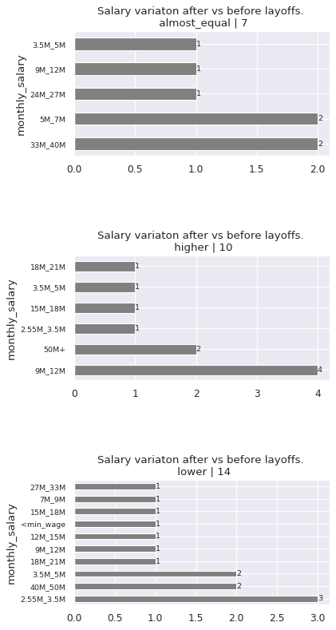

<center>
<span class="go_back_button">
[Go Back](../../intro/#topic_index)
<span>
</center>
